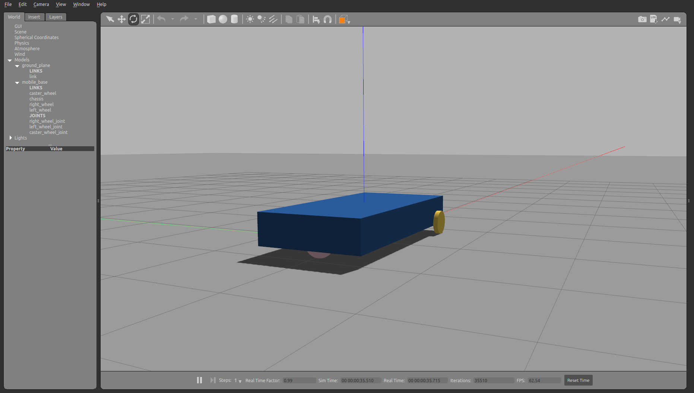

# Models


```python
from pcg_gazebo.simulation import create_object, SimulationModel
```


```python
# If there is a Gazebo instance running, you can spawn the box into the simulation
from pcg_gazebo.task_manager import Server
# First create a simulation server
server = Server()
# Create a simulation manager named default
server.create_simulation('default')
simulation = server.get_simulation('default')
# Run an instance of the empty.world scenario
# This is equivalent to run
#      roslaunch gazebo_ros empty_world.launch
# with all default parameters
simulation.create_gazebo_empty_world_task()
# A task named 'gazebo' the added to the tasks list
print(simulation.get_task_list())
# But it is still not running
print('Is Gazebo running: {}'.format(simulation.is_task_running('gazebo')))
# Run Gazebo
simulation.run_all_tasks()
```


```python
from pcg_gazebo.generators import WorldGenerator
import random
# Create a Gazebo proxy
gazebo_proxy = simulation.get_gazebo_proxy()

# Use the generator to spawn the model to the Gazebo instance running at the moment
generator = WorldGenerator(gazebo_proxy=gazebo_proxy)
```

## Mobile base tutorial

Recreating the [Gazebo tutorial for a mobile base](http://gazebosim.org/tutorials/?tut=attach_gripper#MobileBase)


```python
# Creating the main body of the chassis
chassis = create_object('box')
chassis.size = [2, 1, 0.3]
chassis.add_inertial(20)
chassis.visual.enable_property('material')
chassis.visual.set_xkcd_color()

print(chassis.to_sdf('link'))
```


```python
# Creating the caster wheel
caster_wheel = create_object('sphere')
caster_wheel.radius = 0.125
caster_wheel.add_inertial(1)
caster_wheel.visual.enable_property('material')
caster_wheel.visual.set_xkcd_color()

# Setting friction parameters to zero
caster_wheel.collision.enable_property('friction')
caster_wheel.collision.set_ode_friction_params(
    mu=0.0,
    mu2=0.0,
    slip1=0, 
    slip2=0,
    fdir1=[0, 0, 0]
)

caster_wheel.collision.set_bullet_friction_params(
    friction=0.0, 
    friction2=0.0, 
    fdir1=[0, 0, 0], 
    rolling_friction=1
)

print(caster_wheel.to_sdf('link'))
```


```python
right_wheel = create_object('cylinder')
right_wheel.pose = [0.8, -0.5 - 0.025, -0.125, 0, 1.5707, 1.5707]
right_wheel.radius = 0.125
right_wheel.length = 0.05
right_wheel.add_inertial(1)
right_wheel.visual.enable_property('material')
right_wheel.visual.set_xkcd_color()

left_wheel = create_object('cylinder')
left_wheel.pose = [0.8, 0.5 + 0.025, -0.125, 0, 1.5707, 1.5707]
left_wheel.radius = 0.125
left_wheel.length = 0.05
left_wheel.add_inertial(1)
left_wheel.visual.enable_property('material')
left_wheel.visual.set_xkcd_color()

print(right_wheel.to_sdf('link'))
```


```python
# Assembling the robot mobile base
mobile_base = SimulationModel('mobile_base')

# Adding chassis
mobile_base.add_link('chassis', chassis)

# Adding caster wheel
caster_wheel.pose = [-0.8, 0, -0.125, 0, 0, 0]
mobile_base.add_link('caster_wheel', caster_wheel)
mobile_base.add_joint('caster_wheel_joint', parent='chassis', child='caster_wheel', joint_type='fixed')

# Adding left wheel
mobile_base.add_link('left_wheel', left_wheel)
mobile_base.add_joint('left_wheel_joint', parent='chassis', child='left_wheel', joint_type='revolute')

# Adding right wheel
mobile_base.add_link('right_wheel', right_wheel)
mobile_base.add_joint('right_wheel_joint', parent='chassis', child='right_wheel', joint_type='revolute')

print(mobile_base.to_sdf())
```


```python
print(mobile_base.to_urdf())
```


```python
# Spawn model
generator.spawn_model(
    model=mobile_base, 
    robot_namespace='mobile_base',
    pos=[0, 0, 0.5])
```




```python

```
