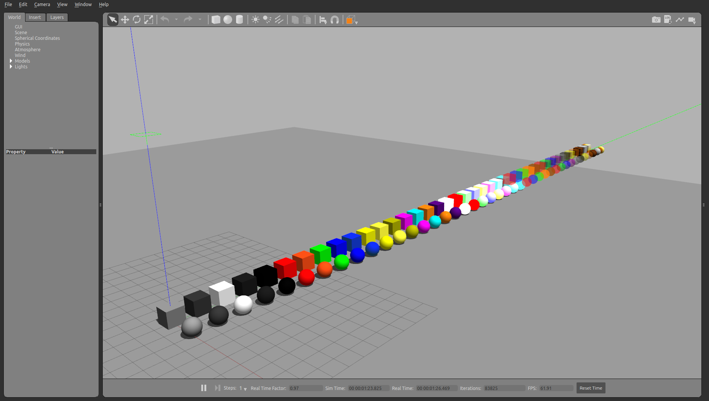
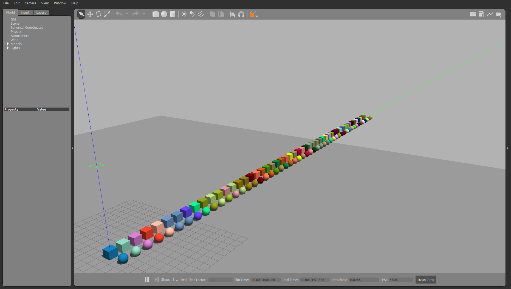

# Visual properties


```python
from pcg_gazebo.simulation import create_object
from pcg_gazebo.generators import WorldGenerator
from time import sleep
import random
```


```python
# If there is a Gazebo instance running, you can spawn the box into the simulation
from pcg_gazebo.task_manager import Server
# First create a simulation server
server = Server()

```

## Transparency


```python
obj = create_object('box')
obj.size = [1, 1, 1]
obj.add_inertial(30)
```


```python
# Print the initial state of a box in the model option
print(obj.to_sdf('model'))
```


```python
obj.visual.transparency = 0.8
print(obj.to_sdf('model'))
```


```python
# Create a simulation manager named default
server.create_simulation('transparency')
simulation = server.get_simulation('transparency')
# Run an instance of the empty.world scenario
# This is equivalent to run
#      roslaunch gazebo_ros empty_world.launch
# with all default parameters
simulation.create_gazebo_empty_world_task()
# A task named 'gazebo' the added to the tasks list
print(simulation.get_task_list())
# But it is still not running
print('Is Gazebo running: {}'.format(simulation.is_task_running('gazebo')))
# Run Gazebo
simulation.run_all_tasks()

# Create a Gazebo proxy
gazebo_proxy = simulation.get_gazebo_proxy()

# Use the generator to spawn the model to the Gazebo instance running at the moment
generator = WorldGenerator(gazebo_proxy=gazebo_proxy)
```


```python
t = [0.1, 0.3, 0.5, 0.7, 1.0] 
for i in range(len(t)):
    obj.visual.transparency = t[i]
    
    generator.spawn_model(
        model=obj, 
        robot_namespace='box_transparency_{}'.format(t[i]),
        pos=[0, i * 1.5, 2])
```


```python
# End the simulation by killing the Gazebo task
sleep(5)
simulation.kill_all_tasks()
```


## Gazebo materials


```python
from pcg_gazebo.simulation.properties import Material
# Find and retrieve all the default Gazebo materials 
print(Material._GAZEBO_MATERIALS)
```


```python
print(Material.get_gazebo_material_as_sdf('Gazebo/PurpleGlow'))
```


```python
# Create a simulation manager named default
server.create_simulation('gazebo_materials')
simulation = server.get_simulation('gazebo_materials')
# Run an instance of the empty.world scenario
# This is equivalent to run
#      roslaunch gazebo_ros empty_world.launch
# with all default parameters
simulation.create_gazebo_empty_world_task()
# A task named 'gazebo' the added to the tasks list
print(simulation.get_task_list())
# But it is still not running
print('Is Gazebo running: {}'.format(simulation.is_task_running('gazebo')))
# Run Gazebo
simulation.run_all_tasks()

# Create a Gazebo proxy
gazebo_proxy = simulation.get_gazebo_proxy()

# Use the generator to spawn the model to the Gazebo instance running at the moment
generator = WorldGenerator(gazebo_proxy=gazebo_proxy)
```


```python
box = create_object('box')
box.size = [1, 1, 1]
box.add_inertial(30)
box.static = True
box.visual.enable_property('material')

sphere = create_object('sphere')
sphere.radius = 0.5
sphere.add_inertial(30)
sphere.static = True
sphere.visual.enable_property('material')

for i in range(len(Material._GAZEBO_MATERIALS)):
    box.visual.set_material_script(Material._GAZEBO_MATERIALS[i])
    sphere.visual.set_material_script(Material._GAZEBO_MATERIALS[i])
        
    color_name = Material._GAZEBO_MATERIALS[i].split('/')[-1].lower()
    
    generator.spawn_model(
        model=box, 
        robot_namespace='box_{}'.format(color_name),
        pos=[0, i * 1.5, 0.5])
    
    generator.spawn_model(
        model=sphere, 
        robot_namespace='sphere_{}'.format(color_name),
        pos=[2.0, i * 1.5, 0.5])
```


```python
# End the simulation by killing the Gazebo task
sleep(5)
simulation.kill_all_tasks()
```



## XKCD color pallete


```python
# Retrieve all XKCD pallete colors
print(Material.get_xkcd_colors_list())
```


```python
# Create a simulation manager named default
server.create_simulation('xkcd')
simulation = server.get_simulation('xkcd')
# Run an instance of the empty.world scenario
# This is equivalent to run
#      roslaunch gazebo_ros empty_world.launch
# with all default parameters
simulation.create_gazebo_empty_world_task()
# A task named 'gazebo' the added to the tasks list
print(simulation.get_task_list())
# But it is still not running
print('Is Gazebo running: {}'.format(simulation.is_task_running('gazebo')))
# Run Gazebo
simulation.run_all_tasks()

# Create a Gazebo proxy
gazebo_proxy = simulation.get_gazebo_proxy()

# Use the generator to spawn the model to the Gazebo instance running at the moment
generator = WorldGenerator(gazebo_proxy=gazebo_proxy)
```


```python
box = create_object('box')
box.size = [1, 1, 1]
box.add_inertial(30)
box.static = True
box.visual.enable_property('material')

sphere = create_object('sphere')
sphere.radius = 0.5
sphere.add_inertial(30)
sphere.static = True
sphere.visual.enable_property('material')

xkcd_colors = Material.get_xkcd_colors_list()
for i, tag in zip(range(len(xkcd_colors)), xkcd_colors.keys()):
    if i > 50:
        break
    # By omiting the name of the color, the material 
    # instance will generate a random color
    box.visual.set_xkcd_color(tag)
    sphere.visual.set_xkcd_color(tag)
            
    generator.spawn_model(
        model=box, 
        robot_namespace='box_{}'.format(tag),
        pos=[0, i * 1.5, 0.5])
    
    generator.spawn_model(
        model=sphere, 
        robot_namespace='sphere_{}'.format(tag),
        pos=[2.0, i * 1.5, 0.5])
```


```python
# End the simulation by killing the Gazebo task
sleep(5)
simulation.kill_all_tasks()
```


