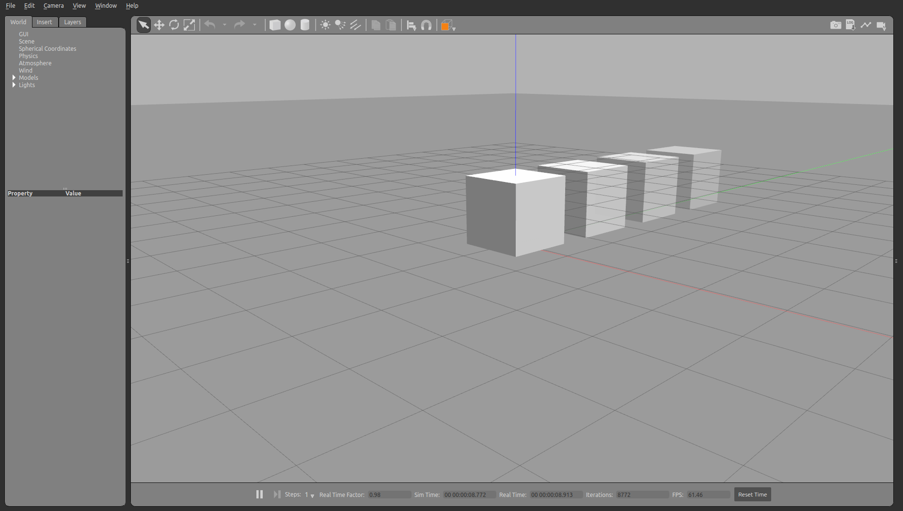

# Visual properties


```python
from pcg_gazebo.simulation import create_object
from pcg_gazebo.generators import WorldGenerator
from time import sleep
import random
```


```python
# If there is a Gazebo instance running, you can spawn the box into the simulation
from pcg_gazebo.task_manager import Server
# First create a simulation server
server = Server()

```

## Transparency


```python
obj = create_object('box')
obj.size = [1, 1, 1]
obj.add_inertial(30)
```


```python
# Print the initial state of a box in the model option
print(obj.to_sdf('model'))
```

    <model name="box">
      <static>0</static>
      <pose frame="">0 0 0 0.0 -0.0 0.0</pose>
      <link name="box">
        <inertial>
          <inertia>
            <izz>5.0</izz>
            <iyz>0.0</iyz>
            <ixy>0.0</ixy>
            <ixx>5.0</ixx>
            <ixz>0.0</ixz>
            <iyy>5.0</iyy>
          </inertia>
          <pose frame="">0 0 0 0.0 -0.0 0.0</pose>
          <mass>30.0</mass>
        </inertial>
        <collision name="collision">
          <geometry>
            <box>
              <size>1 1 1</size>
            </box>
          </geometry>
          <pose frame="">0 0 0 0.0 -0.0 0.0</pose>
          <max_contacts>10</max_contacts>
        </collision>
        <visual name="visual">
          <geometry>
            <box>
              <size>1 1 1</size>
            </box>
          </geometry>
          <pose frame="">0 0 0 0.0 -0.0 0.0</pose>
          <cast_shadows>1</cast_shadows>
          <transparency>0.0</transparency>
        </visual>
      </link>
      <allow_auto_disable>0</allow_auto_disable>
    </model>
    


```python
obj.visual.transparency = 0.8
print(obj.to_sdf('model'))
```

    <model name="box">
      <static>0</static>
      <pose frame="">0 0 0 0.0 -0.0 0.0</pose>
      <link name="box">
        <inertial>
          <inertia>
            <izz>5.0</izz>
            <iyz>0.0</iyz>
            <ixy>0.0</ixy>
            <ixx>5.0</ixx>
            <ixz>0.0</ixz>
            <iyy>5.0</iyy>
          </inertia>
          <pose frame="">0 0 0 0.0 -0.0 0.0</pose>
          <mass>30.0</mass>
        </inertial>
        <collision name="collision">
          <geometry>
            <box>
              <size>1 1 1</size>
            </box>
          </geometry>
          <pose frame="">0 0 0 0.0 -0.0 0.0</pose>
          <max_contacts>10</max_contacts>
        </collision>
        <visual name="visual">
          <geometry>
            <box>
              <size>1 1 1</size>
            </box>
          </geometry>
          <pose frame="">0 0 0 0.0 -0.0 0.0</pose>
          <cast_shadows>1</cast_shadows>
          <transparency>0.8</transparency>
        </visual>
      </link>
      <allow_auto_disable>0</allow_auto_disable>
    </model>
    


```python
# Create a simulation manager named default
server.create_simulation('transparency')
simulation = server.get_simulation('transparency')
# Run an instance of the empty.world scenario
# This is equivalent to run
#      roslaunch gazebo_ros empty_world.launch
# with all default parameters
simulation.create_gazebo_empty_world_task()
# A task named 'gazebo' the added to the tasks list
print(simulation.get_task_list())
# But it is still not running
print('Is Gazebo running: {}'.format(simulation.is_task_running('gazebo')))
# Run Gazebo
simulation.run_all_tasks()

# Create a Gazebo proxy
gazebo_proxy = simulation.get_gazebo_proxy()

# Use the generator to spawn the model to the Gazebo instance running at the moment
generator = WorldGenerator(gazebo_proxy=gazebo_proxy)
```

    ['gazebo']
    Is Gazebo running: False


```python
t = [0.1, 0.3, 0.5, 0.7, 1.0] 
for i in range(len(t)):
    obj.visual.transparency = t[i]
    
    generator.spawn_model(
        model=obj, 
        robot_namespace='box_transparency_{}'.format(t[i]),
        pos=[0, i * 1.5, 2])
```


```python
# End the simulation by killing the Gazebo task
sleep(5)
simulation.kill_all_tasks()
```



## Gazebo materials


```python
from pcg_gazebo.simulation.properties import Material
# Find and retrieve all the default Gazebo materials 
print(Material._GAZEBO_MATERIALS)
```

    ['Gazebo/Grey', 'Gazebo/DarkGrey', 'Gazebo/White', 'Gazebo/FlatBlack', 'Gazebo/Black', 'Gazebo/Red', 'Gazebo/RedBright', 'Gazebo/Green', 'Gazebo/Blue', 'Gazebo/SkyBlue', 'Gazebo/Yellow', 'Gazebo/ZincYellow', 'Gazebo/DarkYellow', 'Gazebo/Purple', 'Gazebo/Turquoise', 'Gazebo/Orange', 'Gazebo/Indigo', 'Gazebo/WhiteGlow', 'Gazebo/RedGlow', 'Gazebo/GreenGlow', 'Gazebo/BlueGlow', 'Gazebo/YellowGlow', 'Gazebo/PurpleGlow', 'Gazebo/TurquoiseGlow', 'Gazebo/TurquoiseGlowOutline', 'Gazebo/RedTransparentOverlay', 'Gazebo/BlueTransparentOverlay', 'Gazebo/GreenTransparentOverlay', 'Gazebo/OrangeTransparentOverlay', 'Gazebo/DarkOrangeTransparentOverlay', 'Gazebo/RedTransparent', 'Gazebo/GreenTransparent', 'Gazebo/BlueTransparent', 'Gazebo/DarkMagentaTransparent', 'Gazebo/GreyTransparent', 'Gazebo/BlackTransparent', 'Gazebo/YellowTransparent', 'Gazebo/OrangeTransparent', 'Gazebo/WoodFloor', 'Gazebo/CeilingTiled', 'Gazebo/PaintedWall', 'Gazebo/BuildingFrame', 'Gazebo/Runway', 'Gazebo/Grass']


```python
print(Material.get_gazebo_material_as_sdf('Gazebo/PurpleGlow'))
```

    <material>
      <script>
        <name>Gazebo/PurpleGlow</name>
        <uri>file://media/materials/scripts/gazebo.material</uri>
      </script>
    </material>
    


```python
# Create a simulation manager named default
server.create_simulation('gazebo_materials')
simulation = server.get_simulation('gazebo_materials')
# Run an instance of the empty.world scenario
# This is equivalent to run
#      roslaunch gazebo_ros empty_world.launch
# with all default parameters
simulation.create_gazebo_empty_world_task()
# A task named 'gazebo' the added to the tasks list
print(simulation.get_task_list())
# But it is still not running
print('Is Gazebo running: {}'.format(simulation.is_task_running('gazebo')))
# Run Gazebo
simulation.run_all_tasks()

# Create a Gazebo proxy
gazebo_proxy = simulation.get_gazebo_proxy()

# Use the generator to spawn the model to the Gazebo instance running at the moment
generator = WorldGenerator(gazebo_proxy=gazebo_proxy)
```

    ['gazebo']
    Is Gazebo running: False


```python
box = create_object('box')
box.size = [1, 1, 1]
box.add_inertial(30)
box.static = True
box.visual.enable_property('material')

sphere = create_object('sphere')
sphere.radius = 0.5
sphere.add_inertial(30)
sphere.static = True
sphere.visual.enable_property('material')

for i in range(len(Material._GAZEBO_MATERIALS)):
    box.visual.set_material_script(Material._GAZEBO_MATERIALS[i])
    sphere.visual.set_material_script(Material._GAZEBO_MATERIALS[i])
        
    color_name = Material._GAZEBO_MATERIALS[i].split('/')[-1].lower()
    
    generator.spawn_model(
        model=box, 
        robot_namespace='box_{}'.format(color_name),
        pos=[0, i * 1.5, 0.5])
    
    generator.spawn_model(
        model=sphere, 
        robot_namespace='sphere_{}'.format(color_name),
        pos=[2.0, i * 1.5, 0.5])
```


```python
# End the simulation by killing the Gazebo task
sleep(5)
simulation.kill_all_tasks()
```


## XKCD color pallete


```python
# Retrieve all XKCD pallete colors
print(Material.get_xkcd_colors_list())
```

    {'tangerine': (255, 148, 8), 'bright_yellow_green': (157, 255, 0), 'pastel_pink': (255, 186, 205), 'light_lavendar': (239, 192, 254), 'dark_brown': (52, 28, 2), 'tealish_green': (12, 220, 115), 'green_blue': (6, 180, 139), 'ice_blue': (215, 255, 254), 'kelly_green': (2, 171, 46), 'warm_blue': (75, 87, 219), 'baby_puke_green': (182, 196, 6), 'mahogany': (74, 1, 0), 'pale_grey': (253, 253, 254), 'bluey_green': (43, 177, 121), 'red_orange': (253, 60, 6), 'radioactive_green': (44, 250, 31), 'yellow_green': (192, 251, 45), 'puce': (165, 126, 82), 'algae_green': (33, 195, 111), 'bile': (181, 195, 6), 'neon_green': (12, 255, 12), 'pale_cyan': (183, 255, 250), 'dark_hot_pink': (217, 1, 102), 'lemon_yellow': (253, 255, 56), 'parchment': (254, 252, 175), 'light_seafoam': (160, 254, 191), 'burple': (104, 50, 227), 'dark_sand': (168, 143, 89), 'dark_cream': (255, 243, 154), 'seaweed': (24, 209, 123), 'butterscotch': (253, 177, 71), 'light_navy_blue': (46, 90, 136), 'neon_yellow': (207, 255, 4), 'purpleish': (152, 86, 141), 'pale_olive_green': (177, 210, 123), 'grassy_green': (65, 156, 3), 'camel': (198, 159, 89), 'gunmetal': (83, 98, 103), 'baby_green': (140, 255, 158), 'royal_purple': (75, 0, 110), 'asparagus': (119, 171, 86), 'steel_blue': (90, 125, 154), 'light_olive_green': (164, 190, 92), 'chocolate': (61, 28, 2), 'warm_pink': (251, 85, 129), 'medium_pink': (243, 97, 150), 'light_aqua': (140, 255, 219), 'lime_green': (137, 254, 5), 'light_peach': (255, 216, 177), 'avocado': (144, 177, 52), 'dark_violet': (52, 1, 63), 'butter_yellow': (255, 253, 116), 'pinky_purple': (201, 76, 190), 'pale_pink': (255, 207, 220), 'ugly_green': (122, 151, 3), 'algae': (84, 172, 104), 'true_green': (8, 148, 4), 'racing_green': (1, 70, 0), 'light_bluish_green': (118, 253, 168), 'indian_red': (133, 14, 4), 'washed_out_green': (188, 245, 166), 'perrywinkle': (143, 140, 231), 'dirt': (138, 110, 69), 'dull_brown': (135, 110, 75), 'orchid': (200, 117, 196), 'orangish_red': (244, 54, 5), 'dandelion': (254, 223, 8), 'coffee': (166, 129, 76), 'light_blue_green': (126, 251, 179), 'sand': (226, 202, 118), 'bright_aqua': (11, 249, 234), 'merlot': (115, 0, 57), 'rosy_pink': (246, 104, 142), 'red_pink': (250, 42, 85), 'barbie_pink': (254, 70, 165), 'fluorescent_green': (8, 255, 8), 'greyish_brown': (122, 106, 79), 'dark_sea_green': (17, 135, 93), 'snot': (172, 187, 13), 'cool_blue': (73, 132, 184), 'light_tan': (251, 238, 172), 'army_green': (75, 93, 22), 'jade': (31, 167, 116), 'turquoise_blue': (6, 177, 196), 'lime': (170, 255, 50), 'old_rose': (200, 127, 137), 'charcoal_grey': (60, 65, 66), 'silver': (197, 201, 199), 'muddy_yellow': (191, 172, 5), 'greyish_teal': (113, 159, 145), 'straw': (252, 246, 121), 'mossy_green': (99, 139, 39), 'leafy_green': (81, 183, 59), "robin's_egg": (109, 237, 253), 'terracotta': (202, 102, 65), 'squash': (242, 171, 21), 'peach': (255, 176, 124), 'very_dark_purple': (42, 1, 52), 'hot_magenta': (245, 4, 201), 'puke_yellow': (194, 190, 14), 'custard': (255, 253, 120), 'desert': (204, 173, 96), 'slate_blue': (91, 124, 153), 'canary_yellow': (255, 254, 64), 'purpley': (135, 86, 228), 'olive_yellow': (194, 183, 9), 'bright_lime_green': (101, 254, 8), 'plum': (88, 15, 65), 'light_periwinkle': (193, 198, 252), 'dusk_blue': (38, 83, 141), 'seafoam': (128, 249, 173), 'light_mint': (182, 255, 187), 'mushroom': (186, 158, 136), 'forest': (11, 85, 9), 'mauve': (174, 113, 129), 'fresh_green': (105, 216, 79), 'marine_blue': (1, 56, 106), 'sunshine_yellow': (255, 253, 55), 'light_rose': (255, 197, 203), 'sea_green': (83, 252, 161), 'bright_purple': (190, 3, 253), 'dirty_yellow': (205, 197, 10), 'deep_violet': (73, 6, 72), 'dark_lime': (132, 183, 1), 'rust_orange': (196, 85, 8), 'sick_green': (157, 185, 44), 'amethyst': (155, 95, 192), 'moss_green': (101, 139, 56), 'blue_green': (19, 126, 109), 'medium_green': (57, 173, 72), 'french_blue': (67, 107, 173), 'dark_fuchsia': (157, 7, 89), 'murky_green': (108, 122, 14), 'baby_poop': (147, 124, 0), 'yellowish_orange': (255, 171, 15), 'faded_yellow': (254, 255, 127), 'camo': (127, 143, 78), 'dark_royal_blue': (2, 6, 111), 'sun_yellow': (255, 223, 34), 'ugly_brown': (125, 113, 3), 'cherry_red': (247, 2, 42), 'dark_taupe': (127, 104, 78), 'salmon_pink': (254, 123, 124), 'hot_purple': (203, 0, 245), 'pale_teal': (130, 203, 178), 'dark_teal': (1, 77, 78), 'pink': (255, 129, 192), 'ugly_blue': (49, 102, 138), 'pale_light_green': (177, 252, 153), 'dark_sage': (89, 133, 86), 'light_greenish_blue': (99, 247, 180), 'claret': (104, 0, 24), 'wine': (128, 1, 63), 'easter_green': (140, 253, 126), 'bright_light_blue': (38, 247, 253), 'steel': (115, 133, 149), 'flat_green': (105, 157, 76), 'milk_chocolate': (127, 78, 30), 'light_light_green': (200, 255, 176), 'poop_green': (111, 124, 0), 'orangey_brown': (177, 96, 2), 'orangered': (254, 66, 15), 'brick_red': (143, 20, 2), 'spring_green': (169, 249, 113), 'purple_brown': (103, 58, 63), 'muted_blue': (59, 113, 159), 'violet_pink': (251, 95, 252), 'reddish_pink': (254, 44, 84), 'reddish_grey': (153, 117, 112), 'bluey_grey': (137, 160, 176), 'pea': (164, 191, 32), 'browny_green': (111, 108, 10), 'topaz': (19, 187, 175), 'egg_shell': (255, 252, 196), 'light_royal_blue': (58, 46, 254), 'muted_green': (95, 160, 82), 'salmon': (255, 121, 108), 'pistachio': (192, 250, 139), 'purple_grey': (134, 111, 133), 'brown_yellow': (178, 151, 5), 'puke_green': (154, 174, 7), 'golden_brown': (178, 122, 1), 'bright_violet': (173, 10, 253), 'maroon': (101, 0, 33), 'lemon': (253, 255, 82), 'pumpkin_orange': (251, 125, 7), 'very_light_brown': (211, 182, 131), 'dark_purple': (53, 6, 62), 'tan_green': (169, 190, 112), 'eggplant_purple': (67, 5, 65), 'grey': (146, 149, 145), 'cobalt': (30, 72, 143), 'green_apple': (94, 220, 31), 'swamp': (105, 131, 57), 'purple_pink': (224, 63, 216), 'slate_green': (101, 141, 109), 'wisteria': (168, 125, 194), 'pinkish_orange': (255, 114, 76), 'pale_mauve': (254, 208, 252), 'brick': (160, 54, 35), 'navy': (1, 21, 62), 'dusty_blue': (90, 134, 173), 'drab_green': (116, 149, 81), 'moss': (118, 153, 88), 'dark_periwinkle': (102, 95, 209), 'light_bright_green': (83, 254, 92), 'apple_green': (118, 205, 38), 'off_yellow': (241, 243, 63), 'nice_blue': (16, 122, 176), 'sandy': (241, 218, 122), 'dark_sky_blue': (68, 142, 228), 'blue': (3, 67, 223), 'british_racing_green': (5, 72, 13), 'carmine': (157, 2, 22), 'dark_grass_green': (56, 128, 4), 'dark_aqua': (5, 105, 107), 'pear': (203, 248, 95), 'indigo': (56, 2, 130), 'baby_shit_brown': (173, 144, 13), 'dark_peach': (222, 126, 93), 'rusty_orange': (205, 89, 9), 'soft_blue': (100, 136, 234), 'dark_magenta': (150, 0, 86), 'vivid_green': (47, 239, 16), 'pale_blue': (208, 254, 254), 'darkblue': (3, 7, 100), 'frog_green': (88, 188, 8), 'light_indigo': (109, 90, 207), 'pale_gold': (253, 222, 108), 'denim_blue': (59, 91, 146), 'dusky_blue': (71, 95, 148), 'dark_seafoam': (31, 181, 122), 'dark_indigo': (31, 9, 84), 'pastel_yellow': (255, 254, 113), 'celadon': (190, 253, 183), 'lightish_purple': (165, 82, 230), 'electric_purple': (170, 35, 255), 'grapefruit': (253, 89, 86), 'steel_grey': (111, 130, 138), 'light_teal': (144, 228, 193), 'aqua': (19, 234, 201), 'mud': (115, 92, 18), 'pale': (255, 249, 208), 'ocean_blue': (3, 113, 156), 'dull_red': (187, 63, 63), 'yellow_tan': (255, 227, 110), 'burnt_sienna': (176, 78, 15), 'rust': (168, 60, 9), 'bronze': (168, 121, 0), 'greenish_cyan': (42, 254, 183), 'dark_olive': (55, 62, 2), 'brown': (101, 55, 0), 'goldenrod': (250, 194, 5), 'poop_brown': (122, 89, 1), 'turquoise': (6, 194, 172), 'liliac': (196, 142, 253), 'tree_green': (42, 126, 25), 'baby_purple': (202, 155, 247), 'sea': (60, 153, 146), 'puke_brown': (148, 119, 6), 'raw_umber': (167, 94, 9), 'bright_olive': (156, 187, 4), 'olive': (110, 117, 14), 'shocking_pink': (254, 2, 162), 'fern_green': (84, 141, 68), 'purple_blue': (99, 45, 233), 'cadet_blue': (78, 116, 150), 'forest_green': (6, 71, 12), 'camouflage_green': (75, 97, 19), 'dark_blue_grey': (31, 59, 77), 'mid_green': (80, 167, 71), 'bright_teal': (1, 249, 198), 'barney': (172, 29, 184), 'blue_blue': (34, 66, 199), 'greyblue': (119, 161, 181), 'soft_green': (111, 194, 118), 'faded_blue': (101, 140, 187), 'buff': (254, 246, 158), 'aqua_marine': (46, 232, 187), 'kermit_green': (92, 178, 0), 'sandy_brown': (196, 166, 97), 'sand_yellow': (252, 225, 102), 'pale_orange': (255, 167, 86), 'carnation': (253, 121, 143), 'dark_yellow_green': (114, 143, 2), 'vomit_green': (137, 162, 3), 'reddish_brown': (127, 43, 10), 'pale_olive': (185, 204, 129), 'crimson': (140, 0, 15), 'yellowish_green': (176, 221, 22), 'light_seafoam_green': (167, 255, 181), 'deep_magenta': (160, 2, 92), 'toxic_green': (97, 222, 42), 'very_light_purple': (246, 206, 252), 'burnt_umber': (160, 69, 14), 'purply_blue': (102, 26, 238), 'greeny_grey': (126, 160, 122), 'dark_navy_blue': (0, 2, 46), 'dark_mauve': (135, 76, 98), 'copper': (182, 99, 37), 'red_violet': (158, 1, 104), 'green_grey': (119, 146, 111), 'ultramarine': (32, 0, 177), "robin's_egg_blue": (152, 239, 249), 'light_eggplant': (137, 69, 133), 'evergreen': (5, 71, 42), 'minty_green': (11, 247, 125), 'pale_peach': (255, 229, 173), 'pale_lavender': (238, 207, 254), 'mustard_yellow': (210, 189, 10), 'burnt_red': (159, 35, 5), 'cinnamon': (172, 79, 6), 'sunflower_yellow': (255, 218, 3), 'turtle_green': (117, 184, 79), 'blood_orange': (254, 75, 3), 'windows_blue': (55, 120, 191), 'bland': (175, 168, 139), 'light_magenta': (250, 95, 247), 'light_navy': (21, 80, 132), 'yellow_brown': (183, 148, 0), 'bubblegum': (255, 108, 181), 'deep_lilac': (150, 110, 189), 'royal_blue': (5, 4, 170), 'light_grey': (216, 220, 214), 'deep_sea_blue': (1, 84, 130), 'deep_purple': (54, 1, 63), 'ocean_green': (61, 153, 115), 'orange': (249, 115, 6), 'burnt_siena': (183, 82, 3), 'pinkish_brown': (177, 114, 97), 'pastel_purple': (202, 160, 255), 'dark_blue_green': (0, 82, 73), 'mocha': (157, 118, 81), 'reddy_brown': (110, 16, 5), 'bright_green': (1, 255, 7), 'pine': (43, 93, 52), 'neon_pink': (254, 1, 154), 'sickly_green': (148, 178, 28), 'cranberry': (158, 0, 58), 'hospital_green': (155, 229, 170), 'light_purple': (191, 119, 246), 'purple/pink': (215, 37, 222), 'greyish_green': (130, 166, 125), 'jungle_green': (4, 130, 67), 'dark_grey_blue': (41, 70, 91), 'purply_pink': (240, 117, 230), 'pig_pink': (231, 142, 165), 'carolina_blue': (138, 184, 254), 'blood': (119, 0, 1), 'shamrock': (1, 180, 76), 'canary': (253, 255, 99), 'greenish_tan': (188, 203, 122), 'deep_red': (154, 2, 0), 'pinky': (252, 134, 170), 'easter_purple': (192, 113, 254), 'seafoam_green': (122, 249, 171), 'chartreuse': (193, 248, 10), 'purple_red': (153, 1, 71), 'dark_maroon': (60, 0, 8), 'brown_green': (112, 108, 17), 'electric_green': (33, 252, 13), 'warm_purple': (149, 46, 143), 'cherry': (207, 2, 52), 'electric_lime': (168, 255, 4), 'reddish_orange': (248, 72, 28), 'brownish_orange': (203, 119, 35), 'gold': (219, 180, 12), 'purple/blue': (93, 33, 208), 'turquoise_green': (4, 244, 137), 'dull_green': (116, 166, 98), 'brick_orange': (193, 74, 9), 'leather': (172, 116, 52), 'blurple': (85, 57, 204), 'grey_brown': (127, 112, 83), 'azul': (29, 93, 236), 'slate': (81, 101, 114), 'very_light_green': (209, 255, 189), 'cornflower': (106, 121, 247), 'night_blue': (4, 3, 72), 'stone': (173, 165, 135), 'pinkish': (212, 106, 126), 'light_mint_green': (166, 251, 178), 'apricot': (255, 177, 109), 'light_orange': (253, 170, 72), 'flat_blue': (60, 115, 168), 'golden': (245, 191, 3), 'brown_red': (146, 43, 5), 'light_yellowish_green': (194, 255, 137), 'sandy_yellow': (253, 238, 115), 'bright_lavender': (199, 96, 255), 'mango': (255, 166, 43), 'piss_yellow': (221, 214, 24), 'russet': (161, 57, 5), 'violet_red': (165, 0, 85), 'vibrant_purple': (173, 3, 222), 'mud_green': (96, 102, 2), 'pale_red': (217, 84, 77), 'shit_brown': (123, 88, 4), 'acid_green': (143, 254, 9), 'light_mustard': (247, 213, 96), 'light_lavender': (223, 197, 254), 'grey/green': (134, 161, 125), 'pale_violet': (206, 174, 250), 'rose_red': (190, 1, 60), 'bright_light_green': (45, 254, 84), 'pure_blue': (2, 3, 226), 'greenish_blue': (11, 139, 135), 'swamp_green': (116, 133, 0), 'aqua_blue': (2, 216, 233), 'lemon_lime': (191, 254, 40), 'teal_green': (37, 163, 111), 'purpleish_pink': (223, 78, 200), 'banana': (255, 255, 126), 'ocean': (1, 123, 146), 'greenish_turquoise': (0, 251, 176), 'cocoa': (135, 95, 66), 'orangish_brown': (178, 95, 3), 'light_green': (150, 249, 123), 'spearmint': (30, 248, 118), 'sea_blue': (4, 116, 149), 'lightblue': (123, 200, 246), 'darkish_blue': (1, 65, 130), 'clear_blue': (36, 122, 253), 'amber': (254, 179, 8), 'off_green': (107, 163, 83), 'rust_brown': (139, 49, 3), 'watermelon': (253, 70, 89), 'banana_yellow': (250, 254, 75), 'brownish_purple': (118, 66, 78), 'snot_green': (157, 193, 0), 'scarlet': (190, 1, 25), 'ruby': (202, 1, 71), 'dirty_purple': (115, 74, 101), 'almost_black': (7, 13, 13), 'tiffany_blue': (123, 242, 218), 'pinkish_tan': (217, 155, 130), 'deep_pink': (203, 1, 98), 'pinkish_purple': (214, 72, 215), 'bluish_grey': (116, 139, 151), 'saffron': (254, 178, 9), 'light_grey_green': (183, 225, 161), 'light_sea_green': (152, 246, 176), 'aubergine': (61, 7, 52), 'muddy_brown': (136, 104, 6), 'reddish_purple': (145, 9, 81), 'tomato': (239, 64, 38), 'grape': (108, 52, 97), 'vermillion': (244, 50, 12), 'very_pale_blue': (214, 255, 254), 'dark_coral': (207, 82, 78), 'deep_sky_blue': (13, 117, 248), 'pale_purple': (183, 144, 212), 'teal_blue': (1, 136, 159), 'magenta': (194, 0, 120), 'light_lime': (174, 253, 108), 'soft_pink': (253, 176, 192), 'dark_navy': (0, 4, 53), 'lipstick_red': (192, 2, 47), 'dust': (178, 153, 110), 'purplish_pink': (206, 93, 174), 'dark_khaki': (155, 143, 85), 'coral_pink': (255, 97, 99), 'bluish_green': (16, 166, 116), 'bright_orange': (255, 91, 0), 'vomit_yellow': (199, 193, 12), 'dirty_blue': (63, 130, 157), 'rust_red': (170, 39, 4), 'purplish_brown': (107, 66, 71), 'violet': (154, 14, 234), 'light_blue': (149, 208, 252), 'dark_olive_green': (60, 77, 3), 'neon_blue': (4, 217, 255), 'greenish_brown': (105, 97, 18), 'viridian': (30, 145, 103), 'baby_poop_green': (143, 152, 5), 'cyan': (0, 255, 255), 'cerulean_blue': (5, 110, 238), 'pine_green': (10, 72, 30), 'brown_orange': (185, 105, 2), 'light_lilac': (237, 200, 255), 'grey_purple': (130, 109, 140), 'emerald_green': (2, 143, 30), 'brown_grey': (141, 132, 104), 'pale_brown': (177, 145, 110), 'hot_pink': (255, 2, 141), 'light_yellow_green': (204, 253, 127), 'grey_blue': (107, 139, 164), 'neon_red': (255, 7, 58), 'hot_green': (37, 255, 41), 'brownish_grey': (134, 119, 95), 'light_aquamarine': (123, 253, 199), 'sage_green': (136, 179, 120), 'eggshell_blue': (196, 255, 247), 'olive_brown': (100, 84, 3), 'orangey_red': (250, 66, 36), 'pink_purple': (219, 75, 218), 'khaki': (170, 166, 98), 'dark_mint_green': (32, 192, 115), 'orange_brown': (190, 100, 0), 'rosa': (254, 134, 164), 'auburn': (154, 48, 1), 'pinky_red': (252, 38, 71), 'pinkish_grey': (200, 172, 169), 'pale_rose': (253, 193, 197), 'dull_blue': (73, 117, 156), 'light_pastel_green': (178, 251, 165), 'adobe': (189, 108, 72), 'butter': (255, 255, 129), 'bluegrey': (133, 163, 178), 'purpley_blue': (95, 52, 231), 'purpley_grey': (148, 126, 148), 'medium_blue': (44, 111, 187), 'midnight': (3, 1, 45), 'cloudy_blue': (172, 194, 217), 'bordeaux': (123, 0, 44), 'light_red': (255, 71, 76), 'light_mauve': (194, 146, 161), 'dark_green': (3, 53, 0), 'dark_aquamarine': (1, 115, 113), 'brownish_red': (158, 54, 35), 'weird_green': (58, 229, 127), 'dark': (27, 36, 49), 'light_beige': (255, 254, 182), 'deep_blue': (4, 2, 115), 'dried_blood': (75, 1, 1), 'military_green': (102, 124, 62), 'ocher': (191, 155, 12), 'icky_green': (143, 174, 34), 'baby_poo': (171, 144, 4), 'avocado_green': (135, 169, 34), 'camo_green': (82, 101, 37), 'khaki_green': (114, 134, 57), 'pastel_orange': (255, 150, 79), 'greenish_teal': (50, 191, 132), 'strong_blue': (12, 6, 247), 'brownish_pink': (194, 126, 121), 'old_pink': (199, 121, 134), 'grey_teal': (94, 155, 138), 'greyish_blue': (94, 129, 157), 'red_wine': (140, 0, 52), 'jade_green': (43, 175, 106), 'rich_purple': (114, 0, 88), 'green/blue': (1, 192, 141), 'medium_purple': (158, 67, 162), 'kiwi': (156, 239, 67), 'taupe': (185, 162, 129), 'brownish': (156, 109, 87), 'primary_blue': (8, 4, 249), 'bluey_purple': (98, 65, 199), 'deep_green': (2, 89, 15), 'bright_turquoise': (15, 254, 249), 'lightish_green': (97, 225, 96), 'macaroni_and_cheese': (239, 180, 53), 'green': (21, 176, 26), 'mustard_green': (168, 181, 4), 'periwinkle': (142, 130, 254), 'lemon_green': (173, 248, 2), 'strawberry': (251, 41, 67), 'periwinkle_blue': (143, 153, 251), 'hunter_green': (11, 64, 8), 'battleship_grey': (107, 124, 133), 'raw_sienna': (154, 98, 0), 'diarrhea': (159, 131, 3), 'pinkish_red': (241, 12, 69), 'neon_purple': (188, 19, 254), 'blue/grey': (117, 141, 163), 'fluro_green': (10, 255, 2), 'earth': (162, 101, 62), 'royal': (12, 23, 147), 'lilac': (206, 162, 253), 'dark_slate_blue': (33, 71, 97), 'gross_green': (160, 191, 22), 'rich_blue': (2, 27, 249), 'orange_pink': (255, 111, 82), 'yellowy_green': (191, 241, 40), 'duck_egg_blue': (195, 251, 244), 'tan_brown': (171, 126, 76), 'muddy_green': (101, 116, 50), 'dull_teal': (95, 158, 143), 'muted_pink': (209, 118, 143), 'light_moss_green': (166, 200, 117), 'ivory': (255, 255, 203), 'dark_green_blue': (31, 99, 87), 'poo': (143, 115, 3), 'muted_purple': (128, 91, 135), 'vomit': (162, 164, 21), 'ultramarine_blue': (24, 5, 219), 'olive_green': (103, 122, 4), 'grass_green': (63, 155, 11), 'velvet': (117, 8, 81), 'warm_grey': (151, 138, 132), 'puke': (165, 165, 2), 'celery': (193, 253, 149), 'bright_red': (255, 0, 13), 'off_white': (255, 255, 228), 'orange_red': (253, 65, 30), 'hazel': (142, 118, 24), 'tea': (101, 171, 124), 'marigold': (252, 192, 6), 'dark_mint': (72, 192, 114), 'dodger_blue': (62, 130, 252), 'raspberry': (176, 1, 73), 'light_lime_green': (185, 255, 102), 'navy_green': (53, 83, 10), 'darkish_red': (169, 3, 8), 'dusty_teal': (76, 144, 133), 'green/yellow': (181, 206, 8), 'pale_yellow': (255, 255, 132), 'berry': (153, 15, 75), 'dusty_pink': (213, 138, 148), 'deep_teal': (0, 85, 90), 'cream': (255, 255, 194), 'boring_green': (99, 179, 101), 'shamrock_green': (2, 193, 77), 'soft_purple': (166, 111, 181), 'pale_magenta': (215, 103, 173), 'dirty_green': (102, 126, 44), 'light_forest_green': (79, 145, 83), 'pale_lime': (190, 253, 115), 'spruce': (10, 95, 56), 'indigo_blue': (58, 24, 177), 'very_light_pink': (255, 244, 242), 'deep_brown': (65, 2, 0), 'purplish_blue': (96, 30, 249), 'yellow_ochre': (203, 157, 6), 'light_grass_green': (154, 247, 100), 'really_light_blue': (212, 255, 255), 'light_khaki': (230, 242, 162), 'dusty_rose': (192, 115, 122), 'light_yellow': (255, 254, 122), 'dusky_pink': (204, 122, 139), 'yellowgreen': (187, 249, 15), 'barney_purple': (160, 4, 152), 'burnt_yellow': (213, 171, 9), 'greeny_brown': (105, 96, 6), 'brownish_green': (106, 110, 9), 'blush_pink': (254, 130, 140), 'baby_blue': (162, 207, 254), 'sickly_yellow': (208, 228, 41), 'red': (229, 0, 0), 'bright_pink': (254, 1, 177), 'blood_red': (152, 0, 2), 'light_sky_blue': (198, 252, 255), 'booger': (155, 181, 60), 'bluish': (41, 118, 187), 'chocolate_brown': (65, 25, 0), 'dark_beige': (172, 147, 98), 'dusty_lavender': (172, 134, 168), 'strong_pink': (255, 7, 137), 'dirt_brown': (131, 101, 57), 'vivid_purple': (153, 0, 250), 'maize': (244, 208, 84), 'rusty_red': (175, 47, 13), 'pale_aqua': (184, 255, 235), 'sky': (130, 202, 252), 'bright_yellow': (255, 253, 1), 'sepia': (152, 94, 43), 'pastel_blue': (162, 191, 254), 'vibrant_blue': (3, 57, 248), 'burnt_orange': (192, 78, 1), 'powder_blue': (177, 209, 252), 'faded_red': (211, 73, 78), 'greeny_yellow': (198, 248, 8), 'clay': (182, 106, 80), 'fawn': (207, 175, 123), 'beige': (230, 218, 166), 'dark_pink': (203, 65, 107), 'mint_green': (143, 255, 159), 'dark_tan': (175, 136, 74), 'peacock_blue': (1, 103, 149), 'blue/green': (15, 155, 142), 'greenblue': (35, 196, 139), 'ugly_purple': (164, 66, 160), 'ochre': (191, 144, 5), 'blue_purple': (87, 41, 206), 'grape_purple': (93, 20, 81), 'leaf_green': (92, 169, 4), 'bottle_green': (4, 74, 5), 'sunflower': (255, 197, 18), 'reddish': (196, 66, 64), 'faded_orange': (240, 148, 77), 'mint': (159, 254, 176), 'poop': (127, 94, 0), 'blue_grey': (96, 124, 142), 'green_yellow': (201, 255, 39), 'green_teal': (12, 181, 119), 'yellow_orange': (252, 176, 1), 'slate_grey': (89, 101, 109), 'lavender_pink': (221, 133, 215), 'heliotrope': (217, 79, 245), 'faded_green': (123, 178, 116), 'light_salmon': (254, 169, 147), 'darkish_pink': (218, 70, 125), 'blue/purple': (90, 6, 239), 'water_blue': (14, 135, 204), 'faded_purple': (145, 110, 153), 'orangey_yellow': (253, 185, 21), 'toupe': (199, 172, 125), 'pale_salmon': (255, 177, 154), 'pea_green': (142, 171, 18), 'bluish_purple': (112, 59, 231), 'pink_red': (245, 5, 79), 'caramel': (175, 111, 9), 'purply': (152, 63, 178), 'lichen': (143, 182, 123), 'kelley_green': (0, 147, 55), 'highlighter_green': (27, 252, 6), 'dark_rose': (181, 72, 93), 'pale_lilac': (228, 203, 255), 'tealish': (36, 188, 168), 'grass': (92, 172, 45), 'pale_lime_green': (177, 255, 101), 'clay_brown': (178, 113, 61), 'greeny_blue': (66, 179, 149), 'poison_green': (64, 253, 20), 'light_blue_grey': (183, 201, 226), 'chestnut': (116, 40, 2), 'sandstone': (201, 174, 116), 'sienna': (169, 86, 30), 'medium_grey': (125, 127, 124), 'dusty_orange': (240, 131, 58), 'light_urple': (179, 111, 246), 'very_dark_green': (6, 46, 3), 'seaweed_green': (53, 173, 107), 'ugly_yellow': (208, 193, 1), 'orangish': (252, 130, 74), 'medium_brown': (127, 81, 18), 'electric_blue': (6, 82, 255), 'off_blue': (86, 132, 174), 'deep_turquoise': (1, 115, 116), 'light_brown': (173, 129, 80), 'deep_aqua': (8, 120, 127), 'plum_purple': (78, 5, 80), 'bright_cyan': (65, 253, 254), 'terracota': (203, 104, 67), 'cement': (165, 163, 145), 'greenish': (64, 163, 104), 'light_grey_blue': (157, 188, 212), 'bright_sea_green': (5, 255, 166), 'dark_blue': (0, 3, 91), 'bright_blue': (1, 101, 252), 'slime_green': (153, 204, 4), 'tea_green': (189, 248, 163), 'yellowy_brown': (174, 139, 12), 'mustard_brown': (172, 126, 4), 'baby_pink': (255, 183, 206), 'robin_egg_blue': (138, 241, 254), 'light_neon_green': (78, 253, 84), 'azure': (6, 154, 243), 'sap_green': (92, 139, 21), 'white': (255, 255, 255), 'red_brown': (139, 46, 22), 'lighter_green': (117, 253, 99), 'dark_forest_green': (0, 45, 4), 'yellow': (255, 255, 20), 'sapphire': (33, 56, 171), 'petrol': (0, 95, 106), 'bright_magenta': (255, 8, 232), 'golden_rod': (249, 188, 8), 'tomato_red': (236, 45, 1), 'coral': (252, 90, 80), 'pea_soup': (146, 153, 1), 'orangeish': (253, 141, 73), 'lighter_purple': (165, 90, 244), 'olive_drab': (111, 118, 50), 'pale_sky_blue': (189, 246, 254), 'dull_yellow': (238, 220, 91), 'pale_green': (199, 253, 181), 'tan': (209, 178, 111), 'pastel_green': (176, 255, 157), 'very_pale_green': (207, 253, 188), 'dusk': (78, 84, 129), 'purplish_grey': (122, 104, 127), 'light_burgundy': (168, 65, 91), 'dusty_red': (185, 72, 78), 'forrest_green': (21, 68, 6), 'dark_lime_green': (126, 189, 1), 'dark_cyan': (10, 136, 138), 'melon': (255, 120, 85), 'grey_green': (120, 155, 115), 'pea_soup_green': (148, 166, 23), 'powder_pink': (255, 178, 208), 'bubblegum_pink': (254, 131, 204), 'lavender': (199, 159, 239), 'yellow/green': (200, 253, 61), 'charcoal': (52, 56, 55), 'light_gold': (253, 220, 92), 'bright_lilac': (201, 94, 251), 'very_dark_brown': (29, 2, 0), 'prussian_blue': (0, 69, 119), 'cerise': (222, 12, 98), 'yellowish': (250, 238, 102), 'blush': (242, 158, 142), 'vivid_blue': (21, 46, 255), 'wine_red': (123, 3, 35), 'bluegreen': (1, 122, 121), 'rouge': (171, 18, 57), 'dusty_green': (118, 169, 115), 'twilight': (78, 81, 139), 'light_plum': (157, 87, 131), 'iris': (98, 88, 196), 'orange_yellow': (255, 173, 1), 'creme': (255, 255, 182), 'dull_pink': (213, 134, 157), 'aquamarine': (4, 216, 178), 'very_light_blue': (213, 255, 255), 'deep_lavender': (141, 94, 183), 'dark_mustard': (168, 137, 5), 'lightish_blue': (61, 122, 253), 'dusky_rose': (186, 104, 115), 'putty': (190, 174, 138), 'navy_blue': (0, 17, 70), 'blue_with_a_hint_of_purple': (83, 60, 198), 'green_brown': (84, 78, 3), 'yellowish_tan': (252, 252, 129), 'baby_shit_green': (136, 151, 23), 'dark_salmon': (200, 90, 83), 'mud_brown': (96, 70, 15), 'irish_green': (1, 149, 41), 'light_cyan': (172, 255, 252), 'poo_brown': (136, 95, 1), 'light_turquoise': (126, 244, 204), 'cobalt_blue': (3, 10, 167), 'cool_grey': (149, 163, 166), 'purple': (126, 30, 156), 'light_olive': (172, 191, 105), 'key_lime': (174, 255, 110), 'aqua_green': (18, 225, 147), 'pastel_red': (219, 88, 86), 'brownish_yellow': (201, 176, 3), 'lipstick': (213, 23, 78), 'stormy_blue': (80, 123, 156), 'lavender_blue': (139, 136, 248), 'light_pea_green': (196, 254, 130), 'leaf': (113, 170, 52), 'ecru': (254, 255, 202), 'teal': (2, 147, 134), 'manilla': (255, 250, 134), 'grey/blue': (100, 125, 142), 'light_green_blue': (86, 252, 162), 'dirty_orange': (200, 118, 6), 'pumpkin': (225, 119, 1), 'ice': (214, 255, 250), 'heather': (164, 132, 172), 'umber': (178, 100, 0), 'barf_green': (148, 172, 2), 'sand_brown': (203, 165, 96), 'cornflower_blue': (81, 112, 215), 'foam_green': (144, 253, 169), 'sage': (135, 174, 115), 'black': (0, 0, 0), 'violet_blue': (81, 10, 201), 'true_blue': (1, 15, 204), 'blue_violet': (93, 6, 233), 'midnight_purple': (40, 1, 55), 'cool_green': (51, 184, 100), 'purpley_pink': (200, 60, 185), 'candy_pink': (255, 99, 233), 'eggshell': (255, 255, 212), 'fuchsia': (237, 13, 217), 'dark_seafoam_green': (62, 175, 118), 'dirty_pink': (202, 123, 128), 'faded_pink': (222, 157, 172), 'carnation_pink': (255, 127, 167), 'midnight_blue': (2, 0, 53), 'cerulean': (4, 133, 209), 'sky_blue': (117, 187, 253), 'lightish_red': (254, 47, 74), 'dark_turquoise': (4, 92, 90), 'greyish_purple': (136, 113, 145), 'red_purple': (130, 7, 71), 'nasty_green': (112, 178, 63), 'terra_cotta': (201, 100, 59), 'browny_orange': (202, 107, 2), 'emerald': (1, 160, 73), 'purplish_red': (176, 5, 75), 'pink/purple': (239, 29, 231), 'kiwi_green': (142, 229, 63), 'shit_green': (117, 128, 0), 'very_dark_blue': (0, 1, 51), 'dark_grey': (54, 55, 55), 'mustard': (206, 179, 1), 'denim': (59, 99, 140), 'purplish': (148, 86, 140), 'booger_green': (150, 180, 3), 'purpleish_blue': (97, 64, 239), 'wheat': (251, 221, 126), 'darkish_purple': (117, 25, 115), 'burgundy': (97, 0, 35), 'dusky_purple': (137, 91, 123), 'dark_plum': (63, 1, 44), 'light_violet': (214, 180, 252), 'vibrant_green': (10, 221, 8), 'yellowish_brown': (155, 122, 1), 'sunny_yellow': (255, 249, 23), 'peachy_pink': (255, 154, 138), 'twilight_blue': (10, 67, 122), 'mulberry': (146, 10, 78), 'metallic_blue': (79, 115, 142), 'electric_pink': (255, 4, 144), 'fern': (99, 169, 80), 'dark_lavender': (133, 103, 152), 'bright_sky_blue': (2, 204, 254), 'bruise': (126, 64, 113), 'dark_orange': (198, 81, 2), 'grey_pink': (195, 144, 155), 'dark_yellow': (213, 182, 10), 'rose': (207, 98, 117), 'pale_turquoise': (165, 251, 213), 'greenish_grey': (150, 174, 141), 'blueberry': (70, 65, 150), 'deep_orange': (220, 77, 1), 'dark_lilac': (156, 109, 165), 'lime_yellow': (208, 254, 29), 'drab': (130, 131, 68), 'dusty_purple': (130, 95, 135), 'warm_brown': (150, 78, 2), 'lightgreen': (118, 255, 123), 'dark_red': (132, 0, 0), 'fire_engine_red': (254, 0, 2), 'marine': (4, 46, 96), 'shit': (127, 95, 0), 'mid_blue': (39, 106, 179), 'apple': (110, 203, 60), 'greyish_pink': (200, 141, 148), 'seafoam_blue': (120, 209, 182), 'dark_pastel_green': (86, 174, 87), 'greenish_beige': (201, 209, 121), 'darkgreen': (5, 73, 7), 'light_maroon': (162, 72, 87), 'eggplant': (56, 8, 53), 'dull_purple': (132, 89, 126), 'darkish_green': (40, 124, 55), 'greenish_yellow': (205, 253, 2), 'light_light_blue': (202, 255, 251), 'light_sage': (188, 236, 172), 'ocre': (198, 156, 4), 'dark_gold': (181, 148, 16), 'wintergreen': (32, 249, 134), 'greyish': (168, 164, 149), 'lawn_green': (77, 164, 9), 'light_pink': (255, 209, 223), 'golden_yellow': (254, 198, 21), 'bright_lime': (135, 253, 5), 'bubble_gum_pink': (255, 105, 175), 'dull_orange': (216, 134, 59), 'rose_pink': (247, 135, 154), 'deep_rose': (199, 71, 103), 'ugly_pink': (205, 117, 132)}


```python
# Create a simulation manager named default
server.create_simulation('xkcd')
simulation = server.get_simulation('xkcd')
# Run an instance of the empty.world scenario
# This is equivalent to run
#      roslaunch gazebo_ros empty_world.launch
# with all default parameters
simulation.create_gazebo_empty_world_task()
# A task named 'gazebo' the added to the tasks list
print(simulation.get_task_list())
# But it is still not running
print('Is Gazebo running: {}'.format(simulation.is_task_running('gazebo')))
# Run Gazebo
simulation.run_all_tasks()

# Create a Gazebo proxy
gazebo_proxy = simulation.get_gazebo_proxy()

# Use the generator to spawn the model to the Gazebo instance running at the moment
generator = WorldGenerator(gazebo_proxy=gazebo_proxy)
```

    ['gazebo']
    Is Gazebo running: False


```python
box = create_object('box')
box.size = [1, 1, 1]
box.add_inertial(30)
box.static = True
box.visual.enable_property('material')

sphere = create_object('sphere')
sphere.radius = 0.5
sphere.add_inertial(30)
sphere.static = True
sphere.visual.enable_property('material')

xkcd_colors = Material.get_xkcd_colors_list()
for i, tag in zip(range(len(xkcd_colors)), xkcd_colors.keys()):
    if i > 50:
        break
    # By omiting the name of the color, the material 
    # instance will generate a random color
    box.visual.set_xkcd_color(tag)
    sphere.visual.set_xkcd_color(tag)
            
    generator.spawn_model(
        model=box, 
        robot_namespace='box_{}'.format(tag),
        pos=[0, i * 1.5, 0.5])
    
    generator.spawn_model(
        model=sphere, 
        robot_namespace='sphere_{}'.format(tag),
        pos=[2.0, i * 1.5, 0.5])
```


```python
# End the simulation by killing the Gazebo task
sleep(5)
simulation.kill_all_tasks()
```


