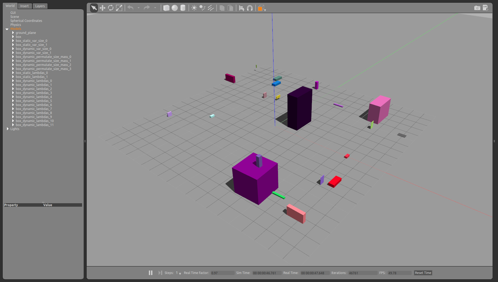
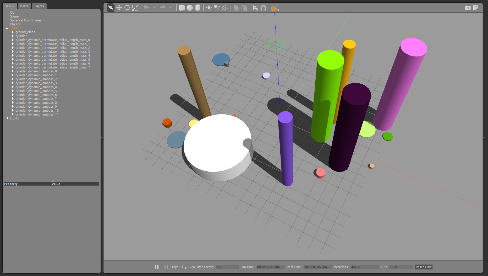
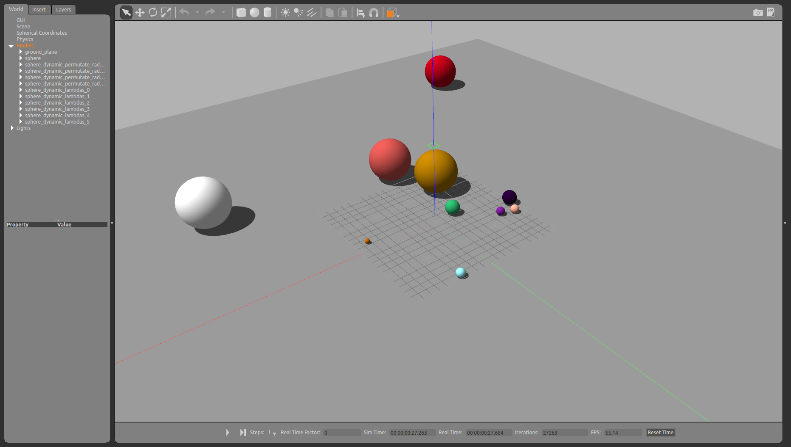
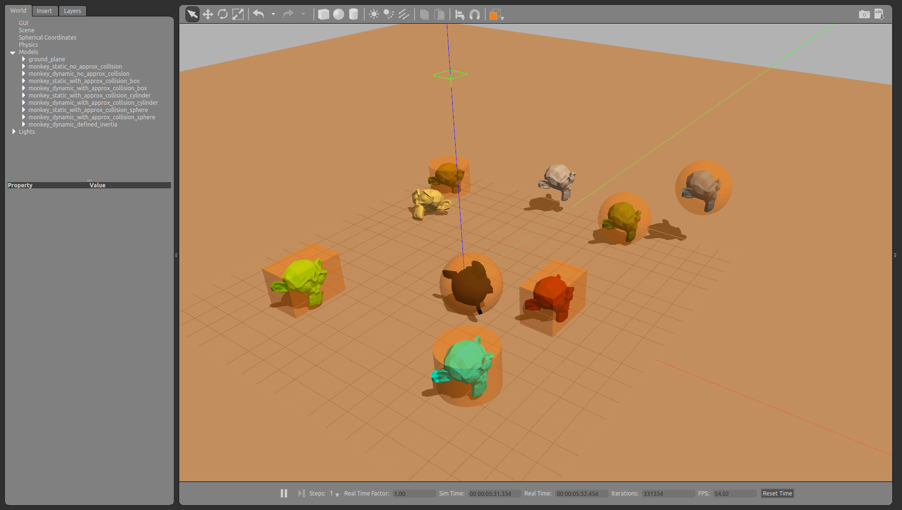

# Model generator


```python
from pcg_gazebo.generators.creators import create_models_from_config
from pcg_gazebo.task_manager import Server
from pcg_gazebo.generators import WorldGenerator
import random

# Start an empty world Gazebo simulation
server = Server()
server.create_simulation('default')
simulation = server.get_simulation('default')
simulation.create_gazebo_empty_world_task()
print(simulation.get_task_list())
print('Is Gazebo running: {}'.format(
    simulation.is_task_running('gazebo')))
simulation.run_all_tasks()

# Create a Gazebo proxy
gazebo_proxy = simulation.get_gazebo_proxy()
# Use the generator to spawn the model to the Gazebo instance 
# running at the moment
generator = WorldGenerator(gazebo_proxy=gazebo_proxy)
```


```python
def create_and_spawn(config):
    models = create_models_from_config(config)
    for model in models:
        generator.spawn_model(
            model=model, 
            robot_namespace=model.name,
            pos=[
                20 * random.random() - 10, 
                20 * random.random() - 10, 
                2 * random.random()])
```

## Box-shaped models

### Creating box models


```python
config = [
    dict(
        type='box',
        args=dict(
            size=[2, 2, 2],
            mass=10,
            name='box',
            pose=[0, 0, 1, 0, 0, 0],
            color='random'
        )
    )
]

create_and_spawn(config)
```

### Creating multiple boxes models using fixed arguments


```python
config = [
    dict(
        type='box_factory',
        args=dict(
            size=[
                [0.1, 0.4, 0.5],
                [1, 2, 3]
            ],
            name='box_static_var_size',
            use_permutation=True,
            color='xkcd'
        )
    ),
    dict(
        type='box_factory',
        args=dict(
            size=[
                [0.1, 0.4, 0.5],
                [1, 2, 3]
            ],
            mass=12,
            name='box_dynamic_var_size',
            use_permutation=False,
            color='xkcd'
        )
    ),
    dict(
        type='box_factory',
        args=dict(
            size=[
                [0.2, 0.4, 0.15],
                [1.2, 0.25, 0.7]
            ],
            mass=[5, 2],
            name='box_dynamic_permutate_size_mass',
            use_permutation=True,
            color='xkcd'
        )
    )
]

create_and_spawn(config)
```

### Creating multiple boxes with lambda arguments


```python
config = [
    dict(
        type='box_factory',
        args=dict(
            size="__import__('numpy').random.random((2, 3))",
            use_permutation=True,
            name='box_static_lambdas',
            color='random'
        )
    ),
    dict(
        type='box_factory',
        args=dict(
            size="__import__('numpy').random.random((4, 3))",
            mass="__import__('numpy').arange(1, 10, 4)",
            use_permutation=True,
            name='box_dynamic_lambdas',
            color='random'
        )
    )
]

create_and_spawn(config)
```



## Cylinder-shaped models


```python
config = [
    dict(
        type='cylinder',
        args=dict(
            radius=3,
            length=2, 
            mass=10,
            name='cylinder',
            pose=[0, 0, 1, 0, 0, 0]
        )
    ),
    dict(
        type='cylinder_factory',
        args=dict(
            length=[0.3, 0.5],
            radius=[0.2, 0.4],
            mass=[5, 2],
            name='cylinder_dynamic_permutate_radius_length_mass',
            use_permutation=True,
            color='xkcd'
        )
    ),
    dict(
        type='cylinder_factory',
        args=dict(
            length="__import__('numpy').linspace(0.1, 10, 2)",
            radius="__import__('numpy').random.random(2)",
            mass="__import__('numpy').arange(1, 4, 1)",
            use_permutation=True,
            name='cylinder_dynamic_lambdas',
            color='xkcd'
        )
    )
]

create_and_spawn(config)
```



## Sphere-shaped models


```python
config = [
    dict(
        type='sphere',
        args=dict(
            radius=3,
            mass=10,
            name='sphere',
            pose=[0, 0, 1.5, 0, 0, 0]
        )
    ),
    dict(
        type='sphere_factory',
        args=dict(
            radius=[0.3, 0.9],
            mass=[5, 2],
            name='sphere_dynamic_permutate_radius_mass',
            use_permutation=True,
            color='xkcd'
        )
    ),
    dict(
        type='sphere_factory',
        args=dict(
            radius="__import__('numpy').random.random(2) * 3",
            mass="__import__('numpy').arange(1, 4, 1)",
            use_permutation=True,
            name='sphere_dynamic_lambdas',
            color='xkcd'
        )
    )
]

create_and_spawn(config)
```



## Mesh models


```python
mesh_filename = 'package://pcg_examples/meshes/monkey_offset.dae'

config = [
    dict(
        type='mesh',
        args=dict(
            visual_mesh_filename=mesh_filename,
            visual_mesh_scale=[1, 1, 1],
            use_approximated_collision=False,
            name='monkey_static_no_approx_collision',
            color='xkcd'
        )
    ),
    dict(
        type='mesh',
        args=dict(
            visual_mesh_filename=mesh_filename,
            visual_mesh_scale=[1, 1, 1],
            use_approximated_collision=False,
            mass=10,
            name='monkey_dynamic_no_approx_collision',
            color='xkcd'
        )
    ),
    dict(
        type='mesh',
        args=dict(
            visual_mesh_filename=mesh_filename,
            visual_mesh_scale=[1, 1, 1],
            use_approximated_collision=True,
            approximated_collision_model='box',
            name='monkey_static_with_approx_collision_box',
            color='xkcd'
        )
    ),
    dict(
        type='mesh',
        args=dict(
            visual_mesh_filename=mesh_filename,
            visual_mesh_scale=[1, 1, 1],
            use_approximated_collision=True,
            approximated_collision_model='box',
            mass=20,
            name='monkey_dynamic_with_approx_collision_box',
            color='xkcd'
        )
    ),
    dict(
        type='mesh',
        args=dict(
            visual_mesh_filename=mesh_filename,
            visual_mesh_scale=[1, 1, 1],
            use_approximated_collision=True,
            approximated_collision_model='cylinder',
            name='monkey_static_with_approx_collision_cylinder',
            color='xkcd'
        )
    ),
    dict(
        type='mesh',
        args=dict(
            visual_mesh_filename=mesh_filename,
            visual_mesh_scale=[1, 1, 1],
            use_approximated_collision=True,
            mass=15,
            approximated_collision_model='cylinder',
            name='monkey_dynamic_with_approx_collision_cylinder',
            color='xkcd'
        )
    ),
    dict(
        type='mesh',
        args=dict(
            visual_mesh_filename=mesh_filename,
            visual_mesh_scale=[1, 1, 1],
            use_approximated_collision=True,
            approximated_collision_model='sphere',
            name='monkey_static_with_approx_collision_sphere',
            color='xkcd'
        )
    ),
    dict(
        type='mesh',
        args=dict(
            visual_mesh_filename=mesh_filename,
            visual_mesh_scale=[1, 1, 1],
            use_approximated_collision=True,
            mass=3,
            approximated_collision_model='sphere',
            name='monkey_dynamic_with_approx_collision_sphere',
            color='xkcd'
        )
    ),
    dict(
        type='mesh',
        args=dict(
            visual_mesh_filename=mesh_filename,
            visual_mesh_scale=[1, 1, 1],
            use_approximated_collision=True,
            mass=3,
            approximated_collision_model='sphere',
            name='monkey_dynamic_defined_inertia',
            color='xkcd',
            use_approximated_inertia=False,
            inertia=dict(
                ixx=0.1,
                iyy=0.1,
                izz=0.1
            )                 
        )
    )
]

create_and_spawn(config)
```




```python

```
