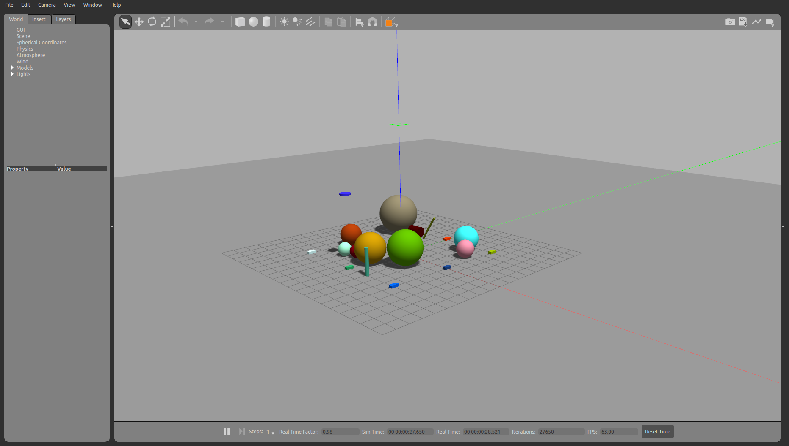

# Objects

The objects are models including basic and custom forms that can be spawned in the simulation.


```python
from pcg_gazebo.simulation import create_object
```


```python
# If there is a Gazebo instance running, you can spawn the box into the simulation
from pcg_gazebo.task_manager import Server
# First create a simulation server
server = Server()
# Create a simulation manager named default
server.create_simulation('default')
simulation = server.get_simulation('default')
# Run an instance of the empty.world scenario
# This is equivalent to run
#      roslaunch gazebo_ros empty_world.launch
# with all default parameters
simulation.create_gazebo_empty_world_task()
# A task named 'gazebo' the added to the tasks list
print(simulation.get_task_list())
# But it is still not running
print('Is Gazebo running: {}'.format(simulation.is_task_running('gazebo')))
# Run Gazebo
simulation.run_all_tasks()
```

    ['gazebo']
    Is Gazebo running: False


```python
from pcg_gazebo.generators import WorldGenerator
import random
# Create a Gazebo proxy
gazebo_proxy = simulation.get_gazebo_proxy()

# Use the generator to spawn the model to the Gazebo instance running at the moment
generator = WorldGenerator(gazebo_proxy=gazebo_proxy)
```

## Geometries

### Box


```python
box = create_object('box')
# A box object comes initially with no inertial information and null size.
print('Size:')
print(box.size)
print('Inertial:')
print(box.inertial)
```

    Size:
    [1, 1, 1]
    Inertial:
    None


```python
# When generating the SDF elements for the box, a few options can be used
print(box.to_sdf('box'))
```

    <box>
      <size>1 1 1</size>
    </box>
    


```python
print(box.to_sdf('geometry'))
```

    <geometry>
      <box>
        <size>1 1 1</size>
      </box>
    </geometry>
    


```python
print(box.to_sdf('collision'))
```

    <collision name="collision">
      <max_contacts>10</max_contacts>
      <pose frame="">0 0 0 0.0 -0.0 0.0</pose>
      <geometry>
        <box>
          <size>1 1 1</size>
        </box>
      </geometry>
    </collision>
    


```python
print(box.to_sdf('visual'))
```

    <visual name="visual">
      <pose frame="">0 0 0 0.0 -0.0 0.0</pose>
      <geometry>
        <box>
          <size>1 1 1</size>
        </box>
      </geometry>
      <transparency>0.0</transparency>
      <cast_shadows>1</cast_shadows>
    </visual>
    


```python
print(box.to_sdf('link'))
```

    <link name="box">
      <collision name="collision">
        <max_contacts>10</max_contacts>
        <pose frame="">0 0 0 0.0 -0.0 0.0</pose>
        <geometry>
          <box>
            <size>1 1 1</size>
          </box>
        </geometry>
      </collision>
      <pose frame="">0 0 0 0.0 -0.0 0.0</pose>
      <visual name="visual">
        <pose frame="">0 0 0 0.0 -0.0 0.0</pose>
        <geometry>
          <box>
            <size>1 1 1</size>
          </box>
        </geometry>
        <transparency>0.0</transparency>
        <cast_shadows>1</cast_shadows>
      </visual>
    </link>
    


```python
print(box.to_sdf('model'))
```

    <model name="box">
      <link name="box">
        <collision name="collision">
          <max_contacts>10</max_contacts>
          <pose frame="">0 0 0 0.0 -0.0 0.0</pose>
          <geometry>
            <box>
              <size>1 1 1</size>
            </box>
          </geometry>
        </collision>
        <visual name="visual">
          <pose frame="">0 0 0 0.0 -0.0 0.0</pose>
          <geometry>
            <box>
              <size>1 1 1</size>
            </box>
          </geometry>
          <transparency>0.0</transparency>
          <cast_shadows>1</cast_shadows>
        </visual>
      </link>
      <pose frame="">0 0 0 0.0 -0.0 0.0</pose>
      <allow_auto_disable>0</allow_auto_disable>
      <static>0</static>
    </model>
    


```python
# To set the inertial, use the function add_inertial giving the mass of the box,
# the moments of inertia will be computed from the box's dimensions
box.size = [0.3, 0.6, 0.2]
box.add_inertial(mass=20)
print(box.inertial)
```

    Mass [Kg]=20
    Pose=[0. 0. 0.]
    I =
    	Ixx=0.6666666666666666
    	Iyy=0.21666666666666665
    	Izz=0.7499999999999999
    	Ixy=0
    	Ixz=0
    	Iyz=0
    


```python
# The inertial information will be added to the SDF description in link and model modes
print(box.to_sdf('link'))
print(box.to_sdf('model'))
```

    <link name="box">
      <collision name="collision">
        <max_contacts>10</max_contacts>
        <pose frame="">0 0 0 0.0 -0.0 0.0</pose>
        <geometry>
          <box>
            <size>0.3 0.6 0.2</size>
          </box>
        </geometry>
      </collision>
      <pose frame="">0 0 0 0.0 -0.0 0.0</pose>
      <inertial>
        <pose frame="">0 0 0 0.0 -0.0 0.0</pose>
        <mass>20.0</mass>
        <inertia>
          <iyz>0.0</iyz>
          <ixy>0.0</ixy>
          <ixz>0.0</ixz>
          <izz>0.7499999999999999</izz>
          <ixx>0.6666666666666666</ixx>
          <iyy>0.21666666666666665</iyy>
        </inertia>
      </inertial>
      <visual name="visual">
        <pose frame="">0 0 0 0.0 -0.0 0.0</pose>
        <geometry>
          <box>
            <size>0.3 0.6 0.2</size>
          </box>
        </geometry>
        <transparency>0.0</transparency>
        <cast_shadows>1</cast_shadows>
      </visual>
    </link>
    
    <model name="box">
      <link name="box">
        <collision name="collision">
          <max_contacts>10</max_contacts>
          <pose frame="">0 0 0 0.0 -0.0 0.0</pose>
          <geometry>
            <box>
              <size>0.3 0.6 0.2</size>
            </box>
          </geometry>
        </collision>
        <visual name="visual">
          <pose frame="">0 0 0 0.0 -0.0 0.0</pose>
          <geometry>
            <box>
              <size>0.3 0.6 0.2</size>
            </box>
          </geometry>
          <transparency>0.0</transparency>
          <cast_shadows>1</cast_shadows>
        </visual>
        <inertial>
          <pose frame="">0 0 0 0.0 -0.0 0.0</pose>
          <inertia>
            <iyz>0.0</iyz>
            <ixy>0.0</ixy>
            <ixz>0.0</ixz>
            <izz>0.7499999999999999</izz>
            <ixx>0.6666666666666666</ixx>
            <iyy>0.21666666666666665</iyy>
          </inertia>
          <mass>20.0</mass>
        </inertial>
      </link>
      <pose frame="">0 0 0 0.0 -0.0 0.0</pose>
      <allow_auto_disable>0</allow_auto_disable>
      <static>0</static>
    </model>
    


```python
model_counter = 0
for x in [-5, 0, 5]:
    for y in [-5, 0, 5]:
        box.visual.enable_property('material')
        box.visual.set_xkcd_color()
        generator.spawn_model(
            model=box, 
            robot_namespace='box_{}'.format(model_counter),
            pos=[x, y, 10])
        model_counter += 1

```


```python
# Using the Gazebo proxy created by the generator's constructor
# it is possible to see that all models were created
print(generator.gazebo_proxy.get_model_names())
```

    ['ground_plane', 'box_0', 'box_1', 'box_2', 'box_3', 'box_4', 'box_5', 'box_6', 'box_7', 'box_8']


```python
# End the simulation by killing the Gazebo task
# simulation.kill_task('gazebo')
```

### Sphere


```python
sphere = create_object('sphere')
# A sphere object comes initially with no inertial information and radius equal to 1.
print('Radius:')
print(sphere.radius)
print('Inertial:')
print(sphere.inertial)
```

    Radius:
    1
    Inertial:
    None


```python
# When generating the SDF elements for the box, a few options can be used
print(sphere.to_sdf('sphere'))
```

    <sphere>
      <radius>1.0</radius>
    </sphere>
    


```python
print(sphere.to_sdf('geometry'))
```

    <geometry>
      <sphere>
        <radius>1.0</radius>
      </sphere>
    </geometry>
    


```python
print(sphere.to_sdf('collision'))
```

    <collision name="collision">
      <max_contacts>10</max_contacts>
      <pose frame="">0 0 0 0.0 -0.0 0.0</pose>
      <geometry>
        <sphere>
          <radius>1.0</radius>
        </sphere>
      </geometry>
    </collision>
    


```python
print(sphere.to_sdf('visual'))
```

    <visual name="visual">
      <pose frame="">0 0 0 0.0 -0.0 0.0</pose>
      <geometry>
        <sphere>
          <radius>1.0</radius>
        </sphere>
      </geometry>
      <transparency>0.0</transparency>
      <cast_shadows>1</cast_shadows>
    </visual>
    


```python
print(sphere.to_sdf('link'))
```

    <link name="sphere">
      <collision name="collision">
        <max_contacts>10</max_contacts>
        <pose frame="">0 0 0 0.0 -0.0 0.0</pose>
        <geometry>
          <sphere>
            <radius>1.0</radius>
          </sphere>
        </geometry>
      </collision>
      <pose frame="">0 0 0 0.0 -0.0 0.0</pose>
      <visual name="visual">
        <pose frame="">0 0 0 0.0 -0.0 0.0</pose>
        <geometry>
          <sphere>
            <radius>1.0</radius>
          </sphere>
        </geometry>
        <transparency>0.0</transparency>
        <cast_shadows>1</cast_shadows>
      </visual>
    </link>
    


```python
print(sphere.to_sdf('model'))
```

    <model name="sphere">
      <link name="sphere">
        <collision name="collision">
          <max_contacts>10</max_contacts>
          <pose frame="">0 0 0 0.0 -0.0 0.0</pose>
          <geometry>
            <sphere>
              <radius>1.0</radius>
            </sphere>
          </geometry>
        </collision>
        <visual name="visual">
          <pose frame="">0 0 0 0.0 -0.0 0.0</pose>
          <geometry>
            <sphere>
              <radius>1.0</radius>
            </sphere>
          </geometry>
          <transparency>0.0</transparency>
          <cast_shadows>1</cast_shadows>
        </visual>
      </link>
      <pose frame="">0 0 0 0.0 -0.0 0.0</pose>
      <allow_auto_disable>0</allow_auto_disable>
      <static>0</static>
    </model>
    


```python
# To set the inertial, use the function add_inertial giving the mass of the sphere,
# the moments of inertia will be computed from the sphere's dimensions
sphere.radius = 0.3
sphere.add_inertial(20)
print(sphere.inertial)
```

    Mass [Kg]=20
    Pose=[0. 0. 0.]
    I =
    	Ixx=0.72
    	Iyy=0.72
    	Izz=0.72
    	Ixy=0
    	Ixz=0
    	Iyz=0
    


```python
# The inertial information will be added to the SDF description in link and model modes
print(sphere.to_sdf('link'))
print(sphere.to_sdf('model'))
```

    <link name="sphere">
      <collision name="collision">
        <max_contacts>10</max_contacts>
        <pose frame="">0 0 0 0.0 -0.0 0.0</pose>
        <geometry>
          <sphere>
            <radius>0.3</radius>
          </sphere>
        </geometry>
      </collision>
      <pose frame="">0 0 0 0.0 -0.0 0.0</pose>
      <inertial>
        <pose frame="">0 0 0 0.0 -0.0 0.0</pose>
        <mass>20.0</mass>
        <inertia>
          <iyz>0.0</iyz>
          <ixy>0.0</ixy>
          <ixz>0.0</ixz>
          <izz>0.72</izz>
          <ixx>0.72</ixx>
          <iyy>0.72</iyy>
        </inertia>
      </inertial>
      <visual name="visual">
        <pose frame="">0 0 0 0.0 -0.0 0.0</pose>
        <geometry>
          <sphere>
            <radius>0.3</radius>
          </sphere>
        </geometry>
        <transparency>0.0</transparency>
        <cast_shadows>1</cast_shadows>
      </visual>
    </link>
    
    <model name="sphere">
      <link name="sphere">
        <collision name="collision">
          <max_contacts>10</max_contacts>
          <pose frame="">0 0 0 0.0 -0.0 0.0</pose>
          <geometry>
            <sphere>
              <radius>0.3</radius>
            </sphere>
          </geometry>
        </collision>
        <visual name="visual">
          <pose frame="">0 0 0 0.0 -0.0 0.0</pose>
          <geometry>
            <sphere>
              <radius>0.3</radius>
            </sphere>
          </geometry>
          <transparency>0.0</transparency>
          <cast_shadows>1</cast_shadows>
        </visual>
        <inertial>
          <pose frame="">0 0 0 0.0 -0.0 0.0</pose>
          <inertia>
            <iyz>0.0</iyz>
            <ixy>0.0</ixy>
            <ixz>0.0</ixz>
            <izz>0.72</izz>
            <ixx>0.72</ixx>
            <iyy>0.72</iyy>
          </inertia>
          <mass>20.0</mass>
        </inertial>
      </link>
      <pose frame="">0 0 0 0.0 -0.0 0.0</pose>
      <allow_auto_disable>0</allow_auto_disable>
      <static>0</static>
    </model>
    


```python
# Run Gazebo again, if not already running
simulation.run_task('gazebo')

```


```python
# Spawn sphere of different values for radius
model_counter = 0
for _ in range(3):
    for _ in range(3):
        sphere.radius = random.random() * 2
        sphere.add_inertial(random.random() * 30)
        sphere.visual.enable_property('material')
        sphere.visual.set_xkcd_color()
        generator.spawn_model(
            model=sphere, 
            robot_namespace='sphere_{}'.format(model_counter),
            pos=[(random.random() - 0.5) * 10, (random.random() - 0.5) * 10, (random.random() - 0.5) * 5 + 3])
        model_counter += 1
```


```python
# End the simulation by killing the Gazebo task
# simulation.kill_all_tasks()
```

### Cylinder


```python
cylinder = create_object('cylinder')
# A sphere object comes initially with no inertial information, and length and radius equal to 1.
print('Radius:')
print(cylinder.radius)
print('Length:')
print(cylinder.length)
```

    Radius:
    1
    Length:
    1


```python
# When generating the SDF elements for the cylinder, a few options can be used
print(cylinder.to_sdf('cylinder'))
```

    <cylinder>
      <length>1.0</length>
      <radius>1.0</radius>
    </cylinder>
    


```python
print(cylinder.to_sdf('geometry'))
```

    <geometry>
      <cylinder>
        <length>1.0</length>
        <radius>1.0</radius>
      </cylinder>
    </geometry>
    


```python
print(cylinder.to_sdf('collision'))
```

    <collision name="collision">
      <max_contacts>10</max_contacts>
      <pose frame="">0 0 0 0.0 -0.0 0.0</pose>
      <geometry>
        <cylinder>
          <length>1.0</length>
          <radius>1.0</radius>
        </cylinder>
      </geometry>
    </collision>
    


```python
print(cylinder.to_sdf('visual'))
```

    <visual name="visual">
      <pose frame="">0 0 0 0.0 -0.0 0.0</pose>
      <geometry>
        <cylinder>
          <length>1.0</length>
          <radius>1.0</radius>
        </cylinder>
      </geometry>
      <transparency>0.0</transparency>
      <cast_shadows>1</cast_shadows>
    </visual>
    


```python
print(cylinder.to_sdf('link'))
```

    <link name="cylinder">
      <collision name="collision">
        <max_contacts>10</max_contacts>
        <pose frame="">0 0 0 0.0 -0.0 0.0</pose>
        <geometry>
          <cylinder>
            <length>1.0</length>
            <radius>1.0</radius>
          </cylinder>
        </geometry>
      </collision>
      <pose frame="">0 0 0 0.0 -0.0 0.0</pose>
      <visual name="visual">
        <pose frame="">0 0 0 0.0 -0.0 0.0</pose>
        <geometry>
          <cylinder>
            <length>1.0</length>
            <radius>1.0</radius>
          </cylinder>
        </geometry>
        <transparency>0.0</transparency>
        <cast_shadows>1</cast_shadows>
      </visual>
    </link>
    


```python
print(cylinder.to_sdf('model'))
```

    <model name="cylinder">
      <link name="cylinder">
        <collision name="collision">
          <max_contacts>10</max_contacts>
          <pose frame="">0 0 0 0.0 -0.0 0.0</pose>
          <geometry>
            <cylinder>
              <length>1.0</length>
              <radius>1.0</radius>
            </cylinder>
          </geometry>
        </collision>
        <visual name="visual">
          <pose frame="">0 0 0 0.0 -0.0 0.0</pose>
          <geometry>
            <cylinder>
              <length>1.0</length>
              <radius>1.0</radius>
            </cylinder>
          </geometry>
          <transparency>0.0</transparency>
          <cast_shadows>1</cast_shadows>
        </visual>
      </link>
      <pose frame="">0 0 0 0.0 -0.0 0.0</pose>
      <allow_auto_disable>0</allow_auto_disable>
      <static>0</static>
    </model>
    


```python
# To set the inertial, use the function add_inertial giving the mass of the cylinder,
# the moments of inertia will be computed from the cylinder's dimensions
cylinder.radius = 0.3
cylinder.length = 0.8
cylinder.add_inertial(20)
print(cylinder.inertial)
```

    Mass [Kg]=20
    Pose=[0. 0. 0.]
    I =
    	Ixx=1.5166666666666668
    	Iyy=1.5166666666666668
    	Izz=0.8999999999999999
    	Ixy=0
    	Ixz=0
    	Iyz=0
    


```python
# The inertial information will be added to the SDF description in link and model modes
print(cylinder.to_sdf('link'))
print(cylinder.to_sdf('model'))
```

    <link name="cylinder">
      <collision name="collision">
        <max_contacts>10</max_contacts>
        <pose frame="">0 0 0 0.0 -0.0 0.0</pose>
        <geometry>
          <cylinder>
            <length>0.8</length>
            <radius>0.3</radius>
          </cylinder>
        </geometry>
      </collision>
      <pose frame="">0 0 0 0.0 -0.0 0.0</pose>
      <inertial>
        <pose frame="">0 0 0 0.0 -0.0 0.0</pose>
        <mass>20.0</mass>
        <inertia>
          <iyz>0.0</iyz>
          <ixy>0.0</ixy>
          <ixz>0.0</ixz>
          <izz>0.8999999999999999</izz>
          <ixx>1.5166666666666668</ixx>
          <iyy>1.5166666666666668</iyy>
        </inertia>
      </inertial>
      <visual name="visual">
        <pose frame="">0 0 0 0.0 -0.0 0.0</pose>
        <geometry>
          <cylinder>
            <length>0.8</length>
            <radius>0.3</radius>
          </cylinder>
        </geometry>
        <transparency>0.0</transparency>
        <cast_shadows>1</cast_shadows>
      </visual>
    </link>
    
    <model name="cylinder">
      <link name="cylinder">
        <collision name="collision">
          <max_contacts>10</max_contacts>
          <pose frame="">0 0 0 0.0 -0.0 0.0</pose>
          <geometry>
            <cylinder>
              <length>0.8</length>
              <radius>0.3</radius>
            </cylinder>
          </geometry>
        </collision>
        <visual name="visual">
          <pose frame="">0 0 0 0.0 -0.0 0.0</pose>
          <geometry>
            <cylinder>
              <length>0.8</length>
              <radius>0.3</radius>
            </cylinder>
          </geometry>
          <transparency>0.0</transparency>
          <cast_shadows>1</cast_shadows>
        </visual>
        <inertial>
          <pose frame="">0 0 0 0.0 -0.0 0.0</pose>
          <inertia>
            <iyz>0.0</iyz>
            <ixy>0.0</ixy>
            <ixz>0.0</ixz>
            <izz>0.8999999999999999</izz>
            <ixx>1.5166666666666668</ixx>
            <iyy>1.5166666666666668</iyy>
          </inertia>
          <mass>20.0</mass>
        </inertial>
      </link>
      <pose frame="">0 0 0 0.0 -0.0 0.0</pose>
      <allow_auto_disable>0</allow_auto_disable>
      <static>0</static>
    </model>
    


```python
# Run Gazebo again, if not already running
simulation.run_task('gazebo')

```


```python
# Spawn sphere of different values for radius
model_counter = 0
for _ in range(3):
    for _ in range(3):
        cylinder.length = random.random() * 3
        cylinder.radius = random.random() * 0.5
        cylinder.add_inertial(random.random() * 30)
        cylinder.visual.enable_property('material')
        cylinder.visual.set_xkcd_color()
        generator.spawn_model(
            model=cylinder, 
            robot_namespace='cylinder_{}'.format(model_counter),
            pos=[(random.random() - 0.5) * 10, (random.random() - 0.5) * 10, (random.random() - 0.5) * 5 + 10])
        model_counter += 1
```

### Plane


```python
plane = create_object('plane')
# A plane per default has normal [0, 0, 1] and size = [1, 1]
print('Normal:')
print(plane.normal)
print('Size:')
print(plane.size)
```

    Normal:
    [0, 0, 1]
    Size:
    [1, 1]


```python
# When generating the SDF elements for the plane, a few options can be used
print(plane.to_sdf('plane'))
```

    <plane>
      <normal>0 0 1</normal>
      <size>1 1</size>
    </plane>
    


```python
print(plane.to_sdf('geometry'))
```

    <geometry>
      <plane>
        <normal>0 0 1</normal>
        <size>1 1</size>
      </plane>
    </geometry>
    


```python
print(plane.to_sdf('visual'))
```

    <visual name="visual">
      <pose frame="">0 0 0 0.0 -0.0 0.0</pose>
      <geometry>
        <plane>
          <normal>0 0 1</normal>
          <size>1 1</size>
        </plane>
      </geometry>
      <transparency>0.0</transparency>
      <cast_shadows>1</cast_shadows>
    </visual>
    


```python
print(plane.to_sdf('collision'))
```

    <collision name="collision">
      <max_contacts>10</max_contacts>
      <pose frame="">0 0 0 0.0 -0.0 0.0</pose>
      <geometry>
        <plane>
          <normal>0 0 1</normal>
          <size>1 1</size>
        </plane>
      </geometry>
    </collision>
    


```python
print(plane.to_sdf('link'))
```

    <link name="plane">
      <pose frame="">0 0 0 0.0 -0.0 0.0</pose>
      <visual name="visual">
        <pose frame="">0 0 0 0.0 -0.0 0.0</pose>
        <geometry>
          <plane>
            <normal>0 0 1</normal>
            <size>1 1</size>
          </plane>
        </geometry>
        <transparency>0.0</transparency>
        <cast_shadows>1</cast_shadows>
      </visual>
    </link>
    


```python
print(plane.to_sdf('model'))
```

    <model name="plane">
      <link name="plane">
        <visual name="visual">
          <pose frame="">0 0 0 0.0 -0.0 0.0</pose>
          <geometry>
            <plane>
              <normal>0 0 1</normal>
              <size>1 1</size>
            </plane>
          </geometry>
          <transparency>0.0</transparency>
          <cast_shadows>1</cast_shadows>
        </visual>
      </link>
      <pose frame="">0 0 0 0.0 -0.0 0.0</pose>
      <allow_auto_disable>0</allow_auto_disable>
      <static>1</static>
    </model>
    


```python
# Run Gazebo again, if not already running
simulation.run_task('gazebo')
```


```python
# Spawning the plane
# When there are other models in the simulation, 
# the spawning of a new plane with [0, 0, 1] and a plane as 
# collision geometry  leads to 
# the new plane becoming the ground plane
# To set the collision geometry, use
#    plane.generate_collision = True
plane = create_object('plane')
plane.size = [random.random() * 5, random.random() * 5]
p = random.random()
plane.normal = [0, 0, 1]
plane.visual.enable_property('material')
plane.visual.set_xkcd_color()
generator.spawn_model(
    model=plane, 
    robot_namespace='new_plane',
    pos=[(random.random() - 0.5) * 10, (random.random() - 0.5) * 10, (random.random() - 0.5) * 2 + 5])

```


    True


The output should look like this


