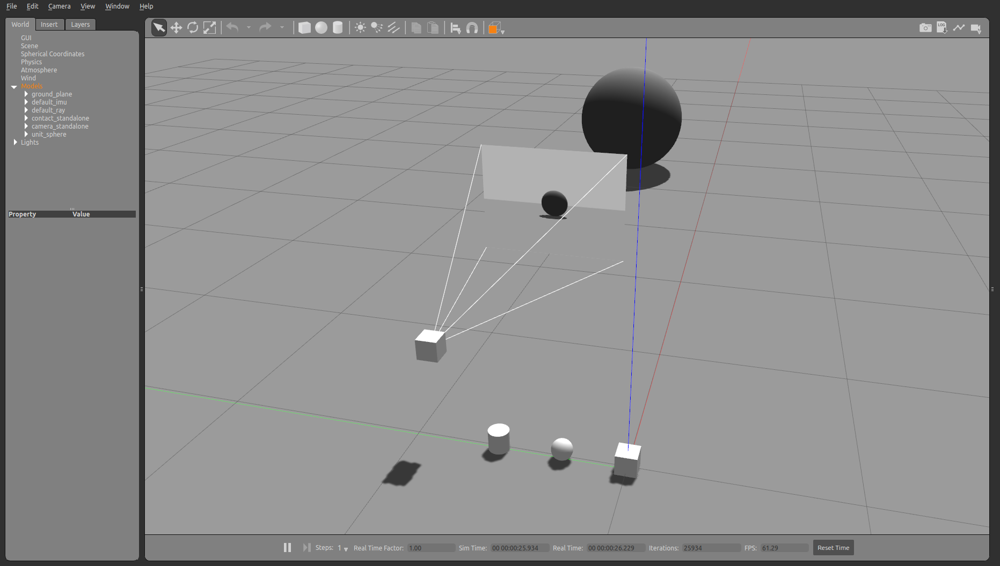

# Sensors


```python
from pcg_gazebo.simulation import create_object, SimulationModel
from pcg_gazebo.task_manager import get_rostopic_list
```


```python
# If there is a Gazebo instance running, you can spawn the box 
# into the simulation
from pcg_gazebo.task_manager import Server
# First create a simulation server
server = Server()
# Create a simulation manager named default
server.create_simulation('default', ros_port=11311, gazebo_port=11345)
simulation = server.get_simulation('default')
# Run an instance of the empty.world scenario
# This is equivalent to run
#      roslaunch gazebo_ros empty_world.launch
# with all default parameters
simulation.create_gazebo_empty_world_task()
simulation.create_rqt_task()

# A task named 'gazebo' the added to the tasks list
print(simulation.get_task_list())
# But it is still not running
print('Is Gazebo running: {}'.format(
    simulation.is_task_running('gazebo')))
# Run Gazebo
simulation.run_all_tasks()
```


```python
from pcg_gazebo.generators import WorldGenerator
import random
# Create a Gazebo proxy
gazebo_proxy = simulation.get_gazebo_proxy()

# Use the generator to spawn the model to the Gazebo instance running at the moment
generator = WorldGenerator(gazebo_proxy=gazebo_proxy)
print('Is Gazebo running: {}'.format(simulation.is_task_running('gazebo')))
```

## Sensors

### Standalone IMU sensor


```python
imu_model = SimulationModel(name='default_imu')

# Default IMU sensor
imu_model.add_imu_sensor(
    add_visual=True, 
    add_collision=True, 
    visualize=True,
    mass=0.01,
    size=[0.1, 0.1, 0.1],
    topic='/imu',
    link_shape='cuboid',
    link_name='imu_link')

print(imu_model.to_sdf())

# Spawn IMU standalone model
generator.spawn_model(
    model=imu_model, 
    robot_namespace='default_imu',
    pos=[0, 0, 0.05])
```


```python
print('List of ROS topics:')
for topic in simulation.get_rostopic_list():
    print(' - ' + topic)
```

### Standalone ray sensor


```python
ray_model = SimulationModel(name='default_ray')

# Default ray sensor
ray_model.add_ray_sensor(
    add_visual=True, 
    add_collision=True, 
    add_ros_plugin=False,
    mass=0.01,
    radius=0.05,
    link_shape='spherical',    
    link_name='ray_link')

print(ray_model.to_sdf())

# Spawn ray sensor standalone model
generator.spawn_model(
    model=ray_model, 
    robot_namespace='default_ray',
    pos=[0, 0.3, 0.05])
```


```python
print('List of ROS topics:')
for topic in simulation.get_rostopic_list():
    print(' - ' + topic)
```

### Standalone contact sensor


```python
contact_sensor = SimulationModel(name='contact_standalone')

contact_sensor.add_contact_sensor(
    add_visual=True, 
    add_collision=True, 
    add_ros_plugin=True,
    mass=0.01,
    radius=0.05,
    length=0.1,
    link_shape='cylindrical',
    link_name='contact_link')

print(contact_sensor.to_sdf())

# Spawn ray sensor standalone model
generator.spawn_model(
    model=contact_sensor, 
    robot_namespace='contact_standalone',
    pos=[0, 0.6, 0.05])
```

### Standalone camera


```python
camera_sensor = SimulationModel(name='camera_standalone')
camera_sensor.static = True

camera_sensor.add_camera_sensor(
    add_visual=True, 
    add_collision=True, 
    add_ros_plugin=True,
    visualize=True,
    mass=0.01,
    size=[0.1, 0.1, 0.1],
    link_shape='cuboid',
    link_name='camera_link')

print(camera_sensor.to_sdf())

# Spawn camera standalone model
generator.spawn_model(
    model=camera_sensor, 
    robot_namespace='camera_standalone',
    pos=[0, 0.9, 0.5])
```


```python
print('List of ROS topics:')
for topic in simulation.get_rostopic_list():
    print(' - ' + topic)
```


```python
# End the simulation by killing the Gazebo task
simulation.kill_all_tasks()
```




```python

```
