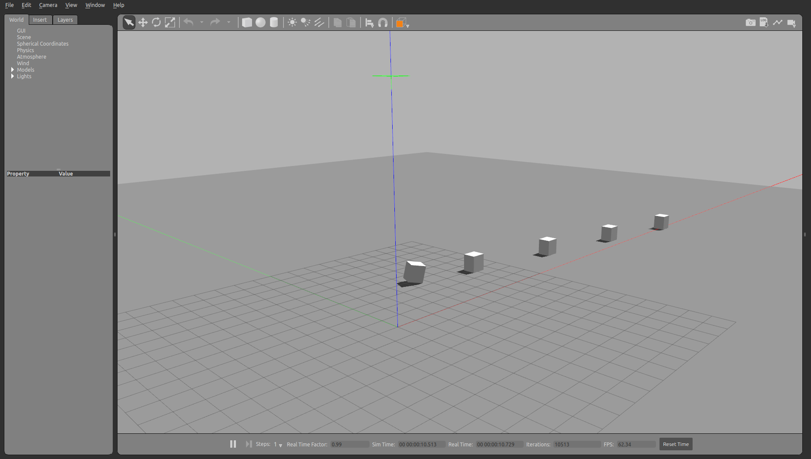

## Surface and collision properties

The simulation objects can include collision properties such as friction, bounce and contact parameters set to an individual link.


```python
from pcg_gazebo.simulation import create_object
```


```python
# If there is a Gazebo instance running, you can spawn the box into the simulation
from pcg_gazebo.task_manager import Server
# First create a simulation server
server = Server()
# Create a simulation manager named default
server.create_simulation('friction')
simulation = server.get_simulation('friction')
# Run an instance of the empty.world scenario
# This is equivalent to run
#      roslaunch gazebo_ros empty_world.launch
# with all default parameters
simulation.create_gazebo_empty_world_task()
# A task named 'gazebo' the added to the tasks list
print(simulation.get_task_list())
# But it is still not running
print('Is Gazebo running: {}'.format(simulation.is_task_running('gazebo')))
# Run Gazebo
simulation.run_all_tasks()
```


```python
from pcg_gazebo.generators import WorldGenerator
import random
# Create a Gazebo proxy
gazebo_proxy = simulation.get_gazebo_proxy()

# Use the generator to spawn the model to the Gazebo instance running at the moment
generator = WorldGenerator(gazebo_proxy=gazebo_proxy)
```

## Friction


```python
obj = create_object('box')
# By changing the size, collision, visual and inertial 
# properties are already going to be updated
obj.size = [0.8, 0.7, 0.9]
obj.add_inertial(30)

# Print the initial state of a box in the model option
print(obj.to_sdf('model'))
```


```python
# Set default friction parameters
obj.collision.enable_property('friction')
print(obj.to_sdf('model'))
```


```python
obj.collision.set_ode_friction_params(
    mu=0.9,
    mu2=0.5,
    slip1=0.3, 
    slip2=0.5,
    fdir1=[0, 0, 0]
)
print(obj.to_sdf('model'))
```


```python
obj.collision.set_bullet_friction_params(
    friction=0.8, 
    friction2=0.9, 
    fdir1=[0, 0, 0], 
    rolling_friction=1
)
print(obj.to_sdf('model'))
```


```python
# Set default bounce parameters
obj.collision.enable_property('bounce')
print(obj.to_sdf('model'))
```


```python
mu = [0.1, 0.3, 0.5, 0.7, 1.0] 
for i in range(len(mu)):
    obj.collision.set_ode_friction_params(
        mu=mu[i],
        mu2=mu[i])
    
    generator.spawn_model(
        model=obj, 
        robot_namespace='box_mu_{}'.format(mu[i]),
        pos=[0, i, 2])
```


```python
from time import sleep
sleep(2)

for i in range(len(mu)):
    gazebo_proxy.apply_body_wrench(
        model_name='box_mu_{}'.format(mu[i]),
        link_name='box',
        force=[300, 0, 0],
        torque=[0, 0, 0],
        start_time=0,
        duration=2
        )
```


```python
# End the simulation by killing the Gazebo task
sleep(5)
simulation.kill_all_tasks()
```

The cuboids are created with different friction parameters and therefore will travel different distances when subjected to a horizontal force applied on their center of mass.




```python

```
