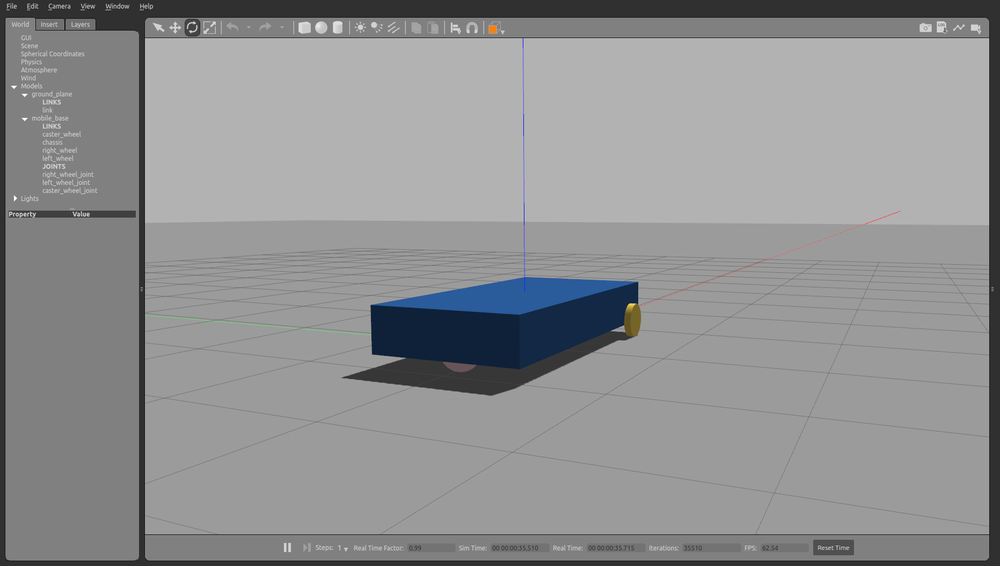

# Models


```python
from pcg_gazebo.simulation import create_object, SimulationModel
```


```python
# If there is a Gazebo instance running, you can spawn the box into the simulation
from pcg_gazebo.task_manager import Server
# First create a simulation server
server = Server()
# Create a simulation manager named default
server.create_simulation('default')
simulation = server.get_simulation('default')
# Run an instance of the empty.world scenario
# This is equivalent to run
#      roslaunch gazebo_ros empty_world.launch
# with all default parameters
simulation.create_gazebo_empty_world_task()
# A task named 'gazebo' the added to the tasks list
print(simulation.get_task_list())
# But it is still not running
print('Is Gazebo running: {}'.format(simulation.is_task_running('gazebo')))
# Run Gazebo
simulation.run_all_tasks()
```

    ['gazebo']
    Is Gazebo running: False


```python
from pcg_gazebo.generators import WorldGenerator
import random
# Create a Gazebo proxy
gazebo_proxy = simulation.get_gazebo_proxy()

# Use the generator to spawn the model to the Gazebo instance running at the moment
generator = WorldGenerator(gazebo_proxy=gazebo_proxy)
```

## Mobile base tutorial

Recreating the [Gazebo tutorial for a mobile base](http://gazebosim.org/tutorials/?tut=attach_gripper#MobileBase)


```python
# Creating the main body of the chassis
chassis = create_object('box')
chassis.size = [2, 1, 0.3]
chassis.add_inertial(20)
chassis.visual.enable_property('material')
chassis.visual.set_xkcd_color()

print(chassis.to_sdf('link'))
```

    <link name="box">
      <collision name="collision">
        <geometry>
          <box>
            <size>2 1 0.3</size>
          </box>
        </geometry>
        <pose frame="">0 0 0 0.0 0.0 0.0</pose>
        <max_contacts>10</max_contacts>
      </collision>
      <pose frame="">0 0 0 0.0 0.0 0.0</pose>
      <visual name="visual">
        <transparency>0.0</transparency>
        <geometry>
          <box>
            <size>2 1 0.3</size>
          </box>
        </geometry>
        <material>
          <ambient>0.396078431372549 0.4549019607843137 0.19607843137254902 1</ambient>
          <diffuse>0.396078431372549 0.4549019607843137 0.19607843137254902 1</diffuse>
        </material>
        <pose frame="">0 0 0 0.0 0.0 0.0</pose>
        <cast_shadows>1</cast_shadows>
      </visual>
      <inertial>
        <mass>20.0</mass>
        <pose frame="">0 0 0 0.0 0.0 0.0</pose>
        <inertia>
          <ixy>0.0</ixy>
          <iyz>0.0</iyz>
          <ixx>1.8166666666666667</ixx>
          <iyy>6.8166666666666655</iyy>
          <ixz>0.0</ixz>
          <izz>8.333333333333332</izz>
        </inertia>
      </inertial>
    </link>
    


```python
# Creating the caster wheel
caster_wheel = create_object('sphere')
caster_wheel.radius = 0.125
caster_wheel.add_inertial(1)
caster_wheel.visual.enable_property('material')
caster_wheel.visual.set_xkcd_color()

# Setting friction parameters to zero
caster_wheel.collision.enable_property('friction')
caster_wheel.collision.set_ode_friction_params(
    mu=0.0,
    mu2=0.0,
    slip1=0, 
    slip2=0,
    fdir1=[0, 0, 0]
)

caster_wheel.collision.set_bullet_friction_params(
    friction=0.0, 
    friction2=0.0, 
    fdir1=[0, 0, 0], 
    rolling_friction=1
)

print(caster_wheel.to_sdf('link'))
```

    <link name="sphere">
      <collision name="collision">
        <surface>
          <friction>
            <ode>
              <mu>0.0</mu>
              <slip2>0.0</slip2>
              <mu2>0.0</mu2>
              <fdir1>0 0 0</fdir1>
              <slip1>0.0</slip1>
            </ode>
            <torsional>
              <coefficient>1</coefficient>
              <use_patch_radius>1</use_patch_radius>
              <patch_radius>0</patch_radius>
              <ode>
                <slip>0</slip>
              </ode>
              <surface_radius>0</surface_radius>
            </torsional>
            <bullet>
              <friction>0.0</friction>
              <rolling_friction>1.0</rolling_friction>
              <fdir1>0 0 0</fdir1>
              <friction2>0.0</friction2>
            </bullet>
          </friction>
        </surface>
        <geometry>
          <sphere>
            <radius>0.125</radius>
          </sphere>
        </geometry>
        <pose frame="">0 0 0 0.0 0.0 0.0</pose>
        <max_contacts>10</max_contacts>
      </collision>
      <pose frame="">0 0 0 0.0 0.0 0.0</pose>
      <visual name="visual">
        <transparency>0.0</transparency>
        <geometry>
          <sphere>
            <radius>0.125</radius>
          </sphere>
        </geometry>
        <material>
          <ambient>1.0 0.8470588235294118 0.6941176470588235 1</ambient>
          <diffuse>1.0 0.8470588235294118 0.6941176470588235 1</diffuse>
        </material>
        <pose frame="">0 0 0 0.0 0.0 0.0</pose>
        <cast_shadows>1</cast_shadows>
      </visual>
      <inertial>
        <mass>1.0</mass>
        <pose frame="">0 0 0 0.0 0.0 0.0</pose>
        <inertia>
          <ixy>0.0</ixy>
          <iyz>0.0</iyz>
          <ixx>0.00625</ixx>
          <iyy>0.00625</iyy>
          <ixz>0.0</ixz>
          <izz>0.00625</izz>
        </inertia>
      </inertial>
    </link>
    


```python
right_wheel = create_object('cylinder')
right_wheel.pose = [0.8, -0.5 - 0.025, -0.125, 0, 1.5707, 1.5707]
right_wheel.radius = 0.125
right_wheel.length = 0.05
right_wheel.add_inertial(1)
right_wheel.visual.enable_property('material')
right_wheel.visual.set_xkcd_color()

left_wheel = create_object('cylinder')
left_wheel.pose = [0.8, 0.5 + 0.025, -0.125, 0, 1.5707, 1.5707]
left_wheel.radius = 0.125
left_wheel.length = 0.05
left_wheel.add_inertial(1)
left_wheel.visual.enable_property('material')
left_wheel.visual.set_xkcd_color()

print(right_wheel.to_sdf('link'))
```

    <link name="cylinder">
      <collision name="collision">
        <geometry>
          <cylinder>
            <length>0.05</length>
            <radius>0.125</radius>
          </cylinder>
        </geometry>
        <pose frame="">0 0 0 0.0 0.0 0.0</pose>
        <max_contacts>10</max_contacts>
      </collision>
      <pose frame="">0.8 -0.525 -0.125 0.0 1.5706999999985511 1.570699999999184</pose>
      <visual name="visual">
        <transparency>0.0</transparency>
        <geometry>
          <cylinder>
            <length>0.05</length>
            <radius>0.125</radius>
          </cylinder>
        </geometry>
        <material>
          <ambient>1.0 1.0 0.8941176470588236 1</ambient>
          <diffuse>1.0 1.0 0.8941176470588236 1</diffuse>
        </material>
        <pose frame="">0 0 0 0.0 0.0 0.0</pose>
        <cast_shadows>1</cast_shadows>
      </visual>
      <inertial>
        <mass>1.0</mass>
        <pose frame="">0 0 0 0.0 0.0 0.0</pose>
        <inertia>
          <ixy>0.0</ixy>
          <iyz>0.0</iyz>
          <ixx>0.004114583333333333</ixx>
          <iyy>0.004114583333333333</iyy>
          <ixz>0.0</ixz>
          <izz>0.0078125</izz>
        </inertia>
      </inertial>
    </link>
    


```python
# Assembling the robot mobile base
mobile_base = SimulationModel('mobile_base')

# Adding chassis
mobile_base.add_link('chassis', chassis)

# Adding caster wheel
caster_wheel.pose = [-0.8, 0, -0.125, 0, 0, 0]
mobile_base.add_link('caster_wheel', caster_wheel)
mobile_base.add_joint('caster_wheel_joint', parent='chassis', child='caster_wheel', joint_type='fixed')

# Adding left wheel
mobile_base.add_link('left_wheel', left_wheel)
mobile_base.add_joint('left_wheel_joint', parent='chassis', child='left_wheel', joint_type='revolute')

# Adding right wheel
mobile_base.add_link('right_wheel', right_wheel)
mobile_base.add_joint('right_wheel_joint', parent='chassis', child='right_wheel', joint_type='revolute')

print(mobile_base.to_sdf())
```

    <model name="mobile_base">
      <static>0</static>
      <joint name="left_wheel_joint" type="revolute">
        <axis>
          <limit>
            <lower>-1e+16</lower>
            <velocity>0.0</velocity>
            <effort>0.0</effort>
            <upper>1e+16</upper>
          </limit>
          <xyz>0 0 1</xyz>
          <dynamics>
            <damping>0.0</damping>
            <friction>0.0</friction>
            <spring_reference>0.0</spring_reference>
            <spring_stiffness>0.0</spring_stiffness>
          </dynamics>
        </axis>
        <parent>chassis</parent>
        <child>left_wheel</child>
        <pose frame="">0 0 0 0.0 0.0 0.0</pose>
      </joint>
      <joint name="caster_wheel_joint" type="fixed">
        <parent>chassis</parent>
        <child>caster_wheel</child>
        <pose frame="">0 0 0 0.0 0.0 0.0</pose>
      </joint>
      <joint name="right_wheel_joint" type="revolute">
        <axis>
          <limit>
            <lower>-1e+16</lower>
            <velocity>0.0</velocity>
            <effort>0.0</effort>
            <upper>1e+16</upper>
          </limit>
          <xyz>0 0 1</xyz>
          <dynamics>
            <damping>0.0</damping>
            <friction>0.0</friction>
            <spring_reference>0.0</spring_reference>
            <spring_stiffness>0.0</spring_stiffness>
          </dynamics>
        </axis>
        <parent>chassis</parent>
        <child>right_wheel</child>
        <pose frame="">0 0 0 0.0 0.0 0.0</pose>
      </joint>
      <self_collide>0</self_collide>
      <pose frame="">0 0 0 0.0 0.0 0.0</pose>
      <allow_auto_disable>0</allow_auto_disable>
      <link name="chassis">
        <collision name="collision">
          <geometry>
            <box>
              <size>2 1 0.3</size>
            </box>
          </geometry>
          <pose frame="">0 0 0 0.0 0.0 0.0</pose>
          <max_contacts>10</max_contacts>
        </collision>
        <pose frame="">0 0 0 0.0 0.0 0.0</pose>
        <visual name="visual">
          <transparency>0.0</transparency>
          <geometry>
            <box>
              <size>2 1 0.3</size>
            </box>
          </geometry>
          <material>
            <ambient>0.396078431372549 0.4549019607843137 0.19607843137254902 1</ambient>
            <diffuse>0.396078431372549 0.4549019607843137 0.19607843137254902 1</diffuse>
          </material>
          <pose frame="">0 0 0 0.0 0.0 0.0</pose>
          <cast_shadows>1</cast_shadows>
        </visual>
        <inertial>
          <mass>20.0</mass>
          <pose frame="">0 0 0 0.0 0.0 0.0</pose>
          <inertia>
            <ixy>0.0</ixy>
            <iyz>0.0</iyz>
            <ixx>1.8166666666666667</ixx>
            <iyy>6.8166666666666655</iyy>
            <ixz>0.0</ixz>
            <izz>8.333333333333332</izz>
          </inertia>
        </inertial>
      </link>
      <link name="right_wheel">
        <collision name="collision">
          <geometry>
            <cylinder>
              <length>0.05</length>
              <radius>0.125</radius>
            </cylinder>
          </geometry>
          <pose frame="">0 0 0 0.0 0.0 0.0</pose>
          <max_contacts>10</max_contacts>
        </collision>
        <pose frame="">0.8 -0.525 -0.125 0.0 1.5706999999985511 1.570699999999184</pose>
        <visual name="visual">
          <transparency>0.0</transparency>
          <geometry>
            <cylinder>
              <length>0.05</length>
              <radius>0.125</radius>
            </cylinder>
          </geometry>
          <material>
            <ambient>1.0 1.0 0.8941176470588236 1</ambient>
            <diffuse>1.0 1.0 0.8941176470588236 1</diffuse>
          </material>
          <pose frame="">0 0 0 0.0 0.0 0.0</pose>
          <cast_shadows>1</cast_shadows>
        </visual>
        <inertial>
          <mass>1.0</mass>
          <pose frame="">0 0 0 0.0 0.0 0.0</pose>
          <inertia>
            <ixy>0.0</ixy>
            <iyz>0.0</iyz>
            <ixx>0.004114583333333333</ixx>
            <iyy>0.004114583333333333</iyy>
            <ixz>0.0</ixz>
            <izz>0.0078125</izz>
          </inertia>
        </inertial>
      </link>
      <link name="left_wheel">
        <collision name="collision">
          <geometry>
            <cylinder>
              <length>0.05</length>
              <radius>0.125</radius>
            </cylinder>
          </geometry>
          <pose frame="">0 0 0 0.0 0.0 0.0</pose>
          <max_contacts>10</max_contacts>
        </collision>
        <pose frame="">0.8 0.525 -0.125 0.0 1.5706999999985511 1.570699999999184</pose>
        <visual name="visual">
          <transparency>0.0</transparency>
          <geometry>
            <cylinder>
              <length>0.05</length>
              <radius>0.125</radius>
            </cylinder>
          </geometry>
          <material>
            <ambient>0.12941176470588237 0.9882352941176471 0.050980392156862744 1</ambient>
            <diffuse>0.12941176470588237 0.9882352941176471 0.050980392156862744 1</diffuse>
          </material>
          <pose frame="">0 0 0 0.0 0.0 0.0</pose>
          <cast_shadows>1</cast_shadows>
        </visual>
        <inertial>
          <mass>1.0</mass>
          <pose frame="">0 0 0 0.0 0.0 0.0</pose>
          <inertia>
            <ixy>0.0</ixy>
            <iyz>0.0</iyz>
            <ixx>0.004114583333333333</ixx>
            <iyy>0.004114583333333333</iyy>
            <ixz>0.0</ixz>
            <izz>0.0078125</izz>
          </inertia>
        </inertial>
      </link>
      <link name="caster_wheel">
        <collision name="collision">
          <surface>
            <friction>
              <bullet>
                <friction>0.0</friction>
                <rolling_friction>1.0</rolling_friction>
                <fdir1>0 0 0</fdir1>
                <friction2>0.0</friction2>
              </bullet>
              <torsional>
                <coefficient>1</coefficient>
                <surface_radius>0</surface_radius>
                <use_patch_radius>1</use_patch_radius>
                <patch_radius>0</patch_radius>
                <ode>
                  <slip>0</slip>
                </ode>
              </torsional>
              <ode>
                <slip2>0.0</slip2>
                <mu>0.0</mu>
                <mu2>0.0</mu2>
                <fdir1>0 0 0</fdir1>
                <slip1>0.0</slip1>
              </ode>
            </friction>
          </surface>
          <geometry>
            <sphere>
              <radius>0.125</radius>
            </sphere>
          </geometry>
          <pose frame="">0 0 0 0.0 0.0 0.0</pose>
          <max_contacts>10</max_contacts>
        </collision>
        <pose frame="">-0.8 0 -0.125 0.0 0.0 0.0</pose>
        <visual name="visual">
          <transparency>0.0</transparency>
          <geometry>
            <sphere>
              <radius>0.125</radius>
            </sphere>
          </geometry>
          <material>
            <ambient>1.0 0.8470588235294118 0.6941176470588235 1</ambient>
            <diffuse>1.0 0.8470588235294118 0.6941176470588235 1</diffuse>
          </material>
          <pose frame="">0 0 0 0.0 0.0 0.0</pose>
          <cast_shadows>1</cast_shadows>
        </visual>
        <inertial>
          <mass>1.0</mass>
          <pose frame="">0 0 0 0.0 0.0 0.0</pose>
          <inertia>
            <ixy>0.0</ixy>
            <iyz>0.0</iyz>
            <ixx>0.00625</ixx>
            <iyy>0.00625</iyy>
            <ixz>0.0</ixz>
            <izz>0.00625</izz>
          </inertia>
        </inertial>
      </link>
    </model>
    


```python
print(mobile_base.to_urdf())
```

    <robot name="mobile_base">
      <joint name="left_wheel_joint" type="revolute">
        <dynamics damping="0.0" friction="0.0"/>
        <origin rpy="1.5706999999981042 9.632679526554173e-05 1.570796317516045" xyz="0.8 0.525 -0.125"/>
        <child link="left_wheel"/>
        <axis xyz="0 0 1"/>
        <limit effort="0.0" lower="-1e+16" upper="1e+16" velocity="0.0"/>
        <parent link="chassis"/>
      </joint>
      <joint name="caster_wheel_joint" type="fixed">
        <limit effort="0" lower="0" upper="0" velocity="0"/>
        <parent link="chassis"/>
        <child link="caster_wheel"/>
        <origin rpy="0.0 -0.0 0.0" xyz="-0.8 0 -0.125"/>
      </joint>
      <joint name="right_wheel_joint" type="revolute">
        <dynamics damping="0.0" friction="0.0"/>
        <origin rpy="1.5706999999981042 9.632679526554173e-05 1.570796317516045" xyz="0.8 -0.525 -0.125"/>
        <child link="right_wheel"/>
        <axis xyz="0 0 1"/>
        <limit effort="0.0" lower="-1e+16" upper="1e+16" velocity="0.0"/>
        <parent link="chassis"/>
      </joint>
      <link name="chassis">
        <collision name="collision">
          <geometry>
            <box size="2 1 0.3"/>
          </geometry>
          <origin rpy="0.0 0.0 0.0" xyz="0 0 0"/>
        </collision>
        <visual name="visual">
          <geometry>
            <box size="2 1 0.3"/>
          </geometry>
          <origin rpy="0.0 0.0 0.0" xyz="0 0 0"/>
          <material name="">
            <color rgba="0.396078431372549 0.4549019607843137 0.19607843137254902 1"/>
          </material>
        </visual>
        <inertial>
          <mass value="20.0"/>
          <origin rpy="0.0 0.0 0.0" xyz="0 0 0"/>
          <inertia ixx="1.8166666666666667" ixy="0.0" ixz="0.0" iyy="6.8166666666666655" iyz="0.0" izz="8.333333333333332"/>
        </inertial>
      </link>
      <link name="right_wheel">
        <collision name="collision">
          <geometry>
            <cylinder length="0.05" radius="0.125"/>
          </geometry>
          <origin rpy="0.0 0.0 0.0" xyz="0 0 0"/>
        </collision>
        <visual name="visual">
          <geometry>
            <cylinder length="0.05" radius="0.125"/>
          </geometry>
          <origin rpy="0.0 0.0 0.0" xyz="0 0 0"/>
          <material name="">
            <color rgba="1.0 1.0 0.8941176470588236 1"/>
          </material>
        </visual>
        <inertial>
          <mass value="1.0"/>
          <origin rpy="0.0 0.0 0.0" xyz="0 0 0"/>
          <inertia ixx="0.004114583333333333" ixy="0.0" ixz="0.0" iyy="0.004114583333333333" iyz="0.0" izz="0.0078125"/>
        </inertial>
      </link>
      <link name="left_wheel">
        <collision name="collision">
          <geometry>
            <cylinder length="0.05" radius="0.125"/>
          </geometry>
          <origin rpy="0.0 0.0 0.0" xyz="0 0 0"/>
        </collision>
        <visual name="visual">
          <geometry>
            <cylinder length="0.05" radius="0.125"/>
          </geometry>
          <origin rpy="0.0 0.0 0.0" xyz="0 0 0"/>
          <material name="">
            <color rgba="0.12941176470588237 0.9882352941176471 0.050980392156862744 1"/>
          </material>
        </visual>
        <inertial>
          <mass value="1.0"/>
          <origin rpy="0.0 0.0 0.0" xyz="0 0 0"/>
          <inertia ixx="0.004114583333333333" ixy="0.0" ixz="0.0" iyy="0.004114583333333333" iyz="0.0" izz="0.0078125"/>
        </inertial>
      </link>
      <link name="caster_wheel">
        <collision name="collision">
          <geometry>
            <sphere radius="0.125"/>
          </geometry>
          <origin rpy="0.0 0.0 0.0" xyz="0 0 0"/>
        </collision>
        <visual name="visual">
          <geometry>
            <sphere radius="0.125"/>
          </geometry>
          <origin rpy="0.0 0.0 0.0" xyz="0 0 0"/>
          <material name="">
            <color rgba="1.0 0.8470588235294118 0.6941176470588235 1"/>
          </material>
        </visual>
        <inertial>
          <mass value="1.0"/>
          <origin rpy="0.0 0.0 0.0" xyz="0 0 0"/>
          <inertia ixx="0.00625" ixy="0.0" ixz="0.0" iyy="0.00625" iyz="0.0" izz="0.00625"/>
        </inertial>
      </link>
    </robot>
    


```python
# Spawn model
generator.spawn_model(
    model=mobile_base, 
    robot_namespace='mobile_base',
    pos=[0, 0, 0.5])
```


    True



