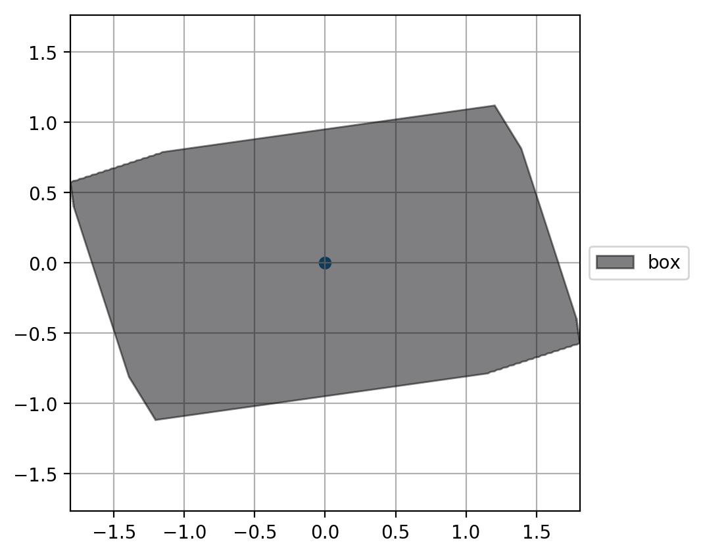

```python
%matplotlib inline
import trimesh
from matplotlib import pyplot as plt
from pcg_gazebo.simulation.properties import Mesh
from pcg_gazebo.simulation import create_object, SimulationModel

```

# Box


```python
# Create model
model = SimulationModel('box')

# Create box link
model.add_cuboid_link('box', mass=0.1, size=[2, 1.2, 3])

print(model.to_sdf('model'))
```

    <model name="box">
      <allow_auto_disable>0</allow_auto_disable>
      <link name="box">
        <collision name="collision">
          <max_contacts>10</max_contacts>
          <geometry>
            <box>
              <size>2 1.2 3</size>
            </box>
          </geometry>
          <pose frame="">0 0 0 0.0 -0.0 0.0</pose>
        </collision>
        <visual name="visual">
          <transparency>0.0</transparency>
          <cast_shadows>1</cast_shadows>
          <geometry>
            <box>
              <size>2 1.2 3</size>
            </box>
          </geometry>
          <pose frame="">0 0 0 0.0 -0.0 0.0</pose>
        </visual>
        <inertial>
          <inertia>
            <izz>0.04533333333333333</izz>
            <iyy>0.10833333333333334</iyy>
            <ixx>0.087</ixx>
            <ixz>0.0</ixz>
            <iyz>0.0</iyz>
            <ixy>0.0</ixy>
          </inertia>
          <mass>0.1</mass>
          <pose frame="">0 0 0 0.0 -0.0 0.0</pose>
        </inertial>
        <pose frame="">0 0 0 0.0 -0.0 0.0</pose>
      </link>
      <static>0</static>
      <self_collide>0</self_collide>
      <pose frame="">0 0 0 0.0 -0.0 0.0</pose>
    </model>
    


```python
scene = model.create_scene()
#scene.show()
```


```python
fig = model.plot_footprint(fig_width=5, fig_height=5)
plt.show()
```


```python
fig = model.plot_footprint(fig_width=5, fig_height=5, z_limits=[-0.2, 0.2])
plt.show()
```


```python
# Set random orientation and plot footprints again
model.set_random_orientation()
scene = model.create_scene()
#scene.show()
```


```python
fig = model.plot_footprint(fig_width=5, fig_height=5)
plt.show()
```


```python
fig = model.plot_footprint(fig_width=5, fig_height=5, z_limits=[-0.2, 0.2])
plt.show()
```





# Cylinder


```python
# Create model
model = SimulationModel('cylinder')

# Create box link
model.add_cylindrical_link('cylinder', mass=0.1, radius=0.3, length=1)

print(model.to_sdf('model'))
```

    <model name="cylinder">
      <allow_auto_disable>0</allow_auto_disable>
      <link name="cylinder">
        <collision name="collision">
          <max_contacts>10</max_contacts>
          <geometry>
            <cylinder>
              <radius>0.3</radius>
              <length>1.0</length>
            </cylinder>
          </geometry>
          <pose frame="">0 0 0 0.0 -0.0 0.0</pose>
        </collision>
        <visual name="visual">
          <transparency>0.0</transparency>
          <cast_shadows>1</cast_shadows>
          <geometry>
            <cylinder>
              <radius>0.3</radius>
              <length>1.0</length>
            </cylinder>
          </geometry>
          <pose frame="">0 0 0 0.0 -0.0 0.0</pose>
        </visual>
        <inertial>
          <inertia>
            <izz>0.0045</izz>
            <iyy>0.010583333333333333</iyy>
            <ixx>0.010583333333333333</ixx>
            <ixz>0.0</ixz>
            <iyz>0.0</iyz>
            <ixy>0.0</ixy>
          </inertia>
          <mass>0.1</mass>
          <pose frame="">0 0 0 0.0 -0.0 0.0</pose>
        </inertial>
        <pose frame="">0 0 0 0.0 -0.0 0.0</pose>
      </link>
      <static>0</static>
      <self_collide>0</self_collide>
      <pose frame="">0 0 0 0.0 -0.0 0.0</pose>
    </model>
    


```python
scene = model.create_scene()
#scene.show()
```


```python
fig = model.plot_footprint(fig_width=5, fig_height=5)
plt.show()
```


```python
fig = model.plot_footprint(fig_width=5, fig_height=5, z_limits=[-0.2, 0.2])
plt.show()
```


```python
# Set random orientation and plot footprints again
model.set_random_orientation()
scene = model.create_scene()
#scene.show()
```


```python
fig = model.plot_footprint(fig_width=5, fig_height=5)
plt.show()
```

    TopologyException: Input geom 0 is invalid: Self-intersection at or near point -0.23884390278343959 -0.21943219059756414 at -0.23884390278343959 -0.21943219059756414


```python
fig = model.plot_footprint(fig_width=5, fig_height=5, z_limits=[-0.1, 0.1])
plt.show()
```


# Custom mesh


```python
model = SimulationModel.from_gazebo_model('jersey_barrier')
print(model.to_sdf('model'))
```

    <model name="jersey_barrier">
      <allow_auto_disable>1</allow_auto_disable>
      <link name="link">
        <collision name="collision">
          <max_contacts>20</max_contacts>
          <geometry>
            <box>
              <size>4.06542 0.3063 1.143</size>
            </box>
          </geometry>
          <pose frame="">0.0 0.0 0.5715 0.0 -0.0 0.0</pose>
        </collision>
        <collision name="collision_0">
          <max_contacts>20</max_contacts>
          <geometry>
            <box>
              <size>4.06542 0.8107 0.064516</size>
            </box>
          </geometry>
          <pose frame="">0.0 0.0 0.032258 0.0 -0.0 0.0</pose>
        </collision>
        <collision name="collision_1">
          <max_contacts>20</max_contacts>
          <geometry>
            <box>
              <size>4.06542 0.65 0.1</size>
            </box>
          </geometry>
          <pose frame="">0.0 0.0 0.1 0.0 -0.0 0.0</pose>
        </collision>
        <collision name="collision_2">
          <max_contacts>20</max_contacts>
          <geometry>
            <box>
              <size>4.06542 0.5 0.1</size>
            </box>
          </geometry>
          <pose frame="">0.0 0.0 0.2 0.0 -0.0 0.0</pose>
        </collision>
        <collision name="collision_3">
          <max_contacts>20</max_contacts>
          <geometry>
            <box>
              <size>4.06542 0.5 0.064516</size>
            </box>
          </geometry>
          <pose frame="">0.0 -0.224 0.2401 0.9000000000000001 -0.0 0.0</pose>
        </collision>
        <collision name="collision_4">
          <max_contacts>20</max_contacts>
          <geometry>
            <box>
              <size>4.06542 0.5 0.064516</size>
            </box>
          </geometry>
          <pose frame="">0.0 0.224 0.2401 -0.9000000000000001 0.0 0.0</pose>
        </collision>
        <visual name="visual">
          <transparency>0.0</transparency>
          <cast_shadows>1</cast_shadows>
          <geometry>
            <mesh>
              <scale>1 1 1</scale>
              <uri>model://jersey_barrier/meshes/jersey_barrier.dae</uri>
            </mesh>
          </geometry>
          <pose frame="">0 0 0 0.0 -0.0 0.0</pose>
        </visual>
        <pose frame="">0 0 0 0.0 -0.0 0.0</pose>
      </link>
      <static>1</static>
      <self_collide>0</self_collide>
      <pose frame="">0 0 0 0.0 -0.0 0.0</pose>
    </model>
    


```python
scene = model.create_scene(mesh_type='collision')
scene.show()
```

    /home/mam0box/.local/lib/python3.5/site-packages/trimesh/visual/color.py:610: RuntimeWarning: invalid value encountered in true_divide
      vertex_colors /= mesh.faces_sparse.sum(axis=1)


<iframe srcdoc="<!DOCTYPE html>
<html lang=&quot;en&quot;>
  <head>
    <title>trimesh: threejs viewer</title>
    <meta charset=&quot;utf-8&quot;>
    <meta name=&quot;viewport&quot; content=&quot;width=device-width, 
		   user-scalable=no, 
		   minimum-scale=1.0, 
		   maximum-scale=1.0&quot;>
    <style>
      body {
      margin: 0px;
      overflow: hidden;
      }
    </style>
  </head>
  <body>
    <div id=&quot;container&quot;></div>
    <script src=&quot;https://cdnjs.cloudflare.com/ajax/libs/three.js/101/three.min.js&quot;></script>
    <script>THREE.TrackballControls=function(object,domElement){var _this=this;var STATE={NONE:-1,ROTATE:0,ZOOM:1,PAN:2,TOUCH_ROTATE:3,TOUCH_ZOOM_PAN:4};this.object=object;this.domElement=(domElement!==undefined)?domElement:document;this.enabled=true;this.screen={left:0,top:0,width:0,height:0};this.rotateSpeed=1.0;this.zoomSpeed=1.2;this.panSpeed=0.3;this.noRotate=false;this.noZoom=false;this.noPan=false;this.staticMoving=false;this.dynamicDampingFactor=0.2;this.minDistance=0;this.maxDistance=Infinity;this.keys=[65 ,83 ,68 ];this.target=new THREE.Vector3();var EPS=0.000001;var lastPosition=new THREE.Vector3();var _state=STATE.NONE,_prevState=STATE.NONE,_eye=new THREE.Vector3(),_movePrev=new THREE.Vector2(),_moveCurr=new THREE.Vector2(),_lastAxis=new THREE.Vector3(),_lastAngle=0,_zoomStart=new THREE.Vector2(),_zoomEnd=new THREE.Vector2(),_touchZoomDistanceStart=0,_touchZoomDistanceEnd=0,_panStart=new THREE.Vector2(),_panEnd=new THREE.Vector2();this.target0=this.target.clone();this.position0=this.object.position.clone();this.up0=this.object.up.clone();var changeEvent={type:'change'};var startEvent={type:'start'};var endEvent={type:'end'};this.handleResize=function(){if(this.domElement===document){this.screen.left=0;this.screen.top=0;this.screen.width=window.innerWidth;this.screen.height=window.innerHeight;}else{var box=this.domElement.getBoundingClientRect();var d=this.domElement.ownerDocument.documentElement;this.screen.left=box.left+window.pageXOffset-d.clientLeft;this.screen.top=box.top+window.pageYOffset-d.clientTop;this.screen.width=box.width;this.screen.height=box.height;}};var getMouseOnScreen=(function(){var vector=new THREE.Vector2();return function getMouseOnScreen(pageX,pageY){vector.set((pageX-_this.screen.left)/_this.screen.width,(pageY-_this.screen.top)/_this.screen.height);return vector;};}());var getMouseOnCircle=(function(){var vector=new THREE.Vector2();return function getMouseOnCircle(pageX,pageY){vector.set(((pageX-_this.screen.width*0.5-_this.screen.left)/(_this.screen.width*0.5)),((_this.screen.height+2*(_this.screen.top-pageY))/_this.screen.width));return vector;};}());this.rotateCamera=(function(){var axis=new THREE.Vector3(),quaternion=new THREE.Quaternion(),eyeDirection=new THREE.Vector3(),objectUpDirection=new THREE.Vector3(),objectSidewaysDirection=new THREE.Vector3(),moveDirection=new THREE.Vector3(),angle;return function rotateCamera(){moveDirection.set(_moveCurr.x-_movePrev.x,_moveCurr.y-_movePrev.y,0);angle=moveDirection.length();if(angle){_eye.copy(_this.object.position).sub(_this.target);eyeDirection.copy(_eye).normalize();objectUpDirection.copy(_this.object.up).normalize();objectSidewaysDirection.crossVectors(objectUpDirection,eyeDirection).normalize();objectUpDirection.setLength(_moveCurr.y-_movePrev.y);objectSidewaysDirection.setLength(_moveCurr.x-_movePrev.x);moveDirection.copy(objectUpDirection.add(objectSidewaysDirection));axis.crossVectors(moveDirection,_eye).normalize();angle*=_this.rotateSpeed;quaternion.setFromAxisAngle(axis,angle);_eye.applyQuaternion(quaternion);_this.object.up.applyQuaternion(quaternion);_lastAxis.copy(axis);_lastAngle=angle;}else if(!_this.staticMoving&&_lastAngle){_lastAngle*=Math.sqrt(1.0-_this.dynamicDampingFactor);_eye.copy(_this.object.position).sub(_this.target);quaternion.setFromAxisAngle(_lastAxis,_lastAngle);_eye.applyQuaternion(quaternion);_this.object.up.applyQuaternion(quaternion);}
_movePrev.copy(_moveCurr);};}());this.zoomCamera=function(){var factor;if(_state===STATE.TOUCH_ZOOM_PAN){factor=_touchZoomDistanceStart/_touchZoomDistanceEnd;_touchZoomDistanceStart=_touchZoomDistanceEnd;_eye.multiplyScalar(factor);}else{factor=1.0+(_zoomEnd.y-_zoomStart.y)*_this.zoomSpeed;if(factor!==1.0&&factor>0.0){_eye.multiplyScalar(factor);}
if(_this.staticMoving){_zoomStart.copy(_zoomEnd);}else{_zoomStart.y+=(_zoomEnd.y-_zoomStart.y)*this.dynamicDampingFactor;}}};this.panCamera=(function(){var mouseChange=new THREE.Vector2(),objectUp=new THREE.Vector3(),pan=new THREE.Vector3();return function panCamera(){mouseChange.copy(_panEnd).sub(_panStart);if(mouseChange.lengthSq()){mouseChange.multiplyScalar(_eye.length()*_this.panSpeed);pan.copy(_eye).cross(_this.object.up).setLength(mouseChange.x);pan.add(objectUp.copy(_this.object.up).setLength(mouseChange.y));_this.object.position.add(pan);_this.target.add(pan);if(_this.staticMoving){_panStart.copy(_panEnd);}else{_panStart.add(mouseChange.subVectors(_panEnd,_panStart).multiplyScalar(_this.dynamicDampingFactor));}}};}());this.checkDistances=function(){if(!_this.noZoom||!_this.noPan){if(_eye.lengthSq()>_this.maxDistance*_this.maxDistance){_this.object.position.addVectors(_this.target,_eye.setLength(_this.maxDistance));_zoomStart.copy(_zoomEnd);}
if(_eye.lengthSq()<_this.minDistance*_this.minDistance){_this.object.position.addVectors(_this.target,_eye.setLength(_this.minDistance));_zoomStart.copy(_zoomEnd);}}};this.update=function(){_eye.subVectors(_this.object.position,_this.target);if(!_this.noRotate){_this.rotateCamera();}
if(!_this.noZoom){_this.zoomCamera();}
if(!_this.noPan){_this.panCamera();}
_this.object.position.addVectors(_this.target,_eye);_this.checkDistances();_this.object.lookAt(_this.target);if(lastPosition.distanceToSquared(_this.object.position)>EPS){_this.dispatchEvent(changeEvent);lastPosition.copy(_this.object.position);}};this.reset=function(){_state=STATE.NONE;_prevState=STATE.NONE;_this.target.copy(_this.target0);_this.object.position.copy(_this.position0);_this.object.up.copy(_this.up0);_eye.subVectors(_this.object.position,_this.target);_this.object.lookAt(_this.target);_this.dispatchEvent(changeEvent);lastPosition.copy(_this.object.position);};function keydown(event){if(_this.enabled===false)return;window.removeEventListener('keydown',keydown);_prevState=_state;if(_state!==STATE.NONE){return;}else if(event.keyCode===_this.keys[STATE.ROTATE]&&!_this.noRotate){_state=STATE.ROTATE;}else if(event.keyCode===_this.keys[STATE.ZOOM]&&!_this.noZoom){_state=STATE.ZOOM;}else if(event.keyCode===_this.keys[STATE.PAN]&&!_this.noPan){_state=STATE.PAN;}}
function keyup(event){if(_this.enabled===false)return;_state=_prevState;window.addEventListener('keydown',keydown,false);}
function mousedown(event){if(_this.enabled===false)return;event.preventDefault();event.stopPropagation();if(_state===STATE.NONE){_state=event.button;}
if(_state===STATE.ROTATE&&!_this.noRotate){_moveCurr.copy(getMouseOnCircle(event.pageX,event.pageY));_movePrev.copy(_moveCurr);}else if(_state===STATE.ZOOM&&!_this.noZoom){_zoomStart.copy(getMouseOnScreen(event.pageX,event.pageY));_zoomEnd.copy(_zoomStart);}else if(_state===STATE.PAN&&!_this.noPan){_panStart.copy(getMouseOnScreen(event.pageX,event.pageY));_panEnd.copy(_panStart);}
document.addEventListener('mousemove',mousemove,false);document.addEventListener('mouseup',mouseup,false);_this.dispatchEvent(startEvent);}
function mousemove(event){if(_this.enabled===false)return;event.preventDefault();event.stopPropagation();if(_state===STATE.ROTATE&&!_this.noRotate){_movePrev.copy(_moveCurr);_moveCurr.copy(getMouseOnCircle(event.pageX,event.pageY));}else if(_state===STATE.ZOOM&&!_this.noZoom){_zoomEnd.copy(getMouseOnScreen(event.pageX,event.pageY));}else if(_state===STATE.PAN&&!_this.noPan){_panEnd.copy(getMouseOnScreen(event.pageX,event.pageY));}}
function mouseup(event){if(_this.enabled===false)return;event.preventDefault();event.stopPropagation();_state=STATE.NONE;document.removeEventListener('mousemove',mousemove);document.removeEventListener('mouseup',mouseup);_this.dispatchEvent(endEvent);}
function mousewheel(event){if(_this.enabled===false)return;if(_this.noZoom===true)return;event.preventDefault();event.stopPropagation();switch(event.deltaMode){case 2:_zoomStart.y-=event.deltaY*0.025;break;case 1:_zoomStart.y-=event.deltaY*0.01;break;default:_zoomStart.y-=event.deltaY*0.00025;break;}
_this.dispatchEvent(startEvent);_this.dispatchEvent(endEvent);}
function touchstart(event){if(_this.enabled===false)return;event.preventDefault();switch(event.touches.length){case 1:_state=STATE.TOUCH_ROTATE;_moveCurr.copy(getMouseOnCircle(event.touches[0].pageX,event.touches[0].pageY));_movePrev.copy(_moveCurr);break;default:_state=STATE.TOUCH_ZOOM_PAN;var dx=event.touches[0].pageX-event.touches[1].pageX;var dy=event.touches[0].pageY-event.touches[1].pageY;_touchZoomDistanceEnd=_touchZoomDistanceStart=Math.sqrt(dx*dx+dy*dy);var x=(event.touches[0].pageX+event.touches[1].pageX)/2;var y=(event.touches[0].pageY+event.touches[1].pageY)/2;_panStart.copy(getMouseOnScreen(x,y));_panEnd.copy(_panStart);break;}
_this.dispatchEvent(startEvent);}
function touchmove(event){if(_this.enabled===false)return;event.preventDefault();event.stopPropagation();switch(event.touches.length){case 1:_movePrev.copy(_moveCurr);_moveCurr.copy(getMouseOnCircle(event.touches[0].pageX,event.touches[0].pageY));break;default:var dx=event.touches[0].pageX-event.touches[1].pageX;var dy=event.touches[0].pageY-event.touches[1].pageY;_touchZoomDistanceEnd=Math.sqrt(dx*dx+dy*dy);var x=(event.touches[0].pageX+event.touches[1].pageX)/2;var y=(event.touches[0].pageY+event.touches[1].pageY)/2;_panEnd.copy(getMouseOnScreen(x,y));break;}}
function touchend(event){if(_this.enabled===false)return;switch(event.touches.length){case 0:_state=STATE.NONE;break;case 1:_state=STATE.TOUCH_ROTATE;_moveCurr.copy(getMouseOnCircle(event.touches[0].pageX,event.touches[0].pageY));_movePrev.copy(_moveCurr);break;}
_this.dispatchEvent(endEvent);}
function contextmenu(event){if(_this.enabled===false)return;event.preventDefault();}
this.dispose=function(){this.domElement.removeEventListener('contextmenu',contextmenu,false);this.domElement.removeEventListener('mousedown',mousedown,false);this.domElement.removeEventListener('wheel',mousewheel,false);this.domElement.removeEventListener('touchstart',touchstart,false);this.domElement.removeEventListener('touchend',touchend,false);this.domElement.removeEventListener('touchmove',touchmove,false);document.removeEventListener('mousemove',mousemove,false);document.removeEventListener('mouseup',mouseup,false);window.removeEventListener('keydown',keydown,false);window.removeEventListener('keyup',keyup,false);};this.domElement.addEventListener('contextmenu',contextmenu,false);this.domElement.addEventListener('mousedown',mousedown,false);this.domElement.addEventListener('wheel',mousewheel,false);this.domElement.addEventListener('touchstart',touchstart,false);this.domElement.addEventListener('touchend',touchend,false);this.domElement.addEventListener('touchmove',touchmove,false);window.addEventListener('keydown',keydown,false);window.addEventListener('keyup',keyup,false);this.handleResize();this.update();};THREE.TrackballControls.prototype=Object.create(THREE.EventDispatcher.prototype);THREE.TrackballControls.prototype.constructor=THREE.TrackballControls;THREE.GLTFLoader=(function(){function GLTFLoader(manager){this.manager=(manager!==undefined)?manager:THREE.DefaultLoadingManager;this.dracoLoader=null;}
GLTFLoader.prototype={constructor:GLTFLoader,crossOrigin:'anonymous',load:function(url,onLoad,onProgress,onError){var scope=this;var resourcePath;if(this.resourcePath!==undefined){resourcePath=this.resourcePath;}else if(this.path!==undefined){resourcePath=this.path;}else{resourcePath=THREE.LoaderUtils.extractUrlBase(url);}
scope.manager.itemStart(url);var _onError=function(e){if(onError){onError(e);}else{console.error(e);}
scope.manager.itemError(url);scope.manager.itemEnd(url);};var loader=new THREE.FileLoader(scope.manager);loader.setPath(this.path);loader.setResponseType('arraybuffer');loader.load(url,function(data){try{scope.parse(data,resourcePath,function(gltf){onLoad(gltf);scope.manager.itemEnd(url);},_onError);}catch(e){_onError(e);}},onProgress,_onError);},setCrossOrigin:function(value){this.crossOrigin=value;return this;},setPath:function(value){this.path=value;return this;},setResourcePath:function(value){this.resourcePath=value;return this;},setDRACOLoader:function(dracoLoader){this.dracoLoader=dracoLoader;return this;},parse:function(data,path,onLoad,onError){var content;var extensions={};if(typeof data==='string'){content=data;}else{var magic=THREE.LoaderUtils.decodeText(new Uint8Array(data,0,4));if(magic===BINARY_EXTENSION_HEADER_MAGIC){try{extensions[EXTENSIONS.KHR_BINARY_GLTF]=new GLTFBinaryExtension(data);}catch(error){if(onError)onError(error);return;}
content=extensions[EXTENSIONS.KHR_BINARY_GLTF].content;}else{content=THREE.LoaderUtils.decodeText(new Uint8Array(data));}}
var json=JSON.parse(content);if(json.asset===undefined||json.asset.version[0]<2){if(onError)onError(new Error('THREE.GLTFLoader: Unsupported asset. glTF versions >=2.0 are supported. Use LegacyGLTFLoader instead.'));return;}
if(json.extensionsUsed){for(var i=0;i<json.extensionsUsed.length;++i){var extensionName=json.extensionsUsed[i];var extensionsRequired=json.extensionsRequired||[];switch(extensionName){case EXTENSIONS.KHR_LIGHTS_PUNCTUAL:extensions[extensionName]=new GLTFLightsExtension(json);break;case EXTENSIONS.KHR_MATERIALS_UNLIT:extensions[extensionName]=new GLTFMaterialsUnlitExtension(json);break;case EXTENSIONS.KHR_MATERIALS_PBR_SPECULAR_GLOSSINESS:extensions[extensionName]=new GLTFMaterialsPbrSpecularGlossinessExtension(json);break;case EXTENSIONS.KHR_DRACO_MESH_COMPRESSION:extensions[extensionName]=new GLTFDracoMeshCompressionExtension(json,this.dracoLoader);break;case EXTENSIONS.MSFT_TEXTURE_DDS:extensions[EXTENSIONS.MSFT_TEXTURE_DDS]=new GLTFTextureDDSExtension(json);break;case EXTENSIONS.KHR_TEXTURE_TRANSFORM:extensions[EXTENSIONS.KHR_TEXTURE_TRANSFORM]=new GLTFTextureTransformExtension(json);break;default:if(extensionsRequired.indexOf(extensionName)>=0){console.warn('THREE.GLTFLoader: Unknown extension &quot;'+extensionName+'&quot;.');}}}}
var parser=new GLTFParser(json,extensions,{path:path||this.resourcePath||'',crossOrigin:this.crossOrigin,manager:this.manager});parser.parse(function(scene,scenes,cameras,animations,json){var glTF={scene:scene,scenes:scenes,cameras:cameras,animations:animations,asset:json.asset,parser:parser,userData:{}};addUnknownExtensionsToUserData(extensions,glTF,json);onLoad(glTF);},onError);}};function GLTFRegistry(){var objects={};return{get:function(key){return objects[key];},add:function(key,object){objects[key]=object;},remove:function(key){delete objects[key];},removeAll:function(){objects={};}};}
var EXTENSIONS={KHR_BINARY_GLTF:'KHR_binary_glTF',KHR_DRACO_MESH_COMPRESSION:'KHR_draco_mesh_compression',KHR_LIGHTS_PUNCTUAL:'KHR_lights_punctual',KHR_MATERIALS_PBR_SPECULAR_GLOSSINESS:'KHR_materials_pbrSpecularGlossiness',KHR_MATERIALS_UNLIT:'KHR_materials_unlit',KHR_TEXTURE_TRANSFORM:'KHR_texture_transform',MSFT_TEXTURE_DDS:'MSFT_texture_dds'};function GLTFTextureDDSExtension(){if(!THREE.DDSLoader){throw new Error('THREE.GLTFLoader: Attempting to load .dds texture without importing THREE.DDSLoader');}
this.name=EXTENSIONS.MSFT_TEXTURE_DDS;this.ddsLoader=new THREE.DDSLoader();}
function GLTFLightsExtension(json){this.name=EXTENSIONS.KHR_LIGHTS_PUNCTUAL;var extension=(json.extensions&&json.extensions[EXTENSIONS.KHR_LIGHTS_PUNCTUAL])||{};this.lightDefs=extension.lights||[];}
GLTFLightsExtension.prototype.loadLight=function(lightIndex){var lightDef=this.lightDefs[lightIndex];var lightNode;var color=new THREE.Color(0xffffff);if(lightDef.color!==undefined)color.fromArray(lightDef.color);var range=lightDef.range!==undefined?lightDef.range:0;switch(lightDef.type){case'directional':lightNode=new THREE.DirectionalLight(color);lightNode.target.position.set(0,0,-1);lightNode.add(lightNode.target);break;case'point':lightNode=new THREE.PointLight(color);lightNode.distance=range;break;case'spot':lightNode=new THREE.SpotLight(color);lightNode.distance=range;lightDef.spot=lightDef.spot||{};lightDef.spot.innerConeAngle=lightDef.spot.innerConeAngle!==undefined?lightDef.spot.innerConeAngle:0;lightDef.spot.outerConeAngle=lightDef.spot.outerConeAngle!==undefined?lightDef.spot.outerConeAngle:Math.PI/4.0;lightNode.angle=lightDef.spot.outerConeAngle;lightNode.penumbra=1.0-lightDef.spot.innerConeAngle/lightDef.spot.outerConeAngle;lightNode.target.position.set(0,0,-1);lightNode.add(lightNode.target);break;default:throw new Error('THREE.GLTFLoader: Unexpected light type, &quot;'+lightDef.type+'&quot;.');}
lightNode.position.set(0,0,0);lightNode.decay=2;if(lightDef.intensity!==undefined)lightNode.intensity=lightDef.intensity;lightNode.name=lightDef.name||('light_'+lightIndex);return Promise.resolve(lightNode);};function GLTFMaterialsUnlitExtension(json){this.name=EXTENSIONS.KHR_MATERIALS_UNLIT;}
GLTFMaterialsUnlitExtension.prototype.getMaterialType=function(material){return THREE.MeshBasicMaterial;};GLTFMaterialsUnlitExtension.prototype.extendParams=function(materialParams,material,parser){var pending=[];materialParams.color=new THREE.Color(1.0,1.0,1.0);materialParams.opacity=1.0;var metallicRoughness=material.pbrMetallicRoughness;if(metallicRoughness){if(Array.isArray(metallicRoughness.baseColorFactor)){var array=metallicRoughness.baseColorFactor;materialParams.color.fromArray(array);materialParams.opacity=array[3];}
if(metallicRoughness.baseColorTexture!==undefined){pending.push(parser.assignTexture(materialParams,'map',metallicRoughness.baseColorTexture));}}
return Promise.all(pending);};var BINARY_EXTENSION_BUFFER_NAME='binary_glTF';var BINARY_EXTENSION_HEADER_MAGIC='glTF';var BINARY_EXTENSION_HEADER_LENGTH=12;var BINARY_EXTENSION_CHUNK_TYPES={JSON:0x4E4F534A,BIN:0x004E4942};function GLTFBinaryExtension(data){this.name=EXTENSIONS.KHR_BINARY_GLTF;this.content=null;this.body=null;var headerView=new DataView(data,0,BINARY_EXTENSION_HEADER_LENGTH);this.header={magic:THREE.LoaderUtils.decodeText(new Uint8Array(data.slice(0,4))),version:headerView.getUint32(4,true),length:headerView.getUint32(8,true)};if(this.header.magic!==BINARY_EXTENSION_HEADER_MAGIC){throw new Error('THREE.GLTFLoader: Unsupported glTF-Binary header.');}else if(this.header.version<2.0){throw new Error('THREE.GLTFLoader: Legacy binary file detected. Use LegacyGLTFLoader instead.');}
var chunkView=new DataView(data,BINARY_EXTENSION_HEADER_LENGTH);var chunkIndex=0;while(chunkIndex<chunkView.byteLength){var chunkLength=chunkView.getUint32(chunkIndex,true);chunkIndex+=4;var chunkType=chunkView.getUint32(chunkIndex,true);chunkIndex+=4;if(chunkType===BINARY_EXTENSION_CHUNK_TYPES.JSON){var contentArray=new Uint8Array(data,BINARY_EXTENSION_HEADER_LENGTH+chunkIndex,chunkLength);this.content=THREE.LoaderUtils.decodeText(contentArray);}else if(chunkType===BINARY_EXTENSION_CHUNK_TYPES.BIN){var byteOffset=BINARY_EXTENSION_HEADER_LENGTH+chunkIndex;this.body=data.slice(byteOffset,byteOffset+chunkLength);}
chunkIndex+=chunkLength;}
if(this.content===null){throw new Error('THREE.GLTFLoader: JSON content not found.');}}
function GLTFDracoMeshCompressionExtension(json,dracoLoader){if(!dracoLoader){throw new Error('THREE.GLTFLoader: No DRACOLoader instance provided.');}
this.name=EXTENSIONS.KHR_DRACO_MESH_COMPRESSION;this.json=json;this.dracoLoader=dracoLoader;THREE.DRACOLoader.getDecoderModule();}
GLTFDracoMeshCompressionExtension.prototype.decodePrimitive=function(primitive,parser){var json=this.json;var dracoLoader=this.dracoLoader;var bufferViewIndex=primitive.extensions[this.name].bufferView;var gltfAttributeMap=primitive.extensions[this.name].attributes;var threeAttributeMap={};var attributeNormalizedMap={};var attributeTypeMap={};for(var attributeName in gltfAttributeMap){if(!(attributeName in ATTRIBUTES))continue;threeAttributeMap[ATTRIBUTES[attributeName]]=gltfAttributeMap[attributeName];}
for(attributeName in primitive.attributes){if(ATTRIBUTES[attributeName]!==undefined&&gltfAttributeMap[attributeName]!==undefined){var accessorDef=json.accessors[primitive.attributes[attributeName]];var componentType=WEBGL_COMPONENT_TYPES[accessorDef.componentType];attributeTypeMap[ATTRIBUTES[attributeName]]=componentType;attributeNormalizedMap[ATTRIBUTES[attributeName]]=accessorDef.normalized===true;}}
return parser.getDependency('bufferView',bufferViewIndex).then(function(bufferView){return new Promise(function(resolve){dracoLoader.decodeDracoFile(bufferView,function(geometry){for(var attributeName in geometry.attributes){var attribute=geometry.attributes[attributeName];var normalized=attributeNormalizedMap[attributeName];if(normalized!==undefined)attribute.normalized=normalized;}
resolve(geometry);},threeAttributeMap,attributeTypeMap);});});};function GLTFTextureTransformExtension(json){this.name=EXTENSIONS.KHR_TEXTURE_TRANSFORM;}
GLTFTextureTransformExtension.prototype.extendTexture=function(texture,transform){texture=texture.clone();if(transform.offset!==undefined){texture.offset.fromArray(transform.offset);}
if(transform.rotation!==undefined){texture.rotation=transform.rotation;}
if(transform.scale!==undefined){texture.repeat.fromArray(transform.scale);}
if(transform.texCoord!==undefined){console.warn('THREE.GLTFLoader: Custom UV sets in &quot;'+this.name+'&quot; extension not yet supported.');}
texture.needsUpdate=true;return texture;};function GLTFMaterialsPbrSpecularGlossinessExtension(){return{name:EXTENSIONS.KHR_MATERIALS_PBR_SPECULAR_GLOSSINESS,specularGlossinessParams:['color','map','lightMap','lightMapIntensity','aoMap','aoMapIntensity','emissive','emissiveIntensity','emissiveMap','bumpMap','bumpScale','normalMap','displacementMap','displacementScale','displacementBias','specularMap','specular','glossinessMap','glossiness','alphaMap','envMap','envMapIntensity','refractionRatio',],getMaterialType:function(){return THREE.ShaderMaterial;},extendParams:function(params,material,parser){var pbrSpecularGlossiness=material.extensions[this.name];var shader=THREE.ShaderLib['standard'];var uniforms=THREE.UniformsUtils.clone(shader.uniforms);var specularMapParsFragmentChunk=['#ifdef USE_SPECULARMAP','	uniform sampler2D specularMap;','#endif'].join('\n');var glossinessMapParsFragmentChunk=['#ifdef USE_GLOSSINESSMAP','	uniform sampler2D glossinessMap;','#endif'].join('\n');var specularMapFragmentChunk=['vec3 specularFactor = specular;','#ifdef USE_SPECULARMAP','	vec4 texelSpecular = texture2D( specularMap, vUv );','	texelSpecular = sRGBToLinear( texelSpecular );','	// reads channel RGB, compatible with a glTF Specular-Glossiness (RGBA) texture','	specularFactor *= texelSpecular.rgb;','#endif'].join('\n');var glossinessMapFragmentChunk=['float glossinessFactor = glossiness;','#ifdef USE_GLOSSINESSMAP','	vec4 texelGlossiness = texture2D( glossinessMap, vUv );','	// reads channel A, compatible with a glTF Specular-Glossiness (RGBA) texture','	glossinessFactor *= texelGlossiness.a;','#endif'].join('\n');var lightPhysicalFragmentChunk=['PhysicalMaterial material;','material.diffuseColor = diffuseColor.rgb;','material.specularRoughness = clamp( 1.0 - glossinessFactor, 0.04, 1.0 );','material.specularColor = specularFactor.rgb;',].join('\n');var fragmentShader=shader.fragmentShader.replace('uniform float roughness;','uniform vec3 specular;').replace('uniform float metalness;','uniform float glossiness;').replace('#include <roughnessmap_pars_fragment>',specularMapParsFragmentChunk).replace('#include <metalnessmap_pars_fragment>',glossinessMapParsFragmentChunk).replace('#include <roughnessmap_fragment>',specularMapFragmentChunk).replace('#include <metalnessmap_fragment>',glossinessMapFragmentChunk).replace('#include <lights_physical_fragment>',lightPhysicalFragmentChunk);delete uniforms.roughness;delete uniforms.metalness;delete uniforms.roughnessMap;delete uniforms.metalnessMap;uniforms.specular={value:new THREE.Color().setHex(0x111111)};uniforms.glossiness={value:0.5};uniforms.specularMap={value:null};uniforms.glossinessMap={value:null};params.vertexShader=shader.vertexShader;params.fragmentShader=fragmentShader;params.uniforms=uniforms;params.defines={'STANDARD':''};params.color=new THREE.Color(1.0,1.0,1.0);params.opacity=1.0;var pending=[];if(Array.isArray(pbrSpecularGlossiness.diffuseFactor)){var array=pbrSpecularGlossiness.diffuseFactor;params.color.fromArray(array);params.opacity=array[3];}
if(pbrSpecularGlossiness.diffuseTexture!==undefined){pending.push(parser.assignTexture(params,'map',pbrSpecularGlossiness.diffuseTexture));}
params.emissive=new THREE.Color(0.0,0.0,0.0);params.glossiness=pbrSpecularGlossiness.glossinessFactor!==undefined?pbrSpecularGlossiness.glossinessFactor:1.0;params.specular=new THREE.Color(1.0,1.0,1.0);if(Array.isArray(pbrSpecularGlossiness.specularFactor)){params.specular.fromArray(pbrSpecularGlossiness.specularFactor);}
if(pbrSpecularGlossiness.specularGlossinessTexture!==undefined){var specGlossMapDef=pbrSpecularGlossiness.specularGlossinessTexture;pending.push(parser.assignTexture(params,'glossinessMap',specGlossMapDef));pending.push(parser.assignTexture(params,'specularMap',specGlossMapDef));}
return Promise.all(pending);},createMaterial:function(params){var material=new THREE.ShaderMaterial({defines:params.defines,vertexShader:params.vertexShader,fragmentShader:params.fragmentShader,uniforms:params.uniforms,fog:true,lights:true,opacity:params.opacity,transparent:params.transparent});material.isGLTFSpecularGlossinessMaterial=true;material.color=params.color;material.map=params.map===undefined?null:params.map;material.lightMap=null;material.lightMapIntensity=1.0;material.aoMap=params.aoMap===undefined?null:params.aoMap;material.aoMapIntensity=1.0;material.emissive=params.emissive;material.emissiveIntensity=1.0;material.emissiveMap=params.emissiveMap===undefined?null:params.emissiveMap;material.bumpMap=params.bumpMap===undefined?null:params.bumpMap;material.bumpScale=1;material.normalMap=params.normalMap===undefined?null:params.normalMap;if(params.normalScale)material.normalScale=params.normalScale;material.displacementMap=null;material.displacementScale=1;material.displacementBias=0;material.specularMap=params.specularMap===undefined?null:params.specularMap;material.specular=params.specular;material.glossinessMap=params.glossinessMap===undefined?null:params.glossinessMap;material.glossiness=params.glossiness;material.alphaMap=null;material.envMap=params.envMap===undefined?null:params.envMap;material.envMapIntensity=1.0;material.refractionRatio=0.98;material.extensions.derivatives=true;return material;},cloneMaterial:function(source){var target=source.clone();target.isGLTFSpecularGlossinessMaterial=true;var params=this.specularGlossinessParams;for(var i=0,il=params.length;i<il;i++){target[params[i]]=source[params[i]];}
return target;},refreshUniforms:function(renderer,scene,camera,geometry,material,group){if(material.isGLTFSpecularGlossinessMaterial!==true){return;}
var uniforms=material.uniforms;var defines=material.defines;uniforms.opacity.value=material.opacity;uniforms.diffuse.value.copy(material.color);uniforms.emissive.value.copy(material.emissive).multiplyScalar(material.emissiveIntensity);uniforms.map.value=material.map;uniforms.specularMap.value=material.specularMap;uniforms.alphaMap.value=material.alphaMap;uniforms.lightMap.value=material.lightMap;uniforms.lightMapIntensity.value=material.lightMapIntensity;uniforms.aoMap.value=material.aoMap;uniforms.aoMapIntensity.value=material.aoMapIntensity;var uvScaleMap;if(material.map){uvScaleMap=material.map;}else if(material.specularMap){uvScaleMap=material.specularMap;}else if(material.displacementMap){uvScaleMap=material.displacementMap;}else if(material.normalMap){uvScaleMap=material.normalMap;}else if(material.bumpMap){uvScaleMap=material.bumpMap;}else if(material.glossinessMap){uvScaleMap=material.glossinessMap;}else if(material.alphaMap){uvScaleMap=material.alphaMap;}else if(material.emissiveMap){uvScaleMap=material.emissiveMap;}
if(uvScaleMap!==undefined){if(uvScaleMap.isWebGLRenderTarget){uvScaleMap=uvScaleMap.texture;}
if(uvScaleMap.matrixAutoUpdate===true){uvScaleMap.updateMatrix();}
uniforms.uvTransform.value.copy(uvScaleMap.matrix);}
if(material.envMap){uniforms.envMap.value=material.envMap;uniforms.envMapIntensity.value=material.envMapIntensity;uniforms.flipEnvMap.value=material.envMap.isCubeTexture?-1:1;uniforms.reflectivity.value=material.reflectivity;uniforms.refractionRatio.value=material.refractionRatio;uniforms.maxMipLevel.value=renderer.properties.get(material.envMap).__maxMipLevel;}
uniforms.specular.value.copy(material.specular);uniforms.glossiness.value=material.glossiness;uniforms.glossinessMap.value=material.glossinessMap;uniforms.emissiveMap.value=material.emissiveMap;uniforms.bumpMap.value=material.bumpMap;uniforms.normalMap.value=material.normalMap;uniforms.displacementMap.value=material.displacementMap;uniforms.displacementScale.value=material.displacementScale;uniforms.displacementBias.value=material.displacementBias;if(uniforms.glossinessMap.value!==null&&defines.USE_GLOSSINESSMAP===undefined){defines.USE_GLOSSINESSMAP='';defines.USE_ROUGHNESSMAP='';}
if(uniforms.glossinessMap.value===null&&defines.USE_GLOSSINESSMAP!==undefined){delete defines.USE_GLOSSINESSMAP;delete defines.USE_ROUGHNESSMAP;}}};}
function GLTFCubicSplineInterpolant(parameterPositions,sampleValues,sampleSize,resultBuffer){THREE.Interpolant.call(this,parameterPositions,sampleValues,sampleSize,resultBuffer);}
GLTFCubicSplineInterpolant.prototype=Object.create(THREE.Interpolant.prototype);GLTFCubicSplineInterpolant.prototype.constructor=GLTFCubicSplineInterpolant;GLTFCubicSplineInterpolant.prototype.copySampleValue_=function(index){var result=this.resultBuffer,values=this.sampleValues,valueSize=this.valueSize,offset=index*valueSize*3+valueSize;for(var i=0;i!==valueSize;i++){result[i]=values[offset+i];}
return result;};GLTFCubicSplineInterpolant.prototype.beforeStart_=GLTFCubicSplineInterpolant.prototype.copySampleValue_;GLTFCubicSplineInterpolant.prototype.afterEnd_=GLTFCubicSplineInterpolant.prototype.copySampleValue_;GLTFCubicSplineInterpolant.prototype.interpolate_=function(i1,t0,t,t1){var result=this.resultBuffer;var values=this.sampleValues;var stride=this.valueSize;var stride2=stride*2;var stride3=stride*3;var td=t1-t0;var p=(t-t0)/td;var pp=p*p;var ppp=pp*p;var offset1=i1*stride3;var offset0=offset1-stride3;var s2=-2*ppp+3*pp;var s3=ppp-pp;var s0=1-s2;var s1=s3-pp+p;for(var i=0;i!==stride;i++){var p0=values[offset0+i+stride];var m0=values[offset0+i+stride2]*td;var p1=values[offset1+i+stride];var m1=values[offset1+i]*td;result[i]=s0*p0+s1*m0+s2*p1+s3*m1;}
return result;};var WEBGL_CONSTANTS={FLOAT:5126,FLOAT_MAT3:35675,FLOAT_MAT4:35676,FLOAT_VEC2:35664,FLOAT_VEC3:35665,FLOAT_VEC4:35666,LINEAR:9729,REPEAT:10497,SAMPLER_2D:35678,POINTS:0,LINES:1,LINE_LOOP:2,LINE_STRIP:3,TRIANGLES:4,TRIANGLE_STRIP:5,TRIANGLE_FAN:6,UNSIGNED_BYTE:5121,UNSIGNED_SHORT:5123};var WEBGL_TYPE={5126:Number,35675:THREE.Matrix3,35676:THREE.Matrix4,35664:THREE.Vector2,35665:THREE.Vector3,35666:THREE.Vector4,35678:THREE.Texture};var WEBGL_COMPONENT_TYPES={5120:Int8Array,5121:Uint8Array,5122:Int16Array,5123:Uint16Array,5125:Uint32Array,5126:Float32Array};var WEBGL_FILTERS={9728:THREE.NearestFilter,9729:THREE.LinearFilter,9984:THREE.NearestMipMapNearestFilter,9985:THREE.LinearMipMapNearestFilter,9986:THREE.NearestMipMapLinearFilter,9987:THREE.LinearMipMapLinearFilter};var WEBGL_WRAPPINGS={33071:THREE.ClampToEdgeWrapping,33648:THREE.MirroredRepeatWrapping,10497:THREE.RepeatWrapping};var WEBGL_SIDES={1028:THREE.BackSide,1029:THREE.FrontSide
};var WEBGL_DEPTH_FUNCS={512:THREE.NeverDepth,513:THREE.LessDepth,514:THREE.EqualDepth,515:THREE.LessEqualDepth,516:THREE.GreaterEqualDepth,517:THREE.NotEqualDepth,518:THREE.GreaterEqualDepth,519:THREE.AlwaysDepth};var WEBGL_BLEND_EQUATIONS={32774:THREE.AddEquation,32778:THREE.SubtractEquation,32779:THREE.ReverseSubtractEquation};var WEBGL_BLEND_FUNCS={0:THREE.ZeroFactor,1:THREE.OneFactor,768:THREE.SrcColorFactor,769:THREE.OneMinusSrcColorFactor,770:THREE.SrcAlphaFactor,771:THREE.OneMinusSrcAlphaFactor,772:THREE.DstAlphaFactor,773:THREE.OneMinusDstAlphaFactor,774:THREE.DstColorFactor,775:THREE.OneMinusDstColorFactor,776:THREE.SrcAlphaSaturateFactor
};var WEBGL_TYPE_SIZES={'SCALAR':1,'VEC2':2,'VEC3':3,'VEC4':4,'MAT2':4,'MAT3':9,'MAT4':16};var ATTRIBUTES={POSITION:'position',NORMAL:'normal',TEXCOORD_0:'uv',TEXCOORD_1:'uv2',COLOR_0:'color',WEIGHTS_0:'skinWeight',JOINTS_0:'skinIndex',};var PATH_PROPERTIES={scale:'scale',translation:'position',rotation:'quaternion',weights:'morphTargetInfluences'};var INTERPOLATION={CUBICSPLINE:THREE.InterpolateSmooth,LINEAR:THREE.InterpolateLinear,STEP:THREE.InterpolateDiscrete};var STATES_ENABLES={2884:'CULL_FACE',2929:'DEPTH_TEST',3042:'BLEND',3089:'SCISSOR_TEST',32823:'POLYGON_OFFSET_FILL',32926:'SAMPLE_ALPHA_TO_COVERAGE'};var ALPHA_MODES={OPAQUE:'OPAQUE',MASK:'MASK',BLEND:'BLEND'};var MIME_TYPE_FORMATS={'image/png':THREE.RGBAFormat,'image/jpeg':THREE.RGBFormat};function resolveURL(url,path){if(typeof url!=='string'||url==='')return'';if(/^(https?:)?\/\//i.test(url))return url;if(/^data:.*,.*$/i.test(url))return url;if(/^blob:.*$/i.test(url))return url;return path+url;}
function createDefaultMaterial(){return new THREE.MeshStandardMaterial({color:0xFFFFFF,emissive:0x000000,metalness:1,roughness:1,transparent:false,depthTest:true,side:THREE.FrontSide});}
function addUnknownExtensionsToUserData(knownExtensions,object,objectDef){for(var name in objectDef.extensions){if(knownExtensions[name]===undefined){object.userData.gltfExtensions=object.userData.gltfExtensions||{};object.userData.gltfExtensions[name]=objectDef.extensions[name];}}}
function assignExtrasToUserData(object,gltfDef){if(gltfDef.extras!==undefined){if(typeof gltfDef.extras==='object'){object.userData=gltfDef.extras;}else{console.warn('THREE.GLTFLoader: Ignoring primitive type .extras, '+gltfDef.extras);}}}
function addMorphTargets(geometry,targets,parser){var hasMorphPosition=false;var hasMorphNormal=false;for(var i=0,il=targets.length;i<il;i++){var target=targets[i];if(target.POSITION!==undefined)hasMorphPosition=true;if(target.NORMAL!==undefined)hasMorphNormal=true;if(hasMorphPosition&&hasMorphNormal)break;}
if(!hasMorphPosition&&!hasMorphNormal)return Promise.resolve(geometry);var pendingPositionAccessors=[];var pendingNormalAccessors=[];for(var i=0,il=targets.length;i<il;i++){var target=targets[i];if(hasMorphPosition){var accessor=target.POSITION!==undefined?parser.getDependency('accessor',target.POSITION).then(function(accessor){return cloneBufferAttribute(accessor);}):geometry.attributes.position;pendingPositionAccessors.push(accessor);}
if(hasMorphNormal){var accessor=target.NORMAL!==undefined?parser.getDependency('accessor',target.NORMAL).then(function(accessor){return cloneBufferAttribute(accessor);}):geometry.attributes.normal;pendingNormalAccessors.push(accessor);}}
return Promise.all([Promise.all(pendingPositionAccessors),Promise.all(pendingNormalAccessors)]).then(function(accessors){var morphPositions=accessors[0];var morphNormals=accessors[1];for(var i=0,il=targets.length;i<il;i++){var target=targets[i];var attributeName='morphTarget'+i;if(hasMorphPosition){if(target.POSITION!==undefined){var positionAttribute=morphPositions[i];positionAttribute.name=attributeName;var position=geometry.attributes.position;for(var j=0,jl=positionAttribute.count;j<jl;j++){positionAttribute.setXYZ(j,positionAttribute.getX(j)+position.getX(j),positionAttribute.getY(j)+position.getY(j),positionAttribute.getZ(j)+position.getZ(j));}}}
if(hasMorphNormal){if(target.NORMAL!==undefined){var normalAttribute=morphNormals[i];normalAttribute.name=attributeName;var normal=geometry.attributes.normal;for(var j=0,jl=normalAttribute.count;j<jl;j++){normalAttribute.setXYZ(j,normalAttribute.getX(j)+normal.getX(j),normalAttribute.getY(j)+normal.getY(j),normalAttribute.getZ(j)+normal.getZ(j));}}}}
if(hasMorphPosition)geometry.morphAttributes.position=morphPositions;if(hasMorphNormal)geometry.morphAttributes.normal=morphNormals;return geometry;});}
function updateMorphTargets(mesh,meshDef){mesh.updateMorphTargets();if(meshDef.weights!==undefined){for(var i=0,il=meshDef.weights.length;i<il;i++){mesh.morphTargetInfluences[i]=meshDef.weights[i];}}
if(meshDef.extras&&Array.isArray(meshDef.extras.targetNames)){var targetNames=meshDef.extras.targetNames;if(mesh.morphTargetInfluences.length===targetNames.length){mesh.morphTargetDictionary={};for(var i=0,il=targetNames.length;i<il;i++){mesh.morphTargetDictionary[targetNames[i]]=i;}}else{console.warn('THREE.GLTFLoader: Invalid extras.targetNames length. Ignoring names.');}}}
function isPrimitiveEqual(a,b){var dracoExtA=a.extensions?a.extensions[EXTENSIONS.KHR_DRACO_MESH_COMPRESSION]:undefined;var dracoExtB=b.extensions?b.extensions[EXTENSIONS.KHR_DRACO_MESH_COMPRESSION]:undefined;if(dracoExtA&&dracoExtB){if(dracoExtA.bufferView!==dracoExtB.bufferView)return false;return isObjectEqual(dracoExtA.attributes,dracoExtB.attributes);}
if(a.indices!==b.indices){return false;}
return isObjectEqual(a.attributes,b.attributes);}
function isObjectEqual(a,b){if(Object.keys(a).length!==Object.keys(b).length)return false;for(var key in a){if(a[key]!==b[key])return false;}
return true;}
function isArrayEqual(a,b){if(a.length!==b.length)return false;for(var i=0,il=a.length;i<il;i++){if(a[i]!==b[i])return false;}
return true;}
function getCachedGeometry(cache,newPrimitive){for(var i=0,il=cache.length;i<il;i++){var cached=cache[i];if(isPrimitiveEqual(cached.primitive,newPrimitive))return cached.promise;}
return null;}
function getCachedCombinedGeometry(cache,geometries){for(var i=0,il=cache.length;i<il;i++){var cached=cache[i];if(isArrayEqual(geometries,cached.baseGeometries))return cached.geometry;}
return null;}
function getCachedMultiPassGeometry(cache,geometry,primitives){for(var i=0,il=cache.length;i<il;i++){var cached=cache[i];if(geometry===cached.baseGeometry&&isArrayEqual(primitives,cached.primitives))return cached.geometry;}
return null;}
function cloneBufferAttribute(attribute){if(attribute.isInterleavedBufferAttribute){var count=attribute.count;var itemSize=attribute.itemSize;var array=attribute.array.slice(0,count*itemSize);for(var i=0,j=0;i<count;++i){array[j++]=attribute.getX(i);if(itemSize>=2)array[j++]=attribute.getY(i);if(itemSize>=3)array[j++]=attribute.getZ(i);if(itemSize>=4)array[j++]=attribute.getW(i);}
return new THREE.BufferAttribute(array,itemSize,attribute.normalized);}
return attribute.clone();}
function isMultiPassGeometry(primitives){if(primitives.length<2)return false;var primitive0=primitives[0];var targets0=primitive0.targets||[];if(primitive0.indices===undefined)return false;for(var i=1,il=primitives.length;i<il;i++){var primitive=primitives[i];if(primitive0.mode!==primitive.mode)return false;if(primitive.indices===undefined)return false;if(primitive.extensions&&primitive.extensions[EXTENSIONS.KHR_DRACO_MESH_COMPRESSION])return false;if(!isObjectEqual(primitive0.attributes,primitive.attributes))return false;var targets=primitive.targets||[];if(targets0.length!==targets.length)return false;for(var j=0,jl=targets0.length;j<jl;j++){if(!isObjectEqual(targets0[j],targets[j]))return false;}}
return true;}
function GLTFParser(json,extensions,options){this.json=json||{};this.extensions=extensions||{};this.options=options||{};this.cache=new GLTFRegistry();this.primitiveCache=[];this.multiplePrimitivesCache=[];this.multiPassGeometryCache=[];this.textureLoader=new THREE.TextureLoader(this.options.manager);this.textureLoader.setCrossOrigin(this.options.crossOrigin);this.fileLoader=new THREE.FileLoader(this.options.manager);this.fileLoader.setResponseType('arraybuffer');}
GLTFParser.prototype.parse=function(onLoad,onError){var json=this.json;this.cache.removeAll();this.markDefs();this.getMultiDependencies(['scene','animation','camera']).then(function(dependencies){var scenes=dependencies.scenes||[];var scene=scenes[json.scene||0];var animations=dependencies.animations||[];var cameras=dependencies.cameras||[];onLoad(scene,scenes,cameras,animations,json);}).catch(onError);};GLTFParser.prototype.markDefs=function(){var nodeDefs=this.json.nodes||[];var skinDefs=this.json.skins||[];var meshDefs=this.json.meshes||[];var meshReferences={};var meshUses={};for(var skinIndex=0,skinLength=skinDefs.length;skinIndex<skinLength;skinIndex++){var joints=skinDefs[skinIndex].joints;for(var i=0,il=joints.length;i<il;i++){nodeDefs[joints[i]].isBone=true;}}
for(var nodeIndex=0,nodeLength=nodeDefs.length;nodeIndex<nodeLength;nodeIndex++){var nodeDef=nodeDefs[nodeIndex];if(nodeDef.mesh!==undefined){if(meshReferences[nodeDef.mesh]===undefined){meshReferences[nodeDef.mesh]=meshUses[nodeDef.mesh]=0;}
meshReferences[nodeDef.mesh]++;if(nodeDef.skin!==undefined){meshDefs[nodeDef.mesh].isSkinnedMesh=true;}}}
this.json.meshReferences=meshReferences;this.json.meshUses=meshUses;};GLTFParser.prototype.getDependency=function(type,index){var cacheKey=type+':'+index;var dependency=this.cache.get(cacheKey);if(!dependency){switch(type){case'scene':dependency=this.loadScene(index);break;case'node':dependency=this.loadNode(index);break;case'mesh':dependency=this.loadMesh(index);break;case'accessor':dependency=this.loadAccessor(index);break;case'bufferView':dependency=this.loadBufferView(index);break;case'buffer':dependency=this.loadBuffer(index);break;case'material':dependency=this.loadMaterial(index);break;case'texture':dependency=this.loadTexture(index);break;case'skin':dependency=this.loadSkin(index);break;case'animation':dependency=this.loadAnimation(index);break;case'camera':dependency=this.loadCamera(index);break;case'light':dependency=this.extensions[EXTENSIONS.KHR_LIGHTS_PUNCTUAL].loadLight(index);break;default:throw new Error('Unknown type: '+type);}
this.cache.add(cacheKey,dependency);}
return dependency;};GLTFParser.prototype.getDependencies=function(type){var dependencies=this.cache.get(type);if(!dependencies){var parser=this;var defs=this.json[type+(type==='mesh'?'es':'s')]||[];dependencies=Promise.all(defs.map(function(def,index){return parser.getDependency(type,index);}));this.cache.add(type,dependencies);}
return dependencies;};GLTFParser.prototype.getMultiDependencies=function(types){var results={};var pending=[];for(var i=0,il=types.length;i<il;i++){var type=types[i];var value=this.getDependencies(type);value=value.then(function(key,value){results[key]=value;}.bind(this,type+(type==='mesh'?'es':'s')));pending.push(value);}
return Promise.all(pending).then(function(){return results;});};GLTFParser.prototype.loadBuffer=function(bufferIndex){var bufferDef=this.json.buffers[bufferIndex];var loader=this.fileLoader;if(bufferDef.type&&bufferDef.type!=='arraybuffer'){throw new Error('THREE.GLTFLoader: '+bufferDef.type+' buffer type is not supported.');}
if(bufferDef.uri===undefined&&bufferIndex===0){return Promise.resolve(this.extensions[EXTENSIONS.KHR_BINARY_GLTF].body);}
var options=this.options;return new Promise(function(resolve,reject){loader.load(resolveURL(bufferDef.uri,options.path),resolve,undefined,function(){reject(new Error('THREE.GLTFLoader: Failed to load buffer &quot;'+bufferDef.uri+'&quot;.'));});});};GLTFParser.prototype.loadBufferView=function(bufferViewIndex){var bufferViewDef=this.json.bufferViews[bufferViewIndex];return this.getDependency('buffer',bufferViewDef.buffer).then(function(buffer){var byteLength=bufferViewDef.byteLength||0;var byteOffset=bufferViewDef.byteOffset||0;return buffer.slice(byteOffset,byteOffset+byteLength);});};GLTFParser.prototype.loadAccessor=function(accessorIndex){var parser=this;var json=this.json;var accessorDef=this.json.accessors[accessorIndex];if(accessorDef.bufferView===undefined&&accessorDef.sparse===undefined){return Promise.resolve(null);}
var pendingBufferViews=[];if(accessorDef.bufferView!==undefined){pendingBufferViews.push(this.getDependency('bufferView',accessorDef.bufferView));}else{pendingBufferViews.push(null);}
if(accessorDef.sparse!==undefined){pendingBufferViews.push(this.getDependency('bufferView',accessorDef.sparse.indices.bufferView));pendingBufferViews.push(this.getDependency('bufferView',accessorDef.sparse.values.bufferView));}
return Promise.all(pendingBufferViews).then(function(bufferViews){var bufferView=bufferViews[0];var itemSize=WEBGL_TYPE_SIZES[accessorDef.type];var TypedArray=WEBGL_COMPONENT_TYPES[accessorDef.componentType];var elementBytes=TypedArray.BYTES_PER_ELEMENT;var itemBytes=elementBytes*itemSize;var byteOffset=accessorDef.byteOffset||0;var byteStride=accessorDef.bufferView!==undefined?json.bufferViews[accessorDef.bufferView].byteStride:undefined;var normalized=accessorDef.normalized===true;var array,bufferAttribute;if(byteStride&&byteStride!==itemBytes){var ibCacheKey='InterleavedBuffer:'+accessorDef.bufferView+':'+accessorDef.componentType;var ib=parser.cache.get(ibCacheKey);if(!ib){array=new TypedArray(bufferView);ib=new THREE.InterleavedBuffer(array,byteStride/elementBytes);parser.cache.add(ibCacheKey,ib);}
bufferAttribute=new THREE.InterleavedBufferAttribute(ib,itemSize,byteOffset/elementBytes,normalized);}else{if(bufferView===null){array=new TypedArray(accessorDef.count*itemSize);}else{array=new TypedArray(bufferView,byteOffset,accessorDef.count*itemSize);}
bufferAttribute=new THREE.BufferAttribute(array,itemSize,normalized);}
if(accessorDef.sparse!==undefined){var itemSizeIndices=WEBGL_TYPE_SIZES.SCALAR;var TypedArrayIndices=WEBGL_COMPONENT_TYPES[accessorDef.sparse.indices.componentType];var byteOffsetIndices=accessorDef.sparse.indices.byteOffset||0;var byteOffsetValues=accessorDef.sparse.values.byteOffset||0;var sparseIndices=new TypedArrayIndices(bufferViews[1],byteOffsetIndices,accessorDef.sparse.count*itemSizeIndices);var sparseValues=new TypedArray(bufferViews[2],byteOffsetValues,accessorDef.sparse.count*itemSize);if(bufferView!==null){bufferAttribute.setArray(bufferAttribute.array.slice());}
for(var i=0,il=sparseIndices.length;i<il;i++){var index=sparseIndices[i];bufferAttribute.setX(index,sparseValues[i*itemSize]);if(itemSize>=2)bufferAttribute.setY(index,sparseValues[i*itemSize+1]);if(itemSize>=3)bufferAttribute.setZ(index,sparseValues[i*itemSize+2]);if(itemSize>=4)bufferAttribute.setW(index,sparseValues[i*itemSize+3]);if(itemSize>=5)throw new Error('THREE.GLTFLoader: Unsupported itemSize in sparse BufferAttribute.');}}
return bufferAttribute;});};GLTFParser.prototype.loadTexture=function(textureIndex){var parser=this;var json=this.json;var options=this.options;var textureLoader=this.textureLoader;var URL=window.URL||window.webkitURL;var textureDef=json.textures[textureIndex];var textureExtensions=textureDef.extensions||{};var source;if(textureExtensions[EXTENSIONS.MSFT_TEXTURE_DDS]){source=json.images[textureExtensions[EXTENSIONS.MSFT_TEXTURE_DDS].source];}else{source=json.images[textureDef.source];}
var sourceURI=source.uri;var isObjectURL=false;if(source.bufferView!==undefined){sourceURI=parser.getDependency('bufferView',source.bufferView).then(function(bufferView){isObjectURL=true;var blob=new Blob([bufferView],{type:source.mimeType});sourceURI=URL.createObjectURL(blob);return sourceURI;});}
return Promise.resolve(sourceURI).then(function(sourceURI){var loader=THREE.Loader.Handlers.get(sourceURI);if(!loader){loader=textureExtensions[EXTENSIONS.MSFT_TEXTURE_DDS]?parser.extensions[EXTENSIONS.MSFT_TEXTURE_DDS].ddsLoader:textureLoader;}
return new Promise(function(resolve,reject){loader.load(resolveURL(sourceURI,options.path),resolve,undefined,reject);});}).then(function(texture){if(isObjectURL===true){URL.revokeObjectURL(sourceURI);}
texture.flipY=false;if(textureDef.name!==undefined)texture.name=textureDef.name;if(source.mimeType in MIME_TYPE_FORMATS){texture.format=MIME_TYPE_FORMATS[source.mimeType];}
var samplers=json.samplers||{};var sampler=samplers[textureDef.sampler]||{};texture.magFilter=WEBGL_FILTERS[sampler.magFilter]||THREE.LinearFilter;texture.minFilter=WEBGL_FILTERS[sampler.minFilter]||THREE.LinearMipMapLinearFilter;texture.wrapS=WEBGL_WRAPPINGS[sampler.wrapS]||THREE.RepeatWrapping;texture.wrapT=WEBGL_WRAPPINGS[sampler.wrapT]||THREE.RepeatWrapping;return texture;});};GLTFParser.prototype.assignTexture=function(materialParams,mapName,mapDef){var parser=this;return this.getDependency('texture',mapDef.index).then(function(texture){if(parser.extensions[EXTENSIONS.KHR_TEXTURE_TRANSFORM]){var transform=mapDef.extensions!==undefined?mapDef.extensions[EXTENSIONS.KHR_TEXTURE_TRANSFORM]:undefined;if(transform){texture=parser.extensions[EXTENSIONS.KHR_TEXTURE_TRANSFORM].extendTexture(texture,transform);}}
materialParams[mapName]=texture;});};GLTFParser.prototype.loadMaterial=function(materialIndex){var parser=this;var json=this.json;var extensions=this.extensions;var materialDef=json.materials[materialIndex];var materialType;var materialParams={};var materialExtensions=materialDef.extensions||{};var pending=[];if(materialExtensions[EXTENSIONS.KHR_MATERIALS_PBR_SPECULAR_GLOSSINESS]){var sgExtension=extensions[EXTENSIONS.KHR_MATERIALS_PBR_SPECULAR_GLOSSINESS];materialType=sgExtension.getMaterialType(materialDef);pending.push(sgExtension.extendParams(materialParams,materialDef,parser));}else if(materialExtensions[EXTENSIONS.KHR_MATERIALS_UNLIT]){var kmuExtension=extensions[EXTENSIONS.KHR_MATERIALS_UNLIT];materialType=kmuExtension.getMaterialType(materialDef);pending.push(kmuExtension.extendParams(materialParams,materialDef,parser));}else{materialType=THREE.MeshStandardMaterial;var metallicRoughness=materialDef.pbrMetallicRoughness||{};materialParams.color=new THREE.Color(1.0,1.0,1.0);materialParams.opacity=1.0;if(Array.isArray(metallicRoughness.baseColorFactor)){var array=metallicRoughness.baseColorFactor;materialParams.color.fromArray(array);materialParams.opacity=array[3];}
if(metallicRoughness.baseColorTexture!==undefined){pending.push(parser.assignTexture(materialParams,'map',metallicRoughness.baseColorTexture));}
materialParams.metalness=metallicRoughness.metallicFactor!==undefined?metallicRoughness.metallicFactor:1.0;materialParams.roughness=metallicRoughness.roughnessFactor!==undefined?metallicRoughness.roughnessFactor:1.0;if(metallicRoughness.metallicRoughnessTexture!==undefined){pending.push(parser.assignTexture(materialParams,'metalnessMap',metallicRoughness.metallicRoughnessTexture));pending.push(parser.assignTexture(materialParams,'roughnessMap',metallicRoughness.metallicRoughnessTexture));}}
if(materialDef.doubleSided===true){materialParams.side=THREE.DoubleSide;}
var alphaMode=materialDef.alphaMode||ALPHA_MODES.OPAQUE;if(alphaMode===ALPHA_MODES.BLEND){materialParams.transparent=true;}else{materialParams.transparent=false;if(alphaMode===ALPHA_MODES.MASK){materialParams.alphaTest=materialDef.alphaCutoff!==undefined?materialDef.alphaCutoff:0.5;}}
if(materialDef.normalTexture!==undefined&&materialType!==THREE.MeshBasicMaterial){pending.push(parser.assignTexture(materialParams,'normalMap',materialDef.normalTexture));materialParams.normalScale=new THREE.Vector2(1,1);if(materialDef.normalTexture.scale!==undefined){materialParams.normalScale.set(materialDef.normalTexture.scale,materialDef.normalTexture.scale);}}
if(materialDef.occlusionTexture!==undefined&&materialType!==THREE.MeshBasicMaterial){pending.push(parser.assignTexture(materialParams,'aoMap',materialDef.occlusionTexture));if(materialDef.occlusionTexture.strength!==undefined){materialParams.aoMapIntensity=materialDef.occlusionTexture.strength;}}
if(materialDef.emissiveFactor!==undefined&&materialType!==THREE.MeshBasicMaterial){materialParams.emissive=new THREE.Color().fromArray(materialDef.emissiveFactor);}
if(materialDef.emissiveTexture!==undefined&&materialType!==THREE.MeshBasicMaterial){pending.push(parser.assignTexture(materialParams,'emissiveMap',materialDef.emissiveTexture));}
return Promise.all(pending).then(function(){var material;if(materialType===THREE.ShaderMaterial){material=extensions[EXTENSIONS.KHR_MATERIALS_PBR_SPECULAR_GLOSSINESS].createMaterial(materialParams);}else{material=new materialType(materialParams);}
if(materialDef.name!==undefined)material.name=materialDef.name;if(material.normalScale){material.normalScale.y=-material.normalScale.y;}
if(material.map)material.map.encoding=THREE.sRGBEncoding;if(material.emissiveMap)material.emissiveMap.encoding=THREE.sRGBEncoding;if(material.specularMap)material.specularMap.encoding=THREE.sRGBEncoding;assignExtrasToUserData(material,materialDef);if(materialDef.extensions)addUnknownExtensionsToUserData(extensions,material,materialDef);return material;});};function addPrimitiveAttributes(geometry,primitiveDef,parser){var attributes=primitiveDef.attributes;var pending=[];function assignAttributeAccessor(accessorIndex,attributeName){return parser.getDependency('accessor',accessorIndex).then(function(accessor){geometry.addAttribute(attributeName,accessor);});}
for(var gltfAttributeName in attributes){var threeAttributeName=ATTRIBUTES[gltfAttributeName];if(!threeAttributeName)continue;if(threeAttributeName in geometry.attributes)continue;pending.push(assignAttributeAccessor(attributes[gltfAttributeName],threeAttributeName));}
if(primitiveDef.indices!==undefined&&!geometry.index){var accessor=parser.getDependency('accessor',primitiveDef.indices).then(function(accessor){geometry.setIndex(accessor);});pending.push(accessor);}
assignExtrasToUserData(geometry,primitiveDef);return Promise.all(pending).then(function(){return primitiveDef.targets!==undefined?addMorphTargets(geometry,primitiveDef.targets,parser):geometry;});}
GLTFParser.prototype.loadGeometries=function(primitives){var parser=this;var extensions=this.extensions;var cache=this.primitiveCache;var isMultiPass=isMultiPassGeometry(primitives);var originalPrimitives;if(isMultiPass){originalPrimitives=primitives;primitives=[primitives[0]];}
function createDracoPrimitive(primitive){return extensions[EXTENSIONS.KHR_DRACO_MESH_COMPRESSION].decodePrimitive(primitive,parser).then(function(geometry){return addPrimitiveAttributes(geometry,primitive,parser);});}
var pending=[];for(var i=0,il=primitives.length;i<il;i++){var primitive=primitives[i];var cached=getCachedGeometry(cache,primitive);if(cached){pending.push(cached);}else{var geometryPromise;if(primitive.extensions&&primitive.extensions[EXTENSIONS.KHR_DRACO_MESH_COMPRESSION]){geometryPromise=createDracoPrimitive(primitive);}else{geometryPromise=addPrimitiveAttributes(new THREE.BufferGeometry(),primitive,parser);}
cache.push({primitive:primitive,promise:geometryPromise});pending.push(geometryPromise);}}
return Promise.all(pending).then(function(geometries){if(isMultiPass){var baseGeometry=geometries[0];var cache=parser.multiPassGeometryCache;var cached=getCachedMultiPassGeometry(cache,baseGeometry,originalPrimitives);if(cached!==null)return[cached.geometry];var geometry=new THREE.BufferGeometry();geometry.name=baseGeometry.name;geometry.userData=baseGeometry.userData;for(var key in baseGeometry.attributes)geometry.addAttribute(key,baseGeometry.attributes[key]);for(var key in baseGeometry.morphAttributes)geometry.morphAttributes[key]=baseGeometry.morphAttributes[key];var pendingIndices=[];for(var i=0,il=originalPrimitives.length;i<il;i++){pendingIndices.push(parser.getDependency('accessor',originalPrimitives[i].indices));}
return Promise.all(pendingIndices).then(function(accessors){var indices=[];var offset=0;for(var i=0,il=originalPrimitives.length;i<il;i++){var accessor=accessors[i];for(var j=0,jl=accessor.count;j<jl;j++)indices.push(accessor.array[j]);geometry.addGroup(offset,accessor.count,i);offset+=accessor.count;}
geometry.setIndex(indices);cache.push({geometry:geometry,baseGeometry:baseGeometry,primitives:originalPrimitives});return[geometry];});}else if(geometries.length>1&&THREE.BufferGeometryUtils!==undefined){for(var i=1,il=primitives.length;i<il;i++){if(primitives[0].mode!==primitives[i].mode)return geometries;}
var cache=parser.multiplePrimitivesCache;var cached=getCachedCombinedGeometry(cache,geometries);if(cached){if(cached.geometry!==null)return[cached.geometry];}else{var geometry=THREE.BufferGeometryUtils.mergeBufferGeometries(geometries,true);cache.push({geometry:geometry,baseGeometries:geometries});if(geometry!==null)return[geometry];}}
return geometries;});};GLTFParser.prototype.loadMesh=function(meshIndex){var parser=this;var json=this.json;var extensions=this.extensions;var meshDef=json.meshes[meshIndex];var primitives=meshDef.primitives;var pending=[];for(var i=0,il=primitives.length;i<il;i++){var material=primitives[i].material===undefined?createDefaultMaterial():this.getDependency('material',primitives[i].material);pending.push(material);}
return Promise.all(pending).then(function(originalMaterials){return parser.loadGeometries(primitives).then(function(geometries){var isMultiMaterial=geometries.length===1&&geometries[0].groups.length>0;var meshes=[];for(var i=0,il=geometries.length;i<il;i++){var geometry=geometries[i];var primitive=primitives[i];var mesh;var material=isMultiMaterial?originalMaterials:originalMaterials[i];if(primitive.mode===WEBGL_CONSTANTS.TRIANGLES||primitive.mode===WEBGL_CONSTANTS.TRIANGLE_STRIP||primitive.mode===WEBGL_CONSTANTS.TRIANGLE_FAN||primitive.mode===undefined){mesh=meshDef.isSkinnedMesh===true?new THREE.SkinnedMesh(geometry,material):new THREE.Mesh(geometry,material);if(mesh.isSkinnedMesh===true)mesh.normalizeSkinWeights();if(primitive.mode===WEBGL_CONSTANTS.TRIANGLE_STRIP){mesh.drawMode=THREE.TriangleStripDrawMode;}else if(primitive.mode===WEBGL_CONSTANTS.TRIANGLE_FAN){mesh.drawMode=THREE.TriangleFanDrawMode;}}else if(primitive.mode===WEBGL_CONSTANTS.LINES){mesh=new THREE.LineSegments(geometry,material);}else if(primitive.mode===WEBGL_CONSTANTS.LINE_STRIP){mesh=new THREE.Line(geometry,material);}else if(primitive.mode===WEBGL_CONSTANTS.LINE_LOOP){mesh=new THREE.LineLoop(geometry,material);}else if(primitive.mode===WEBGL_CONSTANTS.POINTS){mesh=new THREE.Points(geometry,material);}else{throw new Error('THREE.GLTFLoader: Primitive mode unsupported: '+primitive.mode);}
if(Object.keys(mesh.geometry.morphAttributes).length>0){updateMorphTargets(mesh,meshDef);}
mesh.name=meshDef.name||('mesh_'+meshIndex);if(geometries.length>1)mesh.name+='_'+i;assignExtrasToUserData(mesh,meshDef);meshes.push(mesh);var materials=isMultiMaterial?mesh.material:[mesh.material];var useVertexColors=geometry.attributes.color!==undefined;var useFlatShading=geometry.attributes.normal===undefined;var useSkinning=mesh.isSkinnedMesh===true;var useMorphTargets=Object.keys(geometry.morphAttributes).length>0;var useMorphNormals=useMorphTargets&&geometry.morphAttributes.normal!==undefined;for(var j=0,jl=materials.length;j<jl;j++){var material=materials[j];if(mesh.isPoints){var cacheKey='PointsMaterial:'+material.uuid;var pointsMaterial=parser.cache.get(cacheKey);if(!pointsMaterial){pointsMaterial=new THREE.PointsMaterial();THREE.Material.prototype.copy.call(pointsMaterial,material);pointsMaterial.color.copy(material.color);pointsMaterial.map=material.map;pointsMaterial.lights=false;parser.cache.add(cacheKey,pointsMaterial);}
material=pointsMaterial;}else if(mesh.isLine){var cacheKey='LineBasicMaterial:'+material.uuid;var lineMaterial=parser.cache.get(cacheKey);if(!lineMaterial){lineMaterial=new THREE.LineBasicMaterial();THREE.Material.prototype.copy.call(lineMaterial,material);lineMaterial.color.copy(material.color);lineMaterial.lights=false;parser.cache.add(cacheKey,lineMaterial);}
material=lineMaterial;}
if(useVertexColors||useFlatShading||useSkinning||useMorphTargets){var cacheKey='ClonedMaterial:'+material.uuid+':';if(material.isGLTFSpecularGlossinessMaterial)cacheKey+='specular-glossiness:';if(useSkinning)cacheKey+='skinning:';if(useVertexColors)cacheKey+='vertex-colors:';if(useFlatShading)cacheKey+='flat-shading:';if(useMorphTargets)cacheKey+='morph-targets:';if(useMorphNormals)cacheKey+='morph-normals:';var cachedMaterial=parser.cache.get(cacheKey);if(!cachedMaterial){cachedMaterial=material.isGLTFSpecularGlossinessMaterial?extensions[EXTENSIONS.KHR_MATERIALS_PBR_SPECULAR_GLOSSINESS].cloneMaterial(material):material.clone();if(useSkinning)cachedMaterial.skinning=true;if(useVertexColors)cachedMaterial.vertexColors=THREE.VertexColors;if(useFlatShading)cachedMaterial.flatShading=true;if(useMorphTargets)cachedMaterial.morphTargets=true;if(useMorphNormals)cachedMaterial.morphNormals=true;parser.cache.add(cacheKey,cachedMaterial);}
material=cachedMaterial;}
materials[j]=material;if(material.aoMap&&geometry.attributes.uv2===undefined&&geometry.attributes.uv!==undefined){console.log('THREE.GLTFLoader: Duplicating UVs to support aoMap.');geometry.addAttribute('uv2',new THREE.BufferAttribute(geometry.attributes.uv.array,2));}
if(material.isGLTFSpecularGlossinessMaterial){mesh.onBeforeRender=extensions[EXTENSIONS.KHR_MATERIALS_PBR_SPECULAR_GLOSSINESS].refreshUniforms;}}
mesh.material=isMultiMaterial?materials:materials[0];}
if(meshes.length===1){return meshes[0];}
var group=new THREE.Group();for(var i=0,il=meshes.length;i<il;i++){group.add(meshes[i]);}
return group;});});};GLTFParser.prototype.loadCamera=function(cameraIndex){var camera;var cameraDef=this.json.cameras[cameraIndex];var params=cameraDef[cameraDef.type];if(!params){console.warn('THREE.GLTFLoader: Missing camera parameters.');return;}
if(cameraDef.type==='perspective'){camera=new THREE.PerspectiveCamera(THREE.Math.radToDeg(params.yfov),params.aspectRatio||1,params.znear||1,params.zfar||2e6);}else if(cameraDef.type==='orthographic'){camera=new THREE.OrthographicCamera(params.xmag/-2,params.xmag/2,params.ymag/2,params.ymag/-2,params.znear,params.zfar);}
if(cameraDef.name!==undefined)camera.name=cameraDef.name;assignExtrasToUserData(camera,cameraDef);return Promise.resolve(camera);};GLTFParser.prototype.loadSkin=function(skinIndex){var skinDef=this.json.skins[skinIndex];var skinEntry={joints:skinDef.joints};if(skinDef.inverseBindMatrices===undefined){return Promise.resolve(skinEntry);}
return this.getDependency('accessor',skinDef.inverseBindMatrices).then(function(accessor){skinEntry.inverseBindMatrices=accessor;return skinEntry;});};GLTFParser.prototype.loadAnimation=function(animationIndex){var json=this.json;var animationDef=json.animations[animationIndex];var pendingNodes=[];var pendingInputAccessors=[];var pendingOutputAccessors=[];var pendingSamplers=[];var pendingTargets=[];for(var i=0,il=animationDef.channels.length;i<il;i++){var channel=animationDef.channels[i];var sampler=animationDef.samplers[channel.sampler];var target=channel.target;var name=target.node!==undefined?target.node:target.id;var input=animationDef.parameters!==undefined?animationDef.parameters[sampler.input]:sampler.input;var output=animationDef.parameters!==undefined?animationDef.parameters[sampler.output]:sampler.output;pendingNodes.push(this.getDependency('node',name));pendingInputAccessors.push(this.getDependency('accessor',input));pendingOutputAccessors.push(this.getDependency('accessor',output));pendingSamplers.push(sampler);pendingTargets.push(target);}
return Promise.all([Promise.all(pendingNodes),Promise.all(pendingInputAccessors),Promise.all(pendingOutputAccessors),Promise.all(pendingSamplers),Promise.all(pendingTargets)]).then(function(dependencies){var nodes=dependencies[0];var inputAccessors=dependencies[1];var outputAccessors=dependencies[2];var samplers=dependencies[3];var targets=dependencies[4];var tracks=[];for(var i=0,il=nodes.length;i<il;i++){var node=nodes[i];var inputAccessor=inputAccessors[i];var outputAccessor=outputAccessors[i];var sampler=samplers[i];var target=targets[i];if(node===undefined)continue;node.updateMatrix();node.matrixAutoUpdate=true;var TypedKeyframeTrack;switch(PATH_PROPERTIES[target.path]){case PATH_PROPERTIES.weights:TypedKeyframeTrack=THREE.NumberKeyframeTrack;break;case PATH_PROPERTIES.rotation:TypedKeyframeTrack=THREE.QuaternionKeyframeTrack;break;case PATH_PROPERTIES.position:case PATH_PROPERTIES.scale:default:TypedKeyframeTrack=THREE.VectorKeyframeTrack;break;}
var targetName=node.name?node.name:node.uuid;var interpolation=sampler.interpolation!==undefined?INTERPOLATION[sampler.interpolation]:THREE.InterpolateLinear;var targetNames=[];if(PATH_PROPERTIES[target.path]===PATH_PROPERTIES.weights){node.traverse(function(object){if(object.isMesh===true&&object.morphTargetInfluences){targetNames.push(object.name?object.name:object.uuid);}});}else{targetNames.push(targetName);}
for(var j=0,jl=targetNames.length;j<jl;j++){var track=new TypedKeyframeTrack(targetNames[j]+'.'+PATH_PROPERTIES[target.path],THREE.AnimationUtils.arraySlice(inputAccessor.array,0),THREE.AnimationUtils.arraySlice(outputAccessor.array,0),interpolation);if(sampler.interpolation==='CUBICSPLINE'){track.createInterpolant=function InterpolantFactoryMethodGLTFCubicSpline(result){return new GLTFCubicSplineInterpolant(this.times,this.values,this.getValueSize()/3,result);};track.createInterpolant.isInterpolantFactoryMethodGLTFCubicSpline=true;}
tracks.push(track);}}
var name=animationDef.name!==undefined?animationDef.name:'animation_'+animationIndex;return new THREE.AnimationClip(name,undefined,tracks);});};GLTFParser.prototype.loadNode=function(nodeIndex){var json=this.json;var extensions=this.extensions;var parser=this;var meshReferences=json.meshReferences;var meshUses=json.meshUses;var nodeDef=json.nodes[nodeIndex];return(function(){if(nodeDef.isBone===true){return Promise.resolve(new THREE.Bone());}else if(nodeDef.mesh!==undefined){return parser.getDependency('mesh',nodeDef.mesh).then(function(mesh){var node;if(meshReferences[nodeDef.mesh]>1){var instanceNum=meshUses[nodeDef.mesh]++;node=mesh.clone();node.name+='_instance_'+instanceNum;node.onBeforeRender=mesh.onBeforeRender;for(var i=0,il=node.children.length;i<il;i++){node.children[i].name+='_instance_'+instanceNum;node.children[i].onBeforeRender=mesh.children[i].onBeforeRender;}}else{node=mesh;}
if(nodeDef.weights!==undefined){node.traverse(function(o){if(!o.isMesh)return;for(var i=0,il=nodeDef.weights.length;i<il;i++){o.morphTargetInfluences[i]=nodeDef.weights[i];}});}
return node;});}else if(nodeDef.camera!==undefined){return parser.getDependency('camera',nodeDef.camera);}else if(nodeDef.extensions&&nodeDef.extensions[EXTENSIONS.KHR_LIGHTS_PUNCTUAL]&&nodeDef.extensions[EXTENSIONS.KHR_LIGHTS_PUNCTUAL].light!==undefined){return parser.getDependency('light',nodeDef.extensions[EXTENSIONS.KHR_LIGHTS_PUNCTUAL].light);}else{return Promise.resolve(new THREE.Object3D());}}()).then(function(node){if(nodeDef.name!==undefined){node.name=THREE.PropertyBinding.sanitizeNodeName(nodeDef.name);}
assignExtrasToUserData(node,nodeDef);if(nodeDef.extensions)addUnknownExtensionsToUserData(extensions,node,nodeDef);if(nodeDef.matrix!==undefined){var matrix=new THREE.Matrix4();matrix.fromArray(nodeDef.matrix);node.applyMatrix(matrix);}else{if(nodeDef.translation!==undefined){node.position.fromArray(nodeDef.translation);}
if(nodeDef.rotation!==undefined){node.quaternion.fromArray(nodeDef.rotation);}
if(nodeDef.scale!==undefined){node.scale.fromArray(nodeDef.scale);}}
return node;});};GLTFParser.prototype.loadScene=function(){function buildNodeHierachy(nodeId,parentObject,json,parser){var nodeDef=json.nodes[nodeId];return parser.getDependency('node',nodeId).then(function(node){if(nodeDef.skin===undefined)return node;var skinEntry;return parser.getDependency('skin',nodeDef.skin).then(function(skin){skinEntry=skin;var pendingJoints=[];for(var i=0,il=skinEntry.joints.length;i<il;i++){pendingJoints.push(parser.getDependency('node',skinEntry.joints[i]));}
return Promise.all(pendingJoints);}).then(function(jointNodes){var meshes=node.isGroup===true?node.children:[node];for(var i=0,il=meshes.length;i<il;i++){var mesh=meshes[i];var bones=[];var boneInverses=[];for(var j=0,jl=jointNodes.length;j<jl;j++){var jointNode=jointNodes[j];if(jointNode){bones.push(jointNode);var mat=new THREE.Matrix4();if(skinEntry.inverseBindMatrices!==undefined){mat.fromArray(skinEntry.inverseBindMatrices.array,j*16);}
boneInverses.push(mat);}else{console.warn('THREE.GLTFLoader: Joint &quot;%s&quot; could not be found.',skinEntry.joints[j]);}}
mesh.bind(new THREE.Skeleton(bones,boneInverses),mesh.matrixWorld);};return node;});}).then(function(node){parentObject.add(node);var pending=[];if(nodeDef.children){var children=nodeDef.children;for(var i=0,il=children.length;i<il;i++){var child=children[i];pending.push(buildNodeHierachy(child,node,json,parser));}}
return Promise.all(pending);});}
return function loadScene(sceneIndex){var json=this.json;var extensions=this.extensions;var sceneDef=this.json.scenes[sceneIndex];var parser=this;var scene=new THREE.Scene();if(sceneDef.name!==undefined)scene.name=sceneDef.name;assignExtrasToUserData(scene,sceneDef);if(sceneDef.extensions)addUnknownExtensionsToUserData(extensions,scene,sceneDef);var nodeIds=sceneDef.nodes||[];var pending=[];for(var i=0,il=nodeIds.length;i<il;i++){pending.push(buildNodeHierachy(nodeIds[i],scene,json,parser));}
return Promise.all(pending).then(function(){return scene;});};}();return GLTFLoader;})();var camera,controls,scene,renderer,tracklight;function autoFit(obj,camera,controls){const boundingBox=new THREE.Box3().setFromObject(obj);const boundingSphere=new THREE.Sphere();boundingBox.getBoundingSphere((target=boundingSphere));const scale=1.0;const angularSize=camera.fov*Math.PI/180*scale;const distanceToCamera=boundingSphere.radius/Math.tan(angularSize);const len=Math.sqrt(Math.pow(distanceToCamera,2)+
Math.pow(distanceToCamera,2)+
Math.pow(distanceToCamera,2));camera.position.set(len,len,len);controls.update();camera.lookAt(boundingSphere.center);controls.target.set(boundingSphere.center.x,boundingSphere.center.y,boundingSphere.center.z);camera.updateProjectionMatrix();}
function centerControls(obj,camera,controls){const boundingBox=new THREE.Box3().setFromObject(obj);const boundingSphere=new THREE.Sphere();boundingBox.getBoundingSphere((target=boundingSphere));controls.update();controls.target.set(boundingSphere.center.x,boundingSphere.center.y,boundingSphere.center.z);}
function init(){scene=new THREE.Scene();scene.background=new THREE.Color(0xffffff);tracklight=new THREE.DirectionalLight(0xffffff,1.75);scene.add(tracklight);base64_data=&quot;Z2xURgIAAAAQVgAABBgAAEpTT057ImNhbWVyYXMiOiBbeyJuYW1lIjogImNhbWVyYV9TWENQU0giLCAidHlwZSI6ICJwZXJzcGVjdGl2ZSIsICJwZXJzcGVjdGl2ZSI6IHsiYXNwZWN0UmF0aW8iOiAxLjMzMzMzMzMzMzMzMzMzMzMsICJ5Zm92IjogMC43ODUzOTgxNjMzOTc0NDgzfX1dLCAic2NlbmVzIjogW3sibm9kZXMiOiBbMF19XSwgImJ1ZmZlclZpZXdzIjogW3siYnl0ZU9mZnNldCI6IDAsICJidWZmZXIiOiAwLCAiYnl0ZUxlbmd0aCI6IDgxMTJ9LCB7ImJ5dGVPZmZzZXQiOiA4MTEyLCAiYnVmZmVyIjogMCwgImJ5dGVMZW5ndGgiOiA0NTg0fSwgeyJieXRlT2Zmc2V0IjogMTI2OTYsICJidWZmZXIiOiAwLCAiYnl0ZUxlbmd0aCI6IDE1Mjh9LCB7ImJ5dGVPZmZzZXQiOiAxNDIyNCwgImJ1ZmZlciI6IDAsICJieXRlTGVuZ3RoIjogMTQ0fSwgeyJieXRlT2Zmc2V0IjogMTQzNjgsICJidWZmZXIiOiAwLCAiYnl0ZUxlbmd0aCI6IDk2fSwgeyJieXRlT2Zmc2V0IjogMTQ0NjQsICJidWZmZXIiOiAwLCAiYnl0ZUxlbmd0aCI6IDMyfSwgeyJieXRlT2Zmc2V0IjogMTQ0OTYsICJidWZmZXIiOiAwLCAiYnl0ZUxlbmd0aCI6IDE0NH0sIHsiYnl0ZU9mZnNldCI6IDE0NjQwLCAiYnVmZmVyIjogMCwgImJ5dGVMZW5ndGgiOiA5Nn0sIHsiYnl0ZU9mZnNldCI6IDE0NzM2LCAiYnVmZmVyIjogMCwgImJ5dGVMZW5ndGgiOiAzMn0sIHsiYnl0ZU9mZnNldCI6IDE0NzY4LCAiYnVmZmVyIjogMCwgImJ5dGVMZW5ndGgiOiAxNDR9LCB7ImJ5dGVPZmZzZXQiOiAxNDkxMiwgImJ1ZmZlciI6IDAsICJieXRlTGVuZ3RoIjogOTZ9LCB7ImJ5dGVPZmZzZXQiOiAxNTAwOCwgImJ1ZmZlciI6IDAsICJieXRlTGVuZ3RoIjogMzJ9LCB7ImJ5dGVPZmZzZXQiOiAxNTA0MCwgImJ1ZmZlciI6IDAsICJieXRlTGVuZ3RoIjogMTQ0fSwgeyJieXRlT2Zmc2V0IjogMTUxODQsICJidWZmZXIiOiAwLCAiYnl0ZUxlbmd0aCI6IDk2fSwgeyJieXRlT2Zmc2V0IjogMTUyODAsICJidWZmZXIiOiAwLCAiYnl0ZUxlbmd0aCI6IDMyfSwgeyJieXRlT2Zmc2V0IjogMTUzMTIsICJidWZmZXIiOiAwLCAiYnl0ZUxlbmd0aCI6IDE0NH0sIHsiYnl0ZU9mZnNldCI6IDE1NDU2LCAiYnVmZmVyIjogMCwgImJ5dGVMZW5ndGgiOiA5Nn0sIHsiYnl0ZU9mZnNldCI6IDE1NTUyLCAiYnVmZmVyIjogMCwgImJ5dGVMZW5ndGgiOiAzMn0sIHsiYnl0ZU9mZnNldCI6IDE1NTg0LCAiYnVmZmVyIjogMCwgImJ5dGVMZW5ndGgiOiAxNDR9LCB7ImJ5dGVPZmZzZXQiOiAxNTcyOCwgImJ1ZmZlciI6IDAsICJieXRlTGVuZ3RoIjogOTZ9LCB7ImJ5dGVPZmZzZXQiOiAxNTgyNCwgImJ1ZmZlciI6IDAsICJieXRlTGVuZ3RoIjogMzJ9XSwgImFjY2Vzc29ycyI6IFt7Im1heCI6IFszODFdLCAiY291bnQiOiAyMDI4LCAidHlwZSI6ICJTQ0FMQVIiLCAiYnVmZmVyVmlldyI6IDAsICJtaW4iOiBbMF0sICJjb21wb25lbnRUeXBlIjogNTEyNX0sIHsibWF4IjogWzAuNCwgMC40LCAwLjRdLCAiYnl0ZU9mZnNldCI6IDAsICJjb3VudCI6IDM4MiwgInR5cGUiOiAiVkVDMyIsICJidWZmZXJWaWV3IjogMSwgIm1pbiI6IFstMC4wMzg4NTUwNTAzNTQ0ODkxMTQsIC0wLjAzOTI1Nzc2NTQwOTc4ODM2LCAtMC4wNF0sICJjb21wb25lbnRUeXBlIjogNTEyNn0sIHsiYnl0ZU9mZnNldCI6IDAsICJjb3VudCI6IDM4MiwgInR5cGUiOiAiVkVDNCIsICJidWZmZXJWaWV3IjogMiwgIm5vcm1hbGl6ZWQiOiB0cnVlLCAiY29tcG9uZW50VHlwZSI6IDUxMjF9LCB7Im1heCI6IFs3XSwgImNvdW50IjogMzYsICJ0eXBlIjogIlNDQUxBUiIsICJidWZmZXJWaWV3IjogMywgIm1pbiI6IFswXSwgImNvbXBvbmVudFR5cGUiOiA1MTI1fSwgeyJtYXgiOiBbMi4wMzI3MSwgMC4xNTMxNSwgMS4xNDNdLCAiYnl0ZU9mZnNldCI6IDAsICJjb3VudCI6IDgsICJ0eXBlIjogIlZFQzMiLCAiYnVmZmVyVmlldyI6IDQsICJtaW4iOiBbLTIuMDMyNzEsIC0wLjE1MzE1LCAwLjBdLCAiY29tcG9uZW50VHlwZSI6IDUxMjZ9LCB7ImJ5dGVPZmZzZXQiOiAwLCAiY291bnQiOiA4LCAidHlwZSI6ICJWRUM0IiwgImJ1ZmZlclZpZXciOiA1LCAibm9ybWFsaXplZCI6IHRydWUsICJjb21wb25lbnRUeXBlIjogNTEyMX0sIHsibWF4IjogWzddLCAiY291bnQiOiAzNiwgInR5cGUiOiAiU0NBTEFSIiwgImJ1ZmZlclZpZXciOiA2LCAibWluIjogWzBdLCAiY29tcG9uZW50VHlwZSI6IDUxMjV9LCB7Im1heCI6IFsyLjAzMjcxLCAwLjQwNTM1LCAwLjA2NDUxNl0sICJieXRlT2Zmc2V0IjogMCwgImNvdW50IjogOCwgInR5cGUiOiAiVkVDMyIsICJidWZmZXJWaWV3IjogNywgIm1pbiI6IFstMi4wMzI3MSwgLTAuNDA1MzUsIDAuMF0sICJjb21wb25lbnRUeXBlIjogNTEyNn0sIHsiYnl0ZU9mZnNldCI6IDAsICJjb3VudCI6IDgsICJ0eXBlIjogIlZFQzQiLCAiYnVmZmVyVmlldyI6IDgsICJub3JtYWxpemVkIjogdHJ1ZSwgImNvbXBvbmVudFR5cGUiOiA1MTIxfSwgeyJtYXgiOiBbN10sICJjb3VudCI6IDM2LCAidHlwZSI6ICJTQ0FMQVIiLCAiYnVmZmVyVmlldyI6IDksICJtaW4iOiBbMF0sICJjb21wb25lbnRUeXBlIjogNTEyNX0sIHsibWF4IjogWzIuMDMyNzEsIDAuMzI1LCAwLjE1MDAwMDAwMDAwMDAwMDAyXSwgImJ5dGVPZmZzZXQiOiAwLCAiY291bnQiOiA4LCAidHlwZSI6ICJWRUMzIiwgImJ1ZmZlclZpZXciOiAxMCwgIm1pbiI6IFstMi4wMzI3MSwgLTAuMzI1LCAwLjA1XSwgImNvbXBvbmVudFR5cGUiOiA1MTI2fSwgeyJieXRlT2Zmc2V0IjogMCwgImNvdW50IjogOCwgInR5cGUiOiAiVkVDNCIsICJidWZmZXJWaWV3IjogMTEsICJub3JtYWxpemVkIjogdHJ1ZSwgImNvbXBvbmVudFR5cGUiOiA1MTIxfSwgeyJtYXgiOiBbN10sICJjb3VudCI6IDM2LCAidHlwZSI6ICJTQ0FMQVIiLCAiYnVmZmVyVmlldyI6IDEyLCAibWluIjogWzBdLCAiY29tcG9uZW50VHlwZSI6IDUxMjV9LCB7Im1heCI6IFsyLjAzMjcxLCAwLjI1LCAwLjI1XSwgImJ5dGVPZmZzZXQiOiAwLCAiY291bnQiOiA4LCAidHlwZSI6ICJWRUMzIiwgImJ1ZmZlclZpZXciOiAxMywgIm1pbiI6IFstMi4wMzI3MSwgLTAuMjUsIDAuMTUwMDAwMDAwMDAwMDAwMDJdLCAiY29tcG9uZW50VHlwZSI6IDUxMjZ9LCB7ImJ5dGVPZmZzZXQiOiAwLCAiY291bnQiOiA4LCAidHlwZSI6ICJWRUM0IiwgImJ1ZmZlclZpZXciOiAxNCwgIm5vcm1hbGl6ZWQiOiB0cnVlLCAiY29tcG9uZW50VHlwZSI6IDUxMjF9LCB7Im1heCI6IFs3XSwgImNvdW50IjogMzYsICJ0eXBlIjogIlNDQUxBUiIsICJidWZmZXJWaWV3IjogMTUsICJtaW4iOiBbMF0sICJjb21wb25lbnRUeXBlIjogNTEyNX0sIHsibWF4IjogWzIuMDMyNzEsIC0wLjA0MzMyODk0ODQ4MTU3MDU0LCAwLjQ1NTk4MzYyMTc2MzM0NTk1XSwgImJ5dGVPZmZzZXQiOiAwLCAiY291bnQiOiA4LCAidHlwZSI6ICJWRUMzIiwgImJ1ZmZlclZpZXciOiAxNiwgIm1pbiI6IFstMi4wMzI3MSwgLTAuNDA0NjcxMDUxNTE4NDI5NDcsIDAuMDI0MjE2Mzc4MjM2NjU0MDRdLCAiY29tcG9uZW50VHlwZSI6IDUxMjZ9LCB7ImJ5dGVPZmZzZXQiOiAwLCAiY291bnQiOiA4LCAidHlwZSI6ICJWRUM0IiwgImJ1ZmZlclZpZXciOiAxNywgIm5vcm1hbGl6ZWQiOiB0cnVlLCAiY29tcG9uZW50VHlwZSI6IDUxMjF9LCB7Im1heCI6IFs3XSwgImNvdW50IjogMzYsICJ0eXBlIjogIlNDQUxBUiIsICJidWZmZXJWaWV3IjogMTgsICJtaW4iOiBbMF0sICJjb21wb25lbnRUeXBlIjogNTEyNX0sIHsibWF4IjogWzIuMDMyNzEsIDAuNDA0NjcxMDUxNTE4NDI5NDcsIDAuNDU1OTgzNjIxNzYzMzQ1OTVdLCAiYnl0ZU9mZnNldCI6IDAsICJjb3VudCI6IDgsICJ0eXBlIjogIlZFQzMiLCAiYnVmZmVyVmlldyI6IDE5LCAibWluIjogWy0yLjAzMjcxLCAwLjA0MzMyODk0ODQ4MTU3MDU0LCAwLjAyNDIxNjM3ODIzNjY1NDA0XSwgImNvbXBvbmVudFR5cGUiOiA1MTI2fSwgeyJieXRlT2Zmc2V0IjogMCwgImNvdW50IjogOCwgInR5cGUiOiAiVkVDNCIsICJidWZmZXJWaWV3IjogMjAsICJub3JtYWxpemVkIjogdHJ1ZSwgImNvbXBvbmVudFR5cGUiOiA1MTIxfV0sICJhc3NldCI6IHsidmVyc2lvbiI6ICIyLjAiLCAiZ2VuZXJhdG9yIjogImdpdGh1Yi5jb20vbWlrZWRoL3RyaW1lc2gifSwgInNjZW5lIjogMCwgImJ1ZmZlcnMiOiBbeyJieXRlTGVuZ3RoIjogMTU4NTZ9XSwgIm5vZGVzIjogW3sibmFtZSI6ICJ3b3JsZCIsICJjaGlsZHJlbiI6IFsxLCAyLCAzLCA0LCA1LCA2LCA3LCA4XX0sIHsibmFtZSI6ICJnZW9tZXRyeV80X0E4WUtNSElLTFFCTSIsICJtZXNoIjogNCwgIm1hdHJpeCI6IFsxLjAsIDAuMCwgMC4wLCAwLjAsIDAuMCwgMS4wLCAwLjAsIDAuMCwgMC4wLCAwLjAsIDEuMCwgMC4wLCAwLjAsIDAuMCwgMC4wLCAxLjBdfSwgeyJuYW1lIjogImdlb21ldHJ5XzVfQk1BWUxaSlpNQUJZIiwgIm1lc2giOiA1LCAibWF0cml4IjogWzEuMCwgMC4wLCAwLjAsIDAuMCwgMC4wLCAxLjAsIDAuMCwgMC4wLCAwLjAsIDAuMCwgMS4wLCAwLjAsIDAuMCwgMC4wLCAwLjAsIDEuMF19LCB7Im5hbWUiOiAiZ2VvbWV0cnlfMF84WEdFR0FIU1hKR1AiLCAibWVzaCI6IDAsICJtYXRyaXgiOiBbMS4wLCAwLjAsIDAuMCwgMC4wLCAwLjAsIDEuMCwgMC4wLCAwLjAsIDAuMCwgMC4wLCAxLjAsIDAuMCwgMC4wLCAwLjAsIDAuMCwgMS4wXX0sIHsibmFtZSI6ICJjYW1lcmFfU1hDUFNIIiwgIm1hdHJpeCI6IFsxLjAsIDAuMCwgLTAuMCwgMC4wLCAwLjAsIDEuMCwgMC4wLCAwLjAsIDAuMCwgMC4wLCAxLjAsIDAuMCwgMC4wLCAwLjAsIDQuNjYzNzU2OTk3MDUzMzMzLCAxLjBdLCAiY2FtZXJhIjogMH0sIHsibmFtZSI6ICJnZW9tZXRyeV8zX0FTWk9HV0o5WDVOTiIsICJtZXNoIjogMywgIm1hdHJpeCI6IFsxLjAsIDAuMCwgMC4wLCAwLjAsIDAuMCwgMS4wLCAwLjAsIDAuMCwgMC4wLCAwLjAsIDEuMCwgMC4wLCAwLjAsIDAuMCwgMC4wLCAxLjBdfSwgeyJuYW1lIjogImdlb21ldHJ5XzZfQkNaMFIwTVZKSkhZIiwgIm1lc2giOiA2LCAibWF0cml4IjogWzEuMCwgMC4wLCAwLjAsIDAuMCwgMC4wLCAxLjAsIDAuMCwgMC4wLCAwLjAsIDAuMCwgMS4wLCAwLjAsIDAuMCwgMC4wLCAwLjAsIDEuMF19LCB7Im5hbWUiOiAiZ2VvbWV0cnlfMV9BTVlHWVdYTkxDR1IiLCAibWVzaCI6IDEsICJtYXRyaXgiOiBbMS4wLCAwLjAsIDAuMCwgMC4wLCAwLjAsIDEuMCwgMC4wLCAwLjAsIDAuMCwgMC4wLCAxLjAsIDAuMCwgMC4wLCAwLjAsIDAuMCwgMS4wXX0sIHsibmFtZSI6ICJnZW9tZXRyeV8yX0FDQlkzREhZQzNEQSIsICJtZXNoIjogMiwgIm1hdHJpeCI6IFsxLjAsIDAuMCwgMC4wLCAwLjAsIDAuMCwgMS4wLCAwLjAsIDAuMCwgMC4wLCAwLjAsIDEuMCwgMC4wLCAwLjAsIDAuMCwgMC4wLCAxLjBdfV0sICJtZXNoZXMiOiBbeyJwcmltaXRpdmVzIjogW3sibW9kZSI6IDQsICJhdHRyaWJ1dGVzIjogeyJQT1NJVElPTiI6IDEsICJDT0xPUl8wIjogMn0sICJpbmRpY2VzIjogMH1dLCAibmFtZSI6ICJnZW9tZXRyeV8wIn0sIHsicHJpbWl0aXZlcyI6IFt7Im1vZGUiOiA0LCAiYXR0cmlidXRlcyI6IHsiUE9TSVRJT04iOiA0LCAiQ09MT1JfMCI6IDV9LCAiaW5kaWNlcyI6IDN9XSwgIm5hbWUiOiAiZ2VvbWV0cnlfMSJ9LCB7InByaW1pdGl2ZXMiOiBbeyJtb2RlIjogNCwgImF0dHJpYnV0ZXMiOiB7IlBPU0lUSU9OIjogNywgIkNPTE9SXzAiOiA4fSwgImluZGljZXMiOiA2fV0sICJuYW1lIjogImdlb21ldHJ5XzIifSwgeyJwcmltaXRpdmVzIjogW3sibW9kZSI6IDQsICJhdHRyaWJ1dGVzIjogeyJQT1NJVElPTiI6IDEwLCAiQ09MT1JfMCI6IDExfSwgImluZGljZXMiOiA5fV0sICJuYW1lIjogImdlb21ldHJ5XzMifSwgeyJwcmltaXRpdmVzIjogW3sibW9kZSI6IDQsICJhdHRyaWJ1dGVzIjogeyJQT1NJVElPTiI6IDEzLCAiQ09MT1JfMCI6IDE0fSwgImluZGljZXMiOiAxMn1dLCAibmFtZSI6ICJnZW9tZXRyeV80In0sIHsicHJpbWl0aXZlcyI6IFt7Im1vZGUiOiA0LCAiYXR0cmlidXRlcyI6IHsiUE9TSVRJT04iOiAxNiwgIkNPTE9SXzAiOiAxN30sICJpbmRpY2VzIjogMTV9XSwgIm5hbWUiOiAiZ2VvbWV0cnlfNSJ9LCB7InByaW1pdGl2ZXMiOiBbeyJtb2RlIjogNCwgImF0dHJpYnV0ZXMiOiB7IlBPU0lUSU9OIjogMTksICJDT0xPUl8wIjogMjB9LCAiaW5kaWNlcyI6IDE4fV0sICJuYW1lIjogImdlb21ldHJ5XzYifV19ICAg8D0AAEJJTgALAAAAAAAAAAEAAAALAAAAAQAAAAIAAAAMAAAACwAAAAIAAAAMAAAAAgAAAAMAAAANAAAADAAAAAMAAAANAAAAAwAAAAQAAAAOAAAADQAAAAQAAAAOAAAABAAAAAUAAAAPAAAADgAAAAUAAAAPAAAABQAAAAYAAAAQAAAADwAAAAYAAAAQAAAABgAAAAcAAAARAAAAEAAAAAcAAAARAAAABwAAAAgAAAASAAAAEQAAAAgAAAASAAAACAAAAAkAAAAVAAAAAAAAAAsAAAAVAAAACwAAAAwAAAAWAAAAFQAAAAwAAAAWAAAADAAAAA0AAAAXAAAAFgAAAA0AAAAXAAAADQAAAA4AAAAYAAAAFwAAAA4AAAAYAAAADgAAAA8AAAAZAAAAGAAAAA8AAAAZAAAADwAAABAAAAAaAAAAGQAAABAAAAAaAAAAEAAAABEAAAAbAAAAGgAAABEAAAAbAAAAEQAAABIAAAAcAAAAGwAAABIAAAAcAAAAEgAAAAkAAAAfAAAAAAAAABUAAAAfAAAAFQAAABYAAAAgAAAAHwAAABYAAAAgAAAAFgAAABcAAAAhAAAAIAAAABcAAAAhAAAAFwAAABgAAAAiAAAAIQAAABgAAAAiAAAAGAAAABkAAAAjAAAAIgAAABkAAAAjAAAAGQAAABoAAAAkAAAAIwAAABoAAAAkAAAAGgAAABsAAAAlAAAAJAAAABsAAAAlAAAAGwAAABwAAAAmAAAAJQAAABwAAAAmAAAAHAAAAAkAAAApAAAAAAAAAB8AAAApAAAAHwAAACAAAAAqAAAAKQAAACAAAAAqAAAAIAAAACEAAAArAAAAKgAAACEAAAArAAAAIQAAACIAAAAsAAAAKwAAACIAAAAsAAAAIgAAACMAAAAtAAAALAAAACMAAAAtAAAAIwAAACQAAAAuAAAALQAAACQAAAAuAAAAJAAAACUAAAAvAAAALgAAACUAAAAvAAAAJQAAACYAAAAwAAAALwAAACYAAAAwAAAAJgAAAAkAAAAzAAAAAAAAACkAAAAzAAAAKQAAACoAAAA0AAAAMwAAACoAAAA0AAAAKgAAACsAAAA1AAAANAAAACsAAAA1AAAAKwAAACwAAAA2AAAANQAAACwAAAA2AAAALAAAAC0AAAA3AAAANgAAAC0AAAA3AAAALQAAAC4AAAA4AAAANwAAAC4AAAA4AAAALgAAAC8AAAA5AAAAOAAAAC8AAAA5AAAALwAAADAAAAA6AAAAOQAAADAAAAA6AAAAMAAAAAkAAAA9AAAAAAAAADMAAAA9AAAAMwAAADQAAAA+AAAAPQAAADQAAAA+AAAANAAAADUAAAA/AAAAPgAAADUAAAA/AAAANQAAADYAAABAAAAAPwAAADYAAABAAAAANgAAADcAAABBAAAAQAAAADcAAABBAAAANwAAADgAAABCAAAAQQAAADgAAABCAAAAOAAAADkAAABDAAAAQgAAADkAAABDAAAAOQAAADoAAABEAAAAQwAAADoAAABEAAAAOgAAAAkAAABHAAAAAAAAAD0AAABHAAAAPQAAAD4AAABIAAAARwAAAD4AAABIAAAAPgAAAD8AAABJAAAASAAAAD8AAABJAAAAPwAAAEAAAABKAAAASQAAAEAAAABKAAAAQAAAAEEAAABLAAAASgAAAEEAAABLAAAAQQAAAEIAAABMAAAASwAAAEIAAABMAAAAQgAAAEMAAABNAAAATAAAAEMAAABNAAAAQwAAAEQAAABOAAAATQAAAEQAAABOAAAARAAAAAkAAABRAAAAAAAAAEcAAABRAAAARwAAAEgAAABSAAAAUQAAAEgAAABSAAAASAAAAEkAAABTAAAAUgAAAEkAAABTAAAASQAAAEoAAABUAAAAUwAAAEoAAABUAAAASgAAAEsAAABVAAAAVAAAAEsAAABVAAAASwAAAEwAAABWAAAAVQAAAEwAAABWAAAATAAAAE0AAABXAAAAVgAAAE0AAABXAAAATQAAAE4AAABYAAAAVwAAAE4AAABYAAAATgAAAAkAAABbAAAAAAAAAFEAAABbAAAAUQAAAFIAAABcAAAAWwAAAFIAAABcAAAAUgAAAFMAAABdAAAAXAAAAFMAAABdAAAAUwAAAFQAAABeAAAAXQAAAFQAAABeAAAAVAAAAFUAAABfAAAAXgAAAFUAAABfAAAAVQAAAFYAAABgAAAAXwAAAFYAAABgAAAAVgAAAFcAAABhAAAAYAAAAFcAAABhAAAAVwAAAFgAAABiAAAAYQAAAFgAAABiAAAAWAAAAAkAAABlAAAAAAAAAFsAAABlAAAAWwAAAFwAAABmAAAAZQAAAFwAAABmAAAAXAAAAF0AAABnAAAAZgAAAF0AAABnAAAAXQAAAF4AAABoAAAAZwAAAF4AAABoAAAAXgAAAF8AAABpAAAAaAAAAF8AAABpAAAAXwAAAGAAAABqAAAAaQAAAGAAAABqAAAAYAAAAGEAAABrAAAAagAAAGEAAABrAAAAYQAAAGIAAABsAAAAawAAAGIAAABsAAAAYgAAAAkAAABvAAAAAAAAAGUAAABvAAAAZQAAAGYAAABwAAAAbwAAAGYAAABwAAAAZgAAAGcAAABxAAAAcAAAAGcAAABxAAAAZwAAAGgAAAByAAAAcQAAAGgAAAByAAAAaAAAAGkAAABzAAAAcgAAAGkAAABzAAAAaQAAAGoAAAB0AAAAcwAAAGoAAAB0AAAAagAAAGsAAAB1AAAAdAAAAGsAAAB1AAAAawAAAGwAAAB2AAAAdQAAAGwAAAB2AAAAbAAAAAkAAAB5AAAAAAAAAG8AAAB5AAAAbwAAAHAAAAB6AAAAeQAAAHAAAAB6AAAAcAAAAHEAAAB7AAAAegAAAHEAAAB7AAAAcQAAAHIAAAB8AAAAewAAAHIAAAB8AAAAcgAAAHMAAAB9AAAAfAAAAHMAAAB9AAAAcwAAAHQAAAB+AAAAfQAAAHQAAAB+AAAAdAAAAHUAAAB/AAAAfgAAAHUAAAB/AAAAdQAAAHYAAACAAAAAfwAAAHYAAACAAAAAdgAAAAkAAACDAAAAAAAAAHkAAACDAAAAeQAAAHoAAACEAAAAgwAAAHoAAACEAAAAegAAAHsAAACFAAAAhAAAAHsAAACFAAAAewAAAHwAAACGAAAAhQAAAHwAAACGAAAAfAAAAH0AAACHAAAAhgAAAH0AAACHAAAAfQAAAH4AAACIAAAAhwAAAH4AAACIAAAAfgAAAH8AAACJAAAAiAAAAH8AAACJAAAAfwAAAIAAAACKAAAAiQAAAIAAAACKAAAAgAAAAAkAAACNAAAAAAAAAIMAAACNAAAAgwAAAIQAAACOAAAAjQAAAIQAAACOAAAAhAAAAIUAAACPAAAAjgAAAIUAAACPAAAAhQAAAIYAAACQAAAAjwAAAIYAAACQAAAAhgAAAIcAAACRAAAAkAAAAIcAAACRAAAAhwAAAIgAAACSAAAAkQAAAIgAAACSAAAAiAAAAIkAAACTAAAAkgAAAIkAAACTAAAAiQAAAIoAAACUAAAAkwAAAIoAAACUAAAAigAAAAkAAACXAAAAAAAAAI0AAACXAAAAjQAAAI4AAACYAAAAlwAAAI4AAACYAAAAjgAAAI8AAACZAAAAmAAAAI8AAACZAAAAjwAAAJAAAACaAAAAmQAAAJAAAACaAAAAkAAAAJEAAACbAAAAmgAAAJEAAACbAAAAkQAAAJIAAACcAAAAmwAAAJIAAACcAAAAkgAAAJMAAACdAAAAnAAAAJMAAACdAAAAkwAAAJQAAACeAAAAnQAAAJQAAACeAAAAlAAAAAkAAAChAAAAAAAAAJcAAAChAAAAlwAAAJgAAACiAAAAoQAAAJgAAACiAAAAmAAAAJkAAACjAAAAogAAAJkAAACjAAAAmQAAAJoAAACkAAAAowAAAJoAAACkAAAAmgAAAJsAAAClAAAApAAAAJsAAAClAAAAmwAAAJwAAACmAAAApQAAAJwAAACmAAAAnAAAAJ0AAACnAAAApgAAAJ0AAACnAAAAnQAAAJ4AAACoAAAApwAAAJ4AAACoAAAAngAAAAkAAACrAAAAAAAAAKEAAACrAAAAoQAAAKIAAACsAAAAqwAAAKIAAACsAAAAogAAAKMAAACtAAAArAAAAKMAAACtAAAAowAAAKQAAACuAAAArQAAAKQAAACuAAAApAAAAKUAAACvAAAArgAAAKUAAACvAAAApQAAAKYAAACwAAAArwAAAKYAAACwAAAApgAAAKcAAACxAAAAsAAAAKcAAACxAAAApwAAAKgAAACyAAAAsQAAAKgAAACyAAAAqAAAAAkAAAC1AAAAAAAAAKsAAAC1AAAAqwAAAKwAAAC2AAAAtQAAAKwAAAC2AAAArAAAAK0AAAC3AAAAtgAAAK0AAAC3AAAArQAAAK4AAAC4AAAAtwAAAK4AAAC4AAAArgAAAK8AAAC5AAAAuAAAAK8AAAC5AAAArwAAALAAAAC6AAAAuQAAALAAAAC6AAAAsAAAALEAAAC7AAAAugAAALEAAAC7AAAAsQAAALIAAAC8AAAAuwAAALIAAAC8AAAAsgAAAAkAAAABAAAAAAAAALUAAAABAAAAtQAAALYAAAACAAAAAQAAALYAAAACAAAAtgAAALcAAAADAAAAAgAAALcAAAADAAAAtwAAALgAAAAEAAAAAwAAALgAAAAEAAAAuAAAALkAAAAFAAAABAAAALkAAAAFAAAAuQAAALoAAAAGAAAABQAAALoAAAAGAAAAugAAALsAAAAHAAAABgAAALsAAAAHAAAAuwAAALwAAAAIAAAABwAAALwAAAAIAAAAvAAAAAkAAAC+AAAAygAAANYAAAC+AAAA1gAAANAAAAC+AAAA0AAAAPgAAAC+AAAA+AAAAMIAAAC+AAAAwgAAANwAAAC+AAAA3AAAAPYAAAC+AAAA9gAAAPoAAAC+AAAA+gAAANIAAAC+AAAA0gAAAOoAAAC+AAAA6gAAAM4AAAC+AAAAzgAAAOQAAAC+AAAA5AAAAOYAAAC+AAAA5gAAAOAAAAC+AAAA4AAAAMwAAAC+AAAAzAAAAPIAAAC+AAAA8gAAAN4AAAC+AAAA3gAAANgAAAC+AAAA2AAAANoAAAC+AAAA2gAAAPAAAAC+AAAA8AAAANQAAAC+AAAA1AAAAOwAAAC+AAAA7AAAAMQAAAC+AAAAxAAAAMgAAAC+AAAAyAAAAOIAAAC+AAAA4gAAAPwAAAC+AAAA/AAAAMYAAAC+AAAAxgAAAO4AAAC+AAAA7gAAAOgAAAC+AAAA6AAAAPQAAAC+AAAA9AAAAMAAAAC+AAAAwAAAAMoAAADXAAAAywAAAL8AAADRAAAA1wAAAL8AAAD5AAAA0QAAAL8AAADDAAAA+QAAAL8AAADdAAAAwwAAAL8AAAD3AAAA3QAAAL8AAAD7AAAA9wAAAL8AAADTAAAA+wAAAL8AAADrAAAA0wAAAL8AAADPAAAA6wAAAL8AAADlAAAAzwAAAL8AAADnAAAA5QAAAL8AAADhAAAA5wAAAL8AAADNAAAA4QAAAL8AAADzAAAAzQAAAL8AAADfAAAA8wAAAL8AAADZAAAA3wAAAL8AAADbAAAA2QAAAL8AAADxAAAA2wAAAL8AAADVAAAA8QAAAL8AAADtAAAA1QAAAL8AAADFAAAA7QAAAL8AAADJAAAAxQAAAL8AAADjAAAAyQAAAL8AAAD9AAAA4wAAAL8AAADHAAAA/QAAAL8AAADvAAAAxwAAAL8AAADpAAAA7wAAAL8AAAD1AAAA6QAAAL8AAADBAAAA9QAAAL8AAADLAAAAwQAAAL8AAADLAAAA1wAAAMoAAADKAAAA1wAAANYAAADXAAAA0QAAANYAAADWAAAA0QAAANAAAADRAAAA+QAAANAAAADQAAAA+QAAAPgAAAD5AAAAwwAAAPgAAAD4AAAAwwAAAMIAAADDAAAA3QAAAMIAAADCAAAA3QAAANwAAADdAAAA9wAAANwAAADcAAAA9wAAAPYAAAD3AAAA+wAAAPYAAAD2AAAA+wAAAPoAAAD7AAAA0wAAAPoAAAD6AAAA0wAAANIAAADTAAAA6wAAANIAAADSAAAA6wAAAOoAAADrAAAAzwAAAOoAAADqAAAAzwAAAM4AAADPAAAA5QAAAM4AAADOAAAA5QAAAOQAAADlAAAA5wAAAOQAAADkAAAA5wAAAOYAAADnAAAA4QAAAOYAAADmAAAA4QAAAOAAAADhAAAAzQAAAOAAAADgAAAAzQAAAMwAAADNAAAA8wAAAMwAAADMAAAA8wAAAPIAAADzAAAA3wAAAPIAAADyAAAA3wAAAN4AAADfAAAA2QAAAN4AAADeAAAA2QAAANgAAADZAAAA2wAAANgAAADYAAAA2wAAANoAAADbAAAA8QAAANoAAADaAAAA8QAAAPAAAADxAAAA1QAAAPAAAADwAAAA1QAAANQAAADVAAAA7QAAANQAAADUAAAA7QAAAOwAAADtAAAAxQAAAOwAAADsAAAAxQAAAMQAAADFAAAAyQAAAMQAAADEAAAAyQAAAMgAAADJAAAA4wAAAMgAAADIAAAA4wAAAOIAAADjAAAA/QAAAOIAAADiAAAA/QAAAPwAAAD9AAAAxwAAAPwAAAD8AAAAxwAAAMYAAADHAAAA7wAAAMYAAADGAAAA7wAAAO4AAADvAAAA6QAAAO4AAADuAAAA6QAAAOgAAADpAAAA9QAAAOgAAADoAAAA9QAAAPQAAADBAAAAywAAAMAAAADAAAAAywAAAMoAAAD1AAAAwQAAAPQAAAD0AAAAwQAAAMAAAAD+AAAACgEAABYBAAD+AAAAFgEAABABAAD+AAAAEAEAADgBAAD+AAAAOAEAAAIBAAD+AAAAAgEAABwBAAD+AAAAHAEAADYBAAD+AAAANgEAADoBAAD+AAAAOgEAABIBAAD+AAAAEgEAACoBAAD+AAAAKgEAAA4BAAD+AAAADgEAACQBAAD+AAAAJAEAACYBAAD+AAAAJgEAACABAAD+AAAAIAEAAAwBAAD+AAAADAEAADIBAAD+AAAAMgEAAB4BAAD+AAAAHgEAABgBAAD+AAAAGAEAABoBAAD+AAAAGgEAADABAAD+AAAAMAEAABQBAAD+AAAAFAEAACwBAAD+AAAALAEAAAQBAAD+AAAABAEAAAgBAAD+AAAACAEAACIBAAD+AAAAIgEAADwBAAD+AAAAPAEAAAYBAAD+AAAABgEAAC4BAAD+AAAALgEAACgBAAD+AAAAKAEAADQBAAD+AAAANAEAAAABAAD+AAAAAAEAAAoBAAAXAQAACwEAAP8AAAARAQAAFwEAAP8AAAA5AQAAEQEAAP8AAAADAQAAOQEAAP8AAAAdAQAAAwEAAP8AAAA3AQAAHQEAAP8AAAA7AQAANwEAAP8AAAATAQAAOwEAAP8AAAArAQAAEwEAAP8AAAAPAQAAKwEAAP8AAAAlAQAADwEAAP8AAAAnAQAAJQEAAP8AAAAhAQAAJwEAAP8AAAANAQAAIQEAAP8AAAAzAQAADQEAAP8AAAAfAQAAMwEAAP8AAAAZAQAAHwEAAP8AAAAbAQAAGQEAAP8AAAAxAQAAGwEAAP8AAAAVAQAAMQEAAP8AAAAtAQAAFQEAAP8AAAAFAQAALQEAAP8AAAAJAQAABQEAAP8AAAAjAQAACQEAAP8AAAA9AQAAIwEAAP8AAAAHAQAAPQEAAP8AAAAvAQAABwEAAP8AAAApAQAALwEAAP8AAAA1AQAAKQEAAP8AAAABAQAANQEAAP8AAAALAQAAAQEAAP8AAAALAQAAFwEAAAoBAAAKAQAAFwEAABYBAAAXAQAAEQEAABYBAAAWAQAAEQEAABABAAARAQAAOQEAABABAAAQAQAAOQEAADgBAAA5AQAAAwEAADgBAAA4AQAAAwEAAAIBAAADAQAAHQEAAAIBAAACAQAAHQEAABwBAAAdAQAANwEAABwBAAAcAQAANwEAADYBAAA3AQAAOwEAADYBAAA2AQAAOwEAADoBAAA7AQAAEwEAADoBAAA6AQAAEwEAABIBAAATAQAAKwEAABIBAAASAQAAKwEAACoBAAArAQAADwEAACoBAAAqAQAADwEAAA4BAAAPAQAAJQEAAA4BAAAOAQAAJQEAACQBAAAlAQAAJwEAACQBAAAkAQAAJwEAACYBAAAnAQAAIQEAACYBAAAmAQAAIQEAACABAAAhAQAADQEAACABAAAgAQAADQEAAAwBAAANAQAAMwEAAAwBAAAMAQAAMwEAADIBAAAzAQAAHwEAADIBAAAyAQAAHwEAAB4BAAAfAQAAGQEAAB4BAAAeAQAAGQEAABgBAAAZAQAAGwEAABgBAAAYAQAAGwEAABoBAAAbAQAAMQEAABoBAAAaAQAAMQEAADABAAAxAQAAFQEAADABAAAwAQAAFQEAABQBAAAVAQAALQEAABQBAAAUAQAALQEAACwBAAAtAQAABQEAACwBAAAsAQAABQEAAAQBAAAFAQAACQEAAAQBAAAEAQAACQEAAAgBAAAJAQAAIwEAAAgBAAAIAQAAIwEAACIBAAAjAQAAPQEAACIBAAAiAQAAPQEAADwBAAA9AQAABwEAADwBAAA8AQAABwEAAAYBAAAHAQAALwEAAAYBAAAGAQAALwEAAC4BAAAvAQAAKQEAAC4BAAAuAQAAKQEAACgBAAApAQAANQEAACgBAAAoAQAANQEAADQBAAABAQAACwEAAAABAAAAAQAACwEAAAoBAAA1AQAAAQEAADQBAAA0AQAAAQEAAAABAAA+AQAASgEAAFYBAAA+AQAAVgEAAFABAAA+AQAAUAEAAHgBAAA+AQAAeAEAAEIBAAA+AQAAQgEAAFwBAAA+AQAAXAEAAHYBAAA+AQAAdgEAAHoBAAA+AQAAegEAAFIBAAA+AQAAUgEAAGoBAAA+AQAAagEAAE4BAAA+AQAATgEAAGQBAAA+AQAAZAEAAGYBAAA+AQAAZgEAAGABAAA+AQAAYAEAAEwBAAA+AQAATAEAAHIBAAA+AQAAcgEAAF4BAAA+AQAAXgEAAFgBAAA+AQAAWAEAAFoBAAA+AQAAWgEAAHABAAA+AQAAcAEAAFQBAAA+AQAAVAEAAGwBAAA+AQAAbAEAAEQBAAA+AQAARAEAAEgBAAA+AQAASAEAAGIBAAA+AQAAYgEAAHwBAAA+AQAAfAEAAEYBAAA+AQAARgEAAG4BAAA+AQAAbgEAAGgBAAA+AQAAaAEAAHQBAAA+AQAAdAEAAEABAAA+AQAAQAEAAEoBAABXAQAASwEAAD8BAABRAQAAVwEAAD8BAAB5AQAAUQEAAD8BAABDAQAAeQEAAD8BAABdAQAAQwEAAD8BAAB3AQAAXQEAAD8BAAB7AQAAdwEAAD8BAABTAQAAewEAAD8BAABrAQAAUwEAAD8BAABPAQAAawEAAD8BAABlAQAATwEAAD8BAABnAQAAZQEAAD8BAABhAQAAZwEAAD8BAABNAQAAYQEAAD8BAABzAQAATQEAAD8BAABfAQAAcwEAAD8BAABZAQAAXwEAAD8BAABbAQAAWQEAAD8BAABxAQAAWwEAAD8BAABVAQAAcQEAAD8BAABtAQAAVQEAAD8BAABFAQAAbQEAAD8BAABJAQAARQEAAD8BAABjAQAASQEAAD8BAAB9AQAAYwEAAD8BAABHAQAAfQEAAD8BAABvAQAARwEAAD8BAABpAQAAbwEAAD8BAAB1AQAAaQEAAD8BAABBAQAAdQEAAD8BAABLAQAAQQEAAD8BAABLAQAAVwEAAEoBAABKAQAAVwEAAFYBAABXAQAAUQEAAFYBAABWAQAAUQEAAFABAABRAQAAeQEAAFABAABQAQAAeQEAAHgBAAB5AQAAQwEAAHgBAAB4AQAAQwEAAEIBAABDAQAAXQEAAEIBAABCAQAAXQEAAFwBAABdAQAAdwEAAFwBAABcAQAAdwEAAHYBAAB3AQAAewEAAHYBAAB2AQAAewEAAHoBAAB7AQAAUwEAAHoBAAB6AQAAUwEAAFIBAABTAQAAawEAAFIBAABSAQAAawEAAGoBAABrAQAATwEAAGoBAABqAQAATwEAAE4BAABPAQAAZQEAAE4BAABOAQAAZQEAAGQBAABlAQAAZwEAAGQBAABkAQAAZwEAAGYBAABnAQAAYQEAAGYBAABmAQAAYQEAAGABAABhAQAATQEAAGABAABgAQAATQEAAEwBAABNAQAAcwEAAEwBAABMAQAAcwEAAHIBAABzAQAAXwEAAHIBAAByAQAAXwEAAF4BAABfAQAAWQEAAF4BAABeAQAAWQEAAFgBAABZAQAAWwEAAFgBAABYAQAAWwEAAFoBAABbAQAAcQEAAFoBAABaAQAAcQEAAHABAABxAQAAVQEAAHABAABwAQAAVQEAAFQBAABVAQAAbQEAAFQBAABUAQAAbQEAAGwBAABtAQAARQEAAGwBAABsAQAARQEAAEQBAABFAQAASQEAAEQBAABEAQAASQEAAEgBAABJAQAAYwEAAEgBAABIAQAAYwEAAGIBAABjAQAAfQEAAGIBAABiAQAAfQEAAHwBAAB9AQAARwEAAHwBAAB8AQAARwEAAEYBAABHAQAAbwEAAEYBAABGAQAAbwEAAG4BAABvAQAAaQEAAG4BAABuAQAAaQEAAGgBAABpAQAAdQEAAGgBAABoAQAAdQEAAHQBAABBAQAASwEAAEABAABAAQAASwEAAEoBAAB1AQAAQQEAAHQBAAB0AQAAQQEAAEABAAAAAAAAAAAAAArXIz11JWA8AAAAAJH1GT3voNI8AAAAAHcE+zy94w09AAAAAArXozzVWSE9AAAAAKma4zvVWSE9AAAAAKma47u94w09AAAAAArXo7zvoNI8AAAAAHcE+7x1JWA8AAAAAJH1Gb3ZubQiAAAAAArXI70AAAAAAAAAAArXIz1fAFQ8dY+RO5H1GT1ZN8c8MsgIPHcE+zyeMwY9Mkk4PArXozzEmxg97Y9RPKma4zvEmxg97Y9RPKma47ueMwY9Mkk4PArXo7xZN8c8MsgIPHcE+7xfAFQ8dY+RO5H1Gb0J76oi/LnqIQrXI70AAAAAAAAAAArXIz0I4jA8bKwJPJH1GT0xN6Y87F6BPHcE+zwR8d88AU2uPArXozw2qP48IjXGPKma4zs2qP48IjXGPKma47sR8d88AU2uPArXo7wxN6Y87F6BPHcE+7wI4jA8bKwJPJH1Gb1Bno4iJQJeIgrXI70AAAAAAAAAAArXIz1eMfU71aU7PJH1GT3pZ2Y8zFSwPHcE+zxnNps8CJLtPArXozxMgLA82xMHPama4ztMgLA82xMHPama47tnNps8CJLtPArXo7zpZ2Y8zFSwPHcE+7xeMfU71aU7PJH1Gb0KskUiOEyXIgrXI70AAAAAAAAAAArXIz1DGVw7mklZPJH1GT0608479y7MPHcE+zzNUws8PowJPQrXozzubx484mkcPama4zvubx484mkcPama47vNUws8PowJPQrXo7w608479y7MPHcE+7xDGVw7mklZPJH1Gb1gdrEhIDKvIgrXI70AAACAAAAAAArXIz0wFJS6eWFfPJH1GT0LJgu7xOjRPHcE+zxzeTu7rWcNPQrXozwjMFW7wMwgPama4zsjMFW7wMwgPama47tzeTu7rWcNPQrXo7wLJgu7xOjRPHcE+7wwFJS6eWFfPJH1Gb2oye6g1Bu0IgrXI70AAACAAAAAAArXIz29E7S7aURNPJH1GT2WNym8WuPAPHcE+zxR/GO8T/ABPQrXozy6oIG8x8ITPama4zu6oIG8x8ITPama47tR/GO8T/ABPQrXo7yWNym8WuPAPHcE+7y9E7S7aURNPJH1Gb2PMRGiCIGlIgrXI70AAACAAAAAAArXIz1nzxe86egkPJH1GT2np4686/aaPHcE+zzMMsC8fMjQPArXozxbj9q8YGvtPKma4ztbj9q8YGvtPKma47vMMsC8fMjQPArXo7ynp4686/aaPHcE+7xnzxe86egkPJH1Gb0DznSi5PaEIgrXI70AAACAAAAAAArXIz18IUW8HF3VO5H1GT0MPrm8Dn9IPHcE+zyMk/m8YRCHPArXozxl5w29zpaZPKma4ztl5w29zpaZPKma47uMk/m8YRCHPArXo7wMPrm8Dn9IPHcE+7x8IUW8HF3VO5H1Gb2Z8Z6iOAgsIgrXI70AAACAAAAAAArXIz3aFl28tpITO5H1GT2Gwc+8YKyKO3cE+zxU9Au9h9W6OwrXozx5Jh+9u3XUO6ma4zt5Jh+9u3XUO6ma47tU9Au9h9W6OwrXo7yGwc+8YKyKO3cE+7zaFl28tpITO5H1Gb3YQrKi3vhtIQrXI70AAACAAAAAgArXIz3aFl28tpITu5H1GT2Gwc+8YKyKu3cE+zxU9Au9h9W6uwrXozx5Jh+9u3XUu6ma4zt5Jh+9u3XUu6ma47tU9Au9h9W6uwrXo7yGwc+8YKyKu3cE+7zaFl28tpITu5H1Gb3YQrKi3vhtoQrXI70AAACAAAAAgArXIz18IUW8HF3Vu5H1GT0MPrm8Dn9IvHcE+zyMk/m8YRCHvArXozxl5w29zpaZvKma4ztl5w29zpaZvKma47uMk/m8YRCHvArXo7wMPrm8Dn9IvHcE+7x8IUW8HF3Vu5H1Gb2Z8Z6iOAgsogrXI70AAACAAAAAgArXIz1nzxe86egkvJH1GT2np4686/aavHcE+zzMMsC8fMjQvArXozxbj9q8YGvtvKma4ztbj9q8YGvtvKma47vMMsC8fMjQvArXo7ynp4686/aavHcE+7xnzxe86egkvJH1Gb0DznSi5PaEogrXI70AAACAAAAAgArXIz29E7S7aURNvJH1GT2WNym8WuPAvHcE+zxR/GO8T/ABvQrXozy6oIG8x8ITvama4zu6oIG8x8ITvama47tR/GO8T/ABvQrXo7yWNym8WuPAvHcE+7y9E7S7aURNvJH1Gb2PMRGiCIGlogrXI70AAACAAAAAgArXIz0wFJS6eWFfvJH1GT0LJgu7xOjRvHcE+zxzeTu7rWcNvQrXozwjMFW7wMwgvama4zsjMFW7wMwgvama47tzeTu7rWcNvQrXo7wLJgu7xOjRvHcE+7wwFJS6eWFfvJH1Gb2oye6g1Bu0ogrXI70AAAAAAAAAgArXIz1DGVw7mklZvJH1GT0608479y7MvHcE+zzNUws8PowJvQrXozzubx484mkcvama4zvubx484mkcvama47vNUws8PowJvQrXo7w608479y7MvHcE+7xDGVw7mklZvJH1Gb1gdrEhIDKvogrXI70AAAAAAAAAgArXIz1eMfU71aU7vJH1GT3pZ2Y8zFSwvHcE+zxnNps8CJLtvArXozxMgLA82xMHvama4ztMgLA82xMHvama47tnNps8CJLtvArXo7zpZ2Y8zFSwvHcE+7xeMfU71aU7vJH1Gb0KskUiOEyXogrXI70AAAAAAAAAgArXIz0I4jA8bKwJvJH1GT0xN6Y87F6BvHcE+zwR8d88AU2uvArXozw2qP48IjXGvKma4zs2qP48IjXGvKma47sR8d88AU2uvArXo7wxN6Y87F6BvHcE+7wI4jA8bKwJvJH1Gb1Bno4iJQJeogrXI70AAAAAAAAAgArXIz1fAFQ8dY+Ru5H1GT1ZN8c8MsgIvHcE+zyeMwY9Mkk4vArXozzEmxg97Y9RvKma4zvEmxg97Y9RvKma47ueMwY9Mkk4vArXo7xZN8c8MsgIvHcE+7xfAFQ8dY+Ru5H1Gb0J76oi/LnqoQrXI70AAAAAAAAAAAAAAADNzMw+AAAAAE/o4SMAAAAAbxIDPK6UECLNzMw+bxIDPOX68yMAAAAALaqKO4133rvNzMw+LaqKO4133rsAAAAAInDUuV3nAjzNzMw+InDUuV3nAjwAAAAAypu0OwUAvjvNzMw+ypu0OwUAvjsAAAAAlsieOn6PATzNzMw+lsieOn6PATwAAAAAkmMAPKkT07rNzMw+kmMAPKkT07oAAAAARmYCvFQqVLrNzMw+RmYCvFQqVLoAAAAAvXWguxBMz7vNzMw+vXWguxBMz7sAAAAAgSjXOynBlbvNzMw+gSjXOynBlbsAAAAAA2oDu47G/bvNzMw+A2oDu47G/bsAAAAAtORmu6Va6zvNzMw+tORmu6Va6zsAAAAAN+bwO4zBTrvNzMw+N+bwO4zBTrsAAAAAaDTluyBwfjvNzMw+aDTluyBwfjsAAAAAZefGu97AqjvNzMw+ZefGu97AqjsAAAAAhhY2O3vT9bvNzMw+hhY2O3vT9bsAAAAANB/6u9fzHDvNzMw+NB/6u9fzHDsAAAAANB/6u9fzHLvNzMw+NB/6u9fzHLsAAAAAhhY2O3vT9TvNzMw+hhY2O3vT9TsAAAAAZefGu97AqrvNzMw+ZefGu97AqrsAAAAAaDTluyBwfrvNzMw+aDTluyBwfrsAAAAAN+bwO4zBTjvNzMw+N+bwO4zBTjsAAAAAtORmu6Va67vNzMw+tORmu6Va67sAAAAAA2oDu47G/TvNzMw+A2oDu47G/TsAAAAAgSjXOynBlTvNzMw+gSjXOynBlTsAAAAAvXWguxBMzzvNzMw+vXWguxBMzzsAAAAARmYCvFQqVDrNzMw+RmYCvFQqVDoAAAAAkmMAPKkT0zrNzMw+kmMAPKkT0zoAAAAAlsieOn6PAbzNzMw+lsieOn6PAbwAAAAAypu0OwUAvrvNzMw+ypu0OwUAvrsAAAAAInDUuV3nArzNzMw+InDUuV3nArwAAAAALaqKO4133jvNzMw+LaqKO4133jsAAAAAAAAAAAAAAAAAAAAAzczMPk/o4SOulBCiAAAAAG8SA7yulBCizczMPm8SA7yNd947AAAAAC2qiruNd947zczMPi2qirtd5wK8AAAAACJw1Dld5wK8zczMPiJw1DkFAL67AAAAAMqbtLsFAL67zczMPsqbtLt+jwG8AAAAAJbInrp+jwG8zczMPpbInrqpE9M6AAAAAJJjALypE9M6zczMPpJjALxUKlQ6AAAAAEZmAjxUKlQ6zczMPkZmAjwQTM87AAAAAL11oDsQTM87zczMPr11oDspwZU7AAAAAIEo17spwZU7zczMPoEo17uOxv07AAAAAANqAzuOxv07zczMPgNqAzulWuu7AAAAALTkZjulWuu7zczMPrTkZjuMwU47AAAAADfm8LuMwU47zczMPjfm8LsgcH67AAAAAGg05TsgcH67zczMPmg05TvewKq7AAAAAGXnxjvewKq7zczMPmXnxjt70/U7AAAAAIYWNrt70/U7zczMPoYWNrvX8xy7AAAAADQf+jvX8xy7zczMPjQf+jvX8xw7AAAAADQf+jvX8xw7zczMPjQf+jt70/W7AAAAAIYWNrt70/W7zczMPoYWNrvewKo7AAAAAGXnxjvewKo7zczMPmXnxjsgcH47AAAAAGg05TsgcH47zczMPmg05TuMwU67AAAAADfm8LuMwU67zczMPjfm8LulWus7AAAAALTkZjulWus7zczMPrTkZjuOxv27AAAAAANqAzuOxv27zczMPgNqAzspwZW7AAAAAIEo17spwZW7zczMPoEo17sQTM+7AAAAAL11oDsQTM+7zczMPr11oDtUKlS6AAAAAEZmAjxUKlS6zczMPkZmAjypE9O6AAAAAJJjALypE9O6zczMPpJjALx+jwE8AAAAAJbInrp+jwE8zczMPpbInroFAL47AAAAAMqbtLsFAL47zczMPsqbtLtd5wI8AAAAACJw1Dld5wI8zczMPiJw1DmNd967AAAAAC2qiruNd967zczMPi2qirsAAAAAAAAAAAAAAAAAAAAAAAAAAM3MzD6ulBCibxIDPAAAAACulBCibxIDPM3MzD6Nd947LaqKOwAAAACNd947LaqKO83MzD5d5wK8InDUuQAAAABd5wK8InDUuc3MzD4FAL67ypu0OwAAAAAFAL67ypu0O83MzD5+jwG8lsieOgAAAAB+jwG8lsieOs3MzD6pE9M6kmMAPAAAAACpE9M6kmMAPM3MzD5UKlQ6RmYCvAAAAABUKlQ6RmYCvM3MzD4QTM87vXWguwAAAAAQTM87vXWgu83MzD4pwZU7gSjXOwAAAAApwZU7gSjXO83MzD6Oxv07A2oDuwAAAACOxv07A2oDu83MzD6lWuu7tORmuwAAAAClWuu7tORmu83MzD6MwU47N+bwOwAAAACMwU47N+bwO83MzD4gcH67aDTluwAAAAAgcH67aDTlu83MzD7ewKq7ZefGuwAAAADewKq7ZefGu83MzD570/U7hhY2OwAAAAB70/U7hhY2O83MzD7X8xy7NB/6uwAAAADX8xy7NB/6u83MzD7X8xw7NB/6uwAAAADX8xw7NB/6u83MzD570/W7hhY2OwAAAAB70/W7hhY2O83MzD7ewKo7ZefGuwAAAADewKo7ZefGu83MzD4gcH47aDTluwAAAAAgcH47aDTlu83MzD6MwU67N+bwOwAAAACMwU67N+bwO83MzD6lWus7tORmuwAAAAClWus7tORmu83MzD6Oxv27A2oDuwAAAACOxv27A2oDu83MzD4pwZW7gSjXOwAAAAApwZW7gSjXO83MzD4QTM+7vXWguwAAAAAQTM+7vXWgu83MzD5UKlS6RmYCvAAAAABUKlS6RmYCvM3MzD6pE9O6kmMAPAAAAACpE9O6kmMAPM3MzD5+jwE8lsieOgAAAAB+jwE8lsieOs3MzD4FAL47ypu0OwAAAAAFAL47ypu0O83MzD5d5wI8InDUuQAAAABd5wI8InDUuc3MzD6Nd967LaqKOwAAAACNd967LaqKO83MzD7/////////////////////////////////////////////////////AAAAAP//////////////////////////////////////////AAAAAAAAAAD//////////////////////////////////////////wAAAAAAAAAA//////////////////////////////////////////8AAAAAAAAAAP//////////////////////////////////////////AAAAAAAAAAD//////////////////////////////////////////wAAAAAAAAAA//////////////////////////////////////////8AAAAAAAAAAP//////////////////////////////////////////AAAAAAAAAAD//////////////////////////////////////////wAAAAAAAAAA//////////////////////////////////////////8AAAAAAAAAAP//////////////////////////////////////////AAAAAAAAAAD//////////////////////////////////////////wAAAAAAAAAA//////////////////////////////////////////8AAAAAAAAAAP//////////////////////////////////////////AAAAAAAAAAD//////////////////////////////////////////wAAAAAAAAAA//////////////////////////////////////////8AAAAAAAAAAP//////////////////////////////////////////AAAAAAAAAAD//////////////////////////////////////////wAAAAAAAAAA//////////////////////////////////////////8AAAAA/wAA//8AAP//AAD//wAA//8AAP//AAD//wAA//8AAP//AAD//wAA//8AAP//AAD//wAA//8AAP//AAD//wAA//8AAP//AAD//wAA//8AAP//AAD//wAA//8AAP//AAD//wAA//8AAP//AAD//wAA//8AAP//AAD//wAA//8AAP//AAD//wAA//8AAP//AAD//wAA//8AAP//AAD//wAA//8AAP//AAD//wAA//8AAP//AAD//wAA//8AAP//AAD//wAA//8AAP//AAD//wAA//8AAP//AAD//wAA//8AAP//AAD//wAA//8AAP//AAD//wAA//8AAP//AAD//wAA/wD/AP8A/wD/AP8A/wD/AP8A/wD/AP8A/wD/AP8A/wD/AP8A/wD/AP8A/wD/AP8A/wD/AP8A/wD/AP8A/wD/AP8A/wD/AP8A/wD/AP8A/wD/AP8A/wD/AP8A/wD/AP8A/wD/AP8A/wD/AP8A/wD/AP8A/wD/AP8A/wD/AP8A/wD/AP8A/wD/AP8A/wD/AP8A/wD/AP8A/wD/AP8A/wD/AP8A/wD/AP8A/wD/AP8A/wD/AP8A/wD/AP8A/wD/AP8A/wD/AP8A/wD/AP8A/wD/AP8A/wD/AP8A/wD/AP8A/wD/AP8A/wD/AP8A/wD/AP8A/wD/AP8A/wD/AP8A/wD/AP8AAP//AAD//wAA//8AAP//AAD//wAA//8AAP//AAD//wAA//8AAP//AAD//wAA//8AAP//AAD//wAA//8AAP//AAD//wAA//8AAP//AAD//wAA//8AAP//AAD//wAA//8AAP//AAD//wAA//8AAP//AAD//wAA//8AAP//AAD//wAA//8AAP//AAD//wAA//8AAP//AAD//wAA//8AAP//AAD//wAA//8AAP//AAD//wAA//8AAP//AAD//wAA//8AAP//AAD//wAA//8AAP//AAD//wAA//8AAP//AAD//wAA//8AAP//AAD//wAA//8AAP//AAD//wAA//8AAP//AQAAAAMAAAAAAAAABAAAAAEAAAAAAAAAAAAAAAMAAAACAAAAAgAAAAQAAAAAAAAAAQAAAAcAAAADAAAABQAAAAEAAAAEAAAABQAAAAcAAAABAAAAAwAAAAcAAAACAAAABgAAAAQAAAACAAAAAgAAAAcAAAAGAAAABgAAAAUAAAAEAAAABwAAAAUAAAAGAAAA7BcCwFvTHL4AAAAA7BcCwFvTHL7TTZI/7BcCwFvTHD4AAAAA7BcCwFvTHD7TTZI/7BcCQFvTHL4AAAAA7BcCQFvTHL7TTZI/7BcCQFvTHD4AAAAA7BcCQFvTHD7TTZI/2vwWf9r8Fn/a/BZ/2vwWf9r8Fn/a/BZ/2vwWf9r8Fn8BAAAAAwAAAAAAAAAEAAAAAQAAAAAAAAAAAAAAAwAAAAIAAAACAAAABAAAAAAAAAABAAAABwAAAAMAAAAFAAAAAQAAAAQAAAAFAAAABwAAAAEAAAADAAAABwAAAAIAAAAGAAAABAAAAAIAAAACAAAABwAAAAYAAAAGAAAABQAAAAQAAAAHAAAABQAAAAYAAADsFwLACYrPvgAAAADsFwLACYrPvvcghD3sFwLACYrPPgAAAADsFwLACYrPPvcghD3sFwJACYrPvgAAAADsFwJACYrPvvcghD3sFwJACYrPPgAAAADsFwJACYrPPvcghD1hKRd/YSkXf2EpF39hKRd/YSkXf2EpF39hKRd/YSkXfwEAAAADAAAAAAAAAAQAAAABAAAAAAAAAAAAAAADAAAAAgAAAAIAAAAEAAAAAAAAAAEAAAAHAAAAAwAAAAUAAAABAAAABAAAAAUAAAAHAAAAAQAAAAMAAAAHAAAAAgAAAAYAAAAEAAAAAgAAAAIAAAAHAAAABgAAAAYAAAAFAAAABAAAAAcAAAAFAAAABgAAAOwXAsBmZqa+zcxMPewXAsBmZqa+mpkZPuwXAsBmZqY+zcxMPewXAsBmZqY+mpkZPuwXAkBmZqa+zcxMPewXAkBmZqa+mpkZPuwXAkBmZqY+zcxMPewXAkBmZqY+mpkZPvOZLX/zmS1/85ktf/OZLX/zmS1/85ktf/OZLX/zmS1/AQAAAAMAAAAAAAAABAAAAAEAAAAAAAAAAAAAAAMAAAACAAAAAgAAAAQAAAAAAAAAAQAAAAcAAAADAAAABQAAAAEAAAAEAAAABQAAAAcAAAABAAAAAwAAAAcAAAACAAAABgAAAAQAAAACAAAAAgAAAAcAAAAGAAAABgAAAAUAAAAEAAAABwAAAAUAAAAGAAAA7BcCwAAAgL6amRk+7BcCwAAAgL4AAIA+7BcCwAAAgD6amRk+7BcCwAAAgD4AAIA+7BcCQAAAgL6amRk+7BcCQAAAgL4AAIA+7BcCQAAAgD6amRk+7BcCQAAAgD4AAIA+ehx8f3ocfH96HHx/ehx8f3ocfH96HHx/ehx8f3ocfH8BAAAAAwAAAAAAAAAEAAAAAQAAAAAAAAAAAAAAAwAAAAIAAAACAAAABAAAAAAAAAABAAAABwAAAAMAAAAFAAAAAQAAAAQAAAAFAAAABwAAAAEAAAADAAAABwAAAAIAAAAGAAAABAAAAAIAAAACAAAABwAAAAYAAAAGAAAABQAAAAQAAAAHAAAABQAAAAYAAADsFwLAC1G1vm1hxjzsFwLACzHPvku6gz3sFwLAsnkxvTTu1D7sFwLA2jzAva926T7sFwJAC1G1vm1hxjzsFwJACzHPvku6gz3sFwJAsnkxvTTu1D7sFwJA2jzAva926T40NW9/NDVvfzQ1b380NW9/NDVvfzQ1b380NW9/NDVvfwEAAAADAAAAAAAAAAQAAAABAAAAAAAAAAAAAAADAAAAAgAAAAIAAAAEAAAAAAAAAAEAAAAHAAAAAwAAAAUAAAABAAAABAAAAAUAAAAHAAAAAQAAAAMAAAAHAAAAAgAAAAYAAAAEAAAAAgAAAAIAAAAHAAAABgAAAAYAAAAFAAAABAAAAAcAAAAFAAAABgAAAOwXAsCyeTE9NO7UPuwXAsDaPMA9r3bpPuwXAsALUbU+bWHGPOwXAsALMc8+S7qDPewXAkCyeTE9NO7UPuwXAkDaPMA9r3bpPuwXAkALUbU+bWHGPOwXAkALMc8+S7qDPZBEMH+QRDB/kEQwf5BEMH+QRDB/kEQwf5BEMH+QRDB/&quot;;;renderer=new THREE.WebGLRenderer({antialias:true});renderer.setPixelRatio(window.devicePixelRatio);renderer.setSize(window.innerWidth,window.innerHeight);document.body.appendChild(renderer.domElement);loader=new THREE.GLTFLoader();loader.load(&quot;data:text/plain;base64,&quot;+base64_data,function(gltf){scene.add(gltf.scene);camera=gltf.cameras[0];controls=new THREE.TrackballControls(camera);controls.rotateSpeed=1.0;controls.zoomSpeed=1.2;controls.panSpeed=0.8;controls.noZoom=false;controls.noPan=false;controls.staticMoving=true;controls.dynamicDampingFactor=0.3;controls.keys=[65,83,68];controls.addEventListener(&quot;change&quot;,render);centerControls(scene,camera,controls);render();window.addEventListener(&quot;resize&quot;,onWindowResize,false);animate();});}
function onWindowResize(){camera.aspect=window.innerWidth/window.innerHeight;camera.updateProjectionMatrix();renderer.setSize(window.innerWidth,window.innerHeight);controls.handleResize();render();}
function animate(){requestAnimationFrame(animate);controls.update();}
function render(){tracklight.position.copy(camera.position);renderer.render(scene,camera);}
init();</script></body>
</html>" width="100%" height="500px" style="border:none;"></iframe>


```python
fig = model.plot_footprint(mesh_type='collision', fig_width=5, fig_height=5)
plt.show()
```


```python
fig = model.plot_footprint(mesh_type='collision', fig_width=5, fig_height=5, z_limits=[0.5, 0.7])
plt.show()
```


```python
# Set random orientation and plot footprints again
model.set_random_orientation()
print(model.pose)
scene = model.create_scene(mesh_type='collision')
scene.show()
```

    Position (x, y, z) [m]: 0, 0, 0
    	 - x: 0
    	 - y: 0
    	 - z: 0
    Orientation rpy (roll, pitch, yaw) (degrees): 
    	 - Roll: -121.26905649018931
    	 - Pitch: -70.74555110197767
    	 - Yaw: -106.78094081300766
    


<iframe srcdoc="<!DOCTYPE html>
<html lang=&quot;en&quot;>
  <head>
    <title>trimesh: threejs viewer</title>
    <meta charset=&quot;utf-8&quot;>
    <meta name=&quot;viewport&quot; content=&quot;width=device-width, 
		   user-scalable=no, 
		   minimum-scale=1.0, 
		   maximum-scale=1.0&quot;>
    <style>
      body {
      margin: 0px;
      overflow: hidden;
      }
    </style>
  </head>
  <body>
    <div id=&quot;container&quot;></div>
    <script src=&quot;https://cdnjs.cloudflare.com/ajax/libs/three.js/101/three.min.js&quot;></script>
    <script>THREE.TrackballControls=function(object,domElement){var _this=this;var STATE={NONE:-1,ROTATE:0,ZOOM:1,PAN:2,TOUCH_ROTATE:3,TOUCH_ZOOM_PAN:4};this.object=object;this.domElement=(domElement!==undefined)?domElement:document;this.enabled=true;this.screen={left:0,top:0,width:0,height:0};this.rotateSpeed=1.0;this.zoomSpeed=1.2;this.panSpeed=0.3;this.noRotate=false;this.noZoom=false;this.noPan=false;this.staticMoving=false;this.dynamicDampingFactor=0.2;this.minDistance=0;this.maxDistance=Infinity;this.keys=[65 ,83 ,68 ];this.target=new THREE.Vector3();var EPS=0.000001;var lastPosition=new THREE.Vector3();var _state=STATE.NONE,_prevState=STATE.NONE,_eye=new THREE.Vector3(),_movePrev=new THREE.Vector2(),_moveCurr=new THREE.Vector2(),_lastAxis=new THREE.Vector3(),_lastAngle=0,_zoomStart=new THREE.Vector2(),_zoomEnd=new THREE.Vector2(),_touchZoomDistanceStart=0,_touchZoomDistanceEnd=0,_panStart=new THREE.Vector2(),_panEnd=new THREE.Vector2();this.target0=this.target.clone();this.position0=this.object.position.clone();this.up0=this.object.up.clone();var changeEvent={type:'change'};var startEvent={type:'start'};var endEvent={type:'end'};this.handleResize=function(){if(this.domElement===document){this.screen.left=0;this.screen.top=0;this.screen.width=window.innerWidth;this.screen.height=window.innerHeight;}else{var box=this.domElement.getBoundingClientRect();var d=this.domElement.ownerDocument.documentElement;this.screen.left=box.left+window.pageXOffset-d.clientLeft;this.screen.top=box.top+window.pageYOffset-d.clientTop;this.screen.width=box.width;this.screen.height=box.height;}};var getMouseOnScreen=(function(){var vector=new THREE.Vector2();return function getMouseOnScreen(pageX,pageY){vector.set((pageX-_this.screen.left)/_this.screen.width,(pageY-_this.screen.top)/_this.screen.height);return vector;};}());var getMouseOnCircle=(function(){var vector=new THREE.Vector2();return function getMouseOnCircle(pageX,pageY){vector.set(((pageX-_this.screen.width*0.5-_this.screen.left)/(_this.screen.width*0.5)),((_this.screen.height+2*(_this.screen.top-pageY))/_this.screen.width));return vector;};}());this.rotateCamera=(function(){var axis=new THREE.Vector3(),quaternion=new THREE.Quaternion(),eyeDirection=new THREE.Vector3(),objectUpDirection=new THREE.Vector3(),objectSidewaysDirection=new THREE.Vector3(),moveDirection=new THREE.Vector3(),angle;return function rotateCamera(){moveDirection.set(_moveCurr.x-_movePrev.x,_moveCurr.y-_movePrev.y,0);angle=moveDirection.length();if(angle){_eye.copy(_this.object.position).sub(_this.target);eyeDirection.copy(_eye).normalize();objectUpDirection.copy(_this.object.up).normalize();objectSidewaysDirection.crossVectors(objectUpDirection,eyeDirection).normalize();objectUpDirection.setLength(_moveCurr.y-_movePrev.y);objectSidewaysDirection.setLength(_moveCurr.x-_movePrev.x);moveDirection.copy(objectUpDirection.add(objectSidewaysDirection));axis.crossVectors(moveDirection,_eye).normalize();angle*=_this.rotateSpeed;quaternion.setFromAxisAngle(axis,angle);_eye.applyQuaternion(quaternion);_this.object.up.applyQuaternion(quaternion);_lastAxis.copy(axis);_lastAngle=angle;}else if(!_this.staticMoving&&_lastAngle){_lastAngle*=Math.sqrt(1.0-_this.dynamicDampingFactor);_eye.copy(_this.object.position).sub(_this.target);quaternion.setFromAxisAngle(_lastAxis,_lastAngle);_eye.applyQuaternion(quaternion);_this.object.up.applyQuaternion(quaternion);}
_movePrev.copy(_moveCurr);};}());this.zoomCamera=function(){var factor;if(_state===STATE.TOUCH_ZOOM_PAN){factor=_touchZoomDistanceStart/_touchZoomDistanceEnd;_touchZoomDistanceStart=_touchZoomDistanceEnd;_eye.multiplyScalar(factor);}else{factor=1.0+(_zoomEnd.y-_zoomStart.y)*_this.zoomSpeed;if(factor!==1.0&&factor>0.0){_eye.multiplyScalar(factor);}
if(_this.staticMoving){_zoomStart.copy(_zoomEnd);}else{_zoomStart.y+=(_zoomEnd.y-_zoomStart.y)*this.dynamicDampingFactor;}}};this.panCamera=(function(){var mouseChange=new THREE.Vector2(),objectUp=new THREE.Vector3(),pan=new THREE.Vector3();return function panCamera(){mouseChange.copy(_panEnd).sub(_panStart);if(mouseChange.lengthSq()){mouseChange.multiplyScalar(_eye.length()*_this.panSpeed);pan.copy(_eye).cross(_this.object.up).setLength(mouseChange.x);pan.add(objectUp.copy(_this.object.up).setLength(mouseChange.y));_this.object.position.add(pan);_this.target.add(pan);if(_this.staticMoving){_panStart.copy(_panEnd);}else{_panStart.add(mouseChange.subVectors(_panEnd,_panStart).multiplyScalar(_this.dynamicDampingFactor));}}};}());this.checkDistances=function(){if(!_this.noZoom||!_this.noPan){if(_eye.lengthSq()>_this.maxDistance*_this.maxDistance){_this.object.position.addVectors(_this.target,_eye.setLength(_this.maxDistance));_zoomStart.copy(_zoomEnd);}
if(_eye.lengthSq()<_this.minDistance*_this.minDistance){_this.object.position.addVectors(_this.target,_eye.setLength(_this.minDistance));_zoomStart.copy(_zoomEnd);}}};this.update=function(){_eye.subVectors(_this.object.position,_this.target);if(!_this.noRotate){_this.rotateCamera();}
if(!_this.noZoom){_this.zoomCamera();}
if(!_this.noPan){_this.panCamera();}
_this.object.position.addVectors(_this.target,_eye);_this.checkDistances();_this.object.lookAt(_this.target);if(lastPosition.distanceToSquared(_this.object.position)>EPS){_this.dispatchEvent(changeEvent);lastPosition.copy(_this.object.position);}};this.reset=function(){_state=STATE.NONE;_prevState=STATE.NONE;_this.target.copy(_this.target0);_this.object.position.copy(_this.position0);_this.object.up.copy(_this.up0);_eye.subVectors(_this.object.position,_this.target);_this.object.lookAt(_this.target);_this.dispatchEvent(changeEvent);lastPosition.copy(_this.object.position);};function keydown(event){if(_this.enabled===false)return;window.removeEventListener('keydown',keydown);_prevState=_state;if(_state!==STATE.NONE){return;}else if(event.keyCode===_this.keys[STATE.ROTATE]&&!_this.noRotate){_state=STATE.ROTATE;}else if(event.keyCode===_this.keys[STATE.ZOOM]&&!_this.noZoom){_state=STATE.ZOOM;}else if(event.keyCode===_this.keys[STATE.PAN]&&!_this.noPan){_state=STATE.PAN;}}
function keyup(event){if(_this.enabled===false)return;_state=_prevState;window.addEventListener('keydown',keydown,false);}
function mousedown(event){if(_this.enabled===false)return;event.preventDefault();event.stopPropagation();if(_state===STATE.NONE){_state=event.button;}
if(_state===STATE.ROTATE&&!_this.noRotate){_moveCurr.copy(getMouseOnCircle(event.pageX,event.pageY));_movePrev.copy(_moveCurr);}else if(_state===STATE.ZOOM&&!_this.noZoom){_zoomStart.copy(getMouseOnScreen(event.pageX,event.pageY));_zoomEnd.copy(_zoomStart);}else if(_state===STATE.PAN&&!_this.noPan){_panStart.copy(getMouseOnScreen(event.pageX,event.pageY));_panEnd.copy(_panStart);}
document.addEventListener('mousemove',mousemove,false);document.addEventListener('mouseup',mouseup,false);_this.dispatchEvent(startEvent);}
function mousemove(event){if(_this.enabled===false)return;event.preventDefault();event.stopPropagation();if(_state===STATE.ROTATE&&!_this.noRotate){_movePrev.copy(_moveCurr);_moveCurr.copy(getMouseOnCircle(event.pageX,event.pageY));}else if(_state===STATE.ZOOM&&!_this.noZoom){_zoomEnd.copy(getMouseOnScreen(event.pageX,event.pageY));}else if(_state===STATE.PAN&&!_this.noPan){_panEnd.copy(getMouseOnScreen(event.pageX,event.pageY));}}
function mouseup(event){if(_this.enabled===false)return;event.preventDefault();event.stopPropagation();_state=STATE.NONE;document.removeEventListener('mousemove',mousemove);document.removeEventListener('mouseup',mouseup);_this.dispatchEvent(endEvent);}
function mousewheel(event){if(_this.enabled===false)return;if(_this.noZoom===true)return;event.preventDefault();event.stopPropagation();switch(event.deltaMode){case 2:_zoomStart.y-=event.deltaY*0.025;break;case 1:_zoomStart.y-=event.deltaY*0.01;break;default:_zoomStart.y-=event.deltaY*0.00025;break;}
_this.dispatchEvent(startEvent);_this.dispatchEvent(endEvent);}
function touchstart(event){if(_this.enabled===false)return;event.preventDefault();switch(event.touches.length){case 1:_state=STATE.TOUCH_ROTATE;_moveCurr.copy(getMouseOnCircle(event.touches[0].pageX,event.touches[0].pageY));_movePrev.copy(_moveCurr);break;default:_state=STATE.TOUCH_ZOOM_PAN;var dx=event.touches[0].pageX-event.touches[1].pageX;var dy=event.touches[0].pageY-event.touches[1].pageY;_touchZoomDistanceEnd=_touchZoomDistanceStart=Math.sqrt(dx*dx+dy*dy);var x=(event.touches[0].pageX+event.touches[1].pageX)/2;var y=(event.touches[0].pageY+event.touches[1].pageY)/2;_panStart.copy(getMouseOnScreen(x,y));_panEnd.copy(_panStart);break;}
_this.dispatchEvent(startEvent);}
function touchmove(event){if(_this.enabled===false)return;event.preventDefault();event.stopPropagation();switch(event.touches.length){case 1:_movePrev.copy(_moveCurr);_moveCurr.copy(getMouseOnCircle(event.touches[0].pageX,event.touches[0].pageY));break;default:var dx=event.touches[0].pageX-event.touches[1].pageX;var dy=event.touches[0].pageY-event.touches[1].pageY;_touchZoomDistanceEnd=Math.sqrt(dx*dx+dy*dy);var x=(event.touches[0].pageX+event.touches[1].pageX)/2;var y=(event.touches[0].pageY+event.touches[1].pageY)/2;_panEnd.copy(getMouseOnScreen(x,y));break;}}
function touchend(event){if(_this.enabled===false)return;switch(event.touches.length){case 0:_state=STATE.NONE;break;case 1:_state=STATE.TOUCH_ROTATE;_moveCurr.copy(getMouseOnCircle(event.touches[0].pageX,event.touches[0].pageY));_movePrev.copy(_moveCurr);break;}
_this.dispatchEvent(endEvent);}
function contextmenu(event){if(_this.enabled===false)return;event.preventDefault();}
this.dispose=function(){this.domElement.removeEventListener('contextmenu',contextmenu,false);this.domElement.removeEventListener('mousedown',mousedown,false);this.domElement.removeEventListener('wheel',mousewheel,false);this.domElement.removeEventListener('touchstart',touchstart,false);this.domElement.removeEventListener('touchend',touchend,false);this.domElement.removeEventListener('touchmove',touchmove,false);document.removeEventListener('mousemove',mousemove,false);document.removeEventListener('mouseup',mouseup,false);window.removeEventListener('keydown',keydown,false);window.removeEventListener('keyup',keyup,false);};this.domElement.addEventListener('contextmenu',contextmenu,false);this.domElement.addEventListener('mousedown',mousedown,false);this.domElement.addEventListener('wheel',mousewheel,false);this.domElement.addEventListener('touchstart',touchstart,false);this.domElement.addEventListener('touchend',touchend,false);this.domElement.addEventListener('touchmove',touchmove,false);window.addEventListener('keydown',keydown,false);window.addEventListener('keyup',keyup,false);this.handleResize();this.update();};THREE.TrackballControls.prototype=Object.create(THREE.EventDispatcher.prototype);THREE.TrackballControls.prototype.constructor=THREE.TrackballControls;THREE.GLTFLoader=(function(){function GLTFLoader(manager){this.manager=(manager!==undefined)?manager:THREE.DefaultLoadingManager;this.dracoLoader=null;}
GLTFLoader.prototype={constructor:GLTFLoader,crossOrigin:'anonymous',load:function(url,onLoad,onProgress,onError){var scope=this;var resourcePath;if(this.resourcePath!==undefined){resourcePath=this.resourcePath;}else if(this.path!==undefined){resourcePath=this.path;}else{resourcePath=THREE.LoaderUtils.extractUrlBase(url);}
scope.manager.itemStart(url);var _onError=function(e){if(onError){onError(e);}else{console.error(e);}
scope.manager.itemError(url);scope.manager.itemEnd(url);};var loader=new THREE.FileLoader(scope.manager);loader.setPath(this.path);loader.setResponseType('arraybuffer');loader.load(url,function(data){try{scope.parse(data,resourcePath,function(gltf){onLoad(gltf);scope.manager.itemEnd(url);},_onError);}catch(e){_onError(e);}},onProgress,_onError);},setCrossOrigin:function(value){this.crossOrigin=value;return this;},setPath:function(value){this.path=value;return this;},setResourcePath:function(value){this.resourcePath=value;return this;},setDRACOLoader:function(dracoLoader){this.dracoLoader=dracoLoader;return this;},parse:function(data,path,onLoad,onError){var content;var extensions={};if(typeof data==='string'){content=data;}else{var magic=THREE.LoaderUtils.decodeText(new Uint8Array(data,0,4));if(magic===BINARY_EXTENSION_HEADER_MAGIC){try{extensions[EXTENSIONS.KHR_BINARY_GLTF]=new GLTFBinaryExtension(data);}catch(error){if(onError)onError(error);return;}
content=extensions[EXTENSIONS.KHR_BINARY_GLTF].content;}else{content=THREE.LoaderUtils.decodeText(new Uint8Array(data));}}
var json=JSON.parse(content);if(json.asset===undefined||json.asset.version[0]<2){if(onError)onError(new Error('THREE.GLTFLoader: Unsupported asset. glTF versions >=2.0 are supported. Use LegacyGLTFLoader instead.'));return;}
if(json.extensionsUsed){for(var i=0;i<json.extensionsUsed.length;++i){var extensionName=json.extensionsUsed[i];var extensionsRequired=json.extensionsRequired||[];switch(extensionName){case EXTENSIONS.KHR_LIGHTS_PUNCTUAL:extensions[extensionName]=new GLTFLightsExtension(json);break;case EXTENSIONS.KHR_MATERIALS_UNLIT:extensions[extensionName]=new GLTFMaterialsUnlitExtension(json);break;case EXTENSIONS.KHR_MATERIALS_PBR_SPECULAR_GLOSSINESS:extensions[extensionName]=new GLTFMaterialsPbrSpecularGlossinessExtension(json);break;case EXTENSIONS.KHR_DRACO_MESH_COMPRESSION:extensions[extensionName]=new GLTFDracoMeshCompressionExtension(json,this.dracoLoader);break;case EXTENSIONS.MSFT_TEXTURE_DDS:extensions[EXTENSIONS.MSFT_TEXTURE_DDS]=new GLTFTextureDDSExtension(json);break;case EXTENSIONS.KHR_TEXTURE_TRANSFORM:extensions[EXTENSIONS.KHR_TEXTURE_TRANSFORM]=new GLTFTextureTransformExtension(json);break;default:if(extensionsRequired.indexOf(extensionName)>=0){console.warn('THREE.GLTFLoader: Unknown extension &quot;'+extensionName+'&quot;.');}}}}
var parser=new GLTFParser(json,extensions,{path:path||this.resourcePath||'',crossOrigin:this.crossOrigin,manager:this.manager});parser.parse(function(scene,scenes,cameras,animations,json){var glTF={scene:scene,scenes:scenes,cameras:cameras,animations:animations,asset:json.asset,parser:parser,userData:{}};addUnknownExtensionsToUserData(extensions,glTF,json);onLoad(glTF);},onError);}};function GLTFRegistry(){var objects={};return{get:function(key){return objects[key];},add:function(key,object){objects[key]=object;},remove:function(key){delete objects[key];},removeAll:function(){objects={};}};}
var EXTENSIONS={KHR_BINARY_GLTF:'KHR_binary_glTF',KHR_DRACO_MESH_COMPRESSION:'KHR_draco_mesh_compression',KHR_LIGHTS_PUNCTUAL:'KHR_lights_punctual',KHR_MATERIALS_PBR_SPECULAR_GLOSSINESS:'KHR_materials_pbrSpecularGlossiness',KHR_MATERIALS_UNLIT:'KHR_materials_unlit',KHR_TEXTURE_TRANSFORM:'KHR_texture_transform',MSFT_TEXTURE_DDS:'MSFT_texture_dds'};function GLTFTextureDDSExtension(){if(!THREE.DDSLoader){throw new Error('THREE.GLTFLoader: Attempting to load .dds texture without importing THREE.DDSLoader');}
this.name=EXTENSIONS.MSFT_TEXTURE_DDS;this.ddsLoader=new THREE.DDSLoader();}
function GLTFLightsExtension(json){this.name=EXTENSIONS.KHR_LIGHTS_PUNCTUAL;var extension=(json.extensions&&json.extensions[EXTENSIONS.KHR_LIGHTS_PUNCTUAL])||{};this.lightDefs=extension.lights||[];}
GLTFLightsExtension.prototype.loadLight=function(lightIndex){var lightDef=this.lightDefs[lightIndex];var lightNode;var color=new THREE.Color(0xffffff);if(lightDef.color!==undefined)color.fromArray(lightDef.color);var range=lightDef.range!==undefined?lightDef.range:0;switch(lightDef.type){case'directional':lightNode=new THREE.DirectionalLight(color);lightNode.target.position.set(0,0,-1);lightNode.add(lightNode.target);break;case'point':lightNode=new THREE.PointLight(color);lightNode.distance=range;break;case'spot':lightNode=new THREE.SpotLight(color);lightNode.distance=range;lightDef.spot=lightDef.spot||{};lightDef.spot.innerConeAngle=lightDef.spot.innerConeAngle!==undefined?lightDef.spot.innerConeAngle:0;lightDef.spot.outerConeAngle=lightDef.spot.outerConeAngle!==undefined?lightDef.spot.outerConeAngle:Math.PI/4.0;lightNode.angle=lightDef.spot.outerConeAngle;lightNode.penumbra=1.0-lightDef.spot.innerConeAngle/lightDef.spot.outerConeAngle;lightNode.target.position.set(0,0,-1);lightNode.add(lightNode.target);break;default:throw new Error('THREE.GLTFLoader: Unexpected light type, &quot;'+lightDef.type+'&quot;.');}
lightNode.position.set(0,0,0);lightNode.decay=2;if(lightDef.intensity!==undefined)lightNode.intensity=lightDef.intensity;lightNode.name=lightDef.name||('light_'+lightIndex);return Promise.resolve(lightNode);};function GLTFMaterialsUnlitExtension(json){this.name=EXTENSIONS.KHR_MATERIALS_UNLIT;}
GLTFMaterialsUnlitExtension.prototype.getMaterialType=function(material){return THREE.MeshBasicMaterial;};GLTFMaterialsUnlitExtension.prototype.extendParams=function(materialParams,material,parser){var pending=[];materialParams.color=new THREE.Color(1.0,1.0,1.0);materialParams.opacity=1.0;var metallicRoughness=material.pbrMetallicRoughness;if(metallicRoughness){if(Array.isArray(metallicRoughness.baseColorFactor)){var array=metallicRoughness.baseColorFactor;materialParams.color.fromArray(array);materialParams.opacity=array[3];}
if(metallicRoughness.baseColorTexture!==undefined){pending.push(parser.assignTexture(materialParams,'map',metallicRoughness.baseColorTexture));}}
return Promise.all(pending);};var BINARY_EXTENSION_BUFFER_NAME='binary_glTF';var BINARY_EXTENSION_HEADER_MAGIC='glTF';var BINARY_EXTENSION_HEADER_LENGTH=12;var BINARY_EXTENSION_CHUNK_TYPES={JSON:0x4E4F534A,BIN:0x004E4942};function GLTFBinaryExtension(data){this.name=EXTENSIONS.KHR_BINARY_GLTF;this.content=null;this.body=null;var headerView=new DataView(data,0,BINARY_EXTENSION_HEADER_LENGTH);this.header={magic:THREE.LoaderUtils.decodeText(new Uint8Array(data.slice(0,4))),version:headerView.getUint32(4,true),length:headerView.getUint32(8,true)};if(this.header.magic!==BINARY_EXTENSION_HEADER_MAGIC){throw new Error('THREE.GLTFLoader: Unsupported glTF-Binary header.');}else if(this.header.version<2.0){throw new Error('THREE.GLTFLoader: Legacy binary file detected. Use LegacyGLTFLoader instead.');}
var chunkView=new DataView(data,BINARY_EXTENSION_HEADER_LENGTH);var chunkIndex=0;while(chunkIndex<chunkView.byteLength){var chunkLength=chunkView.getUint32(chunkIndex,true);chunkIndex+=4;var chunkType=chunkView.getUint32(chunkIndex,true);chunkIndex+=4;if(chunkType===BINARY_EXTENSION_CHUNK_TYPES.JSON){var contentArray=new Uint8Array(data,BINARY_EXTENSION_HEADER_LENGTH+chunkIndex,chunkLength);this.content=THREE.LoaderUtils.decodeText(contentArray);}else if(chunkType===BINARY_EXTENSION_CHUNK_TYPES.BIN){var byteOffset=BINARY_EXTENSION_HEADER_LENGTH+chunkIndex;this.body=data.slice(byteOffset,byteOffset+chunkLength);}
chunkIndex+=chunkLength;}
if(this.content===null){throw new Error('THREE.GLTFLoader: JSON content not found.');}}
function GLTFDracoMeshCompressionExtension(json,dracoLoader){if(!dracoLoader){throw new Error('THREE.GLTFLoader: No DRACOLoader instance provided.');}
this.name=EXTENSIONS.KHR_DRACO_MESH_COMPRESSION;this.json=json;this.dracoLoader=dracoLoader;THREE.DRACOLoader.getDecoderModule();}
GLTFDracoMeshCompressionExtension.prototype.decodePrimitive=function(primitive,parser){var json=this.json;var dracoLoader=this.dracoLoader;var bufferViewIndex=primitive.extensions[this.name].bufferView;var gltfAttributeMap=primitive.extensions[this.name].attributes;var threeAttributeMap={};var attributeNormalizedMap={};var attributeTypeMap={};for(var attributeName in gltfAttributeMap){if(!(attributeName in ATTRIBUTES))continue;threeAttributeMap[ATTRIBUTES[attributeName]]=gltfAttributeMap[attributeName];}
for(attributeName in primitive.attributes){if(ATTRIBUTES[attributeName]!==undefined&&gltfAttributeMap[attributeName]!==undefined){var accessorDef=json.accessors[primitive.attributes[attributeName]];var componentType=WEBGL_COMPONENT_TYPES[accessorDef.componentType];attributeTypeMap[ATTRIBUTES[attributeName]]=componentType;attributeNormalizedMap[ATTRIBUTES[attributeName]]=accessorDef.normalized===true;}}
return parser.getDependency('bufferView',bufferViewIndex).then(function(bufferView){return new Promise(function(resolve){dracoLoader.decodeDracoFile(bufferView,function(geometry){for(var attributeName in geometry.attributes){var attribute=geometry.attributes[attributeName];var normalized=attributeNormalizedMap[attributeName];if(normalized!==undefined)attribute.normalized=normalized;}
resolve(geometry);},threeAttributeMap,attributeTypeMap);});});};function GLTFTextureTransformExtension(json){this.name=EXTENSIONS.KHR_TEXTURE_TRANSFORM;}
GLTFTextureTransformExtension.prototype.extendTexture=function(texture,transform){texture=texture.clone();if(transform.offset!==undefined){texture.offset.fromArray(transform.offset);}
if(transform.rotation!==undefined){texture.rotation=transform.rotation;}
if(transform.scale!==undefined){texture.repeat.fromArray(transform.scale);}
if(transform.texCoord!==undefined){console.warn('THREE.GLTFLoader: Custom UV sets in &quot;'+this.name+'&quot; extension not yet supported.');}
texture.needsUpdate=true;return texture;};function GLTFMaterialsPbrSpecularGlossinessExtension(){return{name:EXTENSIONS.KHR_MATERIALS_PBR_SPECULAR_GLOSSINESS,specularGlossinessParams:['color','map','lightMap','lightMapIntensity','aoMap','aoMapIntensity','emissive','emissiveIntensity','emissiveMap','bumpMap','bumpScale','normalMap','displacementMap','displacementScale','displacementBias','specularMap','specular','glossinessMap','glossiness','alphaMap','envMap','envMapIntensity','refractionRatio',],getMaterialType:function(){return THREE.ShaderMaterial;},extendParams:function(params,material,parser){var pbrSpecularGlossiness=material.extensions[this.name];var shader=THREE.ShaderLib['standard'];var uniforms=THREE.UniformsUtils.clone(shader.uniforms);var specularMapParsFragmentChunk=['#ifdef USE_SPECULARMAP','	uniform sampler2D specularMap;','#endif'].join('\n');var glossinessMapParsFragmentChunk=['#ifdef USE_GLOSSINESSMAP','	uniform sampler2D glossinessMap;','#endif'].join('\n');var specularMapFragmentChunk=['vec3 specularFactor = specular;','#ifdef USE_SPECULARMAP','	vec4 texelSpecular = texture2D( specularMap, vUv );','	texelSpecular = sRGBToLinear( texelSpecular );','	// reads channel RGB, compatible with a glTF Specular-Glossiness (RGBA) texture','	specularFactor *= texelSpecular.rgb;','#endif'].join('\n');var glossinessMapFragmentChunk=['float glossinessFactor = glossiness;','#ifdef USE_GLOSSINESSMAP','	vec4 texelGlossiness = texture2D( glossinessMap, vUv );','	// reads channel A, compatible with a glTF Specular-Glossiness (RGBA) texture','	glossinessFactor *= texelGlossiness.a;','#endif'].join('\n');var lightPhysicalFragmentChunk=['PhysicalMaterial material;','material.diffuseColor = diffuseColor.rgb;','material.specularRoughness = clamp( 1.0 - glossinessFactor, 0.04, 1.0 );','material.specularColor = specularFactor.rgb;',].join('\n');var fragmentShader=shader.fragmentShader.replace('uniform float roughness;','uniform vec3 specular;').replace('uniform float metalness;','uniform float glossiness;').replace('#include <roughnessmap_pars_fragment>',specularMapParsFragmentChunk).replace('#include <metalnessmap_pars_fragment>',glossinessMapParsFragmentChunk).replace('#include <roughnessmap_fragment>',specularMapFragmentChunk).replace('#include <metalnessmap_fragment>',glossinessMapFragmentChunk).replace('#include <lights_physical_fragment>',lightPhysicalFragmentChunk);delete uniforms.roughness;delete uniforms.metalness;delete uniforms.roughnessMap;delete uniforms.metalnessMap;uniforms.specular={value:new THREE.Color().setHex(0x111111)};uniforms.glossiness={value:0.5};uniforms.specularMap={value:null};uniforms.glossinessMap={value:null};params.vertexShader=shader.vertexShader;params.fragmentShader=fragmentShader;params.uniforms=uniforms;params.defines={'STANDARD':''};params.color=new THREE.Color(1.0,1.0,1.0);params.opacity=1.0;var pending=[];if(Array.isArray(pbrSpecularGlossiness.diffuseFactor)){var array=pbrSpecularGlossiness.diffuseFactor;params.color.fromArray(array);params.opacity=array[3];}
if(pbrSpecularGlossiness.diffuseTexture!==undefined){pending.push(parser.assignTexture(params,'map',pbrSpecularGlossiness.diffuseTexture));}
params.emissive=new THREE.Color(0.0,0.0,0.0);params.glossiness=pbrSpecularGlossiness.glossinessFactor!==undefined?pbrSpecularGlossiness.glossinessFactor:1.0;params.specular=new THREE.Color(1.0,1.0,1.0);if(Array.isArray(pbrSpecularGlossiness.specularFactor)){params.specular.fromArray(pbrSpecularGlossiness.specularFactor);}
if(pbrSpecularGlossiness.specularGlossinessTexture!==undefined){var specGlossMapDef=pbrSpecularGlossiness.specularGlossinessTexture;pending.push(parser.assignTexture(params,'glossinessMap',specGlossMapDef));pending.push(parser.assignTexture(params,'specularMap',specGlossMapDef));}
return Promise.all(pending);},createMaterial:function(params){var material=new THREE.ShaderMaterial({defines:params.defines,vertexShader:params.vertexShader,fragmentShader:params.fragmentShader,uniforms:params.uniforms,fog:true,lights:true,opacity:params.opacity,transparent:params.transparent});material.isGLTFSpecularGlossinessMaterial=true;material.color=params.color;material.map=params.map===undefined?null:params.map;material.lightMap=null;material.lightMapIntensity=1.0;material.aoMap=params.aoMap===undefined?null:params.aoMap;material.aoMapIntensity=1.0;material.emissive=params.emissive;material.emissiveIntensity=1.0;material.emissiveMap=params.emissiveMap===undefined?null:params.emissiveMap;material.bumpMap=params.bumpMap===undefined?null:params.bumpMap;material.bumpScale=1;material.normalMap=params.normalMap===undefined?null:params.normalMap;if(params.normalScale)material.normalScale=params.normalScale;material.displacementMap=null;material.displacementScale=1;material.displacementBias=0;material.specularMap=params.specularMap===undefined?null:params.specularMap;material.specular=params.specular;material.glossinessMap=params.glossinessMap===undefined?null:params.glossinessMap;material.glossiness=params.glossiness;material.alphaMap=null;material.envMap=params.envMap===undefined?null:params.envMap;material.envMapIntensity=1.0;material.refractionRatio=0.98;material.extensions.derivatives=true;return material;},cloneMaterial:function(source){var target=source.clone();target.isGLTFSpecularGlossinessMaterial=true;var params=this.specularGlossinessParams;for(var i=0,il=params.length;i<il;i++){target[params[i]]=source[params[i]];}
return target;},refreshUniforms:function(renderer,scene,camera,geometry,material,group){if(material.isGLTFSpecularGlossinessMaterial!==true){return;}
var uniforms=material.uniforms;var defines=material.defines;uniforms.opacity.value=material.opacity;uniforms.diffuse.value.copy(material.color);uniforms.emissive.value.copy(material.emissive).multiplyScalar(material.emissiveIntensity);uniforms.map.value=material.map;uniforms.specularMap.value=material.specularMap;uniforms.alphaMap.value=material.alphaMap;uniforms.lightMap.value=material.lightMap;uniforms.lightMapIntensity.value=material.lightMapIntensity;uniforms.aoMap.value=material.aoMap;uniforms.aoMapIntensity.value=material.aoMapIntensity;var uvScaleMap;if(material.map){uvScaleMap=material.map;}else if(material.specularMap){uvScaleMap=material.specularMap;}else if(material.displacementMap){uvScaleMap=material.displacementMap;}else if(material.normalMap){uvScaleMap=material.normalMap;}else if(material.bumpMap){uvScaleMap=material.bumpMap;}else if(material.glossinessMap){uvScaleMap=material.glossinessMap;}else if(material.alphaMap){uvScaleMap=material.alphaMap;}else if(material.emissiveMap){uvScaleMap=material.emissiveMap;}
if(uvScaleMap!==undefined){if(uvScaleMap.isWebGLRenderTarget){uvScaleMap=uvScaleMap.texture;}
if(uvScaleMap.matrixAutoUpdate===true){uvScaleMap.updateMatrix();}
uniforms.uvTransform.value.copy(uvScaleMap.matrix);}
if(material.envMap){uniforms.envMap.value=material.envMap;uniforms.envMapIntensity.value=material.envMapIntensity;uniforms.flipEnvMap.value=material.envMap.isCubeTexture?-1:1;uniforms.reflectivity.value=material.reflectivity;uniforms.refractionRatio.value=material.refractionRatio;uniforms.maxMipLevel.value=renderer.properties.get(material.envMap).__maxMipLevel;}
uniforms.specular.value.copy(material.specular);uniforms.glossiness.value=material.glossiness;uniforms.glossinessMap.value=material.glossinessMap;uniforms.emissiveMap.value=material.emissiveMap;uniforms.bumpMap.value=material.bumpMap;uniforms.normalMap.value=material.normalMap;uniforms.displacementMap.value=material.displacementMap;uniforms.displacementScale.value=material.displacementScale;uniforms.displacementBias.value=material.displacementBias;if(uniforms.glossinessMap.value!==null&&defines.USE_GLOSSINESSMAP===undefined){defines.USE_GLOSSINESSMAP='';defines.USE_ROUGHNESSMAP='';}
if(uniforms.glossinessMap.value===null&&defines.USE_GLOSSINESSMAP!==undefined){delete defines.USE_GLOSSINESSMAP;delete defines.USE_ROUGHNESSMAP;}}};}
function GLTFCubicSplineInterpolant(parameterPositions,sampleValues,sampleSize,resultBuffer){THREE.Interpolant.call(this,parameterPositions,sampleValues,sampleSize,resultBuffer);}
GLTFCubicSplineInterpolant.prototype=Object.create(THREE.Interpolant.prototype);GLTFCubicSplineInterpolant.prototype.constructor=GLTFCubicSplineInterpolant;GLTFCubicSplineInterpolant.prototype.copySampleValue_=function(index){var result=this.resultBuffer,values=this.sampleValues,valueSize=this.valueSize,offset=index*valueSize*3+valueSize;for(var i=0;i!==valueSize;i++){result[i]=values[offset+i];}
return result;};GLTFCubicSplineInterpolant.prototype.beforeStart_=GLTFCubicSplineInterpolant.prototype.copySampleValue_;GLTFCubicSplineInterpolant.prototype.afterEnd_=GLTFCubicSplineInterpolant.prototype.copySampleValue_;GLTFCubicSplineInterpolant.prototype.interpolate_=function(i1,t0,t,t1){var result=this.resultBuffer;var values=this.sampleValues;var stride=this.valueSize;var stride2=stride*2;var stride3=stride*3;var td=t1-t0;var p=(t-t0)/td;var pp=p*p;var ppp=pp*p;var offset1=i1*stride3;var offset0=offset1-stride3;var s2=-2*ppp+3*pp;var s3=ppp-pp;var s0=1-s2;var s1=s3-pp+p;for(var i=0;i!==stride;i++){var p0=values[offset0+i+stride];var m0=values[offset0+i+stride2]*td;var p1=values[offset1+i+stride];var m1=values[offset1+i]*td;result[i]=s0*p0+s1*m0+s2*p1+s3*m1;}
return result;};var WEBGL_CONSTANTS={FLOAT:5126,FLOAT_MAT3:35675,FLOAT_MAT4:35676,FLOAT_VEC2:35664,FLOAT_VEC3:35665,FLOAT_VEC4:35666,LINEAR:9729,REPEAT:10497,SAMPLER_2D:35678,POINTS:0,LINES:1,LINE_LOOP:2,LINE_STRIP:3,TRIANGLES:4,TRIANGLE_STRIP:5,TRIANGLE_FAN:6,UNSIGNED_BYTE:5121,UNSIGNED_SHORT:5123};var WEBGL_TYPE={5126:Number,35675:THREE.Matrix3,35676:THREE.Matrix4,35664:THREE.Vector2,35665:THREE.Vector3,35666:THREE.Vector4,35678:THREE.Texture};var WEBGL_COMPONENT_TYPES={5120:Int8Array,5121:Uint8Array,5122:Int16Array,5123:Uint16Array,5125:Uint32Array,5126:Float32Array};var WEBGL_FILTERS={9728:THREE.NearestFilter,9729:THREE.LinearFilter,9984:THREE.NearestMipMapNearestFilter,9985:THREE.LinearMipMapNearestFilter,9986:THREE.NearestMipMapLinearFilter,9987:THREE.LinearMipMapLinearFilter};var WEBGL_WRAPPINGS={33071:THREE.ClampToEdgeWrapping,33648:THREE.MirroredRepeatWrapping,10497:THREE.RepeatWrapping};var WEBGL_SIDES={1028:THREE.BackSide,1029:THREE.FrontSide
};var WEBGL_DEPTH_FUNCS={512:THREE.NeverDepth,513:THREE.LessDepth,514:THREE.EqualDepth,515:THREE.LessEqualDepth,516:THREE.GreaterEqualDepth,517:THREE.NotEqualDepth,518:THREE.GreaterEqualDepth,519:THREE.AlwaysDepth};var WEBGL_BLEND_EQUATIONS={32774:THREE.AddEquation,32778:THREE.SubtractEquation,32779:THREE.ReverseSubtractEquation};var WEBGL_BLEND_FUNCS={0:THREE.ZeroFactor,1:THREE.OneFactor,768:THREE.SrcColorFactor,769:THREE.OneMinusSrcColorFactor,770:THREE.SrcAlphaFactor,771:THREE.OneMinusSrcAlphaFactor,772:THREE.DstAlphaFactor,773:THREE.OneMinusDstAlphaFactor,774:THREE.DstColorFactor,775:THREE.OneMinusDstColorFactor,776:THREE.SrcAlphaSaturateFactor
};var WEBGL_TYPE_SIZES={'SCALAR':1,'VEC2':2,'VEC3':3,'VEC4':4,'MAT2':4,'MAT3':9,'MAT4':16};var ATTRIBUTES={POSITION:'position',NORMAL:'normal',TEXCOORD_0:'uv',TEXCOORD_1:'uv2',COLOR_0:'color',WEIGHTS_0:'skinWeight',JOINTS_0:'skinIndex',};var PATH_PROPERTIES={scale:'scale',translation:'position',rotation:'quaternion',weights:'morphTargetInfluences'};var INTERPOLATION={CUBICSPLINE:THREE.InterpolateSmooth,LINEAR:THREE.InterpolateLinear,STEP:THREE.InterpolateDiscrete};var STATES_ENABLES={2884:'CULL_FACE',2929:'DEPTH_TEST',3042:'BLEND',3089:'SCISSOR_TEST',32823:'POLYGON_OFFSET_FILL',32926:'SAMPLE_ALPHA_TO_COVERAGE'};var ALPHA_MODES={OPAQUE:'OPAQUE',MASK:'MASK',BLEND:'BLEND'};var MIME_TYPE_FORMATS={'image/png':THREE.RGBAFormat,'image/jpeg':THREE.RGBFormat};function resolveURL(url,path){if(typeof url!=='string'||url==='')return'';if(/^(https?:)?\/\//i.test(url))return url;if(/^data:.*,.*$/i.test(url))return url;if(/^blob:.*$/i.test(url))return url;return path+url;}
function createDefaultMaterial(){return new THREE.MeshStandardMaterial({color:0xFFFFFF,emissive:0x000000,metalness:1,roughness:1,transparent:false,depthTest:true,side:THREE.FrontSide});}
function addUnknownExtensionsToUserData(knownExtensions,object,objectDef){for(var name in objectDef.extensions){if(knownExtensions[name]===undefined){object.userData.gltfExtensions=object.userData.gltfExtensions||{};object.userData.gltfExtensions[name]=objectDef.extensions[name];}}}
function assignExtrasToUserData(object,gltfDef){if(gltfDef.extras!==undefined){if(typeof gltfDef.extras==='object'){object.userData=gltfDef.extras;}else{console.warn('THREE.GLTFLoader: Ignoring primitive type .extras, '+gltfDef.extras);}}}
function addMorphTargets(geometry,targets,parser){var hasMorphPosition=false;var hasMorphNormal=false;for(var i=0,il=targets.length;i<il;i++){var target=targets[i];if(target.POSITION!==undefined)hasMorphPosition=true;if(target.NORMAL!==undefined)hasMorphNormal=true;if(hasMorphPosition&&hasMorphNormal)break;}
if(!hasMorphPosition&&!hasMorphNormal)return Promise.resolve(geometry);var pendingPositionAccessors=[];var pendingNormalAccessors=[];for(var i=0,il=targets.length;i<il;i++){var target=targets[i];if(hasMorphPosition){var accessor=target.POSITION!==undefined?parser.getDependency('accessor',target.POSITION).then(function(accessor){return cloneBufferAttribute(accessor);}):geometry.attributes.position;pendingPositionAccessors.push(accessor);}
if(hasMorphNormal){var accessor=target.NORMAL!==undefined?parser.getDependency('accessor',target.NORMAL).then(function(accessor){return cloneBufferAttribute(accessor);}):geometry.attributes.normal;pendingNormalAccessors.push(accessor);}}
return Promise.all([Promise.all(pendingPositionAccessors),Promise.all(pendingNormalAccessors)]).then(function(accessors){var morphPositions=accessors[0];var morphNormals=accessors[1];for(var i=0,il=targets.length;i<il;i++){var target=targets[i];var attributeName='morphTarget'+i;if(hasMorphPosition){if(target.POSITION!==undefined){var positionAttribute=morphPositions[i];positionAttribute.name=attributeName;var position=geometry.attributes.position;for(var j=0,jl=positionAttribute.count;j<jl;j++){positionAttribute.setXYZ(j,positionAttribute.getX(j)+position.getX(j),positionAttribute.getY(j)+position.getY(j),positionAttribute.getZ(j)+position.getZ(j));}}}
if(hasMorphNormal){if(target.NORMAL!==undefined){var normalAttribute=morphNormals[i];normalAttribute.name=attributeName;var normal=geometry.attributes.normal;for(var j=0,jl=normalAttribute.count;j<jl;j++){normalAttribute.setXYZ(j,normalAttribute.getX(j)+normal.getX(j),normalAttribute.getY(j)+normal.getY(j),normalAttribute.getZ(j)+normal.getZ(j));}}}}
if(hasMorphPosition)geometry.morphAttributes.position=morphPositions;if(hasMorphNormal)geometry.morphAttributes.normal=morphNormals;return geometry;});}
function updateMorphTargets(mesh,meshDef){mesh.updateMorphTargets();if(meshDef.weights!==undefined){for(var i=0,il=meshDef.weights.length;i<il;i++){mesh.morphTargetInfluences[i]=meshDef.weights[i];}}
if(meshDef.extras&&Array.isArray(meshDef.extras.targetNames)){var targetNames=meshDef.extras.targetNames;if(mesh.morphTargetInfluences.length===targetNames.length){mesh.morphTargetDictionary={};for(var i=0,il=targetNames.length;i<il;i++){mesh.morphTargetDictionary[targetNames[i]]=i;}}else{console.warn('THREE.GLTFLoader: Invalid extras.targetNames length. Ignoring names.');}}}
function isPrimitiveEqual(a,b){var dracoExtA=a.extensions?a.extensions[EXTENSIONS.KHR_DRACO_MESH_COMPRESSION]:undefined;var dracoExtB=b.extensions?b.extensions[EXTENSIONS.KHR_DRACO_MESH_COMPRESSION]:undefined;if(dracoExtA&&dracoExtB){if(dracoExtA.bufferView!==dracoExtB.bufferView)return false;return isObjectEqual(dracoExtA.attributes,dracoExtB.attributes);}
if(a.indices!==b.indices){return false;}
return isObjectEqual(a.attributes,b.attributes);}
function isObjectEqual(a,b){if(Object.keys(a).length!==Object.keys(b).length)return false;for(var key in a){if(a[key]!==b[key])return false;}
return true;}
function isArrayEqual(a,b){if(a.length!==b.length)return false;for(var i=0,il=a.length;i<il;i++){if(a[i]!==b[i])return false;}
return true;}
function getCachedGeometry(cache,newPrimitive){for(var i=0,il=cache.length;i<il;i++){var cached=cache[i];if(isPrimitiveEqual(cached.primitive,newPrimitive))return cached.promise;}
return null;}
function getCachedCombinedGeometry(cache,geometries){for(var i=0,il=cache.length;i<il;i++){var cached=cache[i];if(isArrayEqual(geometries,cached.baseGeometries))return cached.geometry;}
return null;}
function getCachedMultiPassGeometry(cache,geometry,primitives){for(var i=0,il=cache.length;i<il;i++){var cached=cache[i];if(geometry===cached.baseGeometry&&isArrayEqual(primitives,cached.primitives))return cached.geometry;}
return null;}
function cloneBufferAttribute(attribute){if(attribute.isInterleavedBufferAttribute){var count=attribute.count;var itemSize=attribute.itemSize;var array=attribute.array.slice(0,count*itemSize);for(var i=0,j=0;i<count;++i){array[j++]=attribute.getX(i);if(itemSize>=2)array[j++]=attribute.getY(i);if(itemSize>=3)array[j++]=attribute.getZ(i);if(itemSize>=4)array[j++]=attribute.getW(i);}
return new THREE.BufferAttribute(array,itemSize,attribute.normalized);}
return attribute.clone();}
function isMultiPassGeometry(primitives){if(primitives.length<2)return false;var primitive0=primitives[0];var targets0=primitive0.targets||[];if(primitive0.indices===undefined)return false;for(var i=1,il=primitives.length;i<il;i++){var primitive=primitives[i];if(primitive0.mode!==primitive.mode)return false;if(primitive.indices===undefined)return false;if(primitive.extensions&&primitive.extensions[EXTENSIONS.KHR_DRACO_MESH_COMPRESSION])return false;if(!isObjectEqual(primitive0.attributes,primitive.attributes))return false;var targets=primitive.targets||[];if(targets0.length!==targets.length)return false;for(var j=0,jl=targets0.length;j<jl;j++){if(!isObjectEqual(targets0[j],targets[j]))return false;}}
return true;}
function GLTFParser(json,extensions,options){this.json=json||{};this.extensions=extensions||{};this.options=options||{};this.cache=new GLTFRegistry();this.primitiveCache=[];this.multiplePrimitivesCache=[];this.multiPassGeometryCache=[];this.textureLoader=new THREE.TextureLoader(this.options.manager);this.textureLoader.setCrossOrigin(this.options.crossOrigin);this.fileLoader=new THREE.FileLoader(this.options.manager);this.fileLoader.setResponseType('arraybuffer');}
GLTFParser.prototype.parse=function(onLoad,onError){var json=this.json;this.cache.removeAll();this.markDefs();this.getMultiDependencies(['scene','animation','camera']).then(function(dependencies){var scenes=dependencies.scenes||[];var scene=scenes[json.scene||0];var animations=dependencies.animations||[];var cameras=dependencies.cameras||[];onLoad(scene,scenes,cameras,animations,json);}).catch(onError);};GLTFParser.prototype.markDefs=function(){var nodeDefs=this.json.nodes||[];var skinDefs=this.json.skins||[];var meshDefs=this.json.meshes||[];var meshReferences={};var meshUses={};for(var skinIndex=0,skinLength=skinDefs.length;skinIndex<skinLength;skinIndex++){var joints=skinDefs[skinIndex].joints;for(var i=0,il=joints.length;i<il;i++){nodeDefs[joints[i]].isBone=true;}}
for(var nodeIndex=0,nodeLength=nodeDefs.length;nodeIndex<nodeLength;nodeIndex++){var nodeDef=nodeDefs[nodeIndex];if(nodeDef.mesh!==undefined){if(meshReferences[nodeDef.mesh]===undefined){meshReferences[nodeDef.mesh]=meshUses[nodeDef.mesh]=0;}
meshReferences[nodeDef.mesh]++;if(nodeDef.skin!==undefined){meshDefs[nodeDef.mesh].isSkinnedMesh=true;}}}
this.json.meshReferences=meshReferences;this.json.meshUses=meshUses;};GLTFParser.prototype.getDependency=function(type,index){var cacheKey=type+':'+index;var dependency=this.cache.get(cacheKey);if(!dependency){switch(type){case'scene':dependency=this.loadScene(index);break;case'node':dependency=this.loadNode(index);break;case'mesh':dependency=this.loadMesh(index);break;case'accessor':dependency=this.loadAccessor(index);break;case'bufferView':dependency=this.loadBufferView(index);break;case'buffer':dependency=this.loadBuffer(index);break;case'material':dependency=this.loadMaterial(index);break;case'texture':dependency=this.loadTexture(index);break;case'skin':dependency=this.loadSkin(index);break;case'animation':dependency=this.loadAnimation(index);break;case'camera':dependency=this.loadCamera(index);break;case'light':dependency=this.extensions[EXTENSIONS.KHR_LIGHTS_PUNCTUAL].loadLight(index);break;default:throw new Error('Unknown type: '+type);}
this.cache.add(cacheKey,dependency);}
return dependency;};GLTFParser.prototype.getDependencies=function(type){var dependencies=this.cache.get(type);if(!dependencies){var parser=this;var defs=this.json[type+(type==='mesh'?'es':'s')]||[];dependencies=Promise.all(defs.map(function(def,index){return parser.getDependency(type,index);}));this.cache.add(type,dependencies);}
return dependencies;};GLTFParser.prototype.getMultiDependencies=function(types){var results={};var pending=[];for(var i=0,il=types.length;i<il;i++){var type=types[i];var value=this.getDependencies(type);value=value.then(function(key,value){results[key]=value;}.bind(this,type+(type==='mesh'?'es':'s')));pending.push(value);}
return Promise.all(pending).then(function(){return results;});};GLTFParser.prototype.loadBuffer=function(bufferIndex){var bufferDef=this.json.buffers[bufferIndex];var loader=this.fileLoader;if(bufferDef.type&&bufferDef.type!=='arraybuffer'){throw new Error('THREE.GLTFLoader: '+bufferDef.type+' buffer type is not supported.');}
if(bufferDef.uri===undefined&&bufferIndex===0){return Promise.resolve(this.extensions[EXTENSIONS.KHR_BINARY_GLTF].body);}
var options=this.options;return new Promise(function(resolve,reject){loader.load(resolveURL(bufferDef.uri,options.path),resolve,undefined,function(){reject(new Error('THREE.GLTFLoader: Failed to load buffer &quot;'+bufferDef.uri+'&quot;.'));});});};GLTFParser.prototype.loadBufferView=function(bufferViewIndex){var bufferViewDef=this.json.bufferViews[bufferViewIndex];return this.getDependency('buffer',bufferViewDef.buffer).then(function(buffer){var byteLength=bufferViewDef.byteLength||0;var byteOffset=bufferViewDef.byteOffset||0;return buffer.slice(byteOffset,byteOffset+byteLength);});};GLTFParser.prototype.loadAccessor=function(accessorIndex){var parser=this;var json=this.json;var accessorDef=this.json.accessors[accessorIndex];if(accessorDef.bufferView===undefined&&accessorDef.sparse===undefined){return Promise.resolve(null);}
var pendingBufferViews=[];if(accessorDef.bufferView!==undefined){pendingBufferViews.push(this.getDependency('bufferView',accessorDef.bufferView));}else{pendingBufferViews.push(null);}
if(accessorDef.sparse!==undefined){pendingBufferViews.push(this.getDependency('bufferView',accessorDef.sparse.indices.bufferView));pendingBufferViews.push(this.getDependency('bufferView',accessorDef.sparse.values.bufferView));}
return Promise.all(pendingBufferViews).then(function(bufferViews){var bufferView=bufferViews[0];var itemSize=WEBGL_TYPE_SIZES[accessorDef.type];var TypedArray=WEBGL_COMPONENT_TYPES[accessorDef.componentType];var elementBytes=TypedArray.BYTES_PER_ELEMENT;var itemBytes=elementBytes*itemSize;var byteOffset=accessorDef.byteOffset||0;var byteStride=accessorDef.bufferView!==undefined?json.bufferViews[accessorDef.bufferView].byteStride:undefined;var normalized=accessorDef.normalized===true;var array,bufferAttribute;if(byteStride&&byteStride!==itemBytes){var ibCacheKey='InterleavedBuffer:'+accessorDef.bufferView+':'+accessorDef.componentType;var ib=parser.cache.get(ibCacheKey);if(!ib){array=new TypedArray(bufferView);ib=new THREE.InterleavedBuffer(array,byteStride/elementBytes);parser.cache.add(ibCacheKey,ib);}
bufferAttribute=new THREE.InterleavedBufferAttribute(ib,itemSize,byteOffset/elementBytes,normalized);}else{if(bufferView===null){array=new TypedArray(accessorDef.count*itemSize);}else{array=new TypedArray(bufferView,byteOffset,accessorDef.count*itemSize);}
bufferAttribute=new THREE.BufferAttribute(array,itemSize,normalized);}
if(accessorDef.sparse!==undefined){var itemSizeIndices=WEBGL_TYPE_SIZES.SCALAR;var TypedArrayIndices=WEBGL_COMPONENT_TYPES[accessorDef.sparse.indices.componentType];var byteOffsetIndices=accessorDef.sparse.indices.byteOffset||0;var byteOffsetValues=accessorDef.sparse.values.byteOffset||0;var sparseIndices=new TypedArrayIndices(bufferViews[1],byteOffsetIndices,accessorDef.sparse.count*itemSizeIndices);var sparseValues=new TypedArray(bufferViews[2],byteOffsetValues,accessorDef.sparse.count*itemSize);if(bufferView!==null){bufferAttribute.setArray(bufferAttribute.array.slice());}
for(var i=0,il=sparseIndices.length;i<il;i++){var index=sparseIndices[i];bufferAttribute.setX(index,sparseValues[i*itemSize]);if(itemSize>=2)bufferAttribute.setY(index,sparseValues[i*itemSize+1]);if(itemSize>=3)bufferAttribute.setZ(index,sparseValues[i*itemSize+2]);if(itemSize>=4)bufferAttribute.setW(index,sparseValues[i*itemSize+3]);if(itemSize>=5)throw new Error('THREE.GLTFLoader: Unsupported itemSize in sparse BufferAttribute.');}}
return bufferAttribute;});};GLTFParser.prototype.loadTexture=function(textureIndex){var parser=this;var json=this.json;var options=this.options;var textureLoader=this.textureLoader;var URL=window.URL||window.webkitURL;var textureDef=json.textures[textureIndex];var textureExtensions=textureDef.extensions||{};var source;if(textureExtensions[EXTENSIONS.MSFT_TEXTURE_DDS]){source=json.images[textureExtensions[EXTENSIONS.MSFT_TEXTURE_DDS].source];}else{source=json.images[textureDef.source];}
var sourceURI=source.uri;var isObjectURL=false;if(source.bufferView!==undefined){sourceURI=parser.getDependency('bufferView',source.bufferView).then(function(bufferView){isObjectURL=true;var blob=new Blob([bufferView],{type:source.mimeType});sourceURI=URL.createObjectURL(blob);return sourceURI;});}
return Promise.resolve(sourceURI).then(function(sourceURI){var loader=THREE.Loader.Handlers.get(sourceURI);if(!loader){loader=textureExtensions[EXTENSIONS.MSFT_TEXTURE_DDS]?parser.extensions[EXTENSIONS.MSFT_TEXTURE_DDS].ddsLoader:textureLoader;}
return new Promise(function(resolve,reject){loader.load(resolveURL(sourceURI,options.path),resolve,undefined,reject);});}).then(function(texture){if(isObjectURL===true){URL.revokeObjectURL(sourceURI);}
texture.flipY=false;if(textureDef.name!==undefined)texture.name=textureDef.name;if(source.mimeType in MIME_TYPE_FORMATS){texture.format=MIME_TYPE_FORMATS[source.mimeType];}
var samplers=json.samplers||{};var sampler=samplers[textureDef.sampler]||{};texture.magFilter=WEBGL_FILTERS[sampler.magFilter]||THREE.LinearFilter;texture.minFilter=WEBGL_FILTERS[sampler.minFilter]||THREE.LinearMipMapLinearFilter;texture.wrapS=WEBGL_WRAPPINGS[sampler.wrapS]||THREE.RepeatWrapping;texture.wrapT=WEBGL_WRAPPINGS[sampler.wrapT]||THREE.RepeatWrapping;return texture;});};GLTFParser.prototype.assignTexture=function(materialParams,mapName,mapDef){var parser=this;return this.getDependency('texture',mapDef.index).then(function(texture){if(parser.extensions[EXTENSIONS.KHR_TEXTURE_TRANSFORM]){var transform=mapDef.extensions!==undefined?mapDef.extensions[EXTENSIONS.KHR_TEXTURE_TRANSFORM]:undefined;if(transform){texture=parser.extensions[EXTENSIONS.KHR_TEXTURE_TRANSFORM].extendTexture(texture,transform);}}
materialParams[mapName]=texture;});};GLTFParser.prototype.loadMaterial=function(materialIndex){var parser=this;var json=this.json;var extensions=this.extensions;var materialDef=json.materials[materialIndex];var materialType;var materialParams={};var materialExtensions=materialDef.extensions||{};var pending=[];if(materialExtensions[EXTENSIONS.KHR_MATERIALS_PBR_SPECULAR_GLOSSINESS]){var sgExtension=extensions[EXTENSIONS.KHR_MATERIALS_PBR_SPECULAR_GLOSSINESS];materialType=sgExtension.getMaterialType(materialDef);pending.push(sgExtension.extendParams(materialParams,materialDef,parser));}else if(materialExtensions[EXTENSIONS.KHR_MATERIALS_UNLIT]){var kmuExtension=extensions[EXTENSIONS.KHR_MATERIALS_UNLIT];materialType=kmuExtension.getMaterialType(materialDef);pending.push(kmuExtension.extendParams(materialParams,materialDef,parser));}else{materialType=THREE.MeshStandardMaterial;var metallicRoughness=materialDef.pbrMetallicRoughness||{};materialParams.color=new THREE.Color(1.0,1.0,1.0);materialParams.opacity=1.0;if(Array.isArray(metallicRoughness.baseColorFactor)){var array=metallicRoughness.baseColorFactor;materialParams.color.fromArray(array);materialParams.opacity=array[3];}
if(metallicRoughness.baseColorTexture!==undefined){pending.push(parser.assignTexture(materialParams,'map',metallicRoughness.baseColorTexture));}
materialParams.metalness=metallicRoughness.metallicFactor!==undefined?metallicRoughness.metallicFactor:1.0;materialParams.roughness=metallicRoughness.roughnessFactor!==undefined?metallicRoughness.roughnessFactor:1.0;if(metallicRoughness.metallicRoughnessTexture!==undefined){pending.push(parser.assignTexture(materialParams,'metalnessMap',metallicRoughness.metallicRoughnessTexture));pending.push(parser.assignTexture(materialParams,'roughnessMap',metallicRoughness.metallicRoughnessTexture));}}
if(materialDef.doubleSided===true){materialParams.side=THREE.DoubleSide;}
var alphaMode=materialDef.alphaMode||ALPHA_MODES.OPAQUE;if(alphaMode===ALPHA_MODES.BLEND){materialParams.transparent=true;}else{materialParams.transparent=false;if(alphaMode===ALPHA_MODES.MASK){materialParams.alphaTest=materialDef.alphaCutoff!==undefined?materialDef.alphaCutoff:0.5;}}
if(materialDef.normalTexture!==undefined&&materialType!==THREE.MeshBasicMaterial){pending.push(parser.assignTexture(materialParams,'normalMap',materialDef.normalTexture));materialParams.normalScale=new THREE.Vector2(1,1);if(materialDef.normalTexture.scale!==undefined){materialParams.normalScale.set(materialDef.normalTexture.scale,materialDef.normalTexture.scale);}}
if(materialDef.occlusionTexture!==undefined&&materialType!==THREE.MeshBasicMaterial){pending.push(parser.assignTexture(materialParams,'aoMap',materialDef.occlusionTexture));if(materialDef.occlusionTexture.strength!==undefined){materialParams.aoMapIntensity=materialDef.occlusionTexture.strength;}}
if(materialDef.emissiveFactor!==undefined&&materialType!==THREE.MeshBasicMaterial){materialParams.emissive=new THREE.Color().fromArray(materialDef.emissiveFactor);}
if(materialDef.emissiveTexture!==undefined&&materialType!==THREE.MeshBasicMaterial){pending.push(parser.assignTexture(materialParams,'emissiveMap',materialDef.emissiveTexture));}
return Promise.all(pending).then(function(){var material;if(materialType===THREE.ShaderMaterial){material=extensions[EXTENSIONS.KHR_MATERIALS_PBR_SPECULAR_GLOSSINESS].createMaterial(materialParams);}else{material=new materialType(materialParams);}
if(materialDef.name!==undefined)material.name=materialDef.name;if(material.normalScale){material.normalScale.y=-material.normalScale.y;}
if(material.map)material.map.encoding=THREE.sRGBEncoding;if(material.emissiveMap)material.emissiveMap.encoding=THREE.sRGBEncoding;if(material.specularMap)material.specularMap.encoding=THREE.sRGBEncoding;assignExtrasToUserData(material,materialDef);if(materialDef.extensions)addUnknownExtensionsToUserData(extensions,material,materialDef);return material;});};function addPrimitiveAttributes(geometry,primitiveDef,parser){var attributes=primitiveDef.attributes;var pending=[];function assignAttributeAccessor(accessorIndex,attributeName){return parser.getDependency('accessor',accessorIndex).then(function(accessor){geometry.addAttribute(attributeName,accessor);});}
for(var gltfAttributeName in attributes){var threeAttributeName=ATTRIBUTES[gltfAttributeName];if(!threeAttributeName)continue;if(threeAttributeName in geometry.attributes)continue;pending.push(assignAttributeAccessor(attributes[gltfAttributeName],threeAttributeName));}
if(primitiveDef.indices!==undefined&&!geometry.index){var accessor=parser.getDependency('accessor',primitiveDef.indices).then(function(accessor){geometry.setIndex(accessor);});pending.push(accessor);}
assignExtrasToUserData(geometry,primitiveDef);return Promise.all(pending).then(function(){return primitiveDef.targets!==undefined?addMorphTargets(geometry,primitiveDef.targets,parser):geometry;});}
GLTFParser.prototype.loadGeometries=function(primitives){var parser=this;var extensions=this.extensions;var cache=this.primitiveCache;var isMultiPass=isMultiPassGeometry(primitives);var originalPrimitives;if(isMultiPass){originalPrimitives=primitives;primitives=[primitives[0]];}
function createDracoPrimitive(primitive){return extensions[EXTENSIONS.KHR_DRACO_MESH_COMPRESSION].decodePrimitive(primitive,parser).then(function(geometry){return addPrimitiveAttributes(geometry,primitive,parser);});}
var pending=[];for(var i=0,il=primitives.length;i<il;i++){var primitive=primitives[i];var cached=getCachedGeometry(cache,primitive);if(cached){pending.push(cached);}else{var geometryPromise;if(primitive.extensions&&primitive.extensions[EXTENSIONS.KHR_DRACO_MESH_COMPRESSION]){geometryPromise=createDracoPrimitive(primitive);}else{geometryPromise=addPrimitiveAttributes(new THREE.BufferGeometry(),primitive,parser);}
cache.push({primitive:primitive,promise:geometryPromise});pending.push(geometryPromise);}}
return Promise.all(pending).then(function(geometries){if(isMultiPass){var baseGeometry=geometries[0];var cache=parser.multiPassGeometryCache;var cached=getCachedMultiPassGeometry(cache,baseGeometry,originalPrimitives);if(cached!==null)return[cached.geometry];var geometry=new THREE.BufferGeometry();geometry.name=baseGeometry.name;geometry.userData=baseGeometry.userData;for(var key in baseGeometry.attributes)geometry.addAttribute(key,baseGeometry.attributes[key]);for(var key in baseGeometry.morphAttributes)geometry.morphAttributes[key]=baseGeometry.morphAttributes[key];var pendingIndices=[];for(var i=0,il=originalPrimitives.length;i<il;i++){pendingIndices.push(parser.getDependency('accessor',originalPrimitives[i].indices));}
return Promise.all(pendingIndices).then(function(accessors){var indices=[];var offset=0;for(var i=0,il=originalPrimitives.length;i<il;i++){var accessor=accessors[i];for(var j=0,jl=accessor.count;j<jl;j++)indices.push(accessor.array[j]);geometry.addGroup(offset,accessor.count,i);offset+=accessor.count;}
geometry.setIndex(indices);cache.push({geometry:geometry,baseGeometry:baseGeometry,primitives:originalPrimitives});return[geometry];});}else if(geometries.length>1&&THREE.BufferGeometryUtils!==undefined){for(var i=1,il=primitives.length;i<il;i++){if(primitives[0].mode!==primitives[i].mode)return geometries;}
var cache=parser.multiplePrimitivesCache;var cached=getCachedCombinedGeometry(cache,geometries);if(cached){if(cached.geometry!==null)return[cached.geometry];}else{var geometry=THREE.BufferGeometryUtils.mergeBufferGeometries(geometries,true);cache.push({geometry:geometry,baseGeometries:geometries});if(geometry!==null)return[geometry];}}
return geometries;});};GLTFParser.prototype.loadMesh=function(meshIndex){var parser=this;var json=this.json;var extensions=this.extensions;var meshDef=json.meshes[meshIndex];var primitives=meshDef.primitives;var pending=[];for(var i=0,il=primitives.length;i<il;i++){var material=primitives[i].material===undefined?createDefaultMaterial():this.getDependency('material',primitives[i].material);pending.push(material);}
return Promise.all(pending).then(function(originalMaterials){return parser.loadGeometries(primitives).then(function(geometries){var isMultiMaterial=geometries.length===1&&geometries[0].groups.length>0;var meshes=[];for(var i=0,il=geometries.length;i<il;i++){var geometry=geometries[i];var primitive=primitives[i];var mesh;var material=isMultiMaterial?originalMaterials:originalMaterials[i];if(primitive.mode===WEBGL_CONSTANTS.TRIANGLES||primitive.mode===WEBGL_CONSTANTS.TRIANGLE_STRIP||primitive.mode===WEBGL_CONSTANTS.TRIANGLE_FAN||primitive.mode===undefined){mesh=meshDef.isSkinnedMesh===true?new THREE.SkinnedMesh(geometry,material):new THREE.Mesh(geometry,material);if(mesh.isSkinnedMesh===true)mesh.normalizeSkinWeights();if(primitive.mode===WEBGL_CONSTANTS.TRIANGLE_STRIP){mesh.drawMode=THREE.TriangleStripDrawMode;}else if(primitive.mode===WEBGL_CONSTANTS.TRIANGLE_FAN){mesh.drawMode=THREE.TriangleFanDrawMode;}}else if(primitive.mode===WEBGL_CONSTANTS.LINES){mesh=new THREE.LineSegments(geometry,material);}else if(primitive.mode===WEBGL_CONSTANTS.LINE_STRIP){mesh=new THREE.Line(geometry,material);}else if(primitive.mode===WEBGL_CONSTANTS.LINE_LOOP){mesh=new THREE.LineLoop(geometry,material);}else if(primitive.mode===WEBGL_CONSTANTS.POINTS){mesh=new THREE.Points(geometry,material);}else{throw new Error('THREE.GLTFLoader: Primitive mode unsupported: '+primitive.mode);}
if(Object.keys(mesh.geometry.morphAttributes).length>0){updateMorphTargets(mesh,meshDef);}
mesh.name=meshDef.name||('mesh_'+meshIndex);if(geometries.length>1)mesh.name+='_'+i;assignExtrasToUserData(mesh,meshDef);meshes.push(mesh);var materials=isMultiMaterial?mesh.material:[mesh.material];var useVertexColors=geometry.attributes.color!==undefined;var useFlatShading=geometry.attributes.normal===undefined;var useSkinning=mesh.isSkinnedMesh===true;var useMorphTargets=Object.keys(geometry.morphAttributes).length>0;var useMorphNormals=useMorphTargets&&geometry.morphAttributes.normal!==undefined;for(var j=0,jl=materials.length;j<jl;j++){var material=materials[j];if(mesh.isPoints){var cacheKey='PointsMaterial:'+material.uuid;var pointsMaterial=parser.cache.get(cacheKey);if(!pointsMaterial){pointsMaterial=new THREE.PointsMaterial();THREE.Material.prototype.copy.call(pointsMaterial,material);pointsMaterial.color.copy(material.color);pointsMaterial.map=material.map;pointsMaterial.lights=false;parser.cache.add(cacheKey,pointsMaterial);}
material=pointsMaterial;}else if(mesh.isLine){var cacheKey='LineBasicMaterial:'+material.uuid;var lineMaterial=parser.cache.get(cacheKey);if(!lineMaterial){lineMaterial=new THREE.LineBasicMaterial();THREE.Material.prototype.copy.call(lineMaterial,material);lineMaterial.color.copy(material.color);lineMaterial.lights=false;parser.cache.add(cacheKey,lineMaterial);}
material=lineMaterial;}
if(useVertexColors||useFlatShading||useSkinning||useMorphTargets){var cacheKey='ClonedMaterial:'+material.uuid+':';if(material.isGLTFSpecularGlossinessMaterial)cacheKey+='specular-glossiness:';if(useSkinning)cacheKey+='skinning:';if(useVertexColors)cacheKey+='vertex-colors:';if(useFlatShading)cacheKey+='flat-shading:';if(useMorphTargets)cacheKey+='morph-targets:';if(useMorphNormals)cacheKey+='morph-normals:';var cachedMaterial=parser.cache.get(cacheKey);if(!cachedMaterial){cachedMaterial=material.isGLTFSpecularGlossinessMaterial?extensions[EXTENSIONS.KHR_MATERIALS_PBR_SPECULAR_GLOSSINESS].cloneMaterial(material):material.clone();if(useSkinning)cachedMaterial.skinning=true;if(useVertexColors)cachedMaterial.vertexColors=THREE.VertexColors;if(useFlatShading)cachedMaterial.flatShading=true;if(useMorphTargets)cachedMaterial.morphTargets=true;if(useMorphNormals)cachedMaterial.morphNormals=true;parser.cache.add(cacheKey,cachedMaterial);}
material=cachedMaterial;}
materials[j]=material;if(material.aoMap&&geometry.attributes.uv2===undefined&&geometry.attributes.uv!==undefined){console.log('THREE.GLTFLoader: Duplicating UVs to support aoMap.');geometry.addAttribute('uv2',new THREE.BufferAttribute(geometry.attributes.uv.array,2));}
if(material.isGLTFSpecularGlossinessMaterial){mesh.onBeforeRender=extensions[EXTENSIONS.KHR_MATERIALS_PBR_SPECULAR_GLOSSINESS].refreshUniforms;}}
mesh.material=isMultiMaterial?materials:materials[0];}
if(meshes.length===1){return meshes[0];}
var group=new THREE.Group();for(var i=0,il=meshes.length;i<il;i++){group.add(meshes[i]);}
return group;});});};GLTFParser.prototype.loadCamera=function(cameraIndex){var camera;var cameraDef=this.json.cameras[cameraIndex];var params=cameraDef[cameraDef.type];if(!params){console.warn('THREE.GLTFLoader: Missing camera parameters.');return;}
if(cameraDef.type==='perspective'){camera=new THREE.PerspectiveCamera(THREE.Math.radToDeg(params.yfov),params.aspectRatio||1,params.znear||1,params.zfar||2e6);}else if(cameraDef.type==='orthographic'){camera=new THREE.OrthographicCamera(params.xmag/-2,params.xmag/2,params.ymag/2,params.ymag/-2,params.znear,params.zfar);}
if(cameraDef.name!==undefined)camera.name=cameraDef.name;assignExtrasToUserData(camera,cameraDef);return Promise.resolve(camera);};GLTFParser.prototype.loadSkin=function(skinIndex){var skinDef=this.json.skins[skinIndex];var skinEntry={joints:skinDef.joints};if(skinDef.inverseBindMatrices===undefined){return Promise.resolve(skinEntry);}
return this.getDependency('accessor',skinDef.inverseBindMatrices).then(function(accessor){skinEntry.inverseBindMatrices=accessor;return skinEntry;});};GLTFParser.prototype.loadAnimation=function(animationIndex){var json=this.json;var animationDef=json.animations[animationIndex];var pendingNodes=[];var pendingInputAccessors=[];var pendingOutputAccessors=[];var pendingSamplers=[];var pendingTargets=[];for(var i=0,il=animationDef.channels.length;i<il;i++){var channel=animationDef.channels[i];var sampler=animationDef.samplers[channel.sampler];var target=channel.target;var name=target.node!==undefined?target.node:target.id;var input=animationDef.parameters!==undefined?animationDef.parameters[sampler.input]:sampler.input;var output=animationDef.parameters!==undefined?animationDef.parameters[sampler.output]:sampler.output;pendingNodes.push(this.getDependency('node',name));pendingInputAccessors.push(this.getDependency('accessor',input));pendingOutputAccessors.push(this.getDependency('accessor',output));pendingSamplers.push(sampler);pendingTargets.push(target);}
return Promise.all([Promise.all(pendingNodes),Promise.all(pendingInputAccessors),Promise.all(pendingOutputAccessors),Promise.all(pendingSamplers),Promise.all(pendingTargets)]).then(function(dependencies){var nodes=dependencies[0];var inputAccessors=dependencies[1];var outputAccessors=dependencies[2];var samplers=dependencies[3];var targets=dependencies[4];var tracks=[];for(var i=0,il=nodes.length;i<il;i++){var node=nodes[i];var inputAccessor=inputAccessors[i];var outputAccessor=outputAccessors[i];var sampler=samplers[i];var target=targets[i];if(node===undefined)continue;node.updateMatrix();node.matrixAutoUpdate=true;var TypedKeyframeTrack;switch(PATH_PROPERTIES[target.path]){case PATH_PROPERTIES.weights:TypedKeyframeTrack=THREE.NumberKeyframeTrack;break;case PATH_PROPERTIES.rotation:TypedKeyframeTrack=THREE.QuaternionKeyframeTrack;break;case PATH_PROPERTIES.position:case PATH_PROPERTIES.scale:default:TypedKeyframeTrack=THREE.VectorKeyframeTrack;break;}
var targetName=node.name?node.name:node.uuid;var interpolation=sampler.interpolation!==undefined?INTERPOLATION[sampler.interpolation]:THREE.InterpolateLinear;var targetNames=[];if(PATH_PROPERTIES[target.path]===PATH_PROPERTIES.weights){node.traverse(function(object){if(object.isMesh===true&&object.morphTargetInfluences){targetNames.push(object.name?object.name:object.uuid);}});}else{targetNames.push(targetName);}
for(var j=0,jl=targetNames.length;j<jl;j++){var track=new TypedKeyframeTrack(targetNames[j]+'.'+PATH_PROPERTIES[target.path],THREE.AnimationUtils.arraySlice(inputAccessor.array,0),THREE.AnimationUtils.arraySlice(outputAccessor.array,0),interpolation);if(sampler.interpolation==='CUBICSPLINE'){track.createInterpolant=function InterpolantFactoryMethodGLTFCubicSpline(result){return new GLTFCubicSplineInterpolant(this.times,this.values,this.getValueSize()/3,result);};track.createInterpolant.isInterpolantFactoryMethodGLTFCubicSpline=true;}
tracks.push(track);}}
var name=animationDef.name!==undefined?animationDef.name:'animation_'+animationIndex;return new THREE.AnimationClip(name,undefined,tracks);});};GLTFParser.prototype.loadNode=function(nodeIndex){var json=this.json;var extensions=this.extensions;var parser=this;var meshReferences=json.meshReferences;var meshUses=json.meshUses;var nodeDef=json.nodes[nodeIndex];return(function(){if(nodeDef.isBone===true){return Promise.resolve(new THREE.Bone());}else if(nodeDef.mesh!==undefined){return parser.getDependency('mesh',nodeDef.mesh).then(function(mesh){var node;if(meshReferences[nodeDef.mesh]>1){var instanceNum=meshUses[nodeDef.mesh]++;node=mesh.clone();node.name+='_instance_'+instanceNum;node.onBeforeRender=mesh.onBeforeRender;for(var i=0,il=node.children.length;i<il;i++){node.children[i].name+='_instance_'+instanceNum;node.children[i].onBeforeRender=mesh.children[i].onBeforeRender;}}else{node=mesh;}
if(nodeDef.weights!==undefined){node.traverse(function(o){if(!o.isMesh)return;for(var i=0,il=nodeDef.weights.length;i<il;i++){o.morphTargetInfluences[i]=nodeDef.weights[i];}});}
return node;});}else if(nodeDef.camera!==undefined){return parser.getDependency('camera',nodeDef.camera);}else if(nodeDef.extensions&&nodeDef.extensions[EXTENSIONS.KHR_LIGHTS_PUNCTUAL]&&nodeDef.extensions[EXTENSIONS.KHR_LIGHTS_PUNCTUAL].light!==undefined){return parser.getDependency('light',nodeDef.extensions[EXTENSIONS.KHR_LIGHTS_PUNCTUAL].light);}else{return Promise.resolve(new THREE.Object3D());}}()).then(function(node){if(nodeDef.name!==undefined){node.name=THREE.PropertyBinding.sanitizeNodeName(nodeDef.name);}
assignExtrasToUserData(node,nodeDef);if(nodeDef.extensions)addUnknownExtensionsToUserData(extensions,node,nodeDef);if(nodeDef.matrix!==undefined){var matrix=new THREE.Matrix4();matrix.fromArray(nodeDef.matrix);node.applyMatrix(matrix);}else{if(nodeDef.translation!==undefined){node.position.fromArray(nodeDef.translation);}
if(nodeDef.rotation!==undefined){node.quaternion.fromArray(nodeDef.rotation);}
if(nodeDef.scale!==undefined){node.scale.fromArray(nodeDef.scale);}}
return node;});};GLTFParser.prototype.loadScene=function(){function buildNodeHierachy(nodeId,parentObject,json,parser){var nodeDef=json.nodes[nodeId];return parser.getDependency('node',nodeId).then(function(node){if(nodeDef.skin===undefined)return node;var skinEntry;return parser.getDependency('skin',nodeDef.skin).then(function(skin){skinEntry=skin;var pendingJoints=[];for(var i=0,il=skinEntry.joints.length;i<il;i++){pendingJoints.push(parser.getDependency('node',skinEntry.joints[i]));}
return Promise.all(pendingJoints);}).then(function(jointNodes){var meshes=node.isGroup===true?node.children:[node];for(var i=0,il=meshes.length;i<il;i++){var mesh=meshes[i];var bones=[];var boneInverses=[];for(var j=0,jl=jointNodes.length;j<jl;j++){var jointNode=jointNodes[j];if(jointNode){bones.push(jointNode);var mat=new THREE.Matrix4();if(skinEntry.inverseBindMatrices!==undefined){mat.fromArray(skinEntry.inverseBindMatrices.array,j*16);}
boneInverses.push(mat);}else{console.warn('THREE.GLTFLoader: Joint &quot;%s&quot; could not be found.',skinEntry.joints[j]);}}
mesh.bind(new THREE.Skeleton(bones,boneInverses),mesh.matrixWorld);};return node;});}).then(function(node){parentObject.add(node);var pending=[];if(nodeDef.children){var children=nodeDef.children;for(var i=0,il=children.length;i<il;i++){var child=children[i];pending.push(buildNodeHierachy(child,node,json,parser));}}
return Promise.all(pending);});}
return function loadScene(sceneIndex){var json=this.json;var extensions=this.extensions;var sceneDef=this.json.scenes[sceneIndex];var parser=this;var scene=new THREE.Scene();if(sceneDef.name!==undefined)scene.name=sceneDef.name;assignExtrasToUserData(scene,sceneDef);if(sceneDef.extensions)addUnknownExtensionsToUserData(extensions,scene,sceneDef);var nodeIds=sceneDef.nodes||[];var pending=[];for(var i=0,il=nodeIds.length;i<il;i++){pending.push(buildNodeHierachy(nodeIds[i],scene,json,parser));}
return Promise.all(pending).then(function(){return scene;});};}();return GLTFLoader;})();var camera,controls,scene,renderer,tracklight;function autoFit(obj,camera,controls){const boundingBox=new THREE.Box3().setFromObject(obj);const boundingSphere=new THREE.Sphere();boundingBox.getBoundingSphere((target=boundingSphere));const scale=1.0;const angularSize=camera.fov*Math.PI/180*scale;const distanceToCamera=boundingSphere.radius/Math.tan(angularSize);const len=Math.sqrt(Math.pow(distanceToCamera,2)+
Math.pow(distanceToCamera,2)+
Math.pow(distanceToCamera,2));camera.position.set(len,len,len);controls.update();camera.lookAt(boundingSphere.center);controls.target.set(boundingSphere.center.x,boundingSphere.center.y,boundingSphere.center.z);camera.updateProjectionMatrix();}
function centerControls(obj,camera,controls){const boundingBox=new THREE.Box3().setFromObject(obj);const boundingSphere=new THREE.Sphere();boundingBox.getBoundingSphere((target=boundingSphere));controls.update();controls.target.set(boundingSphere.center.x,boundingSphere.center.y,boundingSphere.center.z);}
function init(){scene=new THREE.Scene();scene.background=new THREE.Color(0xffffff);tracklight=new THREE.DirectionalLight(0xffffff,1.75);scene.add(tracklight);base64_data=&quot;Z2xURgIAAABcVwAAUBkAAEpTT057ImNhbWVyYXMiOiBbeyJuYW1lIjogImNhbWVyYV9FTVlBUEsiLCAidHlwZSI6ICJwZXJzcGVjdGl2ZSIsICJwZXJzcGVjdGl2ZSI6IHsiYXNwZWN0UmF0aW8iOiAxLjMzMzMzMzMzMzMzMzMzMzMsICJ5Zm92IjogMC43ODUzOTgxNjMzOTc0NDgzfX1dLCAic2NlbmVzIjogW3sibm9kZXMiOiBbMF19XSwgImJ1ZmZlclZpZXdzIjogW3siYnl0ZU9mZnNldCI6IDAsICJidWZmZXIiOiAwLCAiYnl0ZUxlbmd0aCI6IDgxMTJ9LCB7ImJ5dGVPZmZzZXQiOiA4MTEyLCAiYnVmZmVyIjogMCwgImJ5dGVMZW5ndGgiOiA0NTg0fSwgeyJieXRlT2Zmc2V0IjogMTI2OTYsICJidWZmZXIiOiAwLCAiYnl0ZUxlbmd0aCI6IDE1Mjh9LCB7ImJ5dGVPZmZzZXQiOiAxNDIyNCwgImJ1ZmZlciI6IDAsICJieXRlTGVuZ3RoIjogMTQ0fSwgeyJieXRlT2Zmc2V0IjogMTQzNjgsICJidWZmZXIiOiAwLCAiYnl0ZUxlbmd0aCI6IDk2fSwgeyJieXRlT2Zmc2V0IjogMTQ0NjQsICJidWZmZXIiOiAwLCAiYnl0ZUxlbmd0aCI6IDMyfSwgeyJieXRlT2Zmc2V0IjogMTQ0OTYsICJidWZmZXIiOiAwLCAiYnl0ZUxlbmd0aCI6IDE0NH0sIHsiYnl0ZU9mZnNldCI6IDE0NjQwLCAiYnVmZmVyIjogMCwgImJ5dGVMZW5ndGgiOiA5Nn0sIHsiYnl0ZU9mZnNldCI6IDE0NzM2LCAiYnVmZmVyIjogMCwgImJ5dGVMZW5ndGgiOiAzMn0sIHsiYnl0ZU9mZnNldCI6IDE0NzY4LCAiYnVmZmVyIjogMCwgImJ5dGVMZW5ndGgiOiAxNDR9LCB7ImJ5dGVPZmZzZXQiOiAxNDkxMiwgImJ1ZmZlciI6IDAsICJieXRlTGVuZ3RoIjogOTZ9LCB7ImJ5dGVPZmZzZXQiOiAxNTAwOCwgImJ1ZmZlciI6IDAsICJieXRlTGVuZ3RoIjogMzJ9LCB7ImJ5dGVPZmZzZXQiOiAxNTA0MCwgImJ1ZmZlciI6IDAsICJieXRlTGVuZ3RoIjogMTQ0fSwgeyJieXRlT2Zmc2V0IjogMTUxODQsICJidWZmZXIiOiAwLCAiYnl0ZUxlbmd0aCI6IDk2fSwgeyJieXRlT2Zmc2V0IjogMTUyODAsICJidWZmZXIiOiAwLCAiYnl0ZUxlbmd0aCI6IDMyfSwgeyJieXRlT2Zmc2V0IjogMTUzMTIsICJidWZmZXIiOiAwLCAiYnl0ZUxlbmd0aCI6IDE0NH0sIHsiYnl0ZU9mZnNldCI6IDE1NDU2LCAiYnVmZmVyIjogMCwgImJ5dGVMZW5ndGgiOiA5Nn0sIHsiYnl0ZU9mZnNldCI6IDE1NTUyLCAiYnVmZmVyIjogMCwgImJ5dGVMZW5ndGgiOiAzMn0sIHsiYnl0ZU9mZnNldCI6IDE1NTg0LCAiYnVmZmVyIjogMCwgImJ5dGVMZW5ndGgiOiAxNDR9LCB7ImJ5dGVPZmZzZXQiOiAxNTcyOCwgImJ1ZmZlciI6IDAsICJieXRlTGVuZ3RoIjogOTZ9LCB7ImJ5dGVPZmZzZXQiOiAxNTgyNCwgImJ1ZmZlciI6IDAsICJieXRlTGVuZ3RoIjogMzJ9XSwgImFjY2Vzc29ycyI6IFt7Im1heCI6IFszODFdLCAiY291bnQiOiAyMDI4LCAidHlwZSI6ICJTQ0FMQVIiLCAiYnVmZmVyVmlldyI6IDAsICJtaW4iOiBbMF0sICJjb21wb25lbnRUeXBlIjogNTEyNX0sIHsibWF4IjogWzAuNCwgMC40LCAwLjRdLCAiYnl0ZU9mZnNldCI6IDAsICJjb3VudCI6IDM4MiwgInR5cGUiOiAiVkVDMyIsICJidWZmZXJWaWV3IjogMSwgIm1pbiI6IFstMC4wMzg4NTUwNTAzNTQ0ODkxMTQsIC0wLjAzOTI1Nzc2NTQwOTc4ODM2LCAtMC4wNF0sICJjb21wb25lbnRUeXBlIjogNTEyNn0sIHsiYnl0ZU9mZnNldCI6IDAsICJjb3VudCI6IDM4MiwgInR5cGUiOiAiVkVDNCIsICJidWZmZXJWaWV3IjogMiwgIm5vcm1hbGl6ZWQiOiB0cnVlLCAiY29tcG9uZW50VHlwZSI6IDUxMjF9LCB7Im1heCI6IFs3XSwgImNvdW50IjogMzYsICJ0eXBlIjogIlNDQUxBUiIsICJidWZmZXJWaWV3IjogMywgIm1pbiI6IFswXSwgImNvbXBvbmVudFR5cGUiOiA1MTI1fSwgeyJtYXgiOiBbMS4wNzg5NzI3NzY3NDE0MTcyLCAwLjczNzEzNzA2Mjg1OTUwNCwgMS45NjIxNzQzNDYxMzIzNDJdLCAiYnl0ZU9mZnNldCI6IDAsICJjb3VudCI6IDgsICJ0eXBlIjogIlZFQzMiLCAiYnVmZmVyVmlldyI6IDQsICJtaW4iOiBbLTAuMzA1MzE2Njk2ODE5MzE2MzQsIC0xLjU1NTQ0NTY2OTkwMjM1MTYsIC0yLjE1NzgxNzYyNzc0MjQyNTJdLCAiY29tcG9uZW50VHlwZSI6IDUxMjZ9LCB7ImJ5dGVPZmZzZXQiOiAwLCAiY291bnQiOiA4LCAidHlwZSI6ICJWRUM0IiwgImJ1ZmZlclZpZXciOiA1LCAibm9ybWFsaXplZCI6IHRydWUsICJjb21wb25lbnRUeXBlIjogNTEyMX0sIHsibWF4IjogWzddLCAiY291bnQiOiAzNiwgInR5cGUiOiAiU0NBTEFSIiwgImJ1ZmZlclZpZXciOiA2LCAibWluIjogWzBdLCAiY29tcG9uZW50VHlwZSI6IDUxMjV9LCB7Im1heCI6IFswLjUzMzA3MjI5NTg5OTk3NDgsIDAuODk0MTgzNjg5NTUyNjQ0NiwgMi4wMzMyNTk5OTM0NjQ0NDY0XSwgImJ5dGVPZmZzZXQiOiAwLCAiY291bnQiOiA4LCAidHlwZSI6ICJWRUMzIiwgImJ1ZmZlclZpZXciOiA3LCAibWluIjogWy0wLjQ4OTQwMzcwODI3NzcwNTEzLCAtMC45NDAzNzI2NjQyNjEyODU0LCAtMi4wNDQzMDI5Njk4MDQyMTVdLCAiY29tcG9uZW50VHlwZSI6IDUxMjZ9LCB7ImJ5dGVPZmZzZXQiOiAwLCAiY291bnQiOiA4LCAidHlwZSI6ICJWRUM0IiwgImJ1ZmZlclZpZXciOiA4LCAibm9ybWFsaXplZCI6IHRydWUsICJjb21wb25lbnRUeXBlIjogNTEyMX0sIHsibWF4IjogWzddLCAiY291bnQiOiAzNiwgInR5cGUiOiAiU0NBTEFSIiwgImJ1ZmZlclZpZXciOiA5LCAibWluIjogWzBdLCAiY29tcG9uZW50VHlwZSI6IDUxMjV9LCB7Im1heCI6IFswLjUzMjI4MzkyNzIzODkwOTgsIDAuODA4MzUyNjgwMTg2MTEyNCwgMi4wMDIwNTQwNDE3NTc2OTVdLCAiYnl0ZU9mZnNldCI6IDAsICJjb3VudCI6IDgsICJ0eXBlIjogIlZFQzMiLCAiYnVmZmVyVmlldyI6IDEwLCAibWluIjogWy0wLjM5NjkxMTAzNDg2NDA4ODk2LCAtMC45NTE1Mzg3ODgxNTUxMTQ2LCAtMi4wMzYyODczMzY4Nzc1Njk2XSwgImNvbXBvbmVudFR5cGUiOiA1MTI2fSwgeyJieXRlT2Zmc2V0IjogMCwgImNvdW50IjogOCwgInR5cGUiOiAiVkVDNCIsICJidWZmZXJWaWV3IjogMTEsICJub3JtYWxpemVkIjogdHJ1ZSwgImNvbXBvbmVudFR5cGUiOiA1MTIxfSwgeyJtYXgiOiBbN10sICJjb3VudCI6IDM2LCAidHlwZSI6ICJTQ0FMQVIiLCAiYnVmZmVyVmlldyI6IDEyLCAibWluIjogWzBdLCAiY29tcG9uZW50VHlwZSI6IDUxMjV9LCB7Im1heCI6IFswLjU0NTIyNjAyMDI5NjM0NzMsIDAuNjkwMDU2NjI0NjA3Njk1NiwgMS45NjM3OTc3MjkwNTE0MTQ0XSwgImJ5dGVPZmZzZXQiOiAwLCAiY291bnQiOiA4LCAidHlwZSI6ICJWRUMzIiwgImJ1ZmZlclZpZXciOiAxMywgIm1pbiI6IFstMC4yNzQ0ODAyMzU1NDY3MDU2NCwgLTAuOTc2NDI4ODQwNTQ1NywgLTIuMDMyMjY0MzE5MjkxMTYzNF0sICJjb21wb25lbnRUeXBlIjogNTEyNn0sIHsiYnl0ZU9mZnNldCI6IDAsICJjb3VudCI6IDgsICJ0eXBlIjogIlZFQzQiLCAiYnVmZmVyVmlldyI6IDE0LCAibm9ybWFsaXplZCI6IHRydWUsICJjb21wb25lbnRUeXBlIjogNTEyMX0sIHsibWF4IjogWzddLCAiY291bnQiOiAzNiwgInR5cGUiOiAiU0NBTEFSIiwgImJ1ZmZlclZpZXciOiAxNSwgIm1pbiI6IFswXSwgImNvbXBvbmVudFR5cGUiOiA1MTI1fSwgeyJtYXgiOiBbMC41NzA2ODI5OTgzNTkzOTIsIDAuODQ3NzEyMTMxOTQ1MjY2NywgMi4wMjIwNTkxNjcyNjM2OTIzXSwgImJ5dGVPZmZzZXQiOiAwLCAiY291bnQiOiA4LCAidHlwZSI6ICJWRUMzIiwgImJ1ZmZlclZpZXciOiAxNiwgIm1pbiI6IFswLjA4MTM1MzU4NTU5NTU5MDg5LCAtMC45MTI1MjkzODA5OTExODQzLCAtMS45Nzc5NzkwNDIzNzIzNTIyXSwgImNvbXBvbmVudFR5cGUiOiA1MTI2fSwgeyJieXRlT2Zmc2V0IjogMCwgImNvdW50IjogOCwgInR5cGUiOiAiVkVDNCIsICJidWZmZXJWaWV3IjogMTcsICJub3JtYWxpemVkIjogdHJ1ZSwgImNvbXBvbmVudFR5cGUiOiA1MTIxfSwgeyJtYXgiOiBbN10sICJjb3VudCI6IDM2LCAidHlwZSI6ICJTQ0FMQVIiLCAiYnVmZmVyVmlldyI6IDE4LCAibWluIjogWzBdLCAiY29tcG9uZW50VHlwZSI6IDUxMjV9LCB7Im1heCI6IFswLjQ0MzM5NjEzNzA0NDE4Njk2LCAwLjQwMzkxMDcyMDYwMTExMTQ0LCAxLjgzNTYwOTY3MTc4MDE2OV0sICJieXRlT2Zmc2V0IjogMCwgImNvdW50IjogOCwgInR5cGUiOiAiVkVDMyIsICJidWZmZXJWaWV3IjogMTksICJtaW4iOiBbLTAuNDQ1MzcyMDkxODE1MjgwMiwgLTEuMDI2NjczMTYyMDIyMzQyNCwgLTIuMDQ0MDc4MDc5ODM3MTQ3XSwgImNvbXBvbmVudFR5cGUiOiA1MTI2fSwgeyJieXRlT2Zmc2V0IjogMCwgImNvdW50IjogOCwgInR5cGUiOiAiVkVDNCIsICJidWZmZXJWaWV3IjogMjAsICJub3JtYWxpemVkIjogdHJ1ZSwgImNvbXBvbmVudFR5cGUiOiA1MTIxfV0sICJhc3NldCI6IHsidmVyc2lvbiI6ICIyLjAiLCAiZ2VuZXJhdG9yIjogImdpdGh1Yi5jb20vbWlrZWRoL3RyaW1lc2gifSwgInNjZW5lIjogMCwgImJ1ZmZlcnMiOiBbeyJieXRlTGVuZ3RoIjogMTU4NTZ9XSwgIm5vZGVzIjogW3sibmFtZSI6ICJ3b3JsZCIsICJjaGlsZHJlbiI6IFsxLCAyLCAzLCA0LCA1LCA2LCA3LCA4XX0sIHsibmFtZSI6ICJnZW9tZXRyeV8zX0ZNWUlWQlBJWjRSVCIsICJtZXNoIjogMywgIm1hdHJpeCI6IFsxLjAsIDAuMCwgMC4wLCAwLjAsIDAuMCwgMS4wLCAwLjAsIDAuMCwgMC4wLCAwLjAsIDEuMCwgMC4wLCAwLjAsIDAuMCwgMC4wLCAxLjBdfSwgeyJuYW1lIjogImdlb21ldHJ5XzFfRVNZUUlDSkNEV1JRIiwgIm1lc2giOiAxLCAibWF0cml4IjogWzEuMCwgMC4wLCAwLjAsIDAuMCwgMC4wLCAxLjAsIDAuMCwgMC4wLCAwLjAsIDAuMCwgMS4wLCAwLjAsIDAuMCwgMC4wLCAwLjAsIDEuMF19LCB7Im5hbWUiOiAiZ2VvbWV0cnlfNV9GU1lCWVRBVzRZTEwiLCAibWVzaCI6IDUsICJtYXRyaXgiOiBbMS4wLCAwLjAsIDAuMCwgMC4wLCAwLjAsIDEuMCwgMC4wLCAwLjAsIDAuMCwgMC4wLCAxLjAsIDAuMCwgMC4wLCAwLjAsIDAuMCwgMS4wXX0sIHsibmFtZSI6ICJnZW9tZXRyeV82X0Y4WklOV0FCSDdZUCIsICJtZXNoIjogNiwgIm1hdHJpeCI6IFsxLjAsIDAuMCwgMC4wLCAwLjAsIDAuMCwgMS4wLCAwLjAsIDAuMCwgMC4wLCAwLjAsIDEuMCwgMC4wLCAwLjAsIDAuMCwgMC4wLCAxLjBdfSwgeyJuYW1lIjogImdlb21ldHJ5XzJfRThaRzZOTVRDVVFQIiwgIm1lc2giOiAyLCAibWF0cml4IjogWzEuMCwgMC4wLCAwLjAsIDAuMCwgMC4wLCAxLjAsIDAuMCwgMC4wLCAwLjAsIDAuMCwgMS4wLCAwLjAsIDAuMCwgMC4wLCAwLjAsIDEuMF19LCB7Im5hbWUiOiAiZ2VvbWV0cnlfNF9GQ0FFRDVWUkhJWlkiLCAibWVzaCI6IDQsICJtYXRyaXgiOiBbMS4wLCAwLjAsIDAuMCwgMC4wLCAwLjAsIDEuMCwgMC4wLCAwLjAsIDAuMCwgMC4wLCAxLjAsIDAuMCwgMC4wLCAwLjAsIDAuMCwgMS4wXX0sIHsibmFtZSI6ICJnZW9tZXRyeV8wX0VDQkdWR1ZYVFpRSSIsICJtZXNoIjogMCwgIm1hdHJpeCI6IFsxLjAsIDAuMCwgMC4wLCAwLjAsIDAuMCwgMS4wLCAwLjAsIDAuMCwgMC4wLCAwLjAsIDEuMCwgMC4wLCAwLjAsIDAuMCwgMC4wLCAxLjBdfSwgeyJuYW1lIjogImNhbWVyYV9FTVlBUEsiLCAibWF0cml4IjogWzEuMCwgMC4wLCAtMC4wLCAwLjAsIDAuMCwgMS4wLCAwLjAsIDAuMCwgMC4wLCAwLjAsIDEuMCwgMC4wLCAwLjI5NDc4NDUzNDIzMTg1NjEsIC0wLjMzMDYzMDk5MDE3NDg1MzQsIDQuOTkwMjI0MjA0NjU2MjMxLCAxLjBdLCAiY2FtZXJhIjogMH1dLCAibWVzaGVzIjogW3sicHJpbWl0aXZlcyI6IFt7Im1vZGUiOiA0LCAiYXR0cmlidXRlcyI6IHsiUE9TSVRJT04iOiAxLCAiQ09MT1JfMCI6IDJ9LCAiaW5kaWNlcyI6IDB9XSwgIm5hbWUiOiAiZ2VvbWV0cnlfMCJ9LCB7InByaW1pdGl2ZXMiOiBbeyJtb2RlIjogNCwgImF0dHJpYnV0ZXMiOiB7IlBPU0lUSU9OIjogNCwgIkNPTE9SXzAiOiA1fSwgImluZGljZXMiOiAzfV0sICJuYW1lIjogImdlb21ldHJ5XzEifSwgeyJwcmltaXRpdmVzIjogW3sibW9kZSI6IDQsICJhdHRyaWJ1dGVzIjogeyJQT1NJVElPTiI6IDcsICJDT0xPUl8wIjogOH0sICJpbmRpY2VzIjogNn1dLCAibmFtZSI6ICJnZW9tZXRyeV8yIn0sIHsicHJpbWl0aXZlcyI6IFt7Im1vZGUiOiA0LCAiYXR0cmlidXRlcyI6IHsiUE9TSVRJT04iOiAxMCwgIkNPTE9SXzAiOiAxMX0sICJpbmRpY2VzIjogOX1dLCAibmFtZSI6ICJnZW9tZXRyeV8zIn0sIHsicHJpbWl0aXZlcyI6IFt7Im1vZGUiOiA0LCAiYXR0cmlidXRlcyI6IHsiUE9TSVRJT04iOiAxMywgIkNPTE9SXzAiOiAxNH0sICJpbmRpY2VzIjogMTJ9XSwgIm5hbWUiOiAiZ2VvbWV0cnlfNCJ9LCB7InByaW1pdGl2ZXMiOiBbeyJtb2RlIjogNCwgImF0dHJpYnV0ZXMiOiB7IlBPU0lUSU9OIjogMTYsICJDT0xPUl8wIjogMTd9LCAiaW5kaWNlcyI6IDE1fV0sICJuYW1lIjogImdlb21ldHJ5XzUifSwgeyJwcmltaXRpdmVzIjogW3sibW9kZSI6IDQsICJhdHRyaWJ1dGVzIjogeyJQT1NJVElPTiI6IDE5LCAiQ09MT1JfMCI6IDIwfSwgImluZGljZXMiOiAxOH1dLCAibmFtZSI6ICJnZW9tZXRyeV82In1dfSDwPQAAQklOAAsAAAAAAAAAAQAAAAsAAAABAAAAAgAAAAwAAAALAAAAAgAAAAwAAAACAAAAAwAAAA0AAAAMAAAAAwAAAA0AAAADAAAABAAAAA4AAAANAAAABAAAAA4AAAAEAAAABQAAAA8AAAAOAAAABQAAAA8AAAAFAAAABgAAABAAAAAPAAAABgAAABAAAAAGAAAABwAAABEAAAAQAAAABwAAABEAAAAHAAAACAAAABIAAAARAAAACAAAABIAAAAIAAAACQAAABUAAAAAAAAACwAAABUAAAALAAAADAAAABYAAAAVAAAADAAAABYAAAAMAAAADQAAABcAAAAWAAAADQAAABcAAAANAAAADgAAABgAAAAXAAAADgAAABgAAAAOAAAADwAAABkAAAAYAAAADwAAABkAAAAPAAAAEAAAABoAAAAZAAAAEAAAABoAAAAQAAAAEQAAABsAAAAaAAAAEQAAABsAAAARAAAAEgAAABwAAAAbAAAAEgAAABwAAAASAAAACQAAAB8AAAAAAAAAFQAAAB8AAAAVAAAAFgAAACAAAAAfAAAAFgAAACAAAAAWAAAAFwAAACEAAAAgAAAAFwAAACEAAAAXAAAAGAAAACIAAAAhAAAAGAAAACIAAAAYAAAAGQAAACMAAAAiAAAAGQAAACMAAAAZAAAAGgAAACQAAAAjAAAAGgAAACQAAAAaAAAAGwAAACUAAAAkAAAAGwAAACUAAAAbAAAAHAAAACYAAAAlAAAAHAAAACYAAAAcAAAACQAAACkAAAAAAAAAHwAAACkAAAAfAAAAIAAAACoAAAApAAAAIAAAACoAAAAgAAAAIQAAACsAAAAqAAAAIQAAACsAAAAhAAAAIgAAACwAAAArAAAAIgAAACwAAAAiAAAAIwAAAC0AAAAsAAAAIwAAAC0AAAAjAAAAJAAAAC4AAAAtAAAAJAAAAC4AAAAkAAAAJQAAAC8AAAAuAAAAJQAAAC8AAAAlAAAAJgAAADAAAAAvAAAAJgAAADAAAAAmAAAACQAAADMAAAAAAAAAKQAAADMAAAApAAAAKgAAADQAAAAzAAAAKgAAADQAAAAqAAAAKwAAADUAAAA0AAAAKwAAADUAAAArAAAALAAAADYAAAA1AAAALAAAADYAAAAsAAAALQAAADcAAAA2AAAALQAAADcAAAAtAAAALgAAADgAAAA3AAAALgAAADgAAAAuAAAALwAAADkAAAA4AAAALwAAADkAAAAvAAAAMAAAADoAAAA5AAAAMAAAADoAAAAwAAAACQAAAD0AAAAAAAAAMwAAAD0AAAAzAAAANAAAAD4AAAA9AAAANAAAAD4AAAA0AAAANQAAAD8AAAA+AAAANQAAAD8AAAA1AAAANgAAAEAAAAA/AAAANgAAAEAAAAA2AAAANwAAAEEAAABAAAAANwAAAEEAAAA3AAAAOAAAAEIAAABBAAAAOAAAAEIAAAA4AAAAOQAAAEMAAABCAAAAOQAAAEMAAAA5AAAAOgAAAEQAAABDAAAAOgAAAEQAAAA6AAAACQAAAEcAAAAAAAAAPQAAAEcAAAA9AAAAPgAAAEgAAABHAAAAPgAAAEgAAAA+AAAAPwAAAEkAAABIAAAAPwAAAEkAAAA/AAAAQAAAAEoAAABJAAAAQAAAAEoAAABAAAAAQQAAAEsAAABKAAAAQQAAAEsAAABBAAAAQgAAAEwAAABLAAAAQgAAAEwAAABCAAAAQwAAAE0AAABMAAAAQwAAAE0AAABDAAAARAAAAE4AAABNAAAARAAAAE4AAABEAAAACQAAAFEAAAAAAAAARwAAAFEAAABHAAAASAAAAFIAAABRAAAASAAAAFIAAABIAAAASQAAAFMAAABSAAAASQAAAFMAAABJAAAASgAAAFQAAABTAAAASgAAAFQAAABKAAAASwAAAFUAAABUAAAASwAAAFUAAABLAAAATAAAAFYAAABVAAAATAAAAFYAAABMAAAATQAAAFcAAABWAAAATQAAAFcAAABNAAAATgAAAFgAAABXAAAATgAAAFgAAABOAAAACQAAAFsAAAAAAAAAUQAAAFsAAABRAAAAUgAAAFwAAABbAAAAUgAAAFwAAABSAAAAUwAAAF0AAABcAAAAUwAAAF0AAABTAAAAVAAAAF4AAABdAAAAVAAAAF4AAABUAAAAVQAAAF8AAABeAAAAVQAAAF8AAABVAAAAVgAAAGAAAABfAAAAVgAAAGAAAABWAAAAVwAAAGEAAABgAAAAVwAAAGEAAABXAAAAWAAAAGIAAABhAAAAWAAAAGIAAABYAAAACQAAAGUAAAAAAAAAWwAAAGUAAABbAAAAXAAAAGYAAABlAAAAXAAAAGYAAABcAAAAXQAAAGcAAABmAAAAXQAAAGcAAABdAAAAXgAAAGgAAABnAAAAXgAAAGgAAABeAAAAXwAAAGkAAABoAAAAXwAAAGkAAABfAAAAYAAAAGoAAABpAAAAYAAAAGoAAABgAAAAYQAAAGsAAABqAAAAYQAAAGsAAABhAAAAYgAAAGwAAABrAAAAYgAAAGwAAABiAAAACQAAAG8AAAAAAAAAZQAAAG8AAABlAAAAZgAAAHAAAABvAAAAZgAAAHAAAABmAAAAZwAAAHEAAABwAAAAZwAAAHEAAABnAAAAaAAAAHIAAABxAAAAaAAAAHIAAABoAAAAaQAAAHMAAAByAAAAaQAAAHMAAABpAAAAagAAAHQAAABzAAAAagAAAHQAAABqAAAAawAAAHUAAAB0AAAAawAAAHUAAABrAAAAbAAAAHYAAAB1AAAAbAAAAHYAAABsAAAACQAAAHkAAAAAAAAAbwAAAHkAAABvAAAAcAAAAHoAAAB5AAAAcAAAAHoAAABwAAAAcQAAAHsAAAB6AAAAcQAAAHsAAABxAAAAcgAAAHwAAAB7AAAAcgAAAHwAAAByAAAAcwAAAH0AAAB8AAAAcwAAAH0AAABzAAAAdAAAAH4AAAB9AAAAdAAAAH4AAAB0AAAAdQAAAH8AAAB+AAAAdQAAAH8AAAB1AAAAdgAAAIAAAAB/AAAAdgAAAIAAAAB2AAAACQAAAIMAAAAAAAAAeQAAAIMAAAB5AAAAegAAAIQAAACDAAAAegAAAIQAAAB6AAAAewAAAIUAAACEAAAAewAAAIUAAAB7AAAAfAAAAIYAAACFAAAAfAAAAIYAAAB8AAAAfQAAAIcAAACGAAAAfQAAAIcAAAB9AAAAfgAAAIgAAACHAAAAfgAAAIgAAAB+AAAAfwAAAIkAAACIAAAAfwAAAIkAAAB/AAAAgAAAAIoAAACJAAAAgAAAAIoAAACAAAAACQAAAI0AAAAAAAAAgwAAAI0AAACDAAAAhAAAAI4AAACNAAAAhAAAAI4AAACEAAAAhQAAAI8AAACOAAAAhQAAAI8AAACFAAAAhgAAAJAAAACPAAAAhgAAAJAAAACGAAAAhwAAAJEAAACQAAAAhwAAAJEAAACHAAAAiAAAAJIAAACRAAAAiAAAAJIAAACIAAAAiQAAAJMAAACSAAAAiQAAAJMAAACJAAAAigAAAJQAAACTAAAAigAAAJQAAACKAAAACQAAAJcAAAAAAAAAjQAAAJcAAACNAAAAjgAAAJgAAACXAAAAjgAAAJgAAACOAAAAjwAAAJkAAACYAAAAjwAAAJkAAACPAAAAkAAAAJoAAACZAAAAkAAAAJoAAACQAAAAkQAAAJsAAACaAAAAkQAAAJsAAACRAAAAkgAAAJwAAACbAAAAkgAAAJwAAACSAAAAkwAAAJ0AAACcAAAAkwAAAJ0AAACTAAAAlAAAAJ4AAACdAAAAlAAAAJ4AAACUAAAACQAAAKEAAAAAAAAAlwAAAKEAAACXAAAAmAAAAKIAAAChAAAAmAAAAKIAAACYAAAAmQAAAKMAAACiAAAAmQAAAKMAAACZAAAAmgAAAKQAAACjAAAAmgAAAKQAAACaAAAAmwAAAKUAAACkAAAAmwAAAKUAAACbAAAAnAAAAKYAAAClAAAAnAAAAKYAAACcAAAAnQAAAKcAAACmAAAAnQAAAKcAAACdAAAAngAAAKgAAACnAAAAngAAAKgAAACeAAAACQAAAKsAAAAAAAAAoQAAAKsAAAChAAAAogAAAKwAAACrAAAAogAAAKwAAACiAAAAowAAAK0AAACsAAAAowAAAK0AAACjAAAApAAAAK4AAACtAAAApAAAAK4AAACkAAAApQAAAK8AAACuAAAApQAAAK8AAAClAAAApgAAALAAAACvAAAApgAAALAAAACmAAAApwAAALEAAACwAAAApwAAALEAAACnAAAAqAAAALIAAACxAAAAqAAAALIAAACoAAAACQAAALUAAAAAAAAAqwAAALUAAACrAAAArAAAALYAAAC1AAAArAAAALYAAACsAAAArQAAALcAAAC2AAAArQAAALcAAACtAAAArgAAALgAAAC3AAAArgAAALgAAACuAAAArwAAALkAAAC4AAAArwAAALkAAACvAAAAsAAAALoAAAC5AAAAsAAAALoAAACwAAAAsQAAALsAAAC6AAAAsQAAALsAAACxAAAAsgAAALwAAAC7AAAAsgAAALwAAACyAAAACQAAAAEAAAAAAAAAtQAAAAEAAAC1AAAAtgAAAAIAAAABAAAAtgAAAAIAAAC2AAAAtwAAAAMAAAACAAAAtwAAAAMAAAC3AAAAuAAAAAQAAAADAAAAuAAAAAQAAAC4AAAAuQAAAAUAAAAEAAAAuQAAAAUAAAC5AAAAugAAAAYAAAAFAAAAugAAAAYAAAC6AAAAuwAAAAcAAAAGAAAAuwAAAAcAAAC7AAAAvAAAAAgAAAAHAAAAvAAAAAgAAAC8AAAACQAAAL4AAADKAAAA1gAAAL4AAADWAAAA0AAAAL4AAADQAAAA+AAAAL4AAAD4AAAAwgAAAL4AAADCAAAA3AAAAL4AAADcAAAA9gAAAL4AAAD2AAAA+gAAAL4AAAD6AAAA0gAAAL4AAADSAAAA6gAAAL4AAADqAAAAzgAAAL4AAADOAAAA5AAAAL4AAADkAAAA5gAAAL4AAADmAAAA4AAAAL4AAADgAAAAzAAAAL4AAADMAAAA8gAAAL4AAADyAAAA3gAAAL4AAADeAAAA2AAAAL4AAADYAAAA2gAAAL4AAADaAAAA8AAAAL4AAADwAAAA1AAAAL4AAADUAAAA7AAAAL4AAADsAAAAxAAAAL4AAADEAAAAyAAAAL4AAADIAAAA4gAAAL4AAADiAAAA/AAAAL4AAAD8AAAAxgAAAL4AAADGAAAA7gAAAL4AAADuAAAA6AAAAL4AAADoAAAA9AAAAL4AAAD0AAAAwAAAAL4AAADAAAAAygAAANcAAADLAAAAvwAAANEAAADXAAAAvwAAAPkAAADRAAAAvwAAAMMAAAD5AAAAvwAAAN0AAADDAAAAvwAAAPcAAADdAAAAvwAAAPsAAAD3AAAAvwAAANMAAAD7AAAAvwAAAOsAAADTAAAAvwAAAM8AAADrAAAAvwAAAOUAAADPAAAAvwAAAOcAAADlAAAAvwAAAOEAAADnAAAAvwAAAM0AAADhAAAAvwAAAPMAAADNAAAAvwAAAN8AAADzAAAAvwAAANkAAADfAAAAvwAAANsAAADZAAAAvwAAAPEAAADbAAAAvwAAANUAAADxAAAAvwAAAO0AAADVAAAAvwAAAMUAAADtAAAAvwAAAMkAAADFAAAAvwAAAOMAAADJAAAAvwAAAP0AAADjAAAAvwAAAMcAAAD9AAAAvwAAAO8AAADHAAAAvwAAAOkAAADvAAAAvwAAAPUAAADpAAAAvwAAAMEAAAD1AAAAvwAAAMsAAADBAAAAvwAAAMsAAADXAAAAygAAAMoAAADXAAAA1gAAANcAAADRAAAA1gAAANYAAADRAAAA0AAAANEAAAD5AAAA0AAAANAAAAD5AAAA+AAAAPkAAADDAAAA+AAAAPgAAADDAAAAwgAAAMMAAADdAAAAwgAAAMIAAADdAAAA3AAAAN0AAAD3AAAA3AAAANwAAAD3AAAA9gAAAPcAAAD7AAAA9gAAAPYAAAD7AAAA+gAAAPsAAADTAAAA+gAAAPoAAADTAAAA0gAAANMAAADrAAAA0gAAANIAAADrAAAA6gAAAOsAAADPAAAA6gAAAOoAAADPAAAAzgAAAM8AAADlAAAAzgAAAM4AAADlAAAA5AAAAOUAAADnAAAA5AAAAOQAAADnAAAA5gAAAOcAAADhAAAA5gAAAOYAAADhAAAA4AAAAOEAAADNAAAA4AAAAOAAAADNAAAAzAAAAM0AAADzAAAAzAAAAMwAAADzAAAA8gAAAPMAAADfAAAA8gAAAPIAAADfAAAA3gAAAN8AAADZAAAA3gAAAN4AAADZAAAA2AAAANkAAADbAAAA2AAAANgAAADbAAAA2gAAANsAAADxAAAA2gAAANoAAADxAAAA8AAAAPEAAADVAAAA8AAAAPAAAADVAAAA1AAAANUAAADtAAAA1AAAANQAAADtAAAA7AAAAO0AAADFAAAA7AAAAOwAAADFAAAAxAAAAMUAAADJAAAAxAAAAMQAAADJAAAAyAAAAMkAAADjAAAAyAAAAMgAAADjAAAA4gAAAOMAAAD9AAAA4gAAAOIAAAD9AAAA/AAAAP0AAADHAAAA/AAAAPwAAADHAAAAxgAAAMcAAADvAAAAxgAAAMYAAADvAAAA7gAAAO8AAADpAAAA7gAAAO4AAADpAAAA6AAAAOkAAAD1AAAA6AAAAOgAAAD1AAAA9AAAAMEAAADLAAAAwAAAAMAAAADLAAAAygAAAPUAAADBAAAA9AAAAPQAAADBAAAAwAAAAP4AAAAKAQAAFgEAAP4AAAAWAQAAEAEAAP4AAAAQAQAAOAEAAP4AAAA4AQAAAgEAAP4AAAACAQAAHAEAAP4AAAAcAQAANgEAAP4AAAA2AQAAOgEAAP4AAAA6AQAAEgEAAP4AAAASAQAAKgEAAP4AAAAqAQAADgEAAP4AAAAOAQAAJAEAAP4AAAAkAQAAJgEAAP4AAAAmAQAAIAEAAP4AAAAgAQAADAEAAP4AAAAMAQAAMgEAAP4AAAAyAQAAHgEAAP4AAAAeAQAAGAEAAP4AAAAYAQAAGgEAAP4AAAAaAQAAMAEAAP4AAAAwAQAAFAEAAP4AAAAUAQAALAEAAP4AAAAsAQAABAEAAP4AAAAEAQAACAEAAP4AAAAIAQAAIgEAAP4AAAAiAQAAPAEAAP4AAAA8AQAABgEAAP4AAAAGAQAALgEAAP4AAAAuAQAAKAEAAP4AAAAoAQAANAEAAP4AAAA0AQAAAAEAAP4AAAAAAQAACgEAABcBAAALAQAA/wAAABEBAAAXAQAA/wAAADkBAAARAQAA/wAAAAMBAAA5AQAA/wAAAB0BAAADAQAA/wAAADcBAAAdAQAA/wAAADsBAAA3AQAA/wAAABMBAAA7AQAA/wAAACsBAAATAQAA/wAAAA8BAAArAQAA/wAAACUBAAAPAQAA/wAAACcBAAAlAQAA/wAAACEBAAAnAQAA/wAAAA0BAAAhAQAA/wAAADMBAAANAQAA/wAAAB8BAAAzAQAA/wAAABkBAAAfAQAA/wAAABsBAAAZAQAA/wAAADEBAAAbAQAA/wAAABUBAAAxAQAA/wAAAC0BAAAVAQAA/wAAAAUBAAAtAQAA/wAAAAkBAAAFAQAA/wAAACMBAAAJAQAA/wAAAD0BAAAjAQAA/wAAAAcBAAA9AQAA/wAAAC8BAAAHAQAA/wAAACkBAAAvAQAA/wAAADUBAAApAQAA/wAAAAEBAAA1AQAA/wAAAAsBAAABAQAA/wAAAAsBAAAXAQAACgEAAAoBAAAXAQAAFgEAABcBAAARAQAAFgEAABYBAAARAQAAEAEAABEBAAA5AQAAEAEAABABAAA5AQAAOAEAADkBAAADAQAAOAEAADgBAAADAQAAAgEAAAMBAAAdAQAAAgEAAAIBAAAdAQAAHAEAAB0BAAA3AQAAHAEAABwBAAA3AQAANgEAADcBAAA7AQAANgEAADYBAAA7AQAAOgEAADsBAAATAQAAOgEAADoBAAATAQAAEgEAABMBAAArAQAAEgEAABIBAAArAQAAKgEAACsBAAAPAQAAKgEAACoBAAAPAQAADgEAAA8BAAAlAQAADgEAAA4BAAAlAQAAJAEAACUBAAAnAQAAJAEAACQBAAAnAQAAJgEAACcBAAAhAQAAJgEAACYBAAAhAQAAIAEAACEBAAANAQAAIAEAACABAAANAQAADAEAAA0BAAAzAQAADAEAAAwBAAAzAQAAMgEAADMBAAAfAQAAMgEAADIBAAAfAQAAHgEAAB8BAAAZAQAAHgEAAB4BAAAZAQAAGAEAABkBAAAbAQAAGAEAABgBAAAbAQAAGgEAABsBAAAxAQAAGgEAABoBAAAxAQAAMAEAADEBAAAVAQAAMAEAADABAAAVAQAAFAEAABUBAAAtAQAAFAEAABQBAAAtAQAALAEAAC0BAAAFAQAALAEAACwBAAAFAQAABAEAAAUBAAAJAQAABAEAAAQBAAAJAQAACAEAAAkBAAAjAQAACAEAAAgBAAAjAQAAIgEAACMBAAA9AQAAIgEAACIBAAA9AQAAPAEAAD0BAAAHAQAAPAEAADwBAAAHAQAABgEAAAcBAAAvAQAABgEAAAYBAAAvAQAALgEAAC8BAAApAQAALgEAAC4BAAApAQAAKAEAACkBAAA1AQAAKAEAACgBAAA1AQAANAEAAAEBAAALAQAAAAEAAAABAAALAQAACgEAADUBAAABAQAANAEAADQBAAABAQAAAAEAAD4BAABKAQAAVgEAAD4BAABWAQAAUAEAAD4BAABQAQAAeAEAAD4BAAB4AQAAQgEAAD4BAABCAQAAXAEAAD4BAABcAQAAdgEAAD4BAAB2AQAAegEAAD4BAAB6AQAAUgEAAD4BAABSAQAAagEAAD4BAABqAQAATgEAAD4BAABOAQAAZAEAAD4BAABkAQAAZgEAAD4BAABmAQAAYAEAAD4BAABgAQAATAEAAD4BAABMAQAAcgEAAD4BAAByAQAAXgEAAD4BAABeAQAAWAEAAD4BAABYAQAAWgEAAD4BAABaAQAAcAEAAD4BAABwAQAAVAEAAD4BAABUAQAAbAEAAD4BAABsAQAARAEAAD4BAABEAQAASAEAAD4BAABIAQAAYgEAAD4BAABiAQAAfAEAAD4BAAB8AQAARgEAAD4BAABGAQAAbgEAAD4BAABuAQAAaAEAAD4BAABoAQAAdAEAAD4BAAB0AQAAQAEAAD4BAABAAQAASgEAAFcBAABLAQAAPwEAAFEBAABXAQAAPwEAAHkBAABRAQAAPwEAAEMBAAB5AQAAPwEAAF0BAABDAQAAPwEAAHcBAABdAQAAPwEAAHsBAAB3AQAAPwEAAFMBAAB7AQAAPwEAAGsBAABTAQAAPwEAAE8BAABrAQAAPwEAAGUBAABPAQAAPwEAAGcBAABlAQAAPwEAAGEBAABnAQAAPwEAAE0BAABhAQAAPwEAAHMBAABNAQAAPwEAAF8BAABzAQAAPwEAAFkBAABfAQAAPwEAAFsBAABZAQAAPwEAAHEBAABbAQAAPwEAAFUBAABxAQAAPwEAAG0BAABVAQAAPwEAAEUBAABtAQAAPwEAAEkBAABFAQAAPwEAAGMBAABJAQAAPwEAAH0BAABjAQAAPwEAAEcBAAB9AQAAPwEAAG8BAABHAQAAPwEAAGkBAABvAQAAPwEAAHUBAABpAQAAPwEAAEEBAAB1AQAAPwEAAEsBAABBAQAAPwEAAEsBAABXAQAASgEAAEoBAABXAQAAVgEAAFcBAABRAQAAVgEAAFYBAABRAQAAUAEAAFEBAAB5AQAAUAEAAFABAAB5AQAAeAEAAHkBAABDAQAAeAEAAHgBAABDAQAAQgEAAEMBAABdAQAAQgEAAEIBAABdAQAAXAEAAF0BAAB3AQAAXAEAAFwBAAB3AQAAdgEAAHcBAAB7AQAAdgEAAHYBAAB7AQAAegEAAHsBAABTAQAAegEAAHoBAABTAQAAUgEAAFMBAABrAQAAUgEAAFIBAABrAQAAagEAAGsBAABPAQAAagEAAGoBAABPAQAATgEAAE8BAABlAQAATgEAAE4BAABlAQAAZAEAAGUBAABnAQAAZAEAAGQBAABnAQAAZgEAAGcBAABhAQAAZgEAAGYBAABhAQAAYAEAAGEBAABNAQAAYAEAAGABAABNAQAATAEAAE0BAABzAQAATAEAAEwBAABzAQAAcgEAAHMBAABfAQAAcgEAAHIBAABfAQAAXgEAAF8BAABZAQAAXgEAAF4BAABZAQAAWAEAAFkBAABbAQAAWAEAAFgBAABbAQAAWgEAAFsBAABxAQAAWgEAAFoBAABxAQAAcAEAAHEBAABVAQAAcAEAAHABAABVAQAAVAEAAFUBAABtAQAAVAEAAFQBAABtAQAAbAEAAG0BAABFAQAAbAEAAGwBAABFAQAARAEAAEUBAABJAQAARAEAAEQBAABJAQAASAEAAEkBAABjAQAASAEAAEgBAABjAQAAYgEAAGMBAAB9AQAAYgEAAGIBAAB9AQAAfAEAAH0BAABHAQAAfAEAAHwBAABHAQAARgEAAEcBAABvAQAARgEAAEYBAABvAQAAbgEAAG8BAABpAQAAbgEAAG4BAABpAQAAaAEAAGkBAAB1AQAAaAEAAGgBAAB1AQAAdAEAAEEBAABLAQAAQAEAAEABAABLAQAASgEAAHUBAABBAQAAdAEAAHQBAABBAQAAQAEAAAAAAAAAAAAACtcjPXUlYDwAAAAAkfUZPe+g0jwAAAAAdwT7PL3jDT0AAAAACtejPNVZIT0AAAAAqZrjO9VZIT0AAAAAqZrju73jDT0AAAAACtejvO+g0jwAAAAAdwT7vHUlYDwAAAAAkfUZvdm5tCIAAAAACtcjvQAAAAAAAAAACtcjPV8AVDx1j5E7kfUZPVk3xzwyyAg8dwT7PJ4zBj0ySTg8CtejPMSbGD3tj1E8qZrjO8SbGD3tj1E8qZrju54zBj0ySTg8CtejvFk3xzwyyAg8dwT7vF8AVDx1j5E7kfUZvQnvqiL8ueohCtcjvQAAAAAAAAAACtcjPQjiMDxsrAk8kfUZPTE3pjzsXoE8dwT7PBHx3zwBTa48CtejPDao/jwiNcY8qZrjOzao/jwiNcY8qZrjuxHx3zwBTa48CtejvDE3pjzsXoE8dwT7vAjiMDxsrAk8kfUZvUGejiIlAl4iCtcjvQAAAAAAAAAACtcjPV4x9TvVpTs8kfUZPelnZjzMVLA8dwT7PGc2mzwIku08CtejPEyAsDzbEwc9qZrjO0yAsDzbEwc9qZrju2c2mzwIku08CtejvOlnZjzMVLA8dwT7vF4x9TvVpTs8kfUZvQqyRSI4TJciCtcjvQAAAAAAAAAACtcjPUMZXDuaSVk8kfUZPTrTzjv3Lsw8dwT7PM1TCzw+jAk9CtejPO5vHjziaRw9qZrjO+5vHjziaRw9qZrju81TCzw+jAk9CtejvDrTzjv3Lsw8dwT7vEMZXDuaSVk8kfUZvWB2sSEgMq8iCtcjvQAAAIAAAAAACtcjPTAUlLp5YV88kfUZPQsmC7vE6NE8dwT7PHN5O7utZw09CtejPCMwVbvAzCA9qZrjOyMwVbvAzCA9qZrju3N5O7utZw09CtejvAsmC7vE6NE8dwT7vDAUlLp5YV88kfUZvajJ7qDUG7QiCtcjvQAAAIAAAAAACtcjPb0TtLtpRE08kfUZPZY3Kbxa48A8dwT7PFH8Y7xP8AE9CtejPLqggbzHwhM9qZrjO7qggbzHwhM9qZrju1H8Y7xP8AE9CtejvJY3Kbxa48A8dwT7vL0TtLtpRE08kfUZvY8xEaIIgaUiCtcjvQAAAIAAAAAACtcjPWfPF7zp6CQ8kfUZPaenjrzr9po8dwT7PMwywLx8yNA8CtejPFuP2rxga+08qZrjO1uP2rxga+08qZrju8wywLx8yNA8CtejvKenjrzr9po8dwT7vGfPF7zp6CQ8kfUZvQPOdKLk9oQiCtcjvQAAAIAAAAAACtcjPXwhRbwcXdU7kfUZPQw+ubwOf0g8dwT7PIyT+bxhEIc8CtejPGXnDb3Olpk8qZrjO2XnDb3Olpk8qZrju4yT+bxhEIc8CtejvAw+ubwOf0g8dwT7vHwhRbwcXdU7kfUZvZnxnqI4CCwiCtcjvQAAAIAAAAAACtcjPdoWXby2khM7kfUZPYbBz7xgrIo7dwT7PFT0C72H1bo7CtejPHkmH727ddQ7qZrjO3kmH727ddQ7qZrju1T0C72H1bo7CtejvIbBz7xgrIo7dwT7vNoWXby2khM7kfUZvdhCsqLe+G0hCtcjvQAAAIAAAACACtcjPdoWXby2khO7kfUZPYbBz7xgrIq7dwT7PFT0C72H1bq7CtejPHkmH727ddS7qZrjO3kmH727ddS7qZrju1T0C72H1bq7CtejvIbBz7xgrIq7dwT7vNoWXby2khO7kfUZvdhCsqLe+G2hCtcjvQAAAIAAAACACtcjPXwhRbwcXdW7kfUZPQw+ubwOf0i8dwT7PIyT+bxhEIe8CtejPGXnDb3Olpm8qZrjO2XnDb3Olpm8qZrju4yT+bxhEIe8CtejvAw+ubwOf0i8dwT7vHwhRbwcXdW7kfUZvZnxnqI4CCyiCtcjvQAAAIAAAACACtcjPWfPF7zp6CS8kfUZPaenjrzr9pq8dwT7PMwywLx8yNC8CtejPFuP2rxga+28qZrjO1uP2rxga+28qZrju8wywLx8yNC8CtejvKenjrzr9pq8dwT7vGfPF7zp6CS8kfUZvQPOdKLk9oSiCtcjvQAAAIAAAACACtcjPb0TtLtpRE28kfUZPZY3Kbxa48C8dwT7PFH8Y7xP8AG9CtejPLqggbzHwhO9qZrjO7qggbzHwhO9qZrju1H8Y7xP8AG9CtejvJY3Kbxa48C8dwT7vL0TtLtpRE28kfUZvY8xEaIIgaWiCtcjvQAAAIAAAACACtcjPTAUlLp5YV+8kfUZPQsmC7vE6NG8dwT7PHN5O7utZw29CtejPCMwVbvAzCC9qZrjOyMwVbvAzCC9qZrju3N5O7utZw29CtejvAsmC7vE6NG8dwT7vDAUlLp5YV+8kfUZvajJ7qDUG7SiCtcjvQAAAAAAAACACtcjPUMZXDuaSVm8kfUZPTrTzjv3Lsy8dwT7PM1TCzw+jAm9CtejPO5vHjziaRy9qZrjO+5vHjziaRy9qZrju81TCzw+jAm9CtejvDrTzjv3Lsy8dwT7vEMZXDuaSVm8kfUZvWB2sSEgMq+iCtcjvQAAAAAAAACACtcjPV4x9TvVpTu8kfUZPelnZjzMVLC8dwT7PGc2mzwIku28CtejPEyAsDzbEwe9qZrjO0yAsDzbEwe9qZrju2c2mzwIku28CtejvOlnZjzMVLC8dwT7vF4x9TvVpTu8kfUZvQqyRSI4TJeiCtcjvQAAAAAAAACACtcjPQjiMDxsrAm8kfUZPTE3pjzsXoG8dwT7PBHx3zwBTa68CtejPDao/jwiNca8qZrjOzao/jwiNca8qZrjuxHx3zwBTa68CtejvDE3pjzsXoG8dwT7vAjiMDxsrAm8kfUZvUGejiIlAl6iCtcjvQAAAAAAAACACtcjPV8AVDx1j5G7kfUZPVk3xzwyyAi8dwT7PJ4zBj0ySTi8CtejPMSbGD3tj1G8qZrjO8SbGD3tj1G8qZrju54zBj0ySTi8CtejvFk3xzwyyAi8dwT7vF8AVDx1j5G7kfUZvQnvqiL8ueqhCtcjvQAAAAAAAAAAAAAAAM3MzD4AAAAAT+jhIwAAAABvEgM8rpQQIs3MzD5vEgM85frzIwAAAAAtqoo7jXfeu83MzD4tqoo7jXfeuwAAAAAicNS5XecCPM3MzD4icNS5XecCPAAAAADKm7Q7BQC+O83MzD7Km7Q7BQC+OwAAAACWyJ46fo8BPM3MzD6WyJ46fo8BPAAAAACSYwA8qRPTus3MzD6SYwA8qRPTugAAAABGZgK8VCpUus3MzD5GZgK8VCpUugAAAAC9daC7EEzPu83MzD69daC7EEzPuwAAAACBKNc7KcGVu83MzD6BKNc7KcGVuwAAAAADagO7jsb9u83MzD4DagO7jsb9uwAAAAC05Ga7pVrrO83MzD605Ga7pVrrOwAAAAA35vA7jMFOu83MzD435vA7jMFOuwAAAABoNOW7IHB+O83MzD5oNOW7IHB+OwAAAABl58a73sCqO83MzD5l58a73sCqOwAAAACGFjY7e9P1u83MzD6GFjY7e9P1uwAAAAA0H/q71/McO83MzD40H/q71/McOwAAAAA0H/q71/Mcu83MzD40H/q71/McuwAAAACGFjY7e9P1O83MzD6GFjY7e9P1OwAAAABl58a73sCqu83MzD5l58a73sCquwAAAABoNOW7IHB+u83MzD5oNOW7IHB+uwAAAAA35vA7jMFOO83MzD435vA7jMFOOwAAAAC05Ga7pVrru83MzD605Ga7pVrruwAAAAADagO7jsb9O83MzD4DagO7jsb9OwAAAACBKNc7KcGVO83MzD6BKNc7KcGVOwAAAAC9daC7EEzPO83MzD69daC7EEzPOwAAAABGZgK8VCpUOs3MzD5GZgK8VCpUOgAAAACSYwA8qRPTOs3MzD6SYwA8qRPTOgAAAACWyJ46fo8BvM3MzD6WyJ46fo8BvAAAAADKm7Q7BQC+u83MzD7Km7Q7BQC+uwAAAAAicNS5XecCvM3MzD4icNS5XecCvAAAAAAtqoo7jXfeO83MzD4tqoo7jXfeOwAAAAAAAAAAAAAAAAAAAADNzMw+T+jhI66UEKIAAAAAbxIDvK6UEKLNzMw+bxIDvI133jsAAAAALaqKu4133jvNzMw+LaqKu13nArwAAAAAInDUOV3nArzNzMw+InDUOQUAvrsAAAAAypu0uwUAvrvNzMw+ypu0u36PAbwAAAAAlsieun6PAbzNzMw+lsieuqkT0zoAAAAAkmMAvKkT0zrNzMw+kmMAvFQqVDoAAAAARmYCPFQqVDrNzMw+RmYCPBBMzzsAAAAAvXWgOxBMzzvNzMw+vXWgOynBlTsAAAAAgSjXuynBlTvNzMw+gSjXu47G/TsAAAAAA2oDO47G/TvNzMw+A2oDO6Va67sAAAAAtORmO6Va67vNzMw+tORmO4zBTjsAAAAAN+bwu4zBTjvNzMw+N+bwuyBwfrsAAAAAaDTlOyBwfrvNzMw+aDTlO97AqrsAAAAAZefGO97AqrvNzMw+ZefGO3vT9TsAAAAAhhY2u3vT9TvNzMw+hhY2u9fzHLsAAAAANB/6O9fzHLvNzMw+NB/6O9fzHDsAAAAANB/6O9fzHDvNzMw+NB/6O3vT9bsAAAAAhhY2u3vT9bvNzMw+hhY2u97AqjsAAAAAZefGO97AqjvNzMw+ZefGOyBwfjsAAAAAaDTlOyBwfjvNzMw+aDTlO4zBTrsAAAAAN+bwu4zBTrvNzMw+N+bwu6Va6zsAAAAAtORmO6Va6zvNzMw+tORmO47G/bsAAAAAA2oDO47G/bvNzMw+A2oDOynBlbsAAAAAgSjXuynBlbvNzMw+gSjXuxBMz7sAAAAAvXWgOxBMz7vNzMw+vXWgO1QqVLoAAAAARmYCPFQqVLrNzMw+RmYCPKkT07oAAAAAkmMAvKkT07rNzMw+kmMAvH6PATwAAAAAlsieun6PATzNzMw+lsieugUAvjsAAAAAypu0uwUAvjvNzMw+ypu0u13nAjwAAAAAInDUOV3nAjzNzMw+InDUOY133rsAAAAALaqKu4133rvNzMw+LaqKuwAAAAAAAAAAAAAAAAAAAAAAAAAAzczMPq6UEKJvEgM8AAAAAK6UEKJvEgM8zczMPo133jstqoo7AAAAAI133jstqoo7zczMPl3nArwicNS5AAAAAF3nArwicNS5zczMPgUAvrvKm7Q7AAAAAAUAvrvKm7Q7zczMPn6PAbyWyJ46AAAAAH6PAbyWyJ46zczMPqkT0zqSYwA8AAAAAKkT0zqSYwA8zczMPlQqVDpGZgK8AAAAAFQqVDpGZgK8zczMPhBMzzu9daC7AAAAABBMzzu9daC7zczMPinBlTuBKNc7AAAAACnBlTuBKNc7zczMPo7G/TsDagO7AAAAAI7G/TsDagO7zczMPqVa67u05Ga7AAAAAKVa67u05Ga7zczMPozBTjs35vA7AAAAAIzBTjs35vA7zczMPiBwfrtoNOW7AAAAACBwfrtoNOW7zczMPt7Aqrtl58a7AAAAAN7Aqrtl58a7zczMPnvT9TuGFjY7AAAAAHvT9TuGFjY7zczMPtfzHLs0H/q7AAAAANfzHLs0H/q7zczMPtfzHDs0H/q7AAAAANfzHDs0H/q7zczMPnvT9buGFjY7AAAAAHvT9buGFjY7zczMPt7Aqjtl58a7AAAAAN7Aqjtl58a7zczMPiBwfjtoNOW7AAAAACBwfjtoNOW7zczMPozBTrs35vA7AAAAAIzBTrs35vA7zczMPqVa6zu05Ga7AAAAAKVa6zu05Ga7zczMPo7G/bsDagO7AAAAAI7G/bsDagO7zczMPinBlbuBKNc7AAAAACnBlbuBKNc7zczMPhBMz7u9daC7AAAAABBMz7u9daC7zczMPlQqVLpGZgK8AAAAAFQqVLpGZgK8zczMPqkT07qSYwA8AAAAAKkT07qSYwA8zczMPn6PATyWyJ46AAAAAH6PATyWyJ46zczMPgUAvjvKm7Q7AAAAAAUAvjvKm7Q7zczMPl3nAjwicNS5AAAAAF3nAjwicNS5zczMPo133rstqoo7AAAAAI133rstqoo7zczMPv////////////////////////////////////////////////////8AAAAA//////////////////////////////////////////8AAAAAAAAAAP//////////////////////////////////////////AAAAAAAAAAD//////////////////////////////////////////wAAAAAAAAAA//////////////////////////////////////////8AAAAAAAAAAP//////////////////////////////////////////AAAAAAAAAAD//////////////////////////////////////////wAAAAAAAAAA//////////////////////////////////////////8AAAAAAAAAAP//////////////////////////////////////////AAAAAAAAAAD//////////////////////////////////////////wAAAAAAAAAA//////////////////////////////////////////8AAAAAAAAAAP//////////////////////////////////////////AAAAAAAAAAD//////////////////////////////////////////wAAAAAAAAAA//////////////////////////////////////////8AAAAAAAAAAP//////////////////////////////////////////AAAAAAAAAAD//////////////////////////////////////////wAAAAAAAAAA//////////////////////////////////////////8AAAAAAAAAAP//////////////////////////////////////////AAAAAAAAAAD//////////////////////////////////////////wAAAAD/AAD//wAA//8AAP//AAD//wAA//8AAP//AAD//wAA//8AAP//AAD//wAA//8AAP//AAD//wAA//8AAP//AAD//wAA//8AAP//AAD//wAA//8AAP//AAD//wAA//8AAP//AAD//wAA//8AAP//AAD//wAA//8AAP//AAD//wAA//8AAP//AAD//wAA//8AAP//AAD//wAA//8AAP//AAD//wAA//8AAP//AAD//wAA//8AAP//AAD//wAA//8AAP//AAD//wAA//8AAP//AAD//wAA//8AAP//AAD//wAA//8AAP//AAD//wAA//8AAP//AAD//wAA//8AAP//AAD/AP8A/wD/AP8A/wD/AP8A/wD/AP8A/wD/AP8A/wD/AP8A/wD/AP8A/wD/AP8A/wD/AP8A/wD/AP8A/wD/AP8A/wD/AP8A/wD/AP8A/wD/AP8A/wD/AP8A/wD/AP8A/wD/AP8A/wD/AP8A/wD/AP8A/wD/AP8A/wD/AP8A/wD/AP8A/wD/AP8A/wD/AP8A/wD/AP8A/wD/AP8A/wD/AP8A/wD/AP8A/wD/AP8A/wD/AP8A/wD/AP8A/wD/AP8A/wD/AP8A/wD/AP8A/wD/AP8A/wD/AP8A/wD/AP8A/wD/AP8A/wD/AP8A/wD/AP8A/wD/AP8A/wD/AP8A/wD/AP8A/wAA//8AAP//AAD//wAA//8AAP//AAD//wAA//8AAP//AAD//wAA//8AAP//AAD//wAA//8AAP//AAD//wAA//8AAP//AAD//wAA//8AAP//AAD//wAA//8AAP//AAD//wAA//8AAP//AAD//wAA//8AAP//AAD//wAA//8AAP//AAD//wAA//8AAP//AAD//wAA//8AAP//AAD//wAA//8AAP//AAD//wAA//8AAP//AAD//wAA//8AAP//AAD//wAA//8AAP//AAD//wAA//8AAP//AAD//wAA//8AAP//AAD//wAA//8AAP//AAD//wAA//8AAP//AAD//wAA//8BAAAAAwAAAAAAAAAEAAAAAQAAAAAAAAAAAAAAAwAAAAIAAAACAAAABAAAAAAAAAABAAAABwAAAAMAAAAFAAAAAQAAAAQAAAAFAAAABwAAAAEAAAADAAAABwAAAAIAAAAGAAAABAAAAAIAAAACAAAABwAAAAYAAAAGAAAABQAAAAQAAAAHAAAABQAAAAYAAAB4Upw+BLU8P4Yb8L/IG4o/RD2mvS6TBMCzZ6c9AOELP4co+79K+1o/WDeLvq8ZCsCzZ6e9AOELv4co+z9dITE/1q6uv7Ed4j94Upy+BLU8v4Yb8D8uyu8+2BjHv68Q1z/Caz1/wms9f8JrPX/Caz1/wms9f8JrPX/Caz1/wms9fwEAAAADAAAAAAAAAAQAAAABAAAAAAAAAAAAAAADAAAAAgAAAAIAAAAEAAAAAAAAAAEAAAAHAAAAAwAAAAUAAAABAAAABAAAAAUAAAAHAAAAAQAAAAMAAAAHAAAAAgAAAAYAAAAEAAAAAgAAAAIAAAAHAAAABgAAAAYAAAAFAAAABAAAAAcAAAAFAAAABgAAAB+T+j456WQ/MALnv213CD8uFlk/DGzov+qa0b2XWcc+7yACwP5XcL2Cs68+3NUCwOqa0T2XWce+7yACQOqEFT6r/96+AWwBQB+T+r456WS/MALnP2U35L5DvHC/VZjlP3kZOH95GTh/eRk4f3kZOH95GTh/eRk4f3kZOH95GTh/AQAAAAMAAAAAAAAABAAAAAEAAAAAAAAAAAAAAAMAAAACAAAAAgAAAAQAAAAAAAAAAQAAAAcAAAADAAAABQAAAAEAAAAEAAAABQAAAAcAAAABAAAAAwAAAAcAAAACAAAABgAAAAQAAAACAAAAAgAAAAcAAAAGAAAABgAAAAUAAAAEAAAABwAAAAUAAAAGAAAAud/tPjTwTj+/AOu/wkMIP0ecPD+gMe2/6HAhvMmjzj4YOgHAKOJsPfH7qT6IUgLATs2ePaFL876nIQBAQLYUPr35C79uEv4/7DfLviBEYb/ez+g/IJCovgyYc7/9nuY/dhEyf3YRMn92ETJ/dhEyf3YRMn92ETJ/dhEyf3YRMn8BAAAAAwAAAAAAAAAEAAAAAQAAAAAAAAAAAAAAAwAAAAIAAAACAAAABAAAAAAAAAABAAAABwAAAAMAAAAFAAAAAQAAAAQAAAAFAAAABwAAAAEAAAADAAAABwAAAAIAAAAGAAAABAAAAAIAAAACAAAABwAAAAYAAAAGAAAABQAAAAQAAAAHAAAABQAAAAYAAAARgPQ+jacwP1Tm77/vkws/oVMePzUX8r/jjuY9ZeXBPi74AMAKlzg+jT2dPp4QAsCwTrk9d+4Xv7ld+z/x9iE+Y0Iqv9gs+T+siIy+UaNnv7JT6T/AwVO+Pvd5v9Ei5z+XU2J/l1Nif5dTYn+XU2J/l1Nif5dTYn+XU2J/l1NifwEAAAADAAAAAAAAAAQAAAABAAAAAAAAAAAAAAADAAAAAgAAAAIAAAAEAAAAAAAAAAEAAAAHAAAAAwAAAAUAAAABAAAABAAAAAUAAAAHAAAAAQAAAAMAAAAHAAAAAgAAAAYAAAAEAAAAAgAAAAIAAAAHAAAABgAAAAYAAAAFAAAABAAAAAcAAAAFAAAABgAAAJLT7z7lTlg/DGPpv0NOCD+qA1k/OHHov86zAT/79L0+ay79v0gYEj+EXr8+ljz8v7Wcpj0+juC+gfAAQEHgFD61JN++a2kBQN/s9D2Hm2m/oxXuP1YIPD7C5mi/dwfvPyUNY38lDWN/JQ1jfyUNY38lDWN/JQ1jfyUNY38lDWN/AQAAAAMAAAAAAAAABAAAAAEAAAAAAAAAAAAAAAMAAAACAAAAAgAAAAQAAAAAAAAAAQAAAAcAAAADAAAABQAAAAEAAAAEAAAABQAAAAcAAAABAAAAAwAAAAcAAAACAAAABgAAAAQAAAACAAAAAgAAAAcAAAAGAAAABgAAAAUAAAAEAAAABwAAAAUAAAAGAAAA0gTjPgRUoj5mJwDAuQfePu6Dgz4/gQHAkfJGvWPNzj5UeAHAVNtuvUz9rz4t0gLAZMNmPQJsd79C9eo/odo+PQdqg7+PQeg/twrfvlMvYb9mU+g/0Afkvl6XcL+0n+U/6QRIf+kESH/pBEh/6QRIf+kESH/pBEh/6QRIf+kESH8=&quot;;;renderer=new THREE.WebGLRenderer({antialias:true});renderer.setPixelRatio(window.devicePixelRatio);renderer.setSize(window.innerWidth,window.innerHeight);document.body.appendChild(renderer.domElement);loader=new THREE.GLTFLoader();loader.load(&quot;data:text/plain;base64,&quot;+base64_data,function(gltf){scene.add(gltf.scene);camera=gltf.cameras[0];controls=new THREE.TrackballControls(camera);controls.rotateSpeed=1.0;controls.zoomSpeed=1.2;controls.panSpeed=0.8;controls.noZoom=false;controls.noPan=false;controls.staticMoving=true;controls.dynamicDampingFactor=0.3;controls.keys=[65,83,68];controls.addEventListener(&quot;change&quot;,render);centerControls(scene,camera,controls);render();window.addEventListener(&quot;resize&quot;,onWindowResize,false);animate();});}
function onWindowResize(){camera.aspect=window.innerWidth/window.innerHeight;camera.updateProjectionMatrix();renderer.setSize(window.innerWidth,window.innerHeight);controls.handleResize();render();}
function animate(){requestAnimationFrame(animate);controls.update();}
function render(){tracklight.position.copy(camera.position);renderer.render(scene,camera);}
init();</script></body>
</html>" width="100%" height="500px" style="border:none;"></iframe>


```python
fig = model.plot_footprint(mesh_type='collision', fig_width=5, fig_height=5)
plt.show()
```


```python
fig = model.plot_footprint(mesh_type='collision', fig_width=5, fig_height=5, z_limits=[-0.2, 0.2])
plt.show()
```


```python

```
