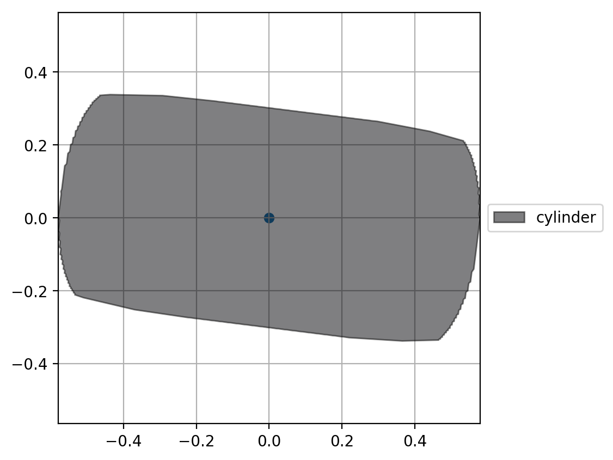
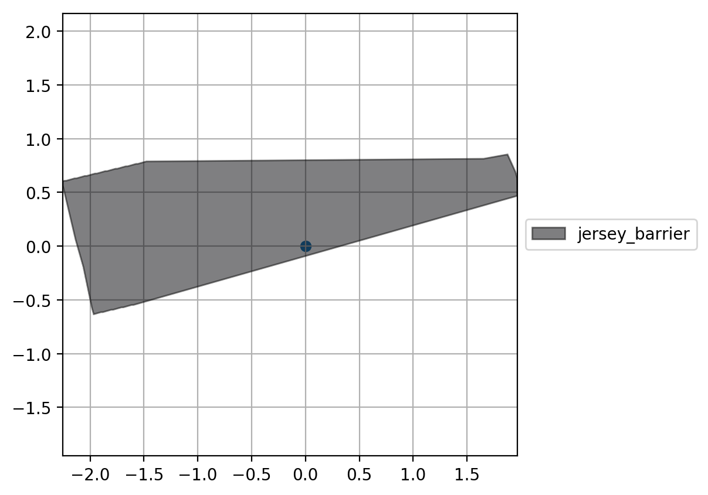

```python
%matplotlib inline
import trimesh
from matplotlib import pyplot as plt
from pcg_gazebo.simulation.properties import Mesh
from pcg_gazebo.simulation import create_object, SimulationModel

```

# Box


```python
# Create model
model = SimulationModel('box')

# Create box link
model.add_cuboid_link('box', mass=0.1, size=[2, 1.2, 3])

print(model.to_sdf('model'))
```

    <model name="box">
      <allow_auto_disable>0</allow_auto_disable>
      <static>0</static>
      <pose frame="">0 0 0 0.0 -0.0 0.0</pose>
      <self_collide>0</self_collide>
      <link name="box">
        <inertial>
          <mass>0.1</mass>
          <pose frame="">0 0 0 0.0 -0.0 0.0</pose>
          <inertia>
            <ixy>0.0</ixy>
            <ixz>0.0</ixz>
            <ixx>0.087</ixx>
            <iyy>0.10833333333333334</iyy>
            <izz>0.04533333333333333</izz>
            <iyz>0.0</iyz>
          </inertia>
        </inertial>
        <collision name="collision">
          <pose frame="">0 0 0 0.0 -0.0 0.0</pose>
          <max_contacts>10</max_contacts>
          <geometry>
            <box>
              <size>2 1.2 3</size>
            </box>
          </geometry>
        </collision>
        <visual name="visual">
          <cast_shadows>1</cast_shadows>
          <pose frame="">0 0 0 0.0 -0.0 0.0</pose>
          <geometry>
            <box>
              <size>2 1.2 3</size>
            </box>
          </geometry>
          <transparency>0.0</transparency>
        </visual>
        <pose frame="">0 0 0 0.0 -0.0 0.0</pose>
      </link>
    </model>
    


```python
scene = model.create_scene()
#scene.show()
```


```python
fig = model.plot_footprint(fig_width=5, fig_height=5)
plt.show()
```


```python
fig = model.plot_footprint(fig_width=5, fig_height=5, z_limits=[-0.2, 0.2])
plt.show()
```


```python
# Set random orientation and plot footprints again
model.set_random_orientation()
scene = model.create_scene()
#scene.show()
```


```python
fig = model.plot_footprint(fig_width=5, fig_height=5)
plt.show()
```


```python
fig = model.plot_footprint(fig_width=5, fig_height=5, z_limits=[-0.2, 0.2])
plt.show()
```


# Cylinder


```python
# Create model
model = SimulationModel('cylinder')

# Create box link
model.add_cylindrical_link('cylinder', mass=0.1, radius=0.3, length=1)

print(model.to_sdf('model'))
```

    <model name="cylinder">
      <allow_auto_disable>0</allow_auto_disable>
      <static>0</static>
      <pose frame="">0 0 0 0.0 -0.0 0.0</pose>
      <self_collide>0</self_collide>
      <link name="cylinder">
        <inertial>
          <mass>0.1</mass>
          <pose frame="">0 0 0 0.0 -0.0 0.0</pose>
          <inertia>
            <ixy>0.0</ixy>
            <ixz>0.0</ixz>
            <ixx>0.010583333333333333</ixx>
            <iyy>0.010583333333333333</iyy>
            <izz>0.0045</izz>
            <iyz>0.0</iyz>
          </inertia>
        </inertial>
        <collision name="collision">
          <pose frame="">0 0 0 0.0 -0.0 0.0</pose>
          <max_contacts>10</max_contacts>
          <geometry>
            <cylinder>
              <length>1.0</length>
              <radius>0.3</radius>
            </cylinder>
          </geometry>
        </collision>
        <visual name="visual">
          <cast_shadows>1</cast_shadows>
          <pose frame="">0 0 0 0.0 -0.0 0.0</pose>
          <geometry>
            <cylinder>
              <length>1.0</length>
              <radius>0.3</radius>
            </cylinder>
          </geometry>
          <transparency>0.0</transparency>
        </visual>
        <pose frame="">0 0 0 0.0 -0.0 0.0</pose>
      </link>
    </model>
    


```python
scene = model.create_scene()
#scene.show()
```


```python
fig = model.plot_footprint(fig_width=5, fig_height=5)
plt.show()
```


```python
fig = model.plot_footprint(fig_width=5, fig_height=5, z_limits=[-0.2, 0.2])
plt.show()
```


```python
# Set random orientation and plot footprints again
model.set_random_orientation()
scene = model.create_scene()
#scene.show()
```


```python
fig = model.plot_footprint(fig_width=5, fig_height=5)
plt.show()
```


```python
fig = model.plot_footprint(fig_width=5, fig_height=5, z_limits=[-0.1, 0.1])
plt.show()
```





# Custom mesh


```python
model = SimulationModel.from_gazebo_model('jersey_barrier')
print(model.to_sdf('model'))
```

    <model name="jersey_barrier">
      <allow_auto_disable>1</allow_auto_disable>
      <static>1</static>
      <pose frame="">0 0 0 0.0 -0.0 0.0</pose>
      <self_collide>0</self_collide>
      <link name="link">
        <collision name="collision">
          <pose frame="">0.0 0.0 0.5715 0.0 -0.0 0.0</pose>
          <max_contacts>20</max_contacts>
          <geometry>
            <box>
              <size>4.06542 0.3063 1.143</size>
            </box>
          </geometry>
        </collision>
        <collision name="collision_0">
          <pose frame="">0.0 0.0 0.032258 0.0 -0.0 0.0</pose>
          <max_contacts>20</max_contacts>
          <geometry>
            <box>
              <size>4.06542 0.8107 0.064516</size>
            </box>
          </geometry>
        </collision>
        <collision name="collision_1">
          <pose frame="">0.0 0.0 0.1 0.0 -0.0 0.0</pose>
          <max_contacts>20</max_contacts>
          <geometry>
            <box>
              <size>4.06542 0.65 0.1</size>
            </box>
          </geometry>
        </collision>
        <collision name="collision_2">
          <pose frame="">0.0 0.0 0.2 0.0 -0.0 0.0</pose>
          <max_contacts>20</max_contacts>
          <geometry>
            <box>
              <size>4.06542 0.5 0.1</size>
            </box>
          </geometry>
        </collision>
        <collision name="collision_3">
          <pose frame="">0.0 -0.224 0.2401 0.9000000000000001 -0.0 0.0</pose>
          <max_contacts>20</max_contacts>
          <geometry>
            <box>
              <size>4.06542 0.5 0.064516</size>
            </box>
          </geometry>
        </collision>
        <collision name="collision_4">
          <pose frame="">0.0 0.224 0.2401 -0.9000000000000001 0.0 0.0</pose>
          <max_contacts>20</max_contacts>
          <geometry>
            <box>
              <size>4.06542 0.5 0.064516</size>
            </box>
          </geometry>
        </collision>
        <visual name="visual">
          <cast_shadows>1</cast_shadows>
          <pose frame="">0 0 0 0.0 -0.0 0.0</pose>
          <geometry>
            <mesh>
              <scale>1 1 1</scale>
              <uri>model://jersey_barrier/meshes/jersey_barrier.dae</uri>
            </mesh>
          </geometry>
          <transparency>0.0</transparency>
        </visual>
        <pose frame="">0 0 0 0.0 -0.0 0.0</pose>
      </link>
    </model>
    


```python
scene = model.create_scene(mesh_type='collision')
#scene.show()
```


```python
fig = model.plot_footprint(mesh_type='collision', fig_width=5, fig_height=5)
plt.show()
```


```python
fig = model.plot_footprint(mesh_type='collision', fig_width=5, fig_height=5, z_limits=[0.5, 0.7])
plt.show()
```


```python
# Set random orientation and plot footprints again
model.set_random_orientation()
print(model.pose)
scene = model.create_scene(mesh_type='collision')
#scene.show()
```

    Position (x, y, z) [m]: 0, 0, 0
    	 - x: 0
    	 - y: 0
    	 - z: 0
    Orientation rpy (roll, pitch, yaw) (degrees): 
    	 - Roll: -114.10701232001225
    	 - Pitch: 5.843477996768009
    	 - Yaw: 13.279297164100752
    


```python
fig = model.plot_footprint(mesh_type='collision', fig_width=5, fig_height=5)
plt.show()
```


```python
fig = model.plot_footprint(mesh_type='collision', fig_width=5, fig_height=5, z_limits=[-0.2, 0.2])
plt.show()
```





```python

```
