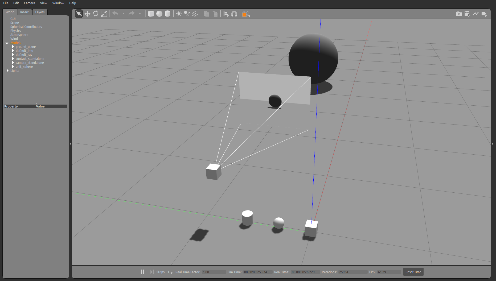

# Sensors


```python
from pcg_gazebo.simulation import create_object, SimulationModel
from pcg_gazebo.task_manager import get_rostopic_list
```


```python
# If there is a Gazebo instance running, you can spawn the box into the simulation
from pcg_gazebo.task_manager import Server
# First create a simulation server
server = Server()
# Create a simulation manager named default
server.create_simulation('default', ros_port=11311, gazebo_port=11345)
simulation = server.get_simulation('default')
# Run an instance of the empty.world scenario
# This is equivalent to run
#      roslaunch gazebo_ros empty_world.launch
# with all default parameters
simulation.create_gazebo_empty_world_task()
simulation.create_rqt_task()

# A task named 'gazebo' the added to the tasks list
print(simulation.get_task_list())
# But it is still not running
print('Is Gazebo running: {}'.format(simulation.is_task_running('gazebo')))
# Run Gazebo
simulation.run_all_tasks()
```

    ['gazebo', 'rqt']
    Is Gazebo running: False


```python
from pcg_gazebo.generators import WorldGenerator
import random
# Create a Gazebo proxy
gazebo_proxy = simulation.get_gazebo_proxy()

# Use the generator to spawn the model to the Gazebo instance running at the moment
generator = WorldGenerator(gazebo_proxy=gazebo_proxy)
print('Is Gazebo running: {}'.format(simulation.is_task_running('gazebo')))
```

    Is Gazebo running: True


## Sensors

### Standalone IMU sensor


```python
imu_model = SimulationModel(name='default_imu')

# Default IMU sensor
imu_model.add_imu_sensor(
    add_visual=True, 
    add_collision=True, 
    visualize=True,
    mass=0.01,
    size=[0.1, 0.1, 0.1],
    topic='/imu',
    link_shape='cuboid',
    link_name='imu_link')

print(imu_model.to_sdf())

# Spawn IMU standalone model
generator.spawn_model(
    model=imu_model, 
    robot_namespace='default_imu',
    pos=[0, 0, 0.05])
```

    <model name="default_imu">
      <pose frame="">0 0 0 0.0 0.0 0.0</pose>
      <link name="imu_link">
        <inertial>
          <pose frame="">0 0 0 0.0 0.0 0.0</pose>
          <inertia>
            <izz>1.6666666666666667e-05</izz>
            <iyy>1.6666666666666667e-05</iyy>
            <ixz>0.0</ixz>
            <iyz>0.0</iyz>
            <ixx>1.6666666666666667e-05</ixx>
            <ixy>0.0</ixy>
          </inertia>
          <mass>0.01</mass>
        </inertial>
        <sensor name="imu" type="imu">
          <imu>
            <angular_velocity>
              <z>
                <noise type="none">
                  <precision>0.0</precision>
                  <bias_mean>0.0</bias_mean>
                  <bias_stddev>0.0</bias_stddev>
                  <mean>0.0</mean>
                  <stddev>0.0</stddev>
                </noise>
              </z>
              <x>
                <noise type="none">
                  <precision>0.0</precision>
                  <bias_mean>0.0</bias_mean>
                  <bias_stddev>0.0</bias_stddev>
                  <mean>0.0</mean>
                  <stddev>0.0</stddev>
                </noise>
              </x>
              <y>
                <noise type="none">
                  <precision>0.0</precision>
                  <bias_mean>0.0</bias_mean>
                  <bias_stddev>0.0</bias_stddev>
                  <mean>0.0</mean>
                  <stddev>0.0</stddev>
                </noise>
              </y>
            </angular_velocity>
            <linear_acceleration>
              <z>
                <noise type="none">
                  <precision>0.0</precision>
                  <bias_mean>0.0</bias_mean>
                  <bias_stddev>0.0</bias_stddev>
                  <mean>0.0</mean>
                  <stddev>0.0</stddev>
                </noise>
              </z>
              <x>
                <noise type="none">
                  <precision>0.0</precision>
                  <bias_mean>0.0</bias_mean>
                  <bias_stddev>0.0</bias_stddev>
                  <mean>0.0</mean>
                  <stddev>0.0</stddev>
                </noise>
              </x>
              <y>
                <noise type="none">
                  <precision>0.0</precision>
                  <bias_mean>0.0</bias_mean>
                  <bias_stddev>0.0</bias_stddev>
                  <mean>0.0</mean>
                  <stddev>0.0</stddev>
                </noise>
              </y>
            </linear_acceleration>
          </imu>
          <topic>/imu</topic>
          <plugin filename="libgazebo_ros_imu_sensor.so" name="imu">
            <topicName>/imu</topicName>
            <updateRateHZ>50</updateRateHZ>
            <gaussianNoise>0</gaussianNoise>
            <alwaysOn>1</alwaysOn>
            <frameName>world</frameName>
            <robotNamespace></robotNamespace>
            <bodyName>imu_link</bodyName>
          </plugin>
          <update_rate>50.0</update_rate>
          <visualize>1</visualize>
          <always_on>1</always_on>
        </sensor>
        <pose frame="">0 0 0 0.0 0.0 0.0</pose>
        <collision name="collision">
          <pose frame="">0 0 0 0.0 0.0 0.0</pose>
          <geometry>
            <box>
              <size>0.1 0.1 0.1</size>
            </box>
          </geometry>
          <max_contacts>10</max_contacts>
        </collision>
        <visual name="visual">
          <pose frame="">0 0 0 0.0 0.0 0.0</pose>
          <transparency>0.0</transparency>
          <cast_shadows>1</cast_shadows>
          <geometry>
            <box>
              <size>0.1 0.1 0.1</size>
            </box>
          </geometry>
        </visual>
      </link>
      <allow_auto_disable>0</allow_auto_disable>
      <static>0</static>
      <self_collide>0</self_collide>
    </model>
    


    True


```python
print('List of ROS topics:')
for topic in simulation.get_rostopic_list():
    print(' - ' + topic)
```

    List of ROS topics:
     - /clock
     - /gazebo/link_states
     - /gazebo/model_states
     - /gazebo/parameter_descriptions
     - /gazebo/parameter_updates
     - /gazebo/set_link_state
     - /gazebo/set_model_state
     - /gazebo_gui/parameter_descriptions
     - /gazebo_gui/parameter_updates
     - /imu
     - /rosout
     - /rosout_agg
     - /tf
     - /tf_static


### Standalone ray sensor


```python
ray_model = SimulationModel(name='default_ray')

# Default ray sensor
ray_model.add_ray_sensor(
    add_visual=True, 
    add_collision=True, 
    add_ros_plugin=False,
    mass=0.01,
    radius=0.05,
    link_shape='spherical',    
    link_name='ray_link')

print(ray_model.to_sdf())

# Spawn ray sensor standalone model
generator.spawn_model(
    model=ray_model, 
    robot_namespace='default_ray',
    pos=[0, 0.3, 0.05])
```

    <model name="default_ray">
      <pose frame="">0 0 0 0.0 0.0 0.0</pose>
      <link name="ray_link">
        <inertial>
          <pose frame="">0 0 0 0.0 0.0 0.0</pose>
          <inertia>
            <izz>1.0000000000000003e-05</izz>
            <iyy>1.0000000000000003e-05</iyy>
            <ixz>0.0</ixz>
            <iyz>0.0</iyz>
            <ixx>1.0000000000000003e-05</ixx>
            <ixy>0.0</ixy>
          </inertia>
          <mass>0.01</mass>
        </inertial>
        <sensor name="ray" type="altimeter">
          <topic>/scan</topic>
          <update_rate>50.0</update_rate>
          <ray>
            <scan>
              <horizontal>
                <max_angle>1.5707963267948966</max_angle>
                <min_angle>-1.5707963267948966</min_angle>
                <samples>640</samples>
                <resolution>1.0</resolution>
              </horizontal>
              <vertical>
                <max_angle>0.0</max_angle>
                <min_angle>0.0</min_angle>
                <samples>1</samples>
                <resolution>1.0</resolution>
              </vertical>
            </scan>
            <noise type="none">
              <precision>0</precision>
              <bias_mean>0</bias_mean>
              <bias_stddev>0</bias_stddev>
              <mean>0.0</mean>
              <stddev>0.0</stddev>
            </noise>
            <range>
              <max>10.0</max>
              <min>0.05</min>
              <resolution>0.001</resolution>
            </range>
          </ray>
          <visualize>0</visualize>
          <always_on>1</always_on>
        </sensor>
        <pose frame="">0 0 0 0.0 0.0 0.0</pose>
        <collision name="collision">
          <pose frame="">0 0 0 0.0 0.0 0.0</pose>
          <geometry>
            <sphere>
              <radius>0.05</radius>
            </sphere>
          </geometry>
          <max_contacts>10</max_contacts>
        </collision>
        <visual name="visual">
          <pose frame="">0 0 0 0.0 0.0 0.0</pose>
          <transparency>0.0</transparency>
          <cast_shadows>1</cast_shadows>
          <geometry>
            <sphere>
              <radius>0.05</radius>
            </sphere>
          </geometry>
        </visual>
      </link>
      <allow_auto_disable>0</allow_auto_disable>
      <static>0</static>
      <self_collide>0</self_collide>
    </model>
    


    True


```python
print('List of ROS topics:')
for topic in simulation.get_rostopic_list():
    print(' - ' + topic)
```

    List of ROS topics:
     - /clock
     - /gazebo/link_states
     - /gazebo/model_states
     - /gazebo/parameter_descriptions
     - /gazebo/parameter_updates
     - /gazebo/set_link_state
     - /gazebo/set_model_state
     - /gazebo_gui/parameter_descriptions
     - /gazebo_gui/parameter_updates
     - /imu
     - /rosout
     - /rosout_agg
     - /tf
     - /tf_static


### Standalone contact sensor


```python
contact_sensor = SimulationModel(name='contact_standalone')

contact_sensor.add_contact_sensor(
    add_visual=True, 
    add_collision=True, 
    add_ros_plugin=True,
    mass=0.01,
    radius=0.05,
    length=0.1,
    link_shape='cylindrical',
    link_name='contact_link')

print(contact_sensor.to_sdf())

# Spawn ray sensor standalone model
generator.spawn_model(
    model=contact_sensor, 
    robot_namespace='contact_standalone',
    pos=[0, 0.6, 0.05])
```

    <model name="contact_standalone">
      <pose frame="">0 0 0 0.0 0.0 0.0</pose>
      <link name="contact_link">
        <inertial>
          <pose frame="">0 0 0 0.0 0.0 0.0</pose>
          <inertia>
            <izz>1.2500000000000002e-05</izz>
            <iyy>1.4583333333333333e-05</iyy>
            <ixz>0.0</ixz>
            <iyz>0.0</iyz>
            <ixx>1.4583333333333333e-05</ixx>
            <ixy>0.0</ixy>
          </inertia>
          <mass>0.01</mass>
        </inertial>
        <sensor name="contact" type="contact">
          <contact>
            <topic>/bumper</topic>
            <collision>collision</collision>
          </contact>
          <topic>/bumper</topic>
          <plugin filename="libgazebo_ros_bumper.so" name="contact">
            <frameName>world</frameName>
            <robotNamespace></robotNamespace>
            <bumperTopicName>/bumper</bumperTopicName>
          </plugin>
          <update_rate>50.0</update_rate>
          <visualize>0</visualize>
          <always_on>1</always_on>
        </sensor>
        <pose frame="">0 0 0 0.0 0.0 0.0</pose>
        <collision name="collision">
          <pose frame="">0 0 0 0.0 0.0 0.0</pose>
          <geometry>
            <cylinder>
              <radius>0.05</radius>
              <length>0.1</length>
            </cylinder>
          </geometry>
          <max_contacts>10</max_contacts>
        </collision>
        <visual name="visual">
          <pose frame="">0 0 0 0.0 0.0 0.0</pose>
          <transparency>0.0</transparency>
          <cast_shadows>1</cast_shadows>
          <geometry>
            <cylinder>
              <radius>0.05</radius>
              <length>0.1</length>
            </cylinder>
          </geometry>
        </visual>
      </link>
      <allow_auto_disable>0</allow_auto_disable>
      <static>0</static>
      <self_collide>0</self_collide>
    </model>
    


    True


### Standalone camera


```python
camera_sensor = SimulationModel(name='camera_standalone')
camera_sensor.static = True

camera_sensor.add_camera_sensor(
    add_visual=True, 
    add_collision=True, 
    add_ros_plugin=True,
    visualize=True,
    mass=0.01,
    size=[0.1, 0.1, 0.1],
    link_shape='cuboid',
    link_name='camera_link')

print(camera_sensor.to_sdf())

# Spawn camera standalone model
generator.spawn_model(
    model=camera_sensor, 
    robot_namespace='camera_standalone',
    pos=[0, 0.9, 0.5])
```

    <model name="camera_standalone">
      <pose frame="">0 0 0 0.0 0.0 0.0</pose>
      <link name="camera_link">
        <inertial>
          <pose frame="">0 0 0 0.0 0.0 0.0</pose>
          <inertia>
            <izz>1.6666666666666667e-05</izz>
            <iyy>1.6666666666666667e-05</iyy>
            <ixz>0.0</ixz>
            <iyz>0.0</iyz>
            <ixx>1.6666666666666667e-05</ixx>
            <ixy>0.0</ixy>
          </inertia>
          <mass>0.01</mass>
        </inertial>
        <sensor name="camera" type="camera">
          <topic>/camera</topic>
          <plugin filename="libgazebo_ros_camera.so" name="camera">
            <imageTopicName>image_raw</imageTopicName>
            <distortionK3>0</distortionK3>
            <robotNamespace></robotNamespace>
            <distortionK2>0</distortionK2>
            <updateRate>0</updateRate>
            <cameraInfoTopicName>camera_info</cameraInfoTopicName>
            <distortionT2>0</distortionT2>
            <hackBaseline>0.07</hackBaseline>
            <cameraName>camera</cameraName>
            <frameName>camera_link</frameName>
            <distortionK1>0</distortionK1>
            <distortionT1>0</distortionT1>
          </plugin>
          <update_rate>50.0</update_rate>
          <visualize>1</visualize>
          <camera name="default">
            <horizontal_fov>1.047</horizontal_fov>
            <depth_camera>
              <output>depths</output>
            </depth_camera>
            <image>
              <height>240.0</height>
              <format>R8G8B8</format>
              <width>320.0</width>
            </image>
            <distortion>
              <p2>0.0</p2>
              <k3>0.0</k3>
              <k2>0.0</k2>
              <k1>0.0</k1>
              <p1>0.0</p1>
              <center>0.5 0.5</center>
            </distortion>
            <noise type="none">
              <precision>0.0</precision>
              <bias_mean>0.0</bias_mean>
              <bias_stddev>0.0</bias_stddev>
              <mean>0.0</mean>
              <stddev>0.0</stddev>
            </noise>
            <save enabled="False">
              <path>__default__</path>
            </save>
            <clip>
              <far>100.0</far>
              <near>0.1</near>
            </clip>
          </camera>
          <always_on>1</always_on>
        </sensor>
        <pose frame="">0 0 0 0.0 0.0 0.0</pose>
        <collision name="collision">
          <pose frame="">0 0 0 0.0 0.0 0.0</pose>
          <geometry>
            <box>
              <size>0.1 0.1 0.1</size>
            </box>
          </geometry>
          <max_contacts>10</max_contacts>
        </collision>
        <visual name="visual">
          <pose frame="">0 0 0 0.0 0.0 0.0</pose>
          <transparency>0.0</transparency>
          <cast_shadows>1</cast_shadows>
          <geometry>
            <box>
              <size>0.1 0.1 0.1</size>
            </box>
          </geometry>
        </visual>
      </link>
      <allow_auto_disable>0</allow_auto_disable>
      <static>1</static>
      <self_collide>0</self_collide>
    </model>
    


    True


```python
print('List of ROS topics:')
for topic in simulation.get_rostopic_list():
    print(' - ' + topic)
```

    List of ROS topics:
     - /bumper
     - /camera_standalone/camera/camera_info
     - /camera_standalone/camera/image_raw
     - /camera_standalone/camera/parameter_descriptions
     - /camera_standalone/camera/parameter_updates
     - /clock
     - /gazebo/link_states
     - /gazebo/model_states
     - /gazebo/parameter_descriptions
     - /gazebo/parameter_updates
     - /gazebo/set_link_state
     - /gazebo/set_model_state
     - /gazebo_gui/parameter_descriptions
     - /gazebo_gui/parameter_updates
     - /imu
     - /rosout
     - /rosout_agg
     - /tf
     - /tf_static


```python
# End the simulation by killing the Gazebo task
simulation.kill_all_tasks()
```




```python

```
